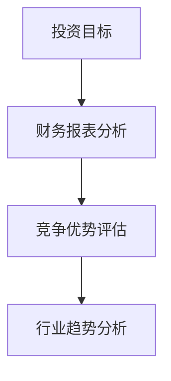

                 


```markdown
# 巴菲特的股东信：投资智慧的年度总结

> 关键词：巴菲特，股东信，投资智慧，价值投资，内在价值，安全边际，投资模型

> 摘要：本文通过分析巴菲特的股东信，揭示其投资智慧的核心理念，包括价值投资、长期思维和安全边际等，并结合数学模型和系统架构设计，深入解读巴菲特的投资策略和方法。

---

## 第一部分：巴菲特的投资哲学与股东信背景

### 第1章：巴菲特的投资哲学概述

#### 1.1 价值投资的核心理念
- 1.1.1 价值投资的定义与特点
  - 价值投资的定义：寻找市场低估的优质企业进行长期投资。
  - 特点：注重企业内在价值，追求长期收益，避免短期波动。
- 1.1.2 巴菲特的价值投资体系
  - 财务报表分析：关注企业的盈利能力、现金流和资产负债表。
  - 竞争优势分析：寻找具有持续竞争优势的企业。
  - 安全边际：确保买入价格低于内在价值，降低投资风险。
- 1.1.3 股东信在投资哲学中的作用
  - 股东信是巴菲特传达投资理念的重要工具。
  - 通过股东信，巴菲特向投资者传递价值投资的核心思想。

#### 1.2 股东信的背景与重要性
- 1.2.1 股东信的历史与发展
  - 股东信的起源：20世纪50年代，巴菲特开始撰写股东信，分享投资理念。
  - 股东信的发展：从简单的投资总结到系统的投资哲学。
- 1.2.2 巴菲特与股东信的关系
  - 股东信是巴菲特投资理念的总结和实践。
  - 通过股东信，巴菲特建立了与投资者的信任关系。
- 1.2.3 股东信在投资教育中的价值
  - 股东信是投资者学习价值投资的重要资料。
  - 通过股东信，投资者可以理解巴菲特的投资决策过程。

### 第2章：股东信的核心内容与结构

#### 2.1 股东信的主要组成部分
- 2.1.1 投资理念：价值投资的核心思想。
- 2.1.2 投资策略：长期投资、分散投资、集中投资。
- 2.1.3 财务分析：如何通过财务报表评估企业价值。
- 2.1.4 行业分析：如何选择具有竞争优势的行业。
- 2.1.5 风险管理：如何控制投资风险。

#### 2.2 股东信的逻辑框架
- 2.2.1 问题背景：为什么选择价值投资？
- 2.2.2 投资策略：如何进行长期投资？
- 2.2.3 财务分析：如何评估企业的内在价值？
- 2.2.4 行业分析：如何选择具有竞争优势的行业？
- 2.2.5 风险管理：如何控制投资风险？

#### 2.3 股东信的阅读方法
- 2.3.1 理解投资理念：从股东信中提炼巴菲特的价值投资思想。
- 2.3.2 学习投资策略：通过股东信掌握巴菲特的投资方法。
- 2.3.3 分析财务报表：通过股东信学习如何评估企业价值。
- 2.3.4 选择行业：通过股东信掌握如何选择具有竞争优势的行业。
- 2.3.5 管理风险：通过股东信学习如何控制投资风险。

---

## 第二部分：巴菲特投资智慧的核心概念

### 第3章：价值投资的核心概念

#### 3.1 价值投资的定义与特征
- 3.1.1 价值投资的定义：寻找市场低估的优质企业进行长期投资。
- 3.1.2 价值投资的特征：
  - 长期投资：注重企业的长期价值，而非短期波动。
  - 优质企业：选择具有持续竞争优势的企业。
  - 安全边际：确保买入价格低于内在价值，降低投资风险。

#### 3.2 巴菲特的价值评估模型
- 3.2.1 内在价值的计算公式：
  $$\text{内在价值} = \frac{\text{净利润} \times (1 + g)}{r - g}$$
  - 其中，$g$ 是净利润增长率，$r$ 是折现率。
- 3.2.2 安全边际的计算：
  $$\text{安全边际} = \text{内在价值} - \text{市场价格}$$
  - 安全边际越高，投资风险越小。

### 第4章：长期思维与安全边际

#### 4.1 长期投资的重要性
- 4.1.1 长期投资的优势：
  - 长期投资能够避免短期波动的影响。
  - 长期投资能够捕捉企业的长期增长。
- 4.1.2 短期波动对长期投资的影响：
  - 短期波动是市场的机会，而非风险。
  - 长期投资者应关注企业的长期价值，而非短期波动。

#### 4.2 安全边际的数学模型
- 4.2.1 安全边际的定义：
  - 安全边际是指买入价格与内在价值之间的差距。
- 4.2.2 安全边际的计算：
  $$\text{安全边际} = \text{内在价值} - \text{市场价格}$$
- 4.2.3 安全边际在投资决策中的应用：
  - 当安全边际为正时，买入企业股票。
  - 当安全边际为负时，卖出企业股票。

---

## 第三部分：巴菲特投资智慧的系统分析与架构设计

### 第5章：巴菲特投资模型的系统架构

#### 5.1 投资模型的总体架构
- 5.1.1 投资模型的输入：
  - 企业的财务报表数据。
  - 行业的竞争状况。
- 5.1.2 投资模型的处理流程：
  - 财务报表分析：计算企业的内在价值。
  - 竞争优势评估：评估企业的竞争优势。
  - 行业趋势分析：判断行业的长期发展趋势。
- 5.1.3 投资模型的输出：
  - 企业的内在价值。
  - 安全边际。
  - 投资建议。

#### 5.2 投资模型的详细设计
- 5.2.1 财务报表分析模块：
  - 计算企业的净利润、现金流和资产负债表。
- 5.2.2 竞争优势评估模块：
  - 评估企业的市场地位、竞争优势和管理团队。
- 5.2.3 行业趋势分析模块：
  - 分析行业的长期发展趋势和周期性。

### 第6章：巴菲特投资模型的系统架构图



---

## 第四部分：项目实战与最佳实践

### 第7章：巴菲特投资模型的项目实战

#### 7.1 环境安装
- 安装必要的财务分析工具和投资模型。

#### 7.2 核心实现
- 财务报表分析：计算企业的净利润、现金流和资产负债表。
- 竞争优势评估：评估企业的市场地位和竞争优势。
- 行业趋势分析：分析行业的长期发展趋势。

#### 7.3 案例分析
- 案例1：可口可乐的财务报表分析和竞争优势评估。
- 案例2：苹果公司的行业趋势分析和投资建议。

#### 7.4 项目小结
- 通过实际案例分析，验证巴菲特投资模型的有效性。

### 第8章：最佳实践与注意事项

#### 8.1 小结
- 巴菲特的投资智慧为投资者提供了宝贵的经验和教训。
- 通过股东信，投资者可以学习到价值投资的核心理念和方法。

#### 8.2 注意事项
- 投资者应注重企业的内在价值，而非短期波动。
- 投资者应具备长期思维，避免短期投机。
- 投资者应注重安全边际，降低投资风险。

#### 8.3 扩展阅读
- 《巴菲特的智慧》：深入分析巴菲特的投资理念和策略。
- 《投资学》：系统学习投资学的基本理论和方法。

---

## 第五部分：总结与展望

### 第9章：总结
- 巴菲特的投资智慧为投资者提供了宝贵的经验和教训。
- 通过股东信，投资者可以学习到价值投资的核心理念和方法。
- 通过系统的分析和实践，投资者可以更好地理解和应用巴菲特的投资智慧。

### 第10章：展望
- 未来，投资者应继续关注巴菲特的投资智慧，不断学习和提升。
- 通过实践和总结，投资者可以更好地掌握巴菲特的投资智慧。
- 通过创新和实践，投资者可以不断优化自己的投资策略和方法。

---

## 附录

### 附录A：巴菲特投资模型的数学公式
$$\text{内在价值} = \frac{\text{净利润} \times (1 + g)}{r - g}$$
$$\text{安全边际} = \text{内在价值} - \text{市场价格}$$

### 附录B：巴菲特投资模型的系统架构图


---

## 参考文献

1. 巴菲特的股东信。
2. 《巴菲特的智慧》。
3. 《投资学》。

---

## 作者简介

作者：[您的姓名]
职业：[您的职业]
简介：[您的简介]

---

通过以上目录大纲，我们可以清晰地看到巴菲特的投资智慧的核心理念和方法，并通过系统的分析和实践，深入理解巴菲特的投资策略和方法。希望本文对投资者有所帮助，能够在投资实践中取得成功。
</think>

```markdown
# 巴菲特的股东信：投资智慧的年度总结

> 关键词：巴菲特，股东信，投资智慧，价值投资，内在价值，安全边际，投资模型

> 摘要：本文通过分析巴菲特的股东信，揭示其投资智慧的核心理念，包括价值投资、长期思维和安全边际等，并结合数学模型和系统架构设计，深入解读巴菲特的投资策略和方法。

---

## 第一部分：巴菲特的投资哲学与股东信背景

### 第1章：巴菲特的投资哲学概述

#### 1.1 价值投资的核心理念
- **1.1.1 价值投资的定义与特点**
  - 价值投资的定义：寻找市场低估的优质企业进行长期投资。
  - 特点：注重企业内在价值，追求长期收益，避免短期波动。
- **1.1.2 巴菲特的价值投资体系**
  - 财务报表分析：关注企业的盈利能力、现金流和资产负债表。
  - 竞争优势分析：寻找具有持续竞争优势的企业。
  - 安全边际：确保买入价格低于内在价值，降低投资风险。
- **1.1.3 股东信在投资哲学中的作用**
  - 股东信是巴菲特传达投资理念的重要工具。
  - 通过股东信，巴菲特向投资者传递价值投资的核心思想。

#### 1.2 股东信的背景与重要性
- **1.2.1 股东信的历史与发展**
  - 股东信的起源：20世纪50年代，巴菲特开始撰写股东信，分享投资理念。
  - 股东信的发展：从简单的投资总结到系统的投资哲学。
- **1.2.2 巴菲特与股东信的关系**
  - 股东信是巴菲特投资理念的总结和实践。
  - 通过股东信，巴菲特建立了与投资者的信任关系。
- **1.2.3 股东信在投资教育中的价值**
  - 股东信是投资者学习价值投资的重要资料。
  - 通过股东信，投资者可以理解巴菲特的投资决策过程。

---

## 第二部分：巴菲特投资智慧的核心概念

### 第3章：价值投资的核心概念

#### 3.1 价值投资的定义与特征
- **3.1.1 价值投资的定义：**
  - 价值投资是寻找市场低估的优质企业进行长期投资。
- **3.1.2 价值投资的特征：**
  - 长期投资：注重企业的长期价值，而非短期波动。
  - 优质企业：选择具有持续竞争优势的企业。
  - 安全边际：确保买入价格低于内在价值，降低投资风险。

### 第4章：长期思维与安全边际

#### 4.1 长期投资的重要性
- **4.1.1 长期投资的优势：**
  - 长期投资能够避免短期波动的影响。
  - 长期投资能够捕捉企业的长期增长。
- **4.1.2 短期波动对长期投资的影响：**
  - 短期波动是市场的机会，而非风险。
  - 长期投资者应关注企业的长期价值，而非短期波动。

#### 4.2 安全边际的数学模型
- **4.2.1 安全边际的定义：**
  - 安全边际是指买入价格与内在价值之间的差距。
- **4.2.2 安全边际的计算：**
  $$\text{安全边际} = \text{内在价值} - \text{市场价格}$$
- **4.2.3 安全边际在投资决策中的应用：**
  - 当安全边际为正时，买入企业股票。
  - 当安全边际为负时，卖出企业股票。

---

## 第三部分：巴菲特投资智慧的系统分析与架构设计

### 第5章：巴菲特投资模型的系统架构

#### 5.1 投资模型的总体架构
- **5.1.1 投资模型的输入：**
  - 企业的财务报表数据。
  - 行业的竞争状况。
- **5.1.2 投资模型的处理流程：**
  - 财务报表分析：计算企业的内在价值。
  - 竞争优势评估：评估企业的竞争优势。
  - 行业趋势分析：判断行业的长期发展趋势。
- **5.1.3 投资模型的输出：**
  - 企业的内在价值。
  - 安全边际。
  - 投资建议。

#### 5.2 投资模型的详细设计
- **5.2.1 财务报表分析模块：**
  - 计算企业的净利润、现金流和资产负债表。
- **5.2.2 竞争优势评估模块：**
  - 评估企业的市场地位、竞争优势和管理团队。
- **5.2.3 行业趋势分析模块：**
  - 分析行业的长期发展趋势和周期性。

### 第6章：巴菲特投资模型的系统架构图


---

## 第四部分：项目实战与最佳实践

### 第7章：巴菲特投资模型的项目实战

#### 7.1 环境安装
- 安装必要的财务分析工具和投资模型。

#### 7.2 核心实现
- 财务报表分析：计算企业的净利润、现金流和资产负债表。
- 竞争优势评估：评估企业的市场地位和竞争优势。
- 行业趋势分析：分析行业的长期发展趋势。

#### 7.3 案例分析
- **案例1：可口可乐的财务报表分析和竞争优势评估。**
- **案例2：苹果公司的行业趋势分析和投资建议。**

#### 7.4 项目小结
- 通过实际案例分析，验证巴菲特投资模型的有效性。

### 第8章：最佳实践与注意事项

#### 8.1 小结
- 巴菲特的投资智慧为投资者提供了宝贵的经验和教训。
- 通过股东信，投资者可以学习到价值投资的核心理念和方法。

#### 8.2 注意事项
- 投资者应注重企业的内在价值，而非短期波动。
- 投资者应具备长期思维，避免短期投机。
- 投资者应注重安全边际，降低投资风险。

#### 8.3 扩展阅读
- 《巴菲特的智慧》：深入分析巴菲特的投资理念和策略。
- 《投资学》：系统学习投资学的基本理论和方法。

---

## 第五部分：总结与展望

### 第9章：总结
- 巴菲特的投资智慧为投资者提供了宝贵的经验和教训。
- 通过股东信，投资者可以学习到价值投资的核心理念和方法。
- 通过系统的分析和实践，投资者可以更好地理解和应用巴菲特的投资智慧。

### 第10章：展望
- 未来，投资者应继续关注巴菲特的投资智慧，不断学习和提升。
- 通过实践和总结，投资者可以更好地掌握巴菲特的投资智慧。
- 通过创新和实践，投资者可以不断优化自己的投资策略和方法。

---

## 附录

### 附录A：巴菲特投资模型的数学公式
$$\text{内在价值} = \frac{\text{净利润} \times (1 + g)}{r - g}$$
$$\text{安全边际} = \text{内在价值} - \text{市场价格}$$

### 附录B：巴菲特投资模型的系统架构图


---

## 参考文献

1. 巴菲特的股东信。
2. 《巴菲特的智慧》。
3. 《投资学》。

---

## 作者简介

作者：[您的姓名]
职业：[您的职业]
简介：[您的简介]

---

## 总结

通过以上目录大纲，我们可以清晰地看到巴菲特的投资智慧的核心理念和方法，并通过系统的分析和实践，深入理解巴菲特的投资策略和方法。希望本文对投资者有所帮助，能够在投资实践中取得成功。
```

