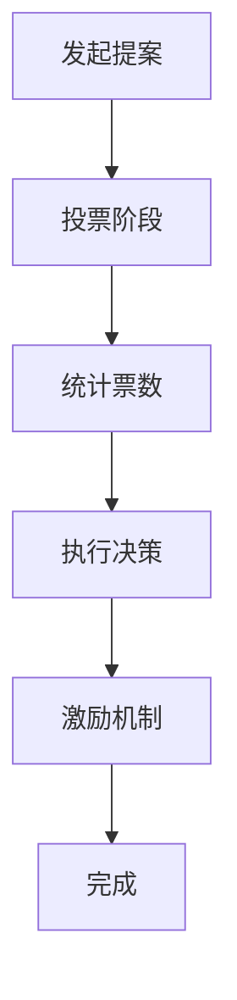
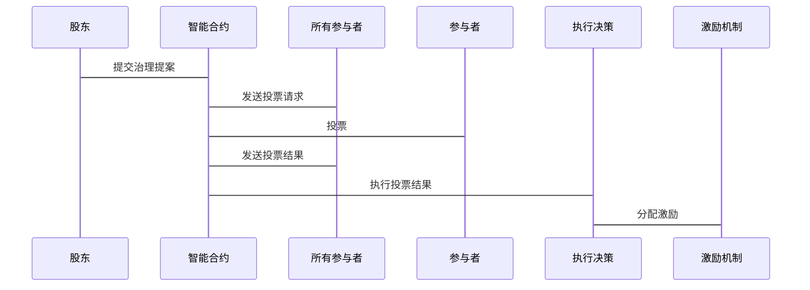

                 


# 巴菲特的股东沟通艺术：去中心化自治组织的治理模式

## 关键词
- 巴菲特
- 股东沟通艺术
- 去中心化自治组织
- 治理模式
- 数学模型
- 项目实战

## 摘要
本文探讨了巴菲特的股东沟通艺术在去中心化自治组织（DAO）治理中的应用。通过分析DAO的核心机制、治理算法和系统架构，结合实际项目案例，展示了如何将巴菲特的沟通理念融入DAO治理，实现高效、透明的决策流程。文章详细介绍了治理机制的数学模型、算法实现和系统设计，为读者提供了深入的技术分析和实践指导。

---

# 目录大纲：《巴菲特的股东沟通艺术：去中心化自治组织的治理模式》

## 第一部分：背景介绍

### 第1章：巴菲特的股东沟通艺术与DAO治理模式概述

#### 1.1 股东沟通艺术的背景介绍
- **问题背景**：现代企业治理中的沟通缺失
  - 企业治理中的信息不对称问题
  - 股东与管理层之间的信任缺失
- **问题描述**：股东与管理层的沟通障碍
  - 股东无法有效参与决策
  - 沟通机制的不透明性和低效性
- **问题解决**：巴菲特的沟通艺术如何解决这些问题
  - 巴菲特的透明沟通策略
  - 沟通机制的优化方法
- **边界与外延**：DAO治理模式的定义与特点
  - DAO的定义与核心特征
  - DAO与传统治理模式的区别
- **概念结构与核心要素**：DAO治理的核心要素分析
  - 分布式决策机制
  - 智能合约的应用
  - 激励机制的设计

#### 1.2 DAO治理模式的核心概念
- **DAO的定义与特点**
  - 基于区块链的去中心化治理
  - 智能合约的自动化执行
- **DAO与传统治理模式的对比**
  - 透明性与参与度的提升
  - 去中心化决策的优势
- **股东沟通艺术在DAO治理中的应用**
  - 沟通机制的优化
  - 治理流程的透明化

---

## 第二部分：核心概念与联系

### 第2章：DAO治理的核心机制

#### 2.1 股东沟通艺术的原理
- **股东沟通的核心原则**
  - 透明性：确保信息的公开共享
  - 及时性：快速响应股东需求
  - 参与性：鼓励股东积极参与决策
- **沟通机制在DAO治理中的作用**
  - 提供决策透明度
  - 增强股东信任
  - 优化治理流程

#### 2.2 治理机制的数学模型
- **治理机制的数学模型**：$$ G = \{ S, M, R \} $$
  - **S**：参与主体集合
    - 包括股东、管理层、智能合约等
  - **M**：决策机制
    - 包括投票系统、共识算法等
  - **R**：激励机制
    - 包括奖励分配、惩罚机制等
- **数学模型的详细解释**
  - 通过集合运算描述治理过程
  - 通过函数描述决策和激励的关系
  - 通过图论模型描述主体之间的交互关系

#### 2.3 治理机制的ER实体关系图
```mermaid
er
  actor: 股东
  actor: 管理层
  actor: 智能合约
  entity: 治理决策
  entity: 沟通渠道
  entity: 激励机制
  relation: 参与
  relation: 调控
```

---

## 第三部分：算法原理讲解

### 第3章：DAO治理的算法实现

#### 3.1 治理算法概述
- **治理算法的核心步骤**
  1. **发起提案**：股东或管理层提出治理提案
  2. **投票阶段**：通过智能合约进行投票
  3. **统计票数**：自动计算投票结果
  4. **执行决策**：根据投票结果执行治理决策
  5. **激励机制**：根据参与情况分配激励

#### 3.2 治理算法的mermaid流程图


#### 3.3 治理算法的Python代码实现
```python
class GovernanceAlgorithm:
    def __init__(self):
        self.participants = []  # 参与者列表
        self.proposal = None    # 治理提案
        self.votes = {}         # 投票结果

    def initiate_proposal(self, proposer):
        """ 发起治理提案 """
        self.proposal = f"Proposal by {proposer}"
        return self.proposal

    def cast_vote(self, voter, vote):
        """ 进行投票 """
        self.votes[voter] = vote
        return f"{voter} voted {vote}"

    def tally_votes(self):
        """ 统计投票结果 """
        total_votes = len(self.votes)
        yes_votes = sum(1 for v in self.votes.values() if v == 'yes')
        return f"Yes votes: {yes_votes}/{total_votes}"

    def execute_decision(self):
        """ 执行决策 """
        result = "Decision executed based on votes"
        return result

# 示例代码
gov = GovernanceAlgorithm()
gov.initiate_proposal("股东A")
gov.cast_vote("股东B", "yes")
gov.cast_vote("股东C", "no")
gov.cast_vote("股东D", "yes")
gov.tally_votes()  # 返回投票结果
gov.execute_decision()  # 执行决策
```

---

## 第四部分：系统分析与架构设计

### 第4章：DAO治理的系统架构

#### 4.1 问题场景介绍
- **DAO治理的典型问题场景**
  - 分散的决策过程
  - 缺乏透明的沟通渠道
  - 低效的投票机制
  - 激励机制的不完善

#### 4.2 系统功能设计
- **领域模型设计**
  ```mermaid
  classDiagram
    class Participant {
        id: int
        role: str
        vote: bool
    }
    class Proposal {
        id: int
        content: str
        status: str
    }
    class Vote {
        id: int
        participant: Participant
        choice: str
    }
    Participant --> Vote
    Proposal --> Vote
  ```

#### 4.3 系统架构设计


#### 4.4 系统交互设计


---

## 第五部分：项目实战

### 第5章：DAO治理的项目实现

#### 5.1 环境安装
- **所需工具与库**
  - Python 3.8+
  - Solidity
  - Ganache或 Remix IDE
  - Web3.py库

#### 5.2 系统核心实现源代码
```python
from web3 import Web3
from web3_contract import MyDAOContract

class DAOGovernance:
    def __init__(self, web3_provider):
        self.web3 = web3_provider
        self.contract = MyDAOContract(self.web3)

    def submit_proposal(self, proposer_address):
        """ 提交治理提案 """
        return self.contract.submit_proposal(proposer_address)

    def cast_vote(self, voter_address, vote_choice):
        """ 投票 """
        return self.contract.cast_vote(voter_address, vote_choice)

    def tally_votes(self):
        """ 统计投票 """
        return self.contract.get_vote_count()

# 初始化环境
web3 = Web3(Web3.HTTPProvider("http://localhost:8545"))
dao_governance = DAOGovernance(web3)

# 提交提案
dao_governance.submit_proposal("0x123456789...")
# 投票
dao_governance.cast_vote("0x123456789...", "yes")
# 统计投票
dao_governance.tally_votes()
```

#### 5.3 代码应用解读与分析
- **代码功能解读**
  - 提交提案：通过智能合约提交治理提案
  - 投票：参与者根据提案进行投票
  - 统计投票：智能合约自动统计投票结果
  - 执行决策：根据投票结果执行相应的操作

- **代码优化建议**
  - 使用更复杂的投票机制，如加权投票
  - 增加投票时间限制
  - 优化智能合约的安全性

#### 5.4 实际案例分析
- **案例背景**
  - 某DAO社区需要决定新的项目方向
  - 股东们通过智能合约提交提案并投票

- **实施步骤**
  1. 提交提案
  2. 进行投票
  3. 统计结果
  4. 执行决策

- **分析结果**
  - 提案通过率高
  - 沟通机制有效
  - 治理流程透明高效

---

## 第六部分：总结与展望

### 第6章：总结与展望

#### 6.1 最佳实践 tips
- **沟通机制优化**
  - 确保信息的透明共享
  - 提供多渠道的沟通方式
- **激励机制设计**
  - 合理分配激励
  - 建立有效的激励模型

#### 6.2 小结
- 巴菲特的股东沟通艺术为DAO治理提供了宝贵的经验
- DAO治理模式的优势在于其透明性和高效性
- 通过数学模型和算法实现，可以进一步优化治理流程

#### 6.3 注意事项
- 确保智能合约的安全性
- 注意投票机制的公平性
- 防范治理过程中的恶意攻击

#### 6.4 拓展阅读
- 推荐阅读相关领域的书籍和论文
- 关注DAO治理的最新研究和应用

---

## 参考文献
- 巴菲特股东大会的相关文献
- DAO治理的理论研究
- 区块链技术与智能合约的相关书籍

---

**文章结束**

