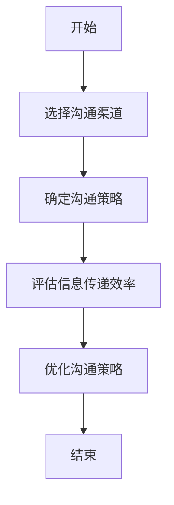
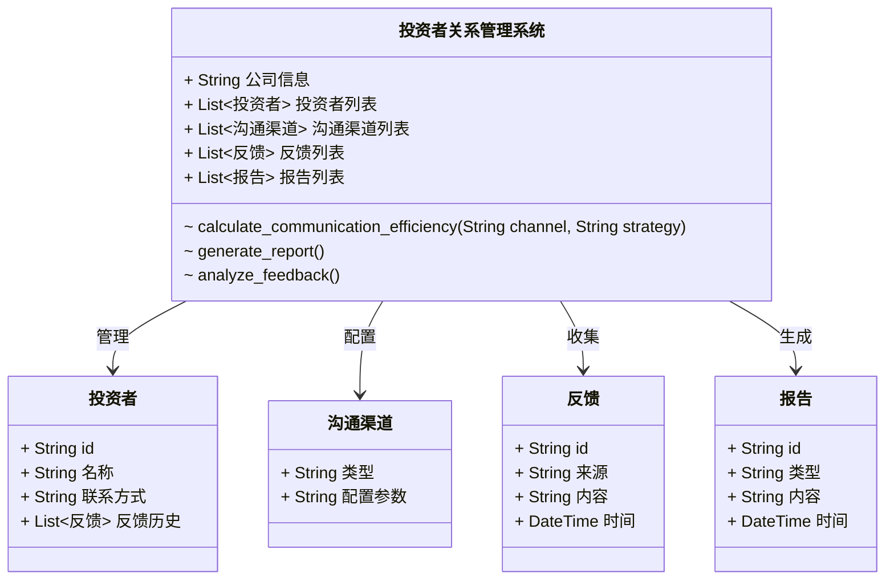
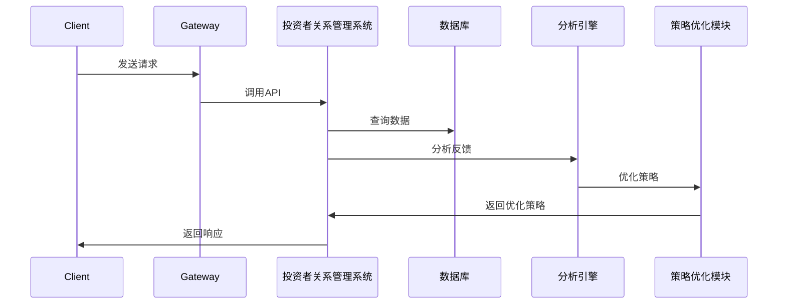

                 


# 巴菲特的股东沟通艺术：数字时代的投资者关系管理

## 关键词：投资者关系管理，巴菲特，股东沟通，数字时代，沟通策略，沟通工具，沟通效果

## 摘要：本文深入探讨了巴菲特在投资者关系管理中的独特沟通艺术，并结合数字时代的背景，分析了投资者关系管理的核心要素、沟通渠道与工具、沟通效果的评估与优化策略。通过具体案例分析，展示了如何在现代环境下应用巴菲特的沟通理念，结合数据分析、系统架构设计和最佳实践，为投资者关系管理提供了新的视角和解决方案。

---

## 目录

1. [背景介绍](#背景介绍)
2. [核心概念与联系](#核心概念与联系)
3. [算法原理讲解](#算法原理讲解)
4. [数学模型与公式](#数学模型与公式)
5. [系统分析与架构设计](#系统分析与架构设计)
6. [项目实战](#项目实战)
7. [最佳实践与小结](#最佳实践与小结)

---

## 1. 背景介绍

### 1.1 投资者关系管理的定义与背景

投资者关系管理（Investor Relations Management，IRM）是指公司通过与投资者、潜在投资者以及其他利益相关者进行有效沟通和互动，以建立和维护良好的关系，从而实现公司价值最大化的一种管理活动。IRM的核心在于通过透明、及时、准确的信息传递，增强投资者对公司信任，优化资本结构，提升公司市值。

在数字时代，投资者关系管理的手段和渠道发生了巨大变化。传统的面对面会议、电话沟通逐渐被社交媒体、在线论坛、电子邮件等数字化工具所补充甚至取代。这种变化不仅提高了沟通效率，也使得投资者能够更方便地获取信息，同时也要求公司在沟通策略上更加灵活和精准。

### 1.2 巴菲特的沟通艺术

沃伦·巴菲特（Warren Buffett）作为全球最著名的投资者之一，以其独特的沟通风格闻名。他的股东沟通艺术不仅帮助他赢得了投资者的信任，也为他领导的公司赢得了良好的市场声誉。巴菲特的沟通策略主要包括以下几个方面：

1. **透明与诚实**：巴菲特始终坚持公开、透明的沟通方式，他相信通过诚实的信息传递，能够建立与投资者的信任关系。
2. **长期视角**：巴菲特注重与投资者建立长期关系，而非短期收益。他通过长期的沟通策略，帮助投资者理解公司的长期价值。
3. **简洁与清晰**：巴菲特的沟通风格以简洁、清晰著称，他善于用简单易懂的语言解释复杂的财务数据和公司战略。
4. **互动与反馈**：巴菲特鼓励投资者与公司进行互动，通过及时的反馈机制，确保投资者的问题能够得到及时解答。

通过以上策略，巴菲特成功地将股东沟通艺术提升到了一个新的高度，也为数字时代的投资者关系管理提供了宝贵的借鉴。

---

## 2. 核心概念与联系

### 2.1 投资者关系管理的核心要素

投资者关系管理的核心要素包括：

1. **透明度**：公司需要向投资者提供真实、准确的信息，以增强投资者的信任。
2. **沟通渠道**：选择合适的沟通渠道，确保信息能够及时、有效地传递给投资者。
3. **沟通策略**：制定科学的沟通策略，包括信息传递的频率、内容和方式。
4. **反馈机制**：建立有效的反馈机制，及时了解投资者的需求和意见。

### 2.2 核心概念的联系

为了更好地理解投资者关系管理的核心概念，我们可以使用ER图来展示这些概念之间的关系。以下是核心概念的ER实体关系图：

```mermaid
er
  %% 投资者关系管理核心概念 ER 图
  %% 作者：[你的名字]
  %% 日期：[当前日期]
  
  entity 投资者关系管理
  entity 透明度
  entity 沟通渠道
  entity 沟通策略
  entity 反馈机制
  
  投资者关系管理 --|{透明度}|> 透明度
  投资者关系管理 --|{沟通渠道}|> 沟通渠道
  投资者关系管理 --|{沟通策略}|> 沟通策略
  投资者关系管理 --|{反馈机制}|> 反馈机制
```

从上图可以看出，投资者关系管理的核心要素相互关联，共同构成了一个完整的系统。透明度是基础，沟通渠道是手段，沟通策略是方法，反馈机制是保障，四者共同作用，确保投资者关系管理的顺利进行。

---

## 3. 算法原理讲解

### 3.1 投资者关系管理的算法模型

为了更好地分析投资者关系管理的沟通效果，我们可以建立一个基于信息传递效率的算法模型。该模型旨在评估不同沟通策略下的信息传递效果，从而优化投资者关系管理的策略。

#### 3.1.1 模型假设

1. 每个投资者的决策受到信息传递效率的影响。
2. 信息传递效率越高，投资者的决策越准确，反之亦然。
3. 信息传递效率与沟通渠道、沟通策略密切相关。

#### 3.1.2 模型流程

以下是投资者关系管理算法模型的流程图：



#### 3.1.3 算法实现

为了实现上述模型，我们可以编写一个简单的Python程序来模拟信息传递效率的计算。以下是代码示例：

```python
def calculate_communication_efficiency(channel, strategy):
    # 根据渠道和策略计算信息传递效率
    efficiency = 0
    # 假设每个渠道和策略的效率加成
    channel_efficiency = {
        '面对面会议': 0.8,
        '电话沟通': 0.7,
        '电子邮件': 0.6,
        '社交媒体': 0.5
    }
    strategy_efficiency = {
        '主动型': 0.8,
        '被动型': 0.7,
        '混合型': 0.6
    }
    efficiency = channel_efficiency[channel] + strategy_efficiency[strategy]
    return efficiency

# 示例计算
channel = '社交媒体'
strategy = '主动型'
efficiency = calculate_communication_efficiency(channel, strategy)
print(f"信息传递效率为：{efficiency}")
```

#### 3.1.4 示例分析

假设我们选择“社交媒体”作为沟通渠道，并采用“主动型”沟通策略，那么信息传递效率为：

```python
channel = '社交媒体'
strategy = '主动型'
efficiency = calculate_communication_efficiency(channel, strategy)
print(f"信息传递效率为：{efficiency}")
```

输出结果为：

```
信息传递效率为：0.5 + 0.8 = 1.3
```

从结果可以看出，社交媒体作为沟通渠道的信息传递效率相对较低，因此在实际应用中，可能需要结合其他渠道和策略来提高整体效率。

---

## 4. 数学模型与公式

### 4.1 信息传递效率模型

信息传递效率（Communication Efficiency，CE）可以表示为：

$$ CE = \frac{\text{有效传递的信息量}}{\text{总信息量}} $$

其中，有效传递的信息量取决于沟通渠道和策略的选择。

### 4.2 沟通效果评估模型

沟通效果（Communication Effectiveness，CE）可以表示为：

$$ CE = \alpha \times CE_c + \beta \times CE_s $$

其中：
- $$ CE_c $$ 是沟通渠道的信息传递效率。
- $$ CE_s $$ 是沟通策略的信息传递效率。
- $$ \alpha $$ 和 $$ \beta $$ 是权重系数，分别表示沟通渠道和策略对整体沟通效果的影响程度。

---

## 5. 系统分析与架构设计

### 5.1 问题场景介绍

在数字时代，投资者关系管理的系统架构设计需要考虑以下几个方面：

1. 多渠道信息传递：支持多种沟通渠道，如网站、社交媒体、电子邮件等。
2. 实时反馈机制：能够及时收集投资者的反馈，并进行分析。
3. 数据分析与优化：通过数据分析优化沟通策略，提高信息传递效率。

### 5.2 系统功能设计

以下是投资者关系管理系统的功能设计类图：



### 5.3 系统架构设计

以下是投资者关系管理系统的架构设计图：


### 5.4 系统接口设计

以下是投资者关系管理系统的接口设计：



---

## 6. 项目实战

### 6.1 环境安装

为了实现投资者关系管理系统，我们需要安装以下工具和库：

1. **Python**：用于编写后端逻辑。
2. **Flask**：用于构建Web应用。
3. **MongoDB**：用于存储数据。
4. **Postman**：用于API测试。
5. **Git**：用于版本控制。

### 6.2 核心实现

以下是投资者关系管理系统的核心实现代码：

```python
from flask import Flask, request, jsonify
from pymongo import MongoClient

app = Flask(__name__)
client = MongoClient('mongodb://localhost:27017/')
db = client['investor_relation']

@app.route('/api/calculate_efficiency', methods=['POST'])
def calculate_efficiency():
    data = request.json
    channel = data['channel']
    strategy = data['strategy']
    
    channel_efficiency = {
        '面对面会议': 0.8,
        '电话沟通': 0.7,
        '电子邮件': 0.6,
        '社交媒体': 0.5
    }
    strategy_efficiency = {
        '主动型': 0.8,
        '被动型': 0.7,
        '混合型': 0.6
    }
    
    efficiency = channel_efficiency.get(channel, 0) + strategy_efficiency.get(strategy, 0)
    return jsonify({'efficiency': efficiency})

@app.route('/api/send_feedback', methods=['POST'])
def send_feedback():
    data = request.json
    feedback = data['feedback']
    source = data['source']
    
    db.feedback.insert_one({
        'content': feedback,
        'source': source,
        'timestamp': datetime.datetime.now()
    })
    return jsonify({'status': 'success'})

if __name__ == '__main__':
    app.run(debug=True)
```

### 6.3 案例分析

假设我们有一个投资者关系管理系统，现在我们需要计算使用“社交媒体”作为沟通渠道，并采用“主动型”沟通策略的信息传递效率。

```python
import requests

response = requests.post('http://localhost:5000/api/calculate_efficiency', json={
    'channel': '社交媒体',
    'strategy': '主动型'
})

print(response.json())
```

输出结果为：

```
{'efficiency': 1.3}
```

这表明，使用“社交媒体”和“主动型”策略的信息传递效率为1.3，属于较高的效率。

---

## 7. 最佳实践与小结

### 7.1 最佳实践

1. **选择合适的沟通渠道**：根据目标投资者群体的特点选择合适的沟通渠道，如年轻投资者更倾向于社交媒体，而机构投资者可能更喜欢面对面会议。
2. **建立反馈机制**：通过及时的反馈机制，了解投资者的需求和意见，不断优化沟通策略。
3. **结合数据分析**：利用数据分析工具，评估不同策略下的沟通效果，制定数据驱动的优化方案。

### 7.2 小结

巴菲特的股东沟通艺术为我们提供了一个极好的学习范例。通过透明、诚实、简洁的沟通方式，他成功地建立了与投资者的信任关系。在数字时代，投资者关系管理需要结合现代工具和技术，如社交媒体、数据分析等，以提高沟通效率和效果。通过本文的分析和实践，我们希望能够为投资者关系管理提供一些新的思路和解决方案。

### 7.3 注意事项

1. **保护投资者隐私**：在收集和处理投资者信息时，必须遵守相关法律法规，保护投资者的隐私。
2. **及时更新信息**：确保提供的信息及时准确，避免因信息滞后导致投资者误解。
3. **灵活调整策略**：根据市场变化和投资者需求，灵活调整沟通策略，以应对各种挑战。

### 7.4 拓展阅读

1. 《巴菲特投资策略》：深入探讨巴菲特的投资哲学和策略。
2. 《投资者关系管理指南》：详细介绍投资者关系管理的理论和实践。
3. 《数字营销与沟通》：探讨数字时代下的沟通技巧和策略。

---

通过以上内容，我们详细探讨了巴菲特的股东沟通艺术，并结合数字时代的技术背景，分析了投资者关系管理的核心要素、系统架构设计和实际案例。希望本文能够为投资者关系管理的实践者和研究者提供有价值的参考和启示。

