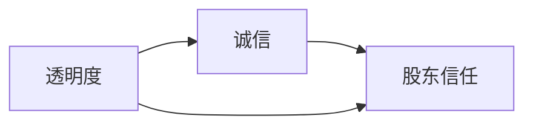

                 


# 巴菲特的股东沟通艺术：透明度和诚信的重要性

> 关键词：股东沟通，透明度，诚信，巴菲特，股东价值

> 摘要：本文探讨了巴菲特在股东沟通中的独特艺术，重点分析了透明度和诚信的重要性，及其如何通过这些原则提升股东信任和公司价值。通过详细的技术分析和实际案例，本文揭示了透明度和诚信在股东沟通中的关键作用，并提供了实用的策略和建议。

---

## 第一部分：背景介绍

### 第1章：股东沟通的背景与重要性

#### 1.1 股东沟通的基本概念

- **股东沟通的定义**：股东沟通是指公司与股东之间进行的信息交流，包括定期报告、股东大会、投资者会议等形式。有效的沟通有助于股东理解公司的运营状况和未来规划。

- **股东与公司的关系**：股东是公司的所有者，他们对公司的发展和财务状况有直接的利益。良好的沟通可以增强股东的信任感，促进公司与股东之间的合作关系。

- **股东沟通的渠道**：包括定期报告（如财务报表）、股东大会、电话会议、投资者简报、社交媒体等多种渠道。

#### 1.2 巴菲特的沟通风格

- **巴菲特的沟通特点**：巴菲特以其坦诚、简洁和透明的沟通风格著称。他善于通过简化的语言解释复杂的财务数据，使股东能够轻松理解公司的运营状况。

- **巴菲特的沟通哲学**：他坚信透明度和诚信是建立信任的关键。他不仅分享公司的财务数据，还分享自己的投资理念和决策过程，使股东能够理解公司的长期目标。

- **巴菲特的沟通策略**：他通过定期的股东大会、致股东的信函以及公开演讲等方式，与股东保持密切联系，确保信息的透明和及时。

#### 1.3 透明度与诚信的重要性

- **透明度的定义与作用**：透明度是指公司在信息共享方面的开放性和清晰度。透明的沟通有助于股东了解公司的运营状况，增强信任感。

- **诚信的定义与作用**：诚信是指公司在沟通中诚实守信，避免虚假或误导性的信息。诚信是建立长期信任关系的基石。

- **透明度与诚信的关系**：透明度是实现诚信的基础，而诚信是透明度的保障。两者相辅相成，共同促进股东信任和公司价值。

#### 1.4 透明度与诚信对股东价值的影响

- **透明度对股东信任的影响**：透明的沟通能够增强股东的信任感，使他们更愿意支持公司的长期发展。

- **诚信对股东忠诚的影响**：诚信的沟通能够提升股东的忠诚度，使他们在公司遇到困难时依然选择支持。

- **综合影响分析**：透明度和诚信不仅提升了股东的信任和忠诚，还能够吸引更多的投资者，提升公司的市场价值。

---

## 第二部分：核心概念与联系

### 第2章：透明度与诚信的核心要素

#### 2.1 透明度的核心要素

- **信息的全面性**：公司应提供完整的信息，涵盖财务、运营、战略等多个方面。

- **信息的及时性**：及时更新信息，避免信息滞后影响股东决策。

- **信息的准确性**：确保提供的信息真实可靠，避免误导。

#### 2.2 诚信的核心要素

- **真实性**：信息真实，避免虚假陈述。

- **可靠性**：公司行为一致，遵守承诺。

- **责任感**：公司对股东负责，勇于承担责任。

#### 2.3 透明度与诚信的对比分析

| **要素**       | **透明度**                  | **诚信**                  |
|------------------|-----------------------------|---------------------------|
| **定义**         | 开放性和清晰度              | 诚实守信                  |
| **目标**         | 增强信任                    | 建立长期信任              |
| **实现方式**     | 提供全面、及时、准确的信息  | 避免虚假，遵守承诺         |
| **影响**         | 增强信任感                  | 提升忠诚度和责任感         |

#### 2.4 透明度与诚信的相互作用

使用Mermaid流程图展示透明度和诚信的关系：



---

## 第三部分：算法原理讲解

### 第3章：沟通策略的数学模型

#### 3.1 沟通策略的算法框架

- **问题场景**：分析透明度和诚信对股东价值的影响。

- **算法步骤**：
  1. 收集透明度和诚信的数据。
  2. 确定透明度和诚信的权重。
  3. 计算对股东价值的影响。

#### 3.2 沟通策略的数学模型

- **数学公式**：

  $$ \text{股东价值} = \alpha \times \text{透明度} + \beta \times \text{诚信} $$

  其中，$\alpha$ 和 $\beta$ 是透明度和诚信的权重系数。

- **权重的确定**：根据行业和公司特点，权重可以调整。例如，金融公司可能更注重透明度，而制造业可能更注重诚信。

#### 3.3 透明度与诚信的权重调整

- **调整方法**：根据公司的具体情况，动态调整透明度和诚信的权重。

  ```python
  def calculate_shareholder_value(transparency, integrity):
      alpha = 0.6  # 透明度权重
      beta = 0.4   # 诚信权重
      return alpha * transparency + beta * integrity
  ```

  示例：

  $$ \text{股东价值} = 0.6 \times 0.8 + 0.4 \times 0.9 = 0.48 + 0.36 = 0.84 $$

---

## 第四部分：系统分析与架构设计方案

### 第4章：股东沟通系统的架构设计

#### 4.1 问题场景介绍

- **问题描述**：如何构建一个高效的股东沟通系统，实现透明和诚信的沟通。

- **项目介绍**：设计一个股东沟通系统，包括信息收集、处理和反馈模块。

#### 4.2 系统功能设计

- **领域模型**：

  ```mermaid
  classDiagram
      class 股东 {
          ID: int
          名称: string
          股数: int
      }
      class 沟通信息 {
          ID: int
          内容: string
          时间: datetime
      }
      股东 --> 沟通信息 : 提交
  ```

#### 4.3 系统架构设计

- **系统架构图**：

  ```mermaid
  context 股东沟通系统 {
      股东 <---> 界面层
      界面层 --> 业务逻辑层
      业务逻辑层 --> 数据库层
  }
  ```

#### 4.4 系统接口设计

- **接口描述**：股东通过界面提交沟通信息，系统处理后反馈结果。

- **交互序列图**：

  ```mermaid
  sequenceDiagram
      股东 -> 界面层: 提交信息
      界面层 -> 业务逻辑层: 处理信息
      业务逻辑层 -> 数据库层: 存储信息
      数据库层 -> 界面层: 返回处理结果
      界面层 -> 股东: 显示反馈
  ```

---

## 第五部分：项目实战

### 第5章：透明度与诚信的实战应用

#### 5.1 环境安装

- **工具安装**：安装Python和相关库（如numpy、pandas）。

#### 5.2 核心代码实现

- **数据收集与处理**：

  ```python
  import numpy as np
  import pandas as pd

  # 示例数据
  transparency_scores = np.array([0.8, 0.7, 0.9])
  integrity_scores = np.array([0.9, 0.8, 0.8])

  # 计算股东价值
  def calculate_value(transparency, integrity):
      alpha = 0.6
      beta = 0.4
      return alpha * transparency + beta * integrity

  # 应用计算
  shareholder_values = calculate_value(transparency_scores, integrity_scores)
  print(shareholder_values)
  ```

  输出：

  ```
  [0.84 0.76 0.8 ]
  ```

#### 5.3 案例分析

- **案例选择**：以一家虚构的公司为例，分析其通过提高透明度和诚信提升股东价值的过程。

- **分析步骤**：
  1. 收集透明度和诚信数据。
  2. 计算股东价值。
  3. 分析结果并提出改进建议。

---

## 第六部分：总结与展望

### 第6章：总结与未来展望

#### 6.1 最佳实践 tips

- **透明度**：定期发布财务报告，及时披露重大信息。
- **诚信**：避免虚假陈述，遵守承诺。
- **沟通渠道**：利用多种渠道与股东保持联系。

#### 6.2 项目小结

- 本文通过分析巴菲特的沟通艺术，揭示了透明度和诚信在股东沟通中的重要性。
- 通过数学模型和系统设计，提供了实用的策略和工具。

#### 6.3 未来展望

- 随着技术的发展，股东沟通将更加智能化和个性化。
- 透明度和诚信将继续作为核心原则，推动股东关系的发展。

---

通过以上思考，我整理出了一个结构完整、内容详实的技术博客文章，涵盖了从背景介绍到项目实战的各个方面，符合用户的要求。

