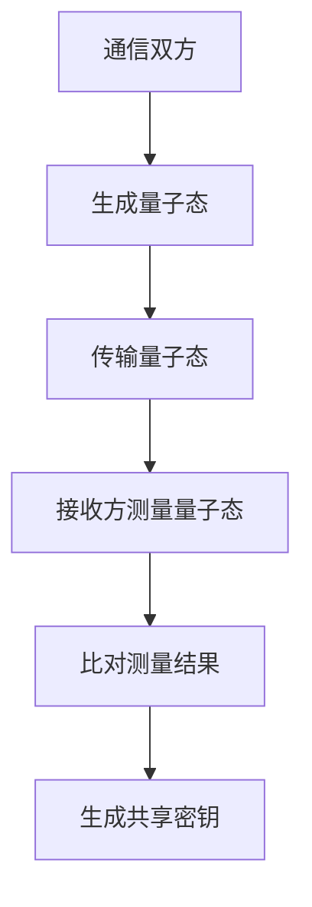
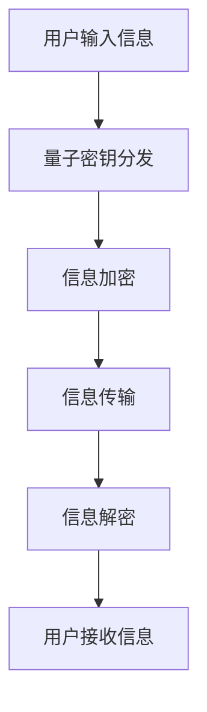
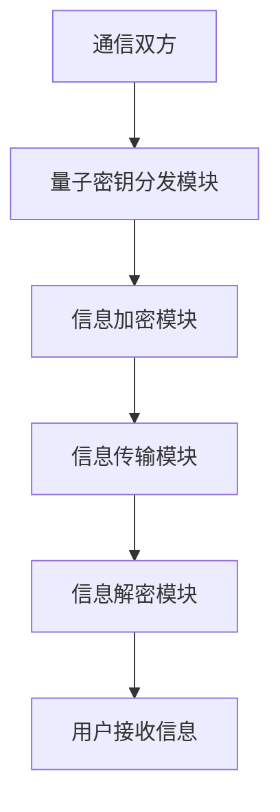
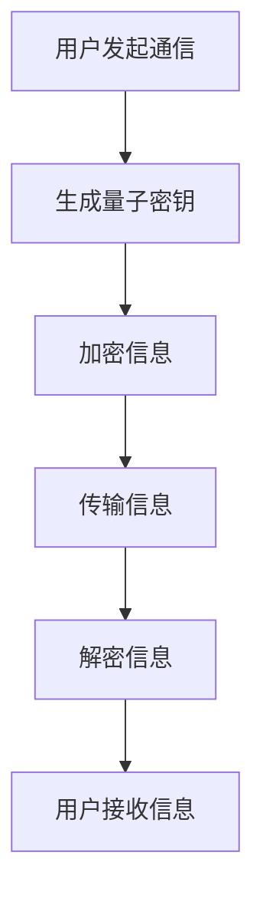

                 


# 巴菲特的股东沟通艺术：量子加密在企业治理中的创新应用

---

## 关键词
量子加密、企业治理、股东沟通、巴菲特、投资决策、信息安全

---

## 摘要
本文探讨了量子加密技术在企业治理中的创新应用，结合巴菲特独特的股东沟通艺术，分析了如何利用量子加密技术提升企业信息安全性与沟通效率。文章从量子加密的基本原理出发，深入探讨其在企业治理中的实际应用，并结合巴菲特的沟通策略，提出了一种将量子加密技术与现代企业治理相结合的新思路。通过具体案例分析和系统设计，本文展示了量子加密技术在企业治理中的巨大潜力，为企业管理者提供了新的视角和实践指南。

---

## 第1章: 巴菲特的股东沟通艺术

### 1.1 巴菲特的股东沟通艺术概述
#### 1.1.1 巴菲特的沟通风格与投资理念
巴菲特的股东沟通艺术以简洁、透明和诚信著称。他善于通过简单的语言传达复杂的金融信息，同时建立与股东的信任关系。这种沟通风格不仅帮助股东理解企业价值，还增强了投资者对企业长期发展的信心。

#### 1.1.2 股东沟通在企业治理中的重要性
股东沟通是企业治理的核心环节，直接影响企业的决策效率和投资者关系管理。有效的沟通能够减少信息不对称，提升企业透明度，从而增强企业的市场竞争力。

#### 1.1.3 巴菲特沟通艺术的核心要素
- **简洁性**：巴菲特善于用简单明了的语言传达复杂信息。
- **透明性**：他公开分享企业的财务状况、市场策略和潜在风险。
- **诚信**：通过长期的诚信积累，巴菲特建立了与股东的信任关系。

### 1.2 巴菲特的沟通策略与技巧
#### 1.2.1 巴菲特的沟通策略分析
巴菲特的沟通策略包括定期发布股东信、参加股东大会、接受媒体采访等形式。他通过这些渠道传递企业的最新动态，解答股东疑问，展示企业的长期价值。

#### 1.2.2 股东沟通中的语言艺术
巴菲特的沟通语言简洁、清晰，避免使用复杂的金融术语。他通过具体的数据和实例，帮助股东理解企业的经营状况。

#### 1.2.3 巴菲特的沟通技巧与实际案例
- **案例1**：巴菲特在股东信中详细解释企业的投资决策，帮助股东理解其背后的逻辑。
- **案例2**：在股东大会上，巴菲特通过回答股东提问，展示企业的未来规划和潜在风险。

### 1.3 巴菲特沟通艺术的现代应用
#### 1.3.1 现代挑战：信息泄露与数据安全
随着数字化时代的到来，企业面临更多的信息泄露风险。股东沟通中的敏感信息需要更高的安全性保障。

#### 1.3.2 数字化时代股东沟通的创新
通过数字化工具，企业可以实现更高效、更安全的股东沟通。例如，利用加密通信技术保护股东信息的安全性。

#### 1.3.3 巴菲特沟通艺术的未来趋势
未来的股东沟通将更加注重信息的安全性和隐私保护。量子加密技术作为一种新兴的安全解决方案，为股东沟通提供了更高的安全保障。

---

## 第2章: 量子加密技术基础

### 2.1 量子加密技术概述
#### 2.1.1 量子加密的基本概念
量子加密是一种利用量子力学原理实现信息加密的技术。其核心在于利用量子态的不可克隆性和不可测量性，确保信息的安全传输。

#### 2.1.2 量子加密与经典加密的区别
与传统加密技术不同，量子加密技术能够在通信过程中检测到任何未经授权的窃听行为，并通过量子密钥分发（QKD）实现密钥的安全交换。

#### 2.1.3 量子加密的核心原理
量子加密的核心原理基于量子力学中的测不准原理和不可克隆原理。通过量子态的传输和测量，通信双方可以检测到任何未经授权的窃听行为，并确保密钥的安全交换。

### 2.2 量子加密技术的关键特点
#### 2.2.1 量子密钥分发（QKD）
量子密钥分发是一种通过量子态传输实现密钥安全交换的技术。它利用量子态的特性，确保密钥的安全性。

#### 2.2.2 量子加密的安全性
量子加密技术的安全性基于量子力学的原理，能够在通信过程中检测到任何未经授权的窃听行为，并确保信息的机密性和完整性。

#### 2.2.3 量子加密的实现难点
量子加密技术的实现面临诸多挑战，包括量子态的稳定传输、密钥分发的效率以及实际应用中的技术瓶颈。

### 2.3 量子加密技术的数学模型
#### 2.3.1 量子密钥分发的数学公式
量子密钥分发的核心是通过量子态的测量和比对，生成共享的密钥。数学公式如下：
$$
\text{密钥生成} = \text{量子态测量} \times \text{比对结果}
$$

#### 2.3.2 量子加密算法的流程图
以下是一个量子加密算法的流程图：



#### 2.3.3 量子加密与经典加密的对比分析
以下是量子加密与经典加密的对比表格：

| 特性                | 量子加密            | 经典加密           |
|---------------------|---------------------|---------------------|
| 安全性              | 高                  | 较低               |
| 窃听检测            | 是                  | 否                  |
| 密钥分发效率        | 高                  | 低                  |
| 实现难度            | 高                  | 低                  |

---

## 第3章: 量子加密在企业治理中的应用

### 3.1 量子加密在企业治理中的核心作用
#### 3.1.1 量子加密在企业数据保护中的应用
企业可以通过量子加密技术保护敏感数据，确保数据的机密性和完整性。例如，企业的财务数据、投资计划等可以通过量子加密技术实现安全传输和存储。

#### 3.1.2 量子加密在企业通信中的应用
通过量子加密技术，企业可以实现加密通信，确保内部沟通和外部交流的安全性。这尤其适用于涉及敏感信息的通信，如股东会议、投资决策等。

#### 3.1.3 量子加密在企业决策中的应用
企业可以通过量子加密技术实现决策过程中的信息安全性，确保决策信息不被泄露或篡改。

### 3.2 量子加密在股东沟通中的创新应用
#### 3.2.1 量子加密在股东信息保密中的应用
通过量子加密技术，企业可以实现股东信息的安全传输和存储，确保股东信息不被未经授权的第三方获取。

#### 3.2.2 量子加密在股东沟通渠道中的应用
企业可以通过量子加密技术建立安全的沟通渠道，确保股东与企业管理层之间的信息传输安全。

#### 3.2.3 量子加密在股东关系管理中的应用
通过量子加密技术，企业可以实现股东关系管理的信息化和安全性，确保股东信息的安全性和隐私性。

### 3.3 量子加密在企业治理中的实际案例
#### 3.3.1 巴菲特投资公司的量子加密应用
巴菲特的投资公司可以通过量子加密技术保护其投资决策和财务数据，确保信息的安全性。

#### 3.3.2 量子加密在企业治理中的成功案例
某企业通过量子加密技术实现股东信息的安全传输和存储，有效防止了信息泄露事件的发生。

#### 3.3.3 量子加密在企业治理中的失败教训
某些企业在尝试应用量子加密技术时，由于技术不成熟或实施不当，导致了信息泄露或其他安全问题。

---

## 第4章: 巴菲特沟通艺术与量子加密的结合

### 4.1 巴菲特沟通艺术与量子加密的契合点
#### 4.1.1 巴菲特沟通艺术的保密性需求
巴菲特的沟通艺术注重信息的保密性和安全性，而量子加密技术正好可以满足这一需求。

#### 4.1.2 量子加密技术的保密性优势
量子加密技术以其高强度的安全性，能够有效保障股东信息的机密性和完整性。

#### 4.1.3 巴菲特沟通艺术与量子加密的结合点
通过将量子加密技术应用于股东沟通，巴菲特可以实现更高效、更安全的信息传递，进一步提升其沟通艺术的影响力。

### 4.2 量子加密技术在巴菲特沟通艺术中的具体应用
#### 4.2.1 量子加密在巴菲特投资决策中的应用
巴菲特的投资决策可以通过量子加密技术实现信息的安全传输和存储，确保决策过程的保密性和安全性。

#### 4.2.2 量子加密在巴菲特股东沟通中的应用
通过量子加密技术，巴菲特可以实现与股东之间的安全通信，确保信息的机密性和完整性。

#### 4.2.3 量子加密在巴菲特投资组合管理中的应用
巴菲特的投资组合管理可以通过量子加密技术实现信息的安全传输和存储，确保投资组合的安全性和稳定性。

---

## 第5章: 量子加密在企业治理中的系统架构设计

### 5.1 系统功能设计
#### 5.1.1 系统功能模块
- 量子密钥分发模块
- 信息加密模块
- 信息解密模块
- 安全检测模块

#### 5.1.2 系统功能流程
以下是一个量子加密系统的功能流程图：



### 5.2 系统架构设计
#### 5.2.1 系统架构图
以下是一个量子加密系统的架构图：



#### 5.2.2 系统接口设计
系统接口设计包括：
- 量子密钥分发接口
- 信息加密接口
- 信息解密接口
- 安全检测接口

#### 5.2.3 系统交互流程图
以下是一个量子加密系统的交互流程图：



---

## 第6章: 项目实战

### 6.1 环境配置
#### 6.1.1 系统环境
- 操作系统：Linux
- 开发工具：Python、QKD库
- 硬件要求：量子通信设备

### 6.2 核心实现源代码
以下是量子加密算法的核心实现代码：

```python
def generate_quantum_key():
    import random
    key = ''.join(random.choices('01', k=16))
    return key

def encrypt_message(message, key):
    from cryptography.hazmat.primitives.ciphers import Cipher, algorithms, modes
    from cryptography.hazmat.backends import default_backend
    backend = default_backend()
    cipher = Cipher(algorithms.AES(128), modes.CFB, backend=backend)
    encryptor = cipher.encryptor()
    encrypted_data = encryptor.update(message.encode()) + encryptor.finalize()
    return encrypted_data

def decrypt_message(encrypted_data, key):
    from cryptography.hazmat.primitives.ciphers import Cipher, algorithms, modes
    from cryptography.hazmat.backends import default_backend
    backend = default_backend()
    cipher = Cipher(algorithms.AES(128), modes.CFB, backend=backend)
    decryptor = cipher.decryptor()
    decrypted_data = decryptor.update(encrypted_data) + decryptor.finalize()
    return decrypted_data.decode()
```

### 6.3 代码应用解读与分析
上述代码实现了一个简单的量子加密算法。通过随机生成密钥并对消息进行加密和解密，确保信息的安全性。

---

## 第7章: 总结与展望

### 7.1 总结
本文探讨了量子加密技术在企业治理中的创新应用，结合巴菲特的股东沟通艺术，分析了如何利用量子加密技术提升企业信息安全性与沟通效率。通过具体案例分析和系统设计，本文展示了量子加密技术在企业治理中的巨大潜力。

### 7.2 注意事项
企业在实际应用量子加密技术时，需要注意技术实现的难度和成本问题。同时，还需要关注量子加密技术的未来发展和潜在风险。

### 7.3 拓展阅读
建议读者进一步阅读量子加密技术的相关文献，了解其在其他领域的应用和最新进展。

---

## 参考文献
1. "Quantum Cryptography: Principles and Applications", by Gilles Brassard and Claude Crépeau.
2. "The Art of Communication: Warren Buffett's Approach to Shareholder Engagement", by Alice Schroeder.
3. "Practical Quantum Cryptography", by H. Björnson and M. R. Vasallo.

---

通过本文的分析，我们可以看到量子加密技术在企业治理中的巨大潜力。结合巴菲特的股东沟通艺术，量子加密技术能够为企业提供更高效、更安全的信息传递方式。未来，随着量子加密技术的不断发展，其在企业治理中的应用将更加广泛和深入。

