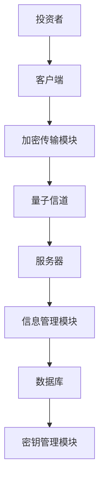
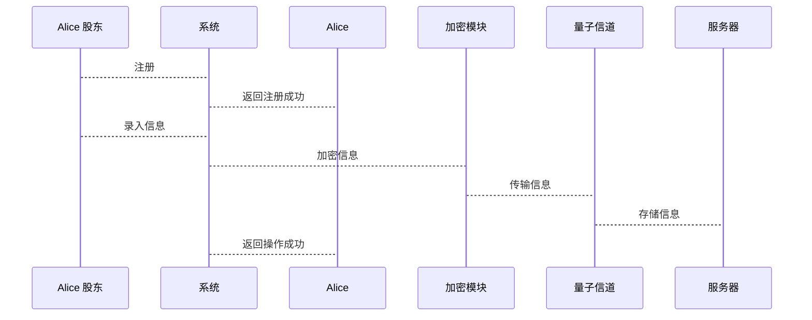

                 


# 巴菲特的股东沟通艺术：量子加密在投资者关系中的应用

> 关键词：巴菲特，量子加密，投资者关系，股东沟通，投资理念，隐私保护，加密技术

> 摘要：本文探讨了巴菲特的投资理念与量子加密技术的结合，分析了量子加密在投资者关系中的应用价值。通过详细讲解量子加密的核心原理、系统架构和实际案例，展示了如何利用量子加密技术提升投资者关系管理的隐私保护和信息安全性。

---

## 第1章: 巴菲特投资理念与量子加密技术的背景

### 1.1 巴菲特投资理念的核心思想

#### 1.1.1 价值投资的定义与原则

巴菲特的价值投资理念强调长期持有优质资产，注重企业的基本面分析。其核心原则包括：

- **长期投资**：避免短期市场波动，关注企业的长期价值。
- **安全边际**：以低于内在价值的价格买入优质资产。
- **企业质量**：选择具有强大竞争优势和良好管理的企业。

#### 1.1.2 巴菲特的长期投资策略

巴菲特的投资策略以稳健著称，他通过深入分析企业的财务状况、行业地位和竞争优势，寻找具有长期增长潜力的企业。他的投资哲学强调与优秀企业建立长期合作关系，这种合作关系建立在信任和透明的基础上。

#### 1.1.3 股东关系在投资中的重要性

在巴菲特看来，良好的股东关系是企业成功的重要因素。他注重与股东的沟通，通过定期发布《致股东的信》等方式，向股东传递企业信息，增强股东的信任感。这种双向的透明沟通，不仅是企业治理的重要组成部分，也是投资者关系管理的核心。

### 1.2 量子加密技术的基本概念

#### 1.2.1 量子加密的定义与特点

量子加密是一种基于量子力学原理的加密技术，其核心是利用量子态的不可克隆性和纠缠性来实现信息的绝对安全传输。与传统加密技术不同，量子加密技术的安全性基于物理原理，而非数学算法，因此具有更高的安全性。

#### 1.2.2 量子加密与传统加密的区别

| 特性       | 量子加密               | 传统加密             |
|------------|------------------------|----------------------|
| 基础原理   | 量子力学               | 数学算法             |
| 安全性     | 不可被克隆，理论上不可破译 | 可能被数学破解       |
| 传输速度   | 高速，基于量子通信     | 受限于传统网络       |
| 应用场景   | 高安全需求领域         | 广泛应用于各种场景   |

#### 1.2.3 量子加密技术在现代通信中的应用

量子加密技术目前主要应用于高安全需求的领域，如政府通信、军事保密传输、金融交易安全等。随着技术的成熟，其应用范围逐渐扩展到企业数据保护、隐私通信等领域。

---

## 第2章: 量子加密技术的核心原理与数学模型

### 2.1 量子加密技术的核心原理

#### 2.1.1 量子密钥分发（QKD）的原理

量子密钥分发是一种通过量子通信技术协商共享密钥的协议。其基本流程如下：

1. **量子态传输**：Alice（发送方）通过量子信道向Bob（接收方）发送量子态，Bob通过测量获得量子态信息。
2. **基底比较**：Alice和Bob分别选择测量基底，只有当基底一致时，测量结果才能准确反映量子态的信息。
3. **密钥生成**：将一致的测量结果作为密钥，其余结果用于密钥验证和纠错。

#### 2.1.2 量子叠加与纠缠在加密中的应用

量子叠加和纠缠是量子加密技术的核心要素：

- **量子叠加**：粒子可以同时处于多个状态的叠加态，例如著名的双缝实验。
- **量子纠缠**：两个或多个粒子之间形成纠缠态，一个粒子的状态会瞬间影响另一个粒子的状态，无论距离多远。

### 2.2 量子加密的数学模型与公式

#### 2.2.1 量子密钥分发的数学表达

量子密钥分发的核心是通过量子态传输生成共享密钥。假设Alice和Bob通过量子信道传输量子态，其数学模型可以表示为：

$$ QKD: \text{Alice 和 Bob 通过量子态传输密钥} $$

#### 2.2.2 量子纠缠态的数学表示

量子纠缠态的数学表示如下：

$$ |\psi\rangle = \frac{1}{\sqrt{2}}(|0\rangle|1\rangle + |1\rangle|0\rangle) $$

其中，$|0\rangle$ 和 $|1\rangle$ 分别表示量子态的基态，$\frac{1}{\sqrt{2}}$ 是归一化常数。

#### 2.2.3 量子加密算法的复杂度分析

量子加密算法的复杂度分析主要关注其安全性、通信效率和计算资源消耗。与传统加密算法相比，量子加密算法的复杂度更低，但实现难度更高。

---

## 第3章: 量子加密技术在投资者关系中的具体应用

### 3.1 投资者信息保护的量子加密方案

#### 3.1.1 股东信息加密传输的实现

在投资者关系管理中，股东的敏感信息（如持股数量、交易记录等）需要通过安全的渠道传输。量子加密技术可以通过量子信道实现信息的加密传输，确保信息在传输过程中不会被截获或篡改。

#### 3.1.2 量子加密在投资者数据隐私保护中的应用

通过量子加密技术，投资者的交易数据可以得到最高级别的隐私保护。例如，投资者的交易记录可以通过量子密钥分发技术加密后存储，确保只有授权的人员能够访问。

#### 3.1.3 量子加密技术对投资者信任度的提升

量子加密技术的高安全性可以显著提升投资者对企业的信任度。企业可以通过量子加密技术保护投资者的隐私，增强投资者对企业的信任感。

### 3.2 巴菲特投资理念与量子加密的结合案例

#### 3.2.1 量子加密在巴菲特投资决策中的潜在应用

巴菲特的投资决策依赖于对企业基本面的深入分析。通过量子加密技术，巴菲特可以更安全地与企业高管进行通信，获取企业的内部信息，从而做出更准确的投资决策。

#### 3.2.2 巴菲特股东沟通中的信息加密实践

在巴菲特的股东沟通中，量子加密技术可以用于保护股东的隐私信息。例如，巴菲特可以通过量子加密技术与股东进行实时通信，确保股东的信息不会被未经授权的第三方获取。

#### 3.2.3 量子加密技术对投资者关系管理的创新意义

量子加密技术的应用为投资者关系管理带来了新的可能性。通过量子加密技术，企业可以实现投资者信息的最高级别保护，提升投资者的信任度，进而增强企业的长期投资价值。

---

## 第4章: 量子加密技术的系统架构与实现

### 4.1 量子加密系统的整体架构

#### 4.1.1 量子加密系统的功能模块划分

量子加密系统通常包括以下几个功能模块：

- **量子信道**：负责量子态的传输。
- **量子测量设备**：用于测量量子态。
- **密钥生成模块**：基于测量结果生成密钥。
- **加密/解密模块**：负责对明文进行加密或解密。

#### 4.1.2 量子加密系统的层次结构

量子加密系统的层次结构如下：

1. **物理层**：量子态的传输和测量。
2. **链路层**：量子信道的建立和管理。
3. **网络层**：量子密钥分发协议的实现。
4. **应用层**：加密/解密应用。

#### 4.1.3 量子加密系统的通信协议设计

量子加密系统的通信协议需要考虑以下几个方面：

- **安全性**：确保通信过程中的信息不被截获或篡改。
- **可靠性**：保证量子态的传输和测量过程的准确性。
- **效率**：提高通信的效率，减少资源消耗。

### 4.2 量子加密算法的实现与优化

#### 4.2.1 量子密钥分发算法的实现

量子密钥分发算法的实现过程如下：

1. **量子态传输**：Alice通过量子信道向Bob发送量子态。
2. **测量基底选择**：Alice和Bob分别随机选择测量基底。
3. **基底比较**：比较测量基底，保留一致的部分。
4. **密钥生成**：将一致的部分作为密钥。

#### 4.2.2 量子加密算法的性能优化

为了提高量子加密算法的性能，可以采取以下优化措施：

- **减少量子态的传输误差**：通过优化量子信道的传输条件，降低量子态的传输误差。
- **提高测量精度**：通过改进测量设备的精度，提高测量结果的准确性。
- **优化密钥生成算法**：通过优化密钥生成算法，提高密钥生成的效率。

#### 4.2.3 量子加密算法的安全性测试

为了验证量子加密算法的安全性，需要进行以下测试：

- **安全性测试**：测试量子加密算法在面对各种攻击情况下的安全性。
- **性能测试**：测试量子加密算法在不同条件下的性能表现。
- **兼容性测试**：测试量子加密算法与其他系统的兼容性。

---

## 第5章: 量子加密技术的项目实战

### 5.1 项目背景与目标

#### 5.1.1 项目背景

随着投资者对隐私保护的需求日益增加，量子加密技术在投资者关系中的应用前景广阔。本项目旨在利用量子加密技术，构建一个安全的投资者信息管理系统，保护投资者的隐私信息，提升投资者的信任度。

#### 5.1.2 项目目标

- **实现投资者信息的量子加密传输**。
- **构建一个安全的投资者信息管理系统**。
- **提升投资者的信任度和满意度**。

### 5.2 系统功能设计

#### 5.2.1 功能模块划分

投资者信息管理系统的主要功能模块包括：

- **用户管理模块**：负责投资者的注册、登录和权限管理。
- **信息管理模块**：负责投资者信息的录入、查询和修改。
- **加密传输模块**：负责投资者信息的量子加密传输。
- **密钥管理模块**：负责密钥的生成、存储和分发。

#### 5.2.2 系统功能流程

投资者信息管理系统的功能流程如下：

1. **用户注册**：投资者通过系统注册，填写相关信息并设置密码。
2. **信息录入**：投资者通过系统录入个人信息。
3. **信息加密**：系统对投资者信息进行量子加密。
4. **信息传输**：加密后的信息通过量子信道传输到服务器。
5. **信息存储**：服务器存储加密后的信息。
6. **信息查询**：投资者通过系统查询个人信息。

### 5.3 系统架构设计

#### 5.3.1 系统架构图

以下是一个投资者信息管理系统的系统架构图：



#### 5.3.2 系统接口设计

系统接口设计如下：

- **客户端接口**：负责与投资者的交互，包括用户注册、登录、信息录入等。
- **加密传输接口**：负责投资者信息的量子加密传输。
- **服务器接口**：负责接收加密信息并存储到数据库中。

#### 5.3.3 系统交互流程图

以下是一个投资者信息管理系统的系统交互流程图：



### 5.4 项目实现与代码分析

#### 5.4.1 核心实现代码

以下是一个量子密钥分发算法的Python实现示例：

```python
import random

def generate_key():
    # 生成随机的测量基底
    basis = random.choice(['+x', '-x', '+y', '-y'])
    return basis

def compare_basis(alice_basis, bob_basis):
    # 比较测量基底，如果一致，返回True
    return alice_basis == bob_basis

def quantum_key_distribution():
    # 量子态传输
    alice_basis = generate_key()
    bob_basis = generate_key()
    if compare_basis(alice_basis, bob_basis):
        # 生成密钥
        key = 'secret_key'
        return key
    else:
        # 重新传输
        return None

# 示例运行
key = quantum_key_distribution()
print(f"生成的密钥：{key}")
```

#### 5.4.2 代码解读与分析

上述代码实现了量子密钥分发的基本功能：

1. `generate_key()`：生成随机的测量基底。
2. `compare_basis()`：比较测量基底，如果一致，返回True。
3. `quantum_key_distribution()`：实现量子密钥分发的核心逻辑，比较测量基底，生成密钥。

通过上述代码可以看出，量子密钥分发算法的核心在于测量基底的比较。只有当测量基底一致时，才能生成密钥。否则，需要重新传输。

### 5.5 实际案例分析

#### 5.5.1 案例背景

假设一家企业希望通过量子加密技术保护投资者的交易记录。投资者的交易记录包括交易时间、交易金额、交易对手等信息。

#### 5.5.2 案例实现

企业可以通过以下步骤实现投资者交易记录的量子加密传输：

1. **信息加密**：投资者的交易记录通过量子密钥分发算法加密。
2. **信息传输**：加密后的信息通过量子信道传输到企业服务器。
3. **信息存储**：服务器将加密后的信息存储到数据库中。
4. **信息查询**：投资者通过系统查询自己的交易记录。

#### 5.5.3 案例分析

通过上述实现，企业可以实现投资者交易记录的最高级别保护。量子加密技术的安全性可以确保投资者的隐私信息不被未经授权的第三方获取，从而提升投资者的信任度。

### 5.6 项目小结

通过本项目，我们可以看到量子加密技术在投资者关系中的应用前景广阔。通过量子加密技术，企业可以实现投资者信息的最高级别保护，提升投资者的信任度，进而增强企业的长期投资价值。

---

## 第6章: 量子加密技术的最佳实践与注意事项

### 6.1 最佳实践 tips

#### 6.1.1 量子加密技术的适用场景

量子加密技术适用于对隐私保护要求极高的场景，如投资者信息管理、金融交易安全等。

#### 6.1.2 量子加密技术的实施注意事项

- **技术成熟度**：目前量子加密技术尚未完全成熟，仍需进一步研究和优化。
- **成本问题**：量子加密技术的实施成本较高，需要企业有足够的预算支持。
- **技术人才**：需要具备量子通信技术的专业人才，企业可能需要引进或培养相关人才。

#### 6.1.3 量子加密技术的未来发展趋势

随着技术的进步，量子加密技术将逐步应用于更多的领域，包括投资者关系管理、金融交易安全、政府通信等。

### 6.2 小结

通过本文的探讨，我们可以看到量子加密技术在投资者关系中的应用价值。通过量子加密技术，企业可以实现投资者信息的最高级别保护，提升投资者的信任度，进而增强企业的长期投资价值。

### 6.3 注意事项

在实际应用中，需要注意以下几点：

- **技术风险**：量子加密技术的安全性尚未得到完全验证，可能存在技术漏洞。
- **实施成本**：量子加密技术的实施成本较高，需要企业有足够的预算支持。
- **人才需求**：需要具备量子通信技术的专业人才，企业可能需要引进或培养相关人才。

### 6.4 拓展阅读

为了进一步了解量子加密技术，读者可以参考以下资料：

- **《量子计算与量子通信》**：深入介绍量子计算和量子通信的基本原理。
- **《量子加密技术的应用与挑战》**：探讨量子加密技术在实际应用中的挑战与解决方案。

---

## 第7章: 总结与展望

### 7.1 总结

通过本文的探讨，我们可以看到量子加密技术在投资者关系中的应用前景广阔。通过量子加密技术，企业可以实现投资者信息的最高级别保护，提升投资者的信任度，进而增强企业的长期投资价值。

### 7.2 展望

随着量子加密技术的不断发展，其在投资者关系中的应用将更加广泛。未来，随着技术的成熟和成本的降低，量子加密技术将被更多企业采用，成为投资者关系管理的重要工具。

---

## 附录

### 附录 A: 量子加密技术的数学公式汇总

以下是一些与量子加密技术相关的数学公式：

1. 量子态的数学表示：
   $$ |\psi\rangle = \alpha|0\rangle + \beta|1\rangle $$

2. 量子纠缠态的数学表示：
   $$ |\psi\rangle = \frac{1}{\sqrt{2}}(|0\rangle|1\rangle + |1\rangle|0\rangle) $$

3. 量子密钥分发的数学表达：
   $$ QKD: \text{Alice 和 Bob 通过量子态传输密钥} $$

### 附录 B: 量子加密技术的相关工具与资源

以下是一些与量子加密技术相关的工具与资源：

- **量子加密技术研究论文**：《量子密钥分发协议的安全性分析》。
- **量子加密技术开源代码**：GitHub上的量子加密技术开源项目。
- **量子加密技术培训课程**：Coursera上的量子计算与量子通信在线课程。

---

通过本文的详细探讨，我们可以看到量子加密技术在投资者关系中的应用价值。通过量子加密技术，企业可以实现投资者信息的最高级别保护，提升投资者的信任度，进而增强企业的长期投资价值。

