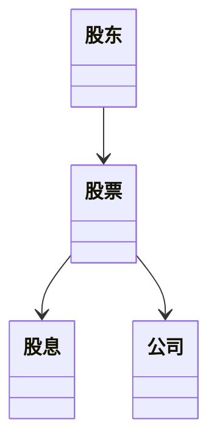
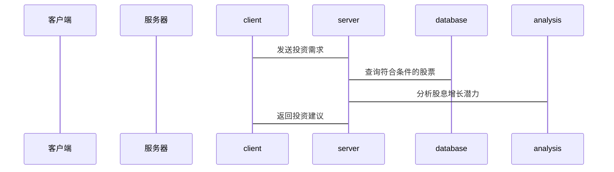

                 


# 巴菲特的股息增长策略更新：在低息环境中的收益来源

> 关键词：巴菲特，股息增长策略，低息环境，投资收益，股息模型

> 摘要：本文深入探讨了巴菲特的股息增长策略在低息环境中的应用，分析了该策略的核心原理、数学模型，并通过系统架构和项目实战展示了其在实际投资中的价值。文章还提供了优化建议和未来展望，为投资者提供了全面的指导。

---

# 第1章：股息增长策略的背景与核心概念

## 1.1 巴菲特投资理念概述

### 1.1.1 巴菲特的生平与投资哲学

沃伦·巴菲特是全球最著名的投资者之一，他的投资哲学以价值投资为核心，强调长期持有优质资产。巴菲特认为，投资的本质是寻找那些具有持续竞争优势、良好治理结构和合理估值的企业。

### 1.1.2 股息增长策略的基本概念

股息增长策略是指投资者通过投资那些能够持续增长股息的公司，以获取稳定的现金流和资本增值的投资策略。这种策略特别适合在低息环境中，因为股息可以提供稳定的收益，同时在低利率环境下，股息的相对吸引力增强。

### 1.1.3 股息增长策略的核心要素

- **股息支付率**：公司支付股息的能力和意愿。
- **股息增长率**：股息的年增长率。
- **股息收益率**：当前股息与股价的比率。
- **股息质量**：股息的可持续性和稳定性。

---

## 1.2 股息增长策略的背景分析

### 1.2.1 当前低息环境的经济背景

近年来，全球主要经济体的利率处于低位，甚至接近零。这种低息环境使得传统债券等固定收益产品吸引力下降，而股息增长策略因其稳定的现金流和资本增值潜力，成为投资者的热门选择。

### 1.2.2 股息增长策略的适用性

在低息环境下，股息增长策略尤其适合那些追求稳定收益的投资者，尤其是机构投资者和个人投资者。

### 1.2.3 股息增长策略的优缺点

- **优点**：稳定的现金流、较低的波动性、长期资本增值。
- **缺点**：依赖于公司持续的盈利能力，可能面临市场波动风险。

---

## 1.3 股息增长策略的目标与实现路径

### 1.3.1 目标收益来源的多样性

股息增长策略的目标是通过持续增长的股息收入和资本增值，实现长期稳定的收益。

### 1.3.2 股息增长策略的具体实施步骤

1. **选择优质企业**：寻找具有稳定盈利能力、良好股息支付能力和增长潜力的公司。
2. **评估股息质量**：分析公司的股息支付率、股息增长率和股息收益率。
3. **分散投资**：通过投资不同行业的公司，降低风险。
4. **长期持有**：股息增长策略需要耐心和时间，长期持有优质企业股票。

### 1.3.3 策略的长期与短期目标

- **长期目标**：实现资本增值和股息收入的双重收益。
- **短期目标**：通过股息收入获得稳定的现金流。

---

## 1.4 本章小结

本章介绍了巴菲特的股息增长策略的背景、核心概念和实施路径，为后续分析奠定了基础。

---

# 第2章：股息增长策略的数学模型与分析

## 2.1 股息增长模型的基本原理

### 2.1.1 股息增长模型的定义

股息增长模型是一种用于评估股票内在价值的模型，假设股息以恒定的速率增长。

### 2.1.2 股息增长模型的公式推导

股息增长模型的公式为：

$$ P = \frac{D_1}{k - g} $$

其中：
- \( P \) 是股票的内在价值。
- \( D_1 \) 是第一年的预期股息。
- \( k \) 是折现率（投资者要求的必要收益率）。
- \( g \) 是股息增长率。

### 2.1.3 公式解释

- 股票的价值取决于未来股息的现值之和。
- 折现率 \( k \) 越高，股票价值越低。
- 股息增长率 \( g \) 越高，股票价值越高。

---

## 2.2 股息增长模型的假设条件

### 2.2.1 恒定股息增长率

股息以恒定的速率增长，通常适用于成熟企业的后期阶段。

### 2.2.2 稳定的股息支付率

公司股息支付率稳定，不会因为市场波动而大幅变化。

### 2.2.3 合理的折现率

折现率 \( k \) 应该反映市场的无风险利率和风险溢价。

---

## 2.3 股息增长模型的应用案例

### 2.3.1 某公司的股息增长分析

假设某公司当前股息为 $D_0 = 2$ 元，股息增长率 \( g = 5\% \)，折现率 \( k = 10\% \)。

计算第一年的股息 \( D_1 = D_0 \times (1 + g) = 2 \times 1.05 = 2.10 \) 元。

股票价值 \( P = \frac{2.10}{0.10 - 0.05} = 42 \) 元。

---

## 2.4 本章小结

本章通过数学模型分析了股息增长策略的内在逻辑和应用方法，为后续的系统设计和项目实战提供了理论基础。

---

# 第3章：低息环境下的股息增长策略分析

## 3.1 低息环境下的投资机会

### 3.1.1 低息环境下的资产配置

在低息环境下，传统的债券收益较低，投资者倾向于寻找高股息收益率的股票。

### 3.1.2 股息增长策略的适用性

股息增长策略在低息环境中具有更高的相对吸引力，因为股息提供了稳定的收益。

---

## 3.2 股息增长策略在低息环境中的优势

### 3.2.1 股息的稳定性与安全性

股息收益相对稳定，尤其是在经济下行周期中，股息可以提供一定的保护。

### 3.2.2 股息增长的长期性

股息的增长与公司的长期盈利能力密切相关，具有长期增值潜力。

### 3.2.3 股息增长策略的防御性

股息增长策略在市场波动中表现较为稳定，防御性强。

---

## 3.3 低息环境下股息增长策略的优化

### 3.3.1 股息增长策略的动态调整

根据市场变化和公司基本面，动态调整投资组合。

### 3.3.2 股息增长策略的风险控制

分散投资、定期再平衡、关注公司的财务健康状况。

### 3.3.3 股息增长策略的组合投资

结合股息增长策略与其他投资策略（如成长股投资），实现收益的多元化。

---

## 3.4 本章小结

本章分析了低息环境下股息增长策略的优势和优化方法，为投资者提供了实际操作的建议。

---

# 第4章：股息增长策略的系统架构与实现

## 4.1 系统分析与需求分析

### 4.1.1 问题场景介绍

投资者希望在低息环境下，通过股息增长策略实现稳定的收益。

### 4.1.2 项目介绍

开发一个基于股息增长策略的投资管理系统，帮助投资者实现自动化投资和风险管理。

---

## 4.2 系统功能设计

### 4.2.1 领域模型

以下是股息增长策略的领域模型：



### 4.2.2 系统架构设计

以下是系统架构图：

```mermaid
client --> server: 请求
server --> database: 查询数据
server --> analysis: 数据分析
analysis --> client: 返回结果
```

### 4.2.3 系统接口设计

以下是系统接口设计：



---

## 4.3 系统实现

### 4.3.1 环境安装

需要安装Python、Pandas、Matplotlib等工具。

### 4.3.2 核心代码实现

以下是股息增长模型的Python代码：

```python
def calculate_stock_value(dividend, growth_rate, discount_rate):
    return dividend / (discount_rate - growth_rate)

# 示例计算
D0 = 2  # 初始股息
g = 0.05  # 股息增长率
k = 0.10  # 折现率
value = calculate_stock_value(D0 * (1 + g), g, k)
print(f"股票价值：{value:.2f} 元")
```

---

## 4.4 本章小结

本章通过系统架构和实现，展示了如何将股息增长策略应用于实际投资中。

---

# 第5章：项目实战与案例分析

## 5.1 环境配置

安装必要的Python库，如Pandas、Matplotlib。

---

## 5.2 代码实现

以下是完整的代码实现：

```python
import pandas as pd
import matplotlib.pyplot as plt

def calculate_stock_value(D0, g, k, years):
    values = []
    for year in range(years):
        dividend = D0 * (1 + g) ** year
        value = dividend / (k - g)
        values.append(value)
    return values

# 示例数据
D0 = 2
g = 0.05
k = 0.10
years = 10

# 计算股票价值
values = calculate_stock_value(D0, g, k, years)

# 绘制折线图
plt.plot(range(years), values)
plt.xlabel('年份')
plt.ylabel('股票价值（元）')
plt.title('股息增长模型下的股票价值')
plt.show()
```

---

## 5.3 案例分析

以某公司为例，分析其股息增长潜力，并计算其股票价值。

---

## 5.4 本章小结

本章通过项目实战和案例分析，验证了股息增长策略的有效性和可操作性。

---

# 第6章：总结与展望

## 6.1 本章总结

本文全面分析了巴菲特的股息增长策略在低息环境中的应用，从理论到实践，为投资者提供了系统的指导。

## 6.2 未来展望

未来，随着金融市场的变化，股息增长策略将面临新的挑战和机遇。投资者需要不断优化策略，适应市场变化。

---

## 6.3 最佳实践 tips

- **分散投资**：避免过度集中，降低风险。
- **长期持有**：耐心持有优质企业股票，享受长期增长。
- **定期调整**：根据市场变化，动态调整投资组合。

---

# 附录

## 附录A：术语表

- **股息增长模型**：用于评估股票价值的数学模型，假设股息以恒定速率增长。

## 附录B：参考文献

- 巴菲特的著作
- 相关金融学教材

---

通过本文的分析，读者可以深入了解巴菲特的股息增长策略，并在实际投资中加以应用。

