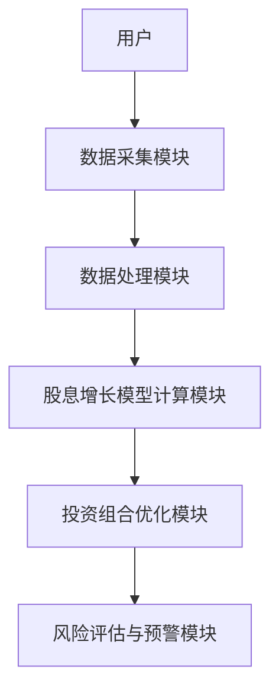

                 


# 巴菲特的股息增长策略：稳定现金流的长期价值

## 关键词：股息增长策略, 巴菲特, 现金流, 投资策略, 长期价值

## 摘要：巴菲特的股息增长策略是一种以股息收入为核心，通过选择股息稳定增长的优质企业进行长期投资的策略。本文详细分析了股息增长策略的定义、核心概念、算法原理、数学模型、系统架构以及实际案例，探讨了该策略在稳定现金流和长期价值创造中的重要作用。

---

## 第一部分: 股息增长策略的背景与基础

### 第1章: 股息增长策略的定义与背景

#### 1.1 股息增长策略的定义

股息增长策略是一种以股息收入为核心的投资策略，投资者通过选择股息稳定增长的公司进行长期投资，以实现资产的稳步增值。这种策略强调企业的股息支付能力和股息增长率，旨在通过持续的股息收入和资本增值来创造长期价值。

#### 1.2 股息增长策略的核心要素

股息增长策略的核心要素包括：

1. **股息支付能力**：公司具有稳定的盈利能力和足够的现金流，能够持续支付股息。
2. **股息增长率**：公司股息的年增长率较高，且具有可持续性。
3. **股息率**：股息与股票价格的比率，反映了股息收入的相对高低。
4. **企业基本面**：公司具有良好的财务状况、行业地位和竞争优势。

#### 1.3 股息增长策略的适用场景

股息增长策略适用于以下场景：

1. **长期投资**：适合追求长期稳定收益的投资者，尤其是希望通过股息收入实现财务自由的投资者。
2. **低波动性需求**：股息增长策略通常比股票价格波动小，适合风险偏好较低的投资者。
3. **经济不确定性**：在经济不确定时期，股息增长策略能够提供稳定的现金流，帮助投资者应对市场波动。

---

### 第2章: 股息增长策略与其他投资策略的对比

#### 2.1 股息增长策略与价值投资的异同

- **相同点**：两者都注重企业的基本面分析，追求长期价值。
- **不同点**：价值投资更关注股票的内在价值，而股息增长策略更关注股息的稳定性和增长性。

#### 2.2 股息增长策略与成长投资的对比

- **相同点**：两者都追求长期收益，注重企业的发展潜力。
- **不同点**：成长投资更关注企业的成长性和未来盈利潜力，而股息增长策略更关注股息的稳定性和增长性。

#### 2.3 股息增长策略与股息贴现模型的区别

- **股息增长策略**：以股息的稳定增长为核心，选择股息率高且增长快的公司。
- **股息贴现模型（DDM）**：通过股息的现值计算股票的内在价值，适用于股息稳定的公司。

---

## 第二部分: 股息增长策略的核心概念

### 第3章: 股息增长模型的原理

#### 3.1 股息增长模型的基本假设

1. 股息在永续期内以固定速度增长。
2. 股票的必要收益率为常数。
3. 股票的价值可以通过股息的现值总和来计算。

#### 3.2 股息增长模型的数学公式

股息增长模型的公式为：

$$ V = \frac{D_1}{r - g} $$

其中：
- \( V \) 为股票的内在价值
- \( D_1 \) 为下一期股息
- \( r \) 为必要收益率
- \( g \) 为股息增长率

#### 3.3 股息增长模型的适用条件

- 公司股息增长率稳定且可预测。
- 股票的必要收益率大于股息增长率。
- 公司具有稳定的盈利能力和现金流。

---

## 第三部分: 股息增长策略的算法与数学模型

### 第4章: 股息增长模型的算法流程

#### 4.1 股息增长模型的输入参数

- 初始股息 \( D_0 \)
- 股息增长率 \( g \)
- 必要收益率 \( r \)
- 投资期限 \( n \)

#### 4.2 股息增长模型的计算步骤

1. 计算未来各期的股息：\( D_t = D_0 \times (1 + g)^t \)
2. 计算每期股息的现值：\( PV_t = \frac{D_t}{(1 + r)^t} \)
3. 将所有现值求和，得到股票的内在价值。

#### 4.3 股息增长模型的输出结果

股票的内在价值和投资回报率。

---

### 第5章: 股息增长模型的数学推导

#### 5.1 股息增长模型的数学公式

股息增长模型的公式为：

$$ V = \frac{D_1}{r - g} $$

#### 5.2 股息增长模型的假设条件

- 股息增长率 \( g \) 是恒定的。
- 股票的必要收益率 \( r \) 是恒定的。

#### 5.3 股息增长模型的实例计算

假设某公司的初始股息为 $1，股息增长率为 5%，必要收益率为 10%。计算股票的内在价值：

$$ V = \frac{1 \times (1 + 0.05)}{0.10 - 0.05} = \frac{1.05}{0.05} = 21 $$

---

## 第四部分: 股息增长策略的系统架构

### 第6章: 投资决策支持系统的功能设计

#### 6.1 系统功能模块

1. 数据采集与处理模块
2. 股息增长模型计算模块
3. 投资组合优化模块
4. 风险评估与预警模块

#### 6.2 系统功能流程

1. 数据采集：获取目标公司的财务数据。
2. 数据处理：计算股息率、股息增长率等指标。
3. 模型计算：使用股息增长模型计算股票的内在价值。
4. 投资组合优化：根据风险偏好生成最优投资组合。
5. 风险评估：评估投资组合的风险，并发出预警。

---

### 第7章: 投资决策支持系统的架构设计

#### 7.1 系统架构图



#### 7.2 系统接口设计

- 数据接口：与数据源（如金融数据库）对接，获取公司财务数据。
- 计算接口：调用股息增长模型进行计算，并返回结果。
- 用户接口：提供友好的用户界面，供用户输入参数和查看结果。

---

## 第五部分: 股息增长策略的项目实战

### 第8章: 投资可口可乐的案例分析

#### 8.1 可口可乐的股息增长情况

- 股息率：2.6%
- 股息增长率：约 8%
- 必要收益率：10%

#### 8.2 股票价值的计算

$$ V = \frac{D_1}{r - g} = \frac{1.08}{0.10 - 0.08} = 54 $$

#### 8.3 投资组合的优化

根据风险偏好，选择多个股息增长稳定的公司，构建投资组合。

---

### 第9章: 股息增长策略的代码实现

#### 9.1 Python代码实现

```python
def calculate_dividend_growth_value(D0, g, r):
    D1 = D0 * (1 + g)
    value = D1 / (r - g)
    return value

# 示例计算
D0 = 1
g = 0.05
r = 0.10
value = calculate_dividend_growth_value(D0, g, r)
print("股票价值为:", value)
```

---

## 第六部分: 总结与展望

### 第10章: 股息增长策略的优势与注意事项

#### 10.1 股息增长策略的优势

- 稳定的现金流收入。
- 长期的资本增值潜力。
- 抗风险能力强。

#### 10.2 股息增长策略的注意事项

- 选择股息增长稳定且可持续的公司。
- 注意市场波动对股息策略的影响。
- 定期调整投资组合，以应对市场变化。

---

### 第11章: 长期价值的实现路径

#### 11.1 长期价值的实现路径

1. 选择股息率高且增长稳定的公司。
2. 长期持有优质股票，避免频繁交易。
3. 定期再投资，复利效应最大化收益。

---

### 第12章: 风险控制与投资策略优化

#### 12.1 风险控制

- 分散投资，降低单一股票的风险。
- 定期评估投资组合，及时调整。

#### 12.2 投资策略优化

- 关注企业的基本面，选择具有竞争优势的公司。
- 保持对市场的敏感性，及时调整投资策略。

---

## 结语

巴菲特的股息增长策略是一种以股息为核心的投资策略，通过选择股息稳定增长的优质企业，实现稳定的现金流和长期的资本增值。本文详细分析了股息增长策略的核心概念、算法原理、系统架构以及实际案例，为投资者提供了理论和实践的双重指导。希望读者能够通过本文，更好地理解和应用股息增长策略，实现长期的财务自由和价值增长。

---

> **TIP**: 在实际投资中，建议结合股息增长策略与其他投资策略，灵活应对市场变化，降低投资风险。

