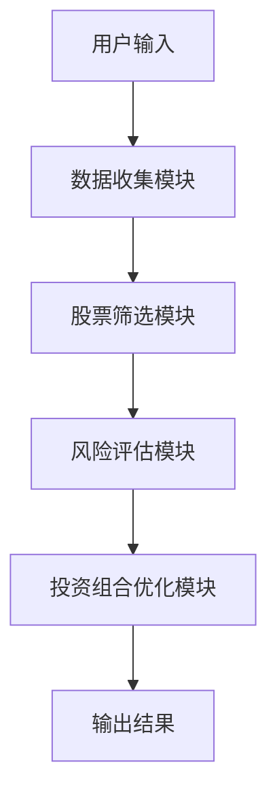

                 


# 巴菲特的股息增长策略：通货膨胀时代的收益来源

> 关键词：巴菲特，股息增长策略，投资理念，通货膨胀，股息率，股息增长率，投资决策

> 摘要：本文深入分析了巴菲特的股息增长策略，探讨了其在通货膨胀时代的收益来源。通过背景介绍、核心概念、数学模型、系统分析、项目实战和最佳实践等多维度的详细阐述，帮助读者理解如何通过股息增长策略实现长期稳定的收益。

---

## 第一部分：股息增长策略的背景与核心概念

### 第1章：巴菲特的投资理念与股息增长策略概述

#### 1.1 股权投资的长期价值

##### 1.1.1 股权投资的基本概念
股权投资是一种通过购买公司股份，成为公司股东并分享其收益的投资方式。巴菲特认为，股权投资的核心在于选择优秀的公司，长期持有，获得稳定的股息和资本增值。

##### 1.1.2 巴菲特的投资哲学
巴菲特的投资哲学以“价值投资”为核心，强调选择具有持续盈利能力、良好财务状况和优秀管理团队的公司。他倾向于投资那些能够持续增长的公司，并通过股息的形式回报股东。

##### 1.1.3 股息增长策略的核心思想
股息增长策略是巴菲特投资理念的重要组成部分。他认为，选择那些能够持续增加股息的公司，能够在通货膨胀时代中获得稳定的收益。股息增长不仅反映了公司的盈利能力，也体现了公司对股东的回报承诺。

---

#### 1.2 股息增长策略的定义与特点

##### 1.2.1 股息增长策略的定义
股息增长策略是指投资者通过选择那些股息收益率稳定且股息增长率较高的公司进行投资，以实现长期稳定的收益增长的投资策略。

##### 1.2.2 股息增长策略的特点
- **稳定性**：股息增长策略注重股息的稳定性，能够在市场波动中提供稳定的收益。
- **长期性**：股息增长策略强调长期持有优质股票，通过时间的积累实现收益的复利增长。
- **防御性**：在通货膨胀环境下，股息增长能够部分抵消通胀的影响，保护投资者的实际购买力。

##### 1.2.3 股息增长策略的优势与局限
- **优势**：股息增长策略能够提供稳定的现金流，且具有较高的抗风险能力。
- **局限**：股息增长策略需要投资者具备较高的选股能力，且在市场低迷时可能面临资本损失的风险。

---

#### 1.3 股息增长策略的背景与重要性

##### 1.3.1 通货膨胀时代的经济环境
通货膨胀会导致货币购买力下降，传统固定收益投资（如债券）的实际收益可能被通胀侵蚀。在这种情况下，股息增长策略通过持续增加的股息收入，能够在一定程度上抵消通胀的影响。

##### 1.3.2 股息增长策略在通货膨胀中的作用
股息增长策略通过持续增加股息收入，能够在通货膨胀中为投资者提供实际收益。同时，股息增长还反映了公司的盈利能力，能够帮助投资者在通胀环境中筛选出具有抗通胀能力的优质企业。

##### 1.3.3 股息增长策略的长期收益分析
长期来看，股息增长策略能够通过复利效应实现收益的稳定增长。巴菲特曾表示，股息的增长是其实现投资收益的重要来源之一，尤其是在市场波动较大的情况下，股息增长能够为投资者提供稳定的安全感。

---

## 第二部分：股息增长策略的核心概念与联系

### 第2章：股息增长策略的核心要素

#### 2.1 股息率与股息增长率

##### 2.1.1 股息率的定义与计算公式
股息率是衡量一只股票股息收入与股价之间的关系，计算公式为：
$$\text{股息率} = \frac{\text{股息总额}}{\text{股票价格}} \times 100\%$$

##### 2.1.2 股息增长率的定义与计算公式
股息增长率是指股息在一定时间内的增长幅度，计算公式为：
$$\text{股息增长率} = \frac{\text{当前股息} - \text{历史股息}}{\text{历史股息}} \times 100\%$$

##### 2.1.3 股息率与股息增长率的关系
股息率反映的是股息收入与股价的比率，而股息增长率则衡量了股息收入的增长速度。两者共同决定了股息增长策略的收益潜力。

---

#### 2.2 股息增长策略的核心要素对比

##### 2.2.1 股息率与股息增长率的对比分析
| 比较维度 | 股息率 | 股息增长率 |
|----------|--------|------------|
| 定义     | 当前股息与股价的比率 | 股息的历史增长速度 |
| 重点     | 短期收益 | 长期收益 |
| 适用场景 | 评估短期收益潜力 | 评估长期增长潜力 |

##### 2.2.2 股息增长策略与其他投资策略的对比
| 投资策略         | 核心目标         | 优缺点                     |
|------------------|------------------|-----------------------------|
| 股息增长策略     | 稳定收益与长期增长 | 稳定性高，但需要选股能力    |
| 股票成长策略     | 资本增值         | 风险较高，收益不稳定        |
| 固定收益投资     | 稳定现金流       | 收益有限，抗通胀能力较弱    |
| 组合投资策略     | 分散风险         | 收益与风险相对均衡          |

##### 2.2.3 股息增长策略的ER实体关系图

```mermaid
erDiagram
    class 股票 {
        股票代码
        股票名称
        股息率
        股息增长率
    }
    class 股东 {
        股东ID
        股东名称
        持股数量
    }
    class 股息支付 {
        支付日期
        支付金额
        支付方式
    }
    股票 --> 股东 : 持股
    股票 --> 股息支付 : 每年支付
```

---

#### 2.3 股息增长策略的ER实体关系图

```mermaid
erDiagram
    class 股票 {
        股票代码
        股票名称
        股息率
        股息增长率
    }
    class 股东 {
        股东ID
        股东名称
        持股数量
    }
    class 股息支付 {
        支付日期
        支付金额
        支付方式
    }
    股票 --> 股东 : 持股
    股票 --> 股息支付 : 每年支付
```

---

## 第三部分：股息增长策略的数学模型与算法原理

### 第3章：股息增长策略的数学模型

#### 3.1 股息增长模型

##### 3.1.1 股息增长模型的定义
股息增长模型是一种用于评估股票内在价值的数学模型，基于股息的持续增长，计算股票的合理估值。

##### 3.1.2 股息增长模型的数学公式
股息增长模型的公式为：
$$P = \frac{D_1}{r - g}$$
其中：
- \(P\) 为股票的内在价值
- \(D_1\) 为下一周期的股息
- \(r\) 为折现率
- \(g\) 为股息增长率

##### 3.1.3 股息增长模型的实例分析
假设某公司当前股息为$1，股息增长率\(g = 5\%\)，折现率\(r = 8\%\)，则股票的内在价值为：
$$P = \frac{1.05}{0.08 - 0.05} = \frac{1.05}{0.03} = 35$$
即该股票的合理估值为35元。

---

#### 3.2 股息增长率的计算

##### 3.2.1 股息增长率的计算公式
股息增长率计算公式为：
$$g = \frac{D_t - D_{t-1}}{D_{t-1}} \times 100\%$$
其中：
- \(D_t\) 为第\(t\)年的股息
- \(D_{t-1}\) 为第\(t-1\)年的股息

##### 3.2.2 股息增长率的实例分析
假设某公司在过去两年的股息分别为$1和$1.05，则股息增长率为：
$$g = \frac{1.05 - 1}{1} \times 100\% = 5\%$$

---

#### 3.3 股息收益率的计算

##### 3.3.1 股息收益率的计算公式
股息收益率计算公式为：
$$\text{股息收益率} = \frac{\text{年股息}}{\text{股价}} \times 100\%$$

##### 3.3.2 股息收益率的实例分析
假设某股票的股价为30元，年股息为1.5元，则股息收益率为：
$$\text{股息收益率} = \frac{1.5}{30} \times 100\% = 5\%$$

---

## 第四部分：股息增长策略的系统分析与架构设计

### 第4章：系统分析与架构设计

#### 4.1 系统功能设计

##### 4.1.1 系统功能模块
- 数据收集模块：收集股票的历史股息数据、股价数据等。
- 股票筛选模块：根据股息增长率和股息率等指标筛选符合条件的股票。
- 风险评估模块：评估投资组合的风险，包括市场风险、流动性风险等。
- 投资组合优化模块：根据风险评估结果，优化投资组合。

##### 4.1.2 系统功能流程图



---

## 第五部分：股息增长策略的项目实战

### 第5章：项目实战

#### 5.1 环境安装

##### 5.1.1 安装Python环境
- 下载并安装Python（https://www.python.org/）
- 安装Pandas和NumPy库：
  ```bash
  pip install pandas numpy
  ```

#### 5.2 核心实现源代码

##### 5.2.1 计算股息增长率
```python
import pandas as pd

# 假设我们有一个股息数据表，包含历史股息数据
dividend_data = {
    'Year': [2018, 2019, 2020, 2021, 2022],
    'Dividend': [1.0, 1.05, 1.1, 1.15, 1.2]
}

df = pd.DataFrame(dividend_data)

# 计算股息增长率
df['Dividend Growth'] = df['Dividend'].pct_change() * 100
```

##### 5.2.2 计算股息收益率
```python
import pandas as pd

# 假设我们有一个股票数据表，包含股价和股息数据
stock_data = {
    'Stock': ['AAPL', 'MSFT', 'PG', 'KO', 'PEP'],
    'Price': [300, 250, 100, 15, 20],
    'Dividend': [2.0, 1.5, 0.5, 0.4, 0.6]
}

df = pd.DataFrame(stock_data)

# 计算股息收益率
df['Dividend Yield'] = df['Dividend'] / df['Price'] * 100
```

---

## 第六部分：股息增长策略的最佳实践

### 第6章：最佳实践

#### 6.1 投资者的注意事项

##### 6.1.1 选择具有持续增长能力的公司
投资者应选择那些具有稳定盈利能力和良好财务状况的公司，确保股息的持续增长。

##### 6.1.2 注意市场波动风险
尽管股息增长策略具有较高的稳定性，但在市场波动较大的情况下，股票价格可能仍会下跌，投资者应做好心理准备。

##### 6.1.3 定期调整投资组合
投资者应定期审视其投资组合，根据市场变化和公司基本面调整持股。

---

#### 6.2 进一步的思考与拓展

##### 6.2.1 股息增长策略与ESG投资
股息增长策略可以与ESG（环境、社会、治理）投资相结合，选择那些在可持续发展方面表现优异的公司。

##### 6.2.2 数字化工具的应用
随着技术的进步，投资者可以利用大数据和人工智能工具，更高效地筛选和分析股息增长潜力的公司。

---

## 结语

巴菲特的股息增长策略是一种能够在通货膨胀时代为投资者提供稳定收益的有效方法。通过深入理解股息增长策略的核心概念、数学模型和系统设计，投资者可以在实际操作中更好地应用这一策略，实现长期稳定的收益。

---

**注意：** 本文内容仅为理论分析，不构成具体的投资建议。实际投资需根据市场变化和个人情况谨慎决策。

