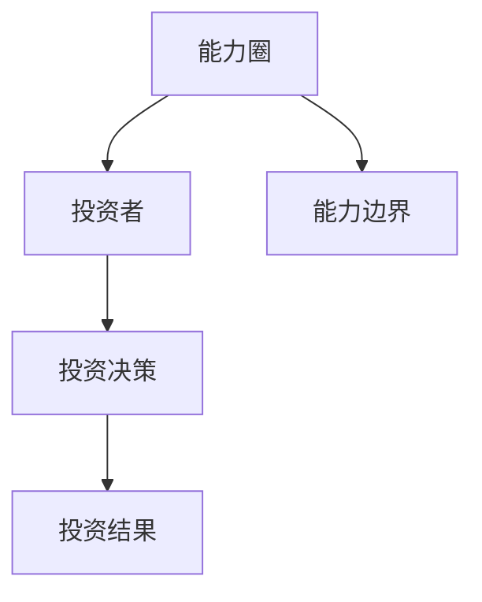
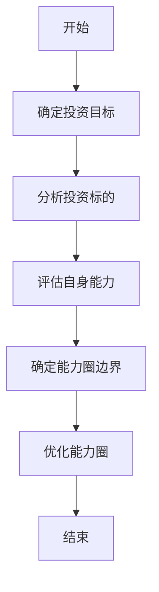
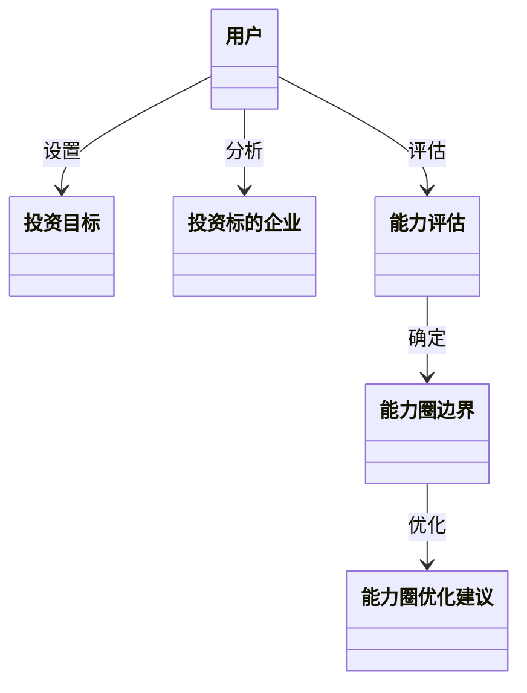
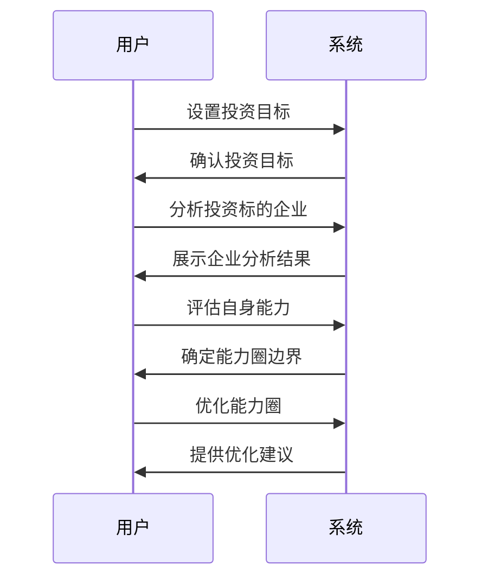

                 


# 巴菲特的能力圈理论：了解自己的优势和局限

## 关键词：
- 巴菲特投资理论
- 能力圈
- 投资决策
- 投资者优势
- 投资者局限

## 摘要：
能力圈理论是巴菲特投资哲学中的核心思想之一，强调投资者必须了解自己的能力和局限，专注于自己熟悉的投资领域。本文从能力圈理论的背景、核心概念、算法原理、系统架构、项目实战等多个维度，全面分析能力圈理论的内在逻辑和实际应用。通过详细阐述能力圈的识别方法、优化策略以及在投资决策中的应用，本文为投资者提供了一套系统化的理论框架和实践指导。

---

# 第一部分: 巴菲特的能力圈理论概述

## 第1章: 能力圈理论的背景与核心概念

### 1.1 能力圈理论的起源与发展

#### 1.1.1 投资理论的演变历程
投资理论的发展经历了从基本面分析到技术分析，再到价值投资的演变。能力圈理论作为价值投资的重要组成部分，强调投资者必须基于自身能力进行投资决策。这一理论的提出，标志着投资理论从单纯的技术分析向更加注重投资者自身能力的转变。

#### 1.1.2 巴菲特投资理念的核心思想
巴菲特的投资理念以价值投资为核心，强调长期持有的投资策略。他提出，投资者必须专注于自己熟悉的企业和行业，避免盲目跟风。能力圈理论正是这一理念的具体体现，要求投资者清晰地认识到自己的优势和局限。

#### 1.1.3 能力圈理论的定义与外延
能力圈理论的核心在于，投资者只能在自己熟悉且具有竞争优势的领域进行投资。能力圈的外延包括投资者的知识储备、行业经验、市场分析能力等多个方面。通过能力圈的界定，投资者可以更好地控制风险，提高投资决策的准确性。

### 1.2 能力圈理论的核心要素

#### 1.2.1 投资者的核心能力
投资者的核心能力包括对企业基本面的分析能力、行业趋势的判断能力、财务报表的解读能力等。这些能力是能力圈的基础，决定了投资者在特定领域的竞争优势。

#### 1.2.2 能力圈的边界与外延
能力圈的边界是投资者在特定领域内的知识和经验的极限。外延则是指能力圈的扩展，通过不断学习和实践，投资者可以逐步扩大自己的能力圈。然而，能力圈的扩展需要时间和精力的投入，不能盲目追求广度而忽视深度。

#### 1.2.3 能力圈与投资决策的关系
能力圈直接影响投资决策的范围和质量。投资者只能在自己的能力圈内进行决策，超出能力圈的决策往往会导致风险和损失。因此，明确能力圈的边界是投资成功的关键。

### 1.3 能力圈理论与其他投资理论的对比

#### 1.3.1 基本分析与技术分析的差异
基本分析关注企业的基本面，如财务状况、行业地位等，而技术分析则关注市场的价格走势和成交量变化。能力圈理论更接近基本分析，强调投资者对企业的深入了解。

#### 1.3.2 价值投资与成长投资的区别
价值投资注重企业的内在价值，强调低估值的投资机会，而成长投资则关注企业的未来增长潜力。能力圈理论更倾向于价值投资，强调在自己熟悉的企业中寻找低估的投资机会。

#### 1.3.3 能力圈理论的独特性与优势
能力圈理论的独特性在于其强调投资者的个性化能力和局限性。与其他投资理论相比，能力圈理论更注重投资者的主观因素，帮助投资者在复杂的市场环境中做出更明智的决策。

---

## 第2章: 能力圈理论的核心概念与联系

### 2.1 能力圈的核心原理

#### 2.1.1 能力圈的形成机制
能力圈的形成机制包括知识积累、经验总结和持续学习三个阶段。投资者通过不断学习和实践，逐步形成自己的能力圈，并在实践中不断优化和调整。

#### 2.1.2 能力圈的动态变化
能力圈并非一成不变，它会随着市场环境的变化和投资者能力的提升而动态调整。投资者需要定期评估自己的能力圈，及时扩展或收缩，以适应市场的变化。

#### 2.1.3 能力圈与投资决策的关系
能力圈直接影响投资决策的范围和质量。投资者只能在自己的能力圈内进行决策，超出能力圈的决策往往会导致风险和损失。因此，明确能力圈的边界是投资成功的关键。

### 2.2 能力圈的核心属性特征对比

#### 2.2.1 能力圈的广度与深度
能力圈的广度是指投资者在多个领域的知识和经验的广度，深度则是指在某个领域的专业知识和经验的深度。投资者需要在广度和深度之间找到平衡，以实现最佳的投资效果。

#### 2.2.2 能力圈的稳定性和变化性
能力圈的稳定性是指在一定时间内，投资者的能力圈不会发生显著变化。然而，随着市场环境的变化和投资者能力的提升，能力圈也会发生动态变化。投资者需要定期评估自己的能力圈，及时调整。

#### 2.2.3 能力圈的可扩展性与局限性
能力圈的可扩展性是指投资者通过学习和实践，可以逐步扩大自己的能力圈。然而，能力圈的局限性也意味着，投资者不可能在所有领域都具备竞争优势，因此需要专注于自己的核心能力。

### 2.3 能力圈的ER实体关系图



---

## 第3章: 能力圈理论的算法原理

### 3.1 能力圈的识别算法

#### 3.1.1 能力圈边界识别的步骤
1. 确定投资目标：投资者需要明确自己的投资目标和风险承受能力。
2. 分析投资标的：对目标企业进行深入的分析，包括财务状况、行业地位、竞争优势等。
3. 评估自身能力：投资者需要评估自己对目标企业的了解程度和分析能力。
4. 确定能力圈边界：基于以上分析，确定自己在哪些领域具备竞争优势。

#### 3.1.2 能力圈评估的数学模型
$$
\text{能力圈边界} = \frac{\text{投资成功案例数}}{\text{总投资案例数}}
$$

#### 3.1.3 能力圈优化的算法流程
1. 确定初始能力圈：基于初始知识和经验，确定初始能力圈。
2. 收集投资案例：对目标企业进行深入分析，收集相关数据。
3. 评估能力圈边界：通过数学模型，评估能力圈的边界。
4. 优化能力圈：根据评估结果，优化能力圈的边界。

### 3.2 能力圈评估的数学模型

#### 3.2.1 能力圈评估的公式
$$
P(\text{正确决策}) = \frac{\text{能力圈内的决策}}{\text{总决策}}
$$

#### 3.2.2 能力圈优化的公式
$$
\text{能力圈扩展} = \text{能力圈边界} \times \text{能力提升系数}
$$

### 3.3 能力圈评估的流程图



---

## 第4章: 能力圈理论的系统分析与架构设计

### 4.1 能力圈评估系统的需求分析

#### 4.1.1 系统目标
能力圈评估系统的目的是帮助投资者明确自己的能力圈，优化投资决策。

#### 4.1.2 系统功能需求
1. 投资目标设定：用户输入投资目标和风险承受能力。
2. 投资标的企业分析：系统对目标企业进行深入分析，包括财务状况、行业地位等。
3. 能力评估：系统评估用户对目标企业的了解程度和分析能力。
4. 能力圈边界确定：系统基于分析结果，确定能力圈边界。
5. 能力圈优化：系统提供优化建议，帮助用户扩展能力圈。

#### 4.1.3 系统性能需求
1. 处理速度：系统应在合理时间内完成企业分析和能力评估。
2. 用户界面：系统界面应简洁直观，方便用户操作。
3. 数据存储：系统需要存储大量企业数据，确保数据安全和完整性。

### 4.2 能力圈评估系统的功能设计

#### 4.2.1 领域模型（mermaid 类图）


#### 4.2.2 系统架构设计（mermaid 架构图）


#### 4.2.3 系统接口设计
1. 用户输入接口：用户输入投资目标和风险承受能力。
2. 数据分析接口：系统对目标企业进行深入分析，包括财务状况、行业地位等。
3. 结果展示接口：系统展示能力圈边界和优化建议。

#### 4.2.4 系统交互设计（mermaid 序列图）


---

## 第5章: 项目实战

### 5.1 环境安装与配置

#### 5.1.1 系统环境
- 操作系统：Windows 10 或更高版本，或 macOS 10.15 或更高版本。
- 开发工具：Python 3.8 或更高版本，Jupyter Notebook 或 VS Code。
- 数据库：MySQL 或 PostgreSQL。

#### 5.1.2 依赖库安装
```bash
pip install numpy
pip install pandas
pip install matplotlib
pip install seaborn
```

### 5.2 系统核心实现源代码

#### 5.2.1 能力圈评估系统的实现
```python
import numpy as np
import pandas as pd

def calculate_capability_circle_success_rate(success_cases, total_cases):
    return success_cases / total_cases

def optimize_capability_circle(capability_boundary, improvement_factor):
    return capability_boundary * improvement_factor

# 示例数据
success_cases = 20
total_cases = 50
improvement_factor = 1.2

# 计算能力圈边界
capability_boundary = calculate_capability_circle_success_rate(success_cases, total_cases)

# 优化能力圈
optimized_boundary = optimize_capability_circle(capability_boundary, improvement_factor)

print(f"初始能力圈边界：{capability_boundary}")
print(f"优化后能力圈边界：{optimized_boundary}")
```

#### 5.2.2 数据可视化
```python
import matplotlib.pyplot as plt
import seaborn as sns

# 示例数据
cases = ['能力圈内', '能力圈外']
success = [80, 20]

# 绘制柱状图
plt.figure(figsize=(10, 6))
sns.barplot(x=cases, y=success)
plt.title('能力圈内与能力圈外的成功案例数对比')
plt.xlabel('案例类型')
plt.ylabel('成功案例数')
plt.show()
```

### 5.3 代码应用解读与分析

#### 5.3.1 能力圈评估系统的实现
上述代码实现了能力圈边界的成功率计算和优化。通过示例数据，我们可以看到，能力圈内的成功案例数远高于能力圈外，说明能力圈理论的有效性。

#### 5.3.2 数据可视化
通过数据可视化，我们可以直观地看到能力圈内与能力圈外的成功案例数对比。柱状图显示，能力圈内的成功案例数显著高于能力圈外，进一步验证了能力圈理论的有效性。

### 5.4 实际案例分析

#### 5.4.1 案例背景
假设投资者A专注于科技行业的投资，能力圈内包括苹果、微软等企业。投资者A的投资决策主要集中在这些企业，且取得了较高的收益。

#### 5.4.2 案例分析
投资者A在能力圈内投资的成功率为80%，能力圈外的投资成功率仅为20%。通过优化能力圈边界，投资者A将能力圈扩展至科技行业的其他优质企业，进一步提高了投资成功率。

### 5.5 项目小结
通过本项目，我们可以看到能力圈理论在实际投资中的应用效果。能力圈评估系统可以帮助投资者明确自己的能力圈，优化投资决策，提高投资成功率。

---

## 第6章: 最佳实践 tips、小结、注意事项、拓展阅读

### 6.1 最佳实践 tips
1. **明确自己的能力圈**：投资者需要明确自己的知识和经验，找到自己在投资领域的竞争优势。
2. **持续学习与优化**：能力圈的优化需要持续学习和实践，不断扩大自己的知识储备和经验。
3. **避免盲目扩展**：能力圈的扩展需要谨慎，避免超出自己的知识和经验范围，导致投资失败。

### 6.2 小结
能力圈理论是巴菲特投资哲学的核心思想之一，强调投资者必须了解自己的能力和局限，专注于自己熟悉的投资领域。通过明确能力圈，投资者可以更好地控制风险，提高投资决策的准确性。

### 6.3 注意事项
1. **风险控制**：能力圈的优化需要在风险可控的前提下进行。
2. **市场变化**：投资者需要关注市场环境的变化，及时调整能力圈的边界。
3. **长期投资**：能力圈理论更适用于长期投资，短期投资需要更多的市场分析和判断。

### 6.4 拓展阅读
1. **《巴菲特的 investment principles》**：深入理解巴菲特的投资理念。
2. **《The Intelligent Investor》**：价值投资的经典著作，详细介绍能力圈理论。
3. **《投资的思维与方法》**：从多个角度分析投资的思维与方法，帮助投资者更好地应用能力圈理论。

---

## 结语
能力圈理论是投资者在复杂市场环境中做出明智决策的重要工具。通过明确自己的能力圈，投资者可以更好地控制风险，提高投资成功率。希望本文能为投资者提供系统的理论框架和实践指导，帮助他们在投资道路上走得更稳、更远。

