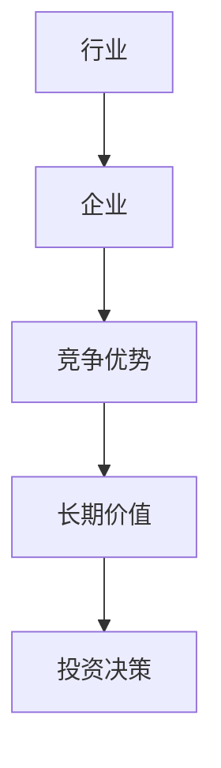
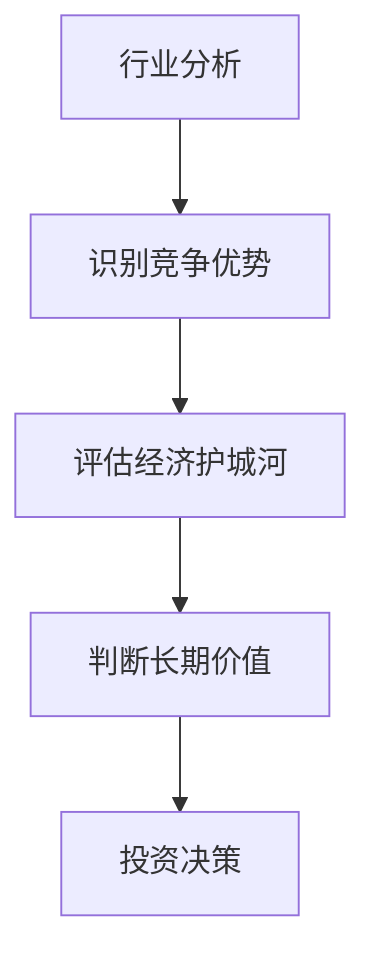
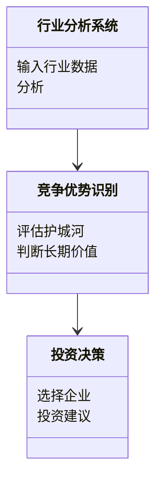
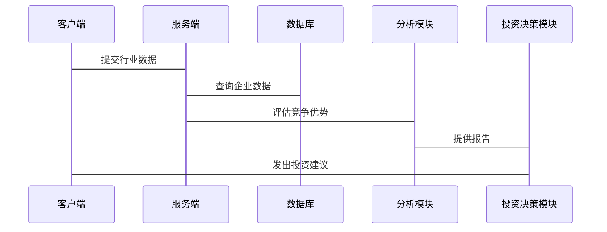

                 


# 巴菲特的行业分析方法：如何识别具有持久竞争优势的行业

> 关键词：巴菲特、行业分析、竞争优势、护城河、长期投资

> 摘要：本文将详细探讨巴菲特的行业分析方法，解析如何识别具有持久竞争优势的行业。通过分析巴菲特的核心投资理念、竞争优势分析框架、行业周期与企业价值的关系，以及实际案例分析，帮助投资者掌握如何在复杂多变的市场环境中找到具有长期价值的企业。

---

## 第1章 巴菲特投资理念与行业分析的背景

### 1.1 巴菲特投资理念的核心思想

#### 1.1.1 价值投资的定义与特点
- 价值投资：寻找市场价格低于其内在价值的股票进行投资。
- 核心特点：长期持有、关注企业基本面、注重安全边际。

#### 1.1.2 巴菲特投资理念的演变
- 早期投资理念：寻找低估的股票。
- 成熟理念：关注企业竞争优势，寻找具有持久护城河的企业。

#### 1.1.3 行业分析在价值投资中的重要性
- 行业分析是企业基本面分析的基础。
- 行业环境决定企业的成长空间和盈利能力。

### 1.2 巴菲特的长期竞争优势分析框架

#### 1.2.1 长期竞争优势的定义
- 长期竞争优势：企业在行业中长期保持领先地位的能力。
- 来源：成本优势、品牌优势、技术优势等。

#### 1.2.2 巴菲特的护城河理论
- 护城河：企业竞争优势的来源，防止竞争对手侵蚀市场份额的屏障。
- 护城河类型：成本优势、网络效应、品牌优势、技术优势。

#### 1.2.3 行业分析在竞争优势识别中的作用
- 行业分析帮助识别行业中的优势企业。
- 行业环境影响企业的竞争优势。

### 1.3 为什么行业分析是巴菲特投资成功的关键

#### 1.3.1 行业分析的重要性
- 行业环境影响企业的盈利能力。
- 行业周期影响企业的成长空间。

#### 1.3.2 巴菲特对行业周期的理解
- 行业周期：行业的兴衰过程。
- 投资机会：在行业低谷时寻找低估企业。

#### 1.3.3 行业分析与企业长期价值的关系
- 行业分析是企业长期价值评估的基础。
- 行业环境影响企业的可持续竞争优势。

---

## 第2章 巴菲特行业分析的核心概念与联系

### 2.1 核心概念原理

#### 2.1.1 经济护城河的定义与特征
- 经济护城河：企业通过某种竞争优势，在长期竞争中获得超额收益的能力。
- 特征：难以被复制、可持续、可量化。

#### 2.1.2 市场地位与竞争优势的关系
- 市场地位：企业在行业中的地位。
- 竞争优势：企业在市场中的独特优势。

#### 2.1.3 行业生命周期与企业价值的关联
- 行业生命周期：导入期、成长期、成熟期、衰退期。
- 企业价值：在行业生命周期不同阶段的表现不同。

### 2.2 核心概念对比表格

| 护城河类型   | 特征描述                              | 示例企业             |
|--------------|---------------------------------------|--------------------|
| 成本优势     | 低成本生产模式                        | 沃尔玛              |
| 网络效应     | 用户数量越多，企业价值越高           | 微软、腾讯          |
| 品牌优势     | 强大品牌影响力                        | 可口可乐            |
| 技术优势     | 拥有独特技术或专利                   | 苹果                |

### 2.3 实体关系图（Mermaid流程图）



---

## 第3章 巴菲特行业分析的算法原理

### 3.1 算法流程图（Mermaid）



### 3.2 数学模型与公式

#### 行业分析中的关键指标计算

$$\text{ROE} = \frac{\text{净利润}}{\text{股东权益}}$$

$$\text{ROA} = \frac{\text{净利润}}{\text{总资产}}$$

#### 案例分析：ROE与ROA的应用

假设某企业ROE为15%，ROA为10%，表明该企业在资产使用效率和股东权益回报方面表现良好，具有一定的竞争优势。

---

## 第4章 巴菲特行业分析的系统架构设计

### 4.1 系统功能设计（Mermaid类图）



### 4.2 系统架构设计（Mermaid架构图）


### 4.3 系统接口设计

- 输入接口：行业数据、企业财务数据。
- 输出接口：竞争优势评估报告、投资建议。

### 4.4 系统交互（Mermaid序列图）



---

## 第5章 巴菲特行业分析的项目实战

### 5.1 环境安装

#### 5.1.1 安装Python环境
```bash
pip install numpy pandas matplotlib
```

#### 5.1.2 安装数据分析工具
```bash
pip install seaborn scikit-learn
```

### 5.2 系统核心实现源代码

```python
import pandas as pd
import numpy as np

def calculate_roe(net_profit, shareholders_equity):
    return net_profit / shareholders_equity

def calculate_roa(net_profit, total_assets):
    return net_profit / total_assets

# 示例数据
data = {
    '企业': ['企业A', '企业B', '企业C'],
    '净利润': [100, 150, 200],
    '股东权益': [500, 600, 700],
    '总资产': [1000, 1200, 1400]
}

df = pd.DataFrame(data)

# 计算ROE和ROA
df['ROE'] = calculate_roe(df['净利润'], df['股东权益'])
df['ROA'] = calculate_roa(df['净利润'], df['总资产'])

print(df)
```

### 5.3 代码实现与解读

- 计算ROE和ROA，评估企业的财务健康状况。
- 通过数据可视化分析行业趋势。

### 5.4 实际案例分析

#### 案例：分析某行业的三家企业

```python
import seaborn as sns
import matplotlib.pyplot as plt

# 绘制ROE和ROA分布图
plt.figure(figsize=(10, 6))
sns.scatterplot(x='ROE', y='ROA', data=df)
plt.title('行业分析：ROE vs ROA')
plt.xlabel('ROE (%)')
plt.ylabel('ROA (%)')
plt.show()
```

---

## 第6章 巴菲特行业分析的最佳实践

### 6.1 小结

- 巴菲特的行业分析方法注重企业的竞争优势和长期价值。
- 通过护城河理论识别具有持续竞争优势的企业。

### 6.2 注意事项

- 行业分析需要结合宏观经济环境。
- 数据分析是辅助工具，不能完全依赖数字。

### 6.3 拓展阅读

- 《巴菲特传》：了解巴菲特的投资哲学。
- 《竞争优势：如何识别和构建企业护城河》：深入学习竞争优势分析。

---

## 总结

巴菲特的行业分析方法是价值投资的重要组成部分，通过识别具有持久竞争优势的企业，投资者可以在长期获得超额收益。本文通过详细解析巴菲特的分析框架、核心概念、算法原理和实际案例，帮助投资者掌握这一方法，并在实际投资中灵活运用。

