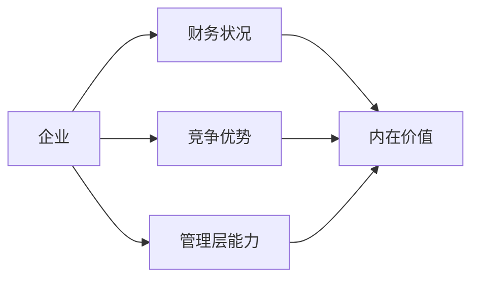
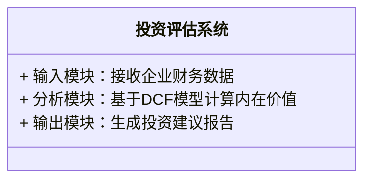
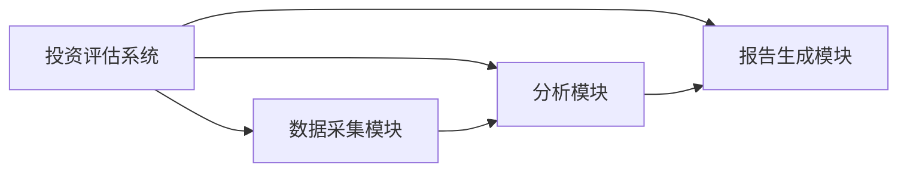

                 


# 巴菲特的行业分析方法：应对产业边界模糊化的挑战

## 关键词：巴菲特、行业分析、产业边界、价值投资、现金流折现模型

## 摘要：  
本文深入探讨了巴菲特的行业分析方法及其在应对产业边界模糊化挑战中的应用。通过分析巴菲特的核心投资理念，结合现代产业融合的趋势，提出了一套基于现金流折现模型的行业评估方法，并通过实际案例展示了如何在复杂产业环境中应用这些方法。文章还提供了详细的数学模型、系统架构设计和Python代码示例，帮助读者更好地理解和应用这些方法。

---

## 第一部分：背景介绍

### 第1章：问题背景与描述

#### 1.1 问题背景  
随着数字经济的快速发展， industries之间的界限变得越来越模糊。例如，科技公司进入金融领域，互联网企业涉足教育行业，传统制造业与服务业深度融合。这种现象导致传统的行业分类方法难以准确评估企业的价值。

#### 1.2 问题描述  
产业边界模糊化使得传统的行业分析方法失效，投资者难以准确判断企业的核心竞争力和发展潜力。这种不确定性增加了投资决策的难度，尤其是在全球经济波动加剧的背景下。

#### 1.3 问题解决  
巴菲特的行业分析方法以企业基本面分析为核心，强调长期价值而非短期市场波动。这种方法可以帮助投资者在产业边界模糊的环境中，找到具有持续竞争优势的企业。

#### 1.4 边界与外延  
产业边界模糊化主要体现在以下几个方面：
1. **技术驱动的跨界**：例如，科技企业向传统制造业延伸。
2. **消费者需求的变化**：消费者行为的变化推动了行业融合。
3. **全球化与本地化的冲突与融合**：企业在全球化背景下需要适应本地市场需求。

### 第2章：巴菲特行业分析方法的核心要素

#### 2.1 核心概念  
巴菲特的行业分析方法基于以下核心要素：
1. **企业内在价值**：通过现金流折现模型计算企业的实际价值。
2. **竞争优势**：分析企业的“护城河”，即核心竞争力。
3. **管理层能力**：评估管理层的决策能力和企业治理结构。

#### 2.2 与传统行业分析方法的区别  
传统的行业分析方法主要关注行业增长率、市场份额等宏观指标，而巴菲特的方法更注重企业的微观层面，包括财务健康状况、竞争优势和管理层能力。

---

## 第二部分：核心概念与联系

### 第3章：巴菲特行业分析方法的核心原理

#### 3.1 核心原理  
巴菲特的行业分析方法以价值投资为核心，强调以下几点：
1. **长期投资**：关注企业的长期价值，而非短期市场波动。
2. **安全边际**：通过低估企业的内在价值，确保投资的安全性。
3. **竞争优势**：寻找具有可持续竞争优势的企业。

#### 3.2 核心概念对比表格  
以下是巴菲特分析方法与其他分析方法的对比：

| 比较维度 | 传统行业分析 | 巴菲特行业分析 |
|----------|--------------|----------------|
| 分析重点 | 行业宏观指标 | 企业内在价值 |
| 数据来源 | 行业统计数据 | 财务报表分析 |
| 分析目标 | 行业发展趋势 | 企业投资价值 |

#### 3.3 实体关系图  
以下是基于巴菲特分析方法的企业分析模型的Mermaid图：



---

## 第三部分：算法原理讲解

### 第4章：现金流折现模型的数学模型

#### 4.1 模型概述  
现金流折现模型（DCF模型）是巴菲特分析方法的核心工具之一。该模型通过将企业未来现金流折现，计算其内在价值。

#### 4.2 数学公式  
现金流折现模型的公式如下：

$$ V = \sum_{t=1}^{n} \frac{CF_t}{(1 + r)^t} $$

其中：
- \( V \) 表示企业的内在价值
- \( CF_t \) 表示第 \( t \) 年的现金流
- \( r \) 表示折现率
- \( n \) 表示现金流预测的年数

#### 4.3 Python代码实现  
以下是现金流折现模型的Python代码示例：

```python
def discounted_cash_flow(CF, r, n):
    value = 0
    for t in range(1, n+1):
        value += CF / (1 + r)**t
    return value

# 示例数据
CF = 1000000  # 年度现金流
r = 0.10      # 折现率
n = 5         # 年数

V = discounted_cash_flow(CF, r, n)
print(f"企业内在价值为：{V:.2f}")
```

---

## 第四部分：系统分析与架构设计方案

### 第5章：系统功能设计

#### 5.1 问题场景介绍  
本文构建了一个基于巴菲特行业分析方法的投资评估系统，用于在产业边界模糊化的背景下，帮助企业进行投资决策。

#### 5.2 系统功能设计  
以下是系统的功能模块：



#### 5.3 系统架构设计  
以下是系统的架构设计：



---

## 第五部分：项目实战

### 第6章：环境安装与核心代码实现

#### 6.1 环境安装  
需要安装以下Python库：
- `numpy`
- `pandas`
- `matplotlib`

#### 6.2 核心代码实现  
以下是基于现金流折现模型的Python代码：

```python
import numpy as np
import pandas as pd
import matplotlib.pyplot as plt

# 示例数据
CF = [1000000, 1200000, 1500000, 2000000, 2500000]
r = 0.10

# 计算折现因子
discount_factors = [1/(1+r)**t for t in range(1, 6)]
discounted_CF = [CF[i] * discount_factors[i] for i in range(5)]

# 计算内在价值
V = sum(discounted_CF)

# 可视化
plt.bar(range(1,6), CF, label='现金流')
plt.bar(range(1,6), discounted_CF, label='折现后现金流')
plt.legend()
plt.show()

print(f"企业内在价值为：{V:.2f}")
```

---

## 第六部分：最佳实践与总结

### 第7章：最佳实践

#### 7.1 实践总结  
通过本文的分析，我们可以得出以下结论：
1. 巴菲特的行业分析方法在应对产业边界模糊化方面具有显著优势。
2. 现金流折现模型是评估企业内在价值的重要工具。

#### 7.2 小结  
本文通过详细分析巴菲特的行业分析方法，结合实际案例，展示了如何在产业边界模糊化的背景下，运用这些方法进行投资决策。

#### 7.3 注意事项  
投资者在实际操作中需要注意以下几点：
1. 数据的准确性
2. 模型的适用性
3. 市场风险的评估

#### 7.4 拓展阅读  
推荐阅读以下书籍：
1. 《巴菲特致股东的信》
2. 《投资学精要》

---

## 结语  
通过对巴菲特行业分析方法的深入探讨，我们不仅可以更好地理解其核心理念，还可以将其应用于实际投资决策中，尤其是在产业边界模糊化的复杂环境中。希望本文能为读者提供有价值的参考和启发。

