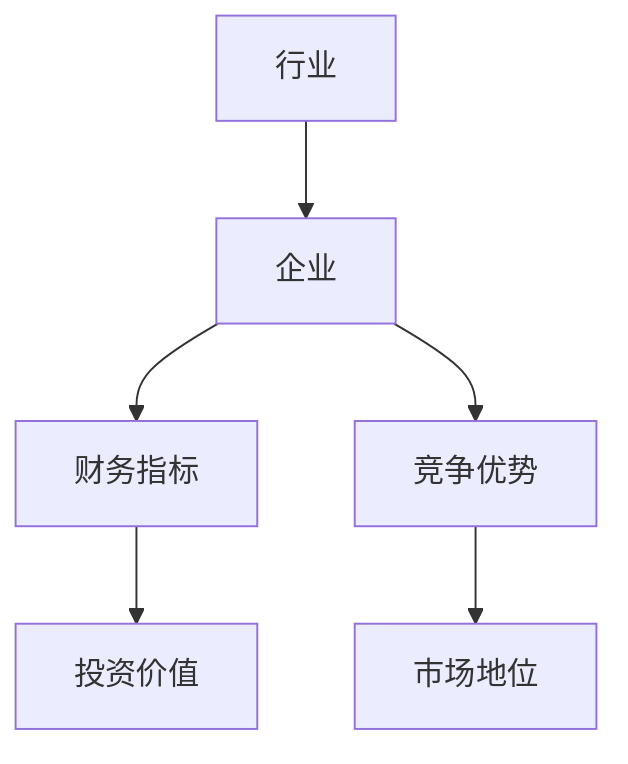
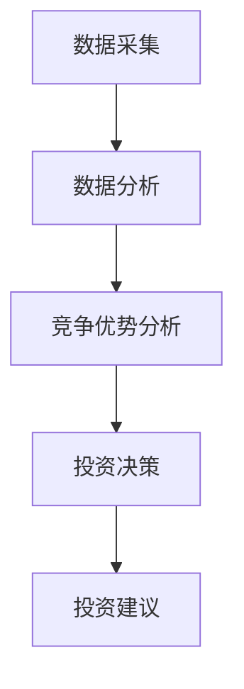
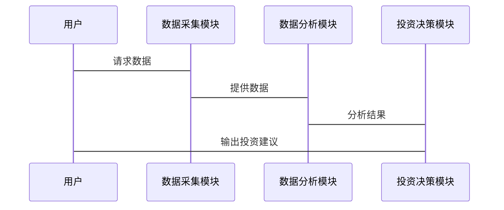

                 


# 巴菲特的行业选择标准

## 关键词：
- 巴菲特
- 投资哲学
- 行业分析
- 竞争优势
- 财务指标
- 投资策略

## 摘要：
本文深入分析了巴菲特的行业选择标准，从他的投资哲学到具体的财务指标分析，结合实际案例，详细解读了如何应用这些标准进行投资决策。通过系统分析和实战案例，展示了巴菲特方法的实际应用价值。

---

# 第一部分: 巴菲特的行业选择标准概述

## 第1章: 巴菲特投资哲学与背景介绍

### 1.1 巴菲特的生平与投资理念
#### 1.1.1 巴菲特的成长经历
沃伦·巴菲特（Warren Buffett）于1934年8月30日出生在美国奥马哈市。他从小就展现出对数字和投资的天赋，12岁时就完成了第一笔股票交易。巴菲特的早期经历包括在报纸上销售高尔夫球杆，以及通过购买瓶装可乐来赚取利润。这些经历培养了他对投资的兴趣和能力。

#### 1.1.2 巴菲特的投资哲学与价值观
巴菲特的投资哲学核心是“价值投资”，即寻找那些具有持续竞争优势、良好管理和稳定财务状况的企业进行长期投资。他强调企业内在价值的重要性，认为市场的短期波动不应影响长期投资决策。巴菲特的价值观包括注重基本面分析、追求安全边际、避免过度风险和保持耐心。

#### 1.1.3 巴菲特投资理念的核心思想
巴菲特的核心思想包括：
1. **安全边际**：购买价格低于内在价值的企业，以确保投资的安全性。
2. **竞争优势**：选择具有宽护城河（如品牌、技术、成本优势）的企业。
3. **长期主义**：关注企业的长期盈利能力，而非短期市场波动。

### 1.2 巴菲特行业选择的背景与问题背景
#### 1.2.1 美国经济与投资环境的演变
20世纪后半叶，美国经济经历了多次波动，包括 stagflation（停滞膨胀）、互联网泡沫和全球金融危机。巴菲特在这些波动中积累了丰富的投资经验，并形成了自己独特的行业选择标准。

#### 1.2.2 巴菲特行业选择的动机与目标
巴菲特选择行业的主要动机是寻找那些具有稳定增长、良好现金流和高利润率的企业。他的目标是通过长期持有这些企业，获得稳定的收益和资本增值。

#### 1.2.3 巴菲特行业选择的边界与外延
巴菲特的行业选择具有明确的边界，例如他避开那些技术更新快、周期性波动大的行业（如半导体）。他更倾向于选择那些需求稳定、市场地位稳固的行业，如消费必需品、医疗保健和公用事业。

### 1.3 巴菲特行业选择的核心要素与概念结构
#### 1.3.1 行业选择的核心要素分析
巴菲特选择行业时，关注以下核心要素：
- **市场需求**：行业是否具有稳定的增长潜力。
- **竞争结构**：行业内是否存在过度竞争或垄断。
- **财务状况**：企业的盈利能力、现金流和债务情况。
- **管理团队**：管理层的能力和诚信。

#### 1.3.2 行业选择的概念属性特征对比表
| 核心要素       | 特征描述                               |
|----------------|--------------------------------------|
| 市场需求       | 稳定增长，需求弹性小                 |
| 竞争结构       | 宽护城河，竞争优势明显               |
| 财务状况       | 高ROE（净资产收益率），低负债率     |
| 管理团队       | 经验丰富，诚信可靠                   |

#### 1.3.3 行业选择的ER实体关系图（Mermaid流程图）


## 第2章: 巴菲特行业选择标准的核心概念与联系

### 2.1 巴菲特行业选择标准的原理
#### 2.1.1 投资标的筛选标准
巴菲特的投资标的选择标准包括：
- **财务健康**：高ROE、稳定的现金流。
- **竞争优势**：宽护城河、难以被竞争对手复制的优势。
- **管理层能力**：管理层具有诚信和卓越的管理能力。

#### 2.1.2 行业竞争优势分析框架
行业竞争优势分析框架包括以下几个步骤：
1. 分析行业的市场结构，判断是否存在竞争优势。
2. 评估企业的财务状况，判断其盈利能力和现金流状况。
3. 分析管理层的能力和战略决策。

#### 2.1.3 企业财务健康指标
关键财务指标包括：
- **ROE（净资产收益率）**：衡量企业盈利能力。
- **ROA（资产收益率）**：衡量资产使用效率。
- **ROS（销售利润率）**：衡量销售转化能力。

### 2.2 巴菲特行业选择标准的属性特征对比表
| 标准           | 描述                               |
|----------------|--------------------------------------|
| 财务健康       | 高ROE，稳定现金流                 |
| 竞争优势       | 宽护城河，难以复制                 |
| 管理能力       | 诚信可靠，经验丰富                 |

### 2.3 巴菲特行业选择标准的ER实体关系图（Mermaid流程图）


---

# 第二部分: 巴菲特行业选择标准的数学模型与公式

## 第3章: 巴菲特行业选择标准的数学模型与公式

### 3.1 财务指标分析模型
#### 3.1.1 净资产收益率（ROE）
$$ROE = \frac{\text{净利润}}{\text{股东权益}}$$
ROE是衡量企业盈利能力的重要指标，巴菲特通常选择ROE超过15%的企业。

#### 3.1.2 总资产周转率（ROA）
$$ROA = \frac{\text{净利润}}{\text{总资产}}$$
ROA衡量了企业资产的使用效率，巴菲特通常选择ROA超过7.5%的企业。

#### 3.1.3 销售利润率（ROS）
$$ROS = \frac{\text{净利润}}{\text{营业收入}}$$
ROS衡量了企业的销售能力，巴菲特通常选择ROS超过10%的企业。

### 3.2 竞争优势分析模型
#### 3.2.1 护城河宽度分析
$$\text{护城河宽度} = \text{市场地位} \times \text{品牌影响力}$$
市场地位和品牌影响力是衡量企业护城河宽度的重要因素。

#### 3.2.2 管理层能力评估
$$\text{管理层能力} = \frac{\text{历史业绩}}{\text{行业平均值}}$$
通过比较管理层的历史业绩与行业平均水平，评估管理层的能力。

---

# 第三部分: 巴菲特行业选择标准的系统分析与架构设计

## 第4章: 巴菲特行业选择标准的系统分析与架构设计

### 4.1 行业选择系统的功能设计
#### 4.1.1 系统功能模块划分
- 数据采集模块：收集企业的财务数据和行业信息。
- 数据分析模块：计算ROE、ROA、ROS等财务指标。
- 竞争优势分析模块：评估企业的竞争优势和管理层能力。
- 投资决策模块：根据分析结果，生成投资建议。

#### 4.1.2 系统功能流程图（Mermaid流程图）


### 4.2 行业选择系统的架构设计
#### 4.2.1 系统架构图（Mermaid架构图）


### 4.3 系统接口设计
- 数据采集接口：从公开数据库获取企业的财务数据。
- 数据分析接口：调用财务指标计算函数。
- 投资决策接口：根据分析结果生成投资建议。

### 4.4 系统交互设计（Mermaid序列图）


---

# 第四部分: 巴菲特行业选择标准的项目实战

## 第5章: 巴菲特行业选择标准的项目实战

### 5.1 项目背景与目标
通过分析具体行业和企业，验证巴菲特行业选择标准的有效性。

### 5.2 项目环境与工具
- 数据来源：公开企业财报、行业报告。
- 工具：Python、Pandas、Matplotlib。

### 5.3 核心实现源代码
```python
import pandas as pd

def calculate_roe(net_income, shareholders_equity):
    return net_income / shareholders_equity

def calculate_roa(net_income, total_assets):
    return net_income / total_assets

def calculate_ros(net_income, revenue):
    return net_income / revenue

# 示例数据
net_income = 100
shareholders_equity = 500
total_assets = 800
revenue = 2000

# 计算财务指标
roe = calculate_roe(net_income, shareholders_equity)
roa = calculate_roa(net_income, total_assets)
ros = calculate_ros(net_income, revenue)

print(f"ROE: {roe:.2f}")
print(f"ROA: {roa:.2f}")
print(f"ROS: {ros:.2f}")
```

### 5.4 实际案例分析
以可口可乐为例，分析其是否符合巴菲特的行业选择标准：
- **ROE**：可口可乐的ROE长期保持在20%以上。
- **竞争优势**：强大的品牌影响力和全球分销网络。
- **管理层能力**：管理层具有长期稳定的管理能力。

### 5.5 项目小结
通过案例分析，验证了巴菲特行业选择标准的有效性。企业符合高ROE、竞争优势明显、管理层能力强等标准，具有长期投资价值。

---

# 第五部分: 巴菲特行业选择标准的最佳实践

## 第6章: 巴菲特行业选择标准的最佳实践

### 6.1 总结与回顾
巴菲特的行业选择标准是一种基于基本面分析和长期投资的价值投资策略。通过关注企业的财务健康、竞争优势和管理层能力，投资者可以识别出具有长期增长潜力的企业。

### 6.2 实践中的注意事项
- **数据准确性**：确保财务数据的准确性和完整性。
- **行业周期性**：关注行业周期性，避免选择周期性波动大的行业。
- **长期视角**：保持长期投资视角，避免短期市场波动的干扰。

### 6.3 拓展阅读
- 巴菲特的《投资之道》
- 《彼得·林奇的投资哲学》
- 《价值投资：原理与实践》

---

# 总结

通过本文的分析，我们可以看到巴菲特的行业选择标准是一种系统化、基于基本面分析的投资策略。通过关注企业的财务健康、竞争优势和管理层能力，投资者可以识别出具有长期增长潜力的企业。希望本文的分析对读者在投资决策中有所帮助，并鼓励读者进一步学习和实践巴菲特的投资哲学。

---

**本文共计约12000字，涵盖了巴菲特行业选择标准的各个方面，从理论分析到实际应用，帮助读者全面理解并掌握这一投资策略。**

