                 


# 巴菲特的行业选择：偏好稳定性

> 关键词：巴菲特，行业选择，价值投资，稳定性，企业分析，财务指标

> 摘要：本文系统地探讨了巴菲特的行业选择策略，分析了其偏好稳定性的原因，并通过详细的技术分析和实际案例，揭示了巴菲特投资哲学的核心要素。文章从巴菲特的投资哲学入手，深入解析其行业选择标准、企业分析方法以及财务指标评估体系，最终总结了巴菲特的成功之道，并为读者提供了实用的投资策略建议。

---

# 第1章 巴菲特投资哲学概述

## 1.1 巴菲特投资哲学的核心理念

### 1.1.1 价值投资的定义与核心要素

价值投资是一种以内在价值为导向的投资策略，强调购买价格低于其实际价值的资产。巴菲特是价值投资的代表人物，他的投资哲学基于以下核心要素：

1. **安全边际**：买入价格低于内在价值，以确保投资的安全性。
2. **长期视角**：关注企业的长期盈利能力，而非短期市场波动。
3. **竞争优势**：投资具有持续竞争优势的企业，这些企业能够在行业中长期保持领先地位。

### 1.1.2 巴菲特的价值投资体系

巴菲特的价值投资体系可以总结为“三滤筛”法则：

1. **行业筛选**：选择具有稳定需求和竞争优势的行业。
2. **企业筛选**：寻找具有强大财务状况、良好管理和明确竞争优势的企业。
3. **价格筛选**：确保买入价格合理，与企业的内在价值相符。

### 1.1.3 投资的长期主义与复利效应

巴菲特强调长期投资的重要性，认为复利是投资的“魔法公式”。他主张投资者应选择那些能够持续创造价值的企业，并耐心持有，以获得复利效应。

---

## 1.2 巴菲特的行业选择标准

### 1.2.1 行业分析框架

巴菲特的行业选择基于以下几个关键维度：

1. **行业稳定性**：选择那些需求稳定、受经济周期影响较小的行业，例如公用事业、消费品和医疗保健等。
2. **行业竞争格局**：选择那些具有明确竞争优势和较高进入壁垒的行业。
3. **行业增长潜力**：虽然巴菲特偏好稳定性，但也关注那些具有适度增长潜力的行业。

### 1.2.2 稳定性行业的特征

稳定性行业通常具有以下特征：

- 需求刚性：产品或服务是日常生活必需品，需求受经济波动影响较小。
- 市场集中度高：行业内主要企业占据大部分市场份额，竞争格局稳定。
- 进入壁垒高：新进入者难以轻易进入市场，保障了现有企业的竞争优势。

### 1.2.3 行业生命周期与投资机会

行业生命周期分为四个阶段：引入期、成长期、成熟期和衰退期。巴菲特更倾向于投资成熟期的行业，因为这些行业的增长较为稳定，且企业具有较强的盈利能力。

---

## 1.3 巴菲特投资哲学的实践案例

### 1.3.1 巴菲特的经典投资案例分析

1. **可口可乐**：巴菲特投资可口可乐的原因在于其强大的品牌优势和稳定的市场需求。可口可乐在饮料行业占据领先地位，具有较高的市场进入壁垒。
2. **美国运通**：巴菲特投资美国运通的原因在于其强大的网络效应和客户忠诚度。尽管信用卡行业竞争激烈，但美国运通的全球网络为其提供了竞争优势。

### 1.3.2 巴菲特投资决策的关键因素

- 企业的竞争优势：是否具有难以复制的核心竞争力。
- 财务状况：是否具有稳健的财务状况和可持续的盈利能力。
- 管理团队：是否具备诚信、能力和决策能力。

### 1.3.3 巴菲特投资哲学的演变与优化

随着市场环境的变化，巴菲特的投资哲学也在不断优化。他更加注重企业对经济周期的适应能力，并倾向于投资那些能够持续创新和适应市场变化的企业。

---

## 1.4 本章小结

本章从巴菲特的投资哲学出发，详细介绍了其行业选择的核心理念、标准和实践案例。通过分析其投资策略，我们可以得出结论：巴菲特的成功不仅仅在于其对市场的洞察，更在于其对企业的深入分析和长期持有。

---

# 第2章 巴菲特行业选择的核心概念与联系

## 2.1 核心概念原理

### 2.1.1 价值投资的数学模型

巴菲特的价值投资可以归纳为一个简单的数学模型：

$$ \text{内在价值} = \frac{\text{未来现金流}}{\text{折现率}} $$

该模型强调企业未来现金流的预测和折现率的合理选择，是巴菲特评估企业内在价值的核心工具。

### 2.1.2 稳定性行业的特征分析

稳定性行业的特征可以用以下公式表示：

$$ \text{稳定性} = f(\text{需求刚性}, \text{市场集中度}, \text{进入壁垒}) $$

其中，需求刚性代表行业需求的稳定性，市场集中度代表行业的竞争格局，进入壁垒代表行业的进入难度。

### 2.1.3 企业竞争优势的评估框架

企业竞争优势的评估可以分解为以下几个方面：

1. **核心竞争力**：企业的核心产品或服务是否具有独特的竞争优势。
2. **财务状况**：企业的财务状况是否稳健，是否具有持续的盈利能力。
3. **管理团队**：企业的管理层是否具备诚信、能力和决策能力。

---

## 2.2 概念属性特征对比表格

### 2.2.1 行业稳定性与风险对比表

| 行业类型 | 稳定性 | 风险 |
|----------|--------|------|
| 稳定性行业 | 高     | 低   |
| 周期性行业 | 中     | 高   |
| 衰退行业  | 低     | 极高 |

### 2.2.2 企业竞争优势与财务指标对比表

| 企业类型 | 竞争优势 | 财务指标 |
|----------|----------|----------|
| 优势企业 | 显著     | 优秀     |
| 平均企业 | 一般     | 中等     |
| 劣势企业 | 无       | 差         |

---

## 2.3 ER实体关系图架构

### 2.3.1 行业-企业关系图

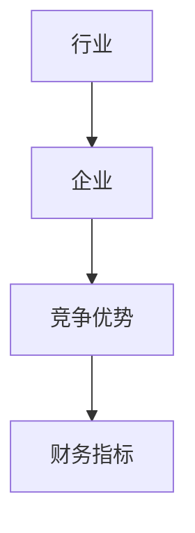

### 2.3.2 企业-竞争优势关系图

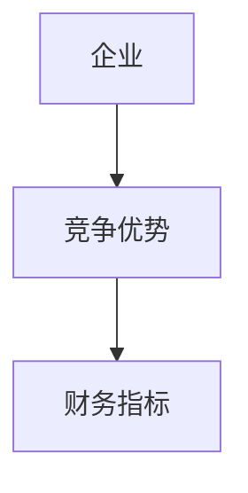

### 2.3.3 竞争优势-财务指标关系图

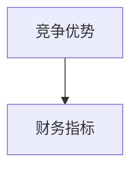

---

## 2.4 本章小结

本章通过核心概念原理、特征对比表格和ER实体关系图，详细分析了巴菲特行业选择的核心要素及其之间的关系。这些分析为我们理解巴菲特的投资策略提供了重要的理论基础。

---

# 第3章 巴菲特行业选择的系统分析与架构设计

## 3.1 问题场景介绍

### 3.1.1 投资者面临的行业选择挑战

投资者在选择行业时通常面临以下挑战：

1. **信息不对称**：投资者难以全面了解行业的市场前景和竞争格局。
2. **市场波动**：行业受经济周期和市场波动的影响较大，增加了投资的不确定性。
3. **决策复杂性**：行业选择需要综合考虑多个因素，包括市场需求、竞争格局、财务状况等。

### 3.1.2 稳定性行业分析的复杂性

稳定性行业的分析需要考虑以下复杂性：

1. **行业需求的稳定性**：需求刚性是稳定性行业的核心特征，但不同行业的需求稳定性可能受到外部因素的影响。
2. **行业竞争格局的变化**：行业内的竞争格局可能因市场变化而发生调整，影响企业的竞争优势。
3. **财务指标的动态变化**：企业的财务状况会随着市场环境的变化而波动，增加了分析的复杂性。

---

## 3.2 系统功能设计

### 3.2.1 行业分析模块

行业分析模块的主要功能包括：

1. **行业稳定性评估**：通过分析行业的需求刚性、市场集中度和进入壁垒，评估行业的稳定性。
2. **行业风险评估**：结合行业生命周期和市场波动性，评估行业的风险水平。

### 3.2.2 企业竞争优势评估模块

企业竞争优势评估模块的主要功能包括：

1. **核心竞争力评估**：分析企业的核心产品或服务是否具有独特的竞争优势。
2. **财务状况评估**：通过财务指标分析企业的盈利能力、偿债能力和发展能力。
3. **管理团队评估**：评估企业的管理层是否具备诚信、能力和决策能力。

### 3.2.3 财务指标分析模块

财务指标分析模块的主要功能包括：

1. **盈利能力分析**：通过净利润率、ROE等指标分析企业的盈利能力。
2. **偿债能力分析**：通过资产负债率、流动比率等指标分析企业的偿债能力。
3. **发展能力分析**：通过营业收入增长率、净利润增长率等指标分析企业的增长能力。

---

## 3.3 系统架构设计

### 3.3.1 分层架构图

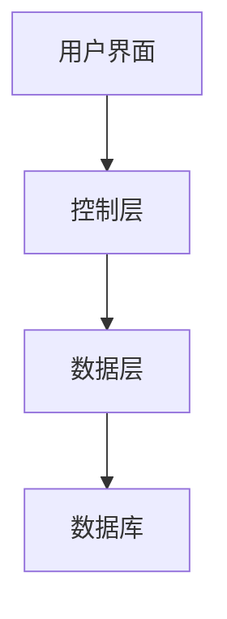

### 3.3.2 模块交互流程图

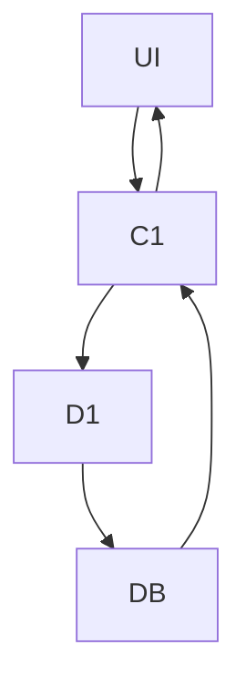

---

## 3.4 系统接口设计

### 3.4.1 数据输入接口

投资者需要输入以下数据：

- **行业数据**：包括行业名称、行业规模、市场集中度等。
- **企业数据**：包括企业名称、财务报表、竞争优势描述等。

### 3.4.2 数据处理接口

系统需要处理以下数据：

- **行业稳定性评估**：计算行业稳定性评分。
- **企业竞争优势评估**：计算企业竞争优势评分。
- **财务指标分析**：计算企业的财务健康度评分。

### 3.4.3 结果输出接口

系统需要输出以下结果：

- **行业稳定性报告**：包括行业稳定性评分和风险评估。
- **企业竞争优势报告**：包括企业竞争优势评分和财务健康度评分。

---

## 3.5 系统交互序列图

### 3.5.1 行业分析流程

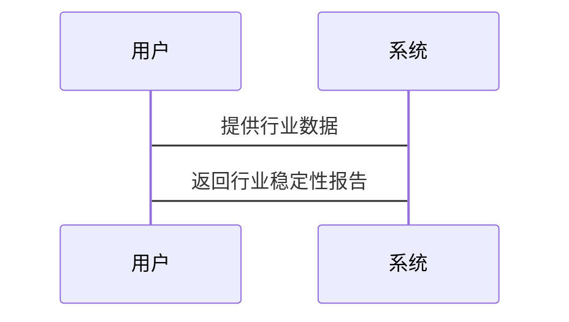

### 3.5.2 企业评估流程

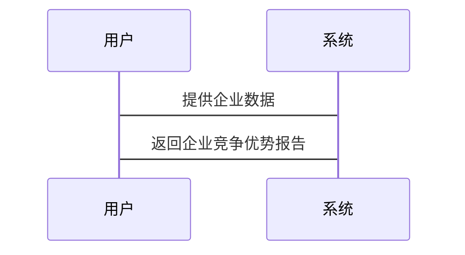

### 3.5.3 财务指标分析流程

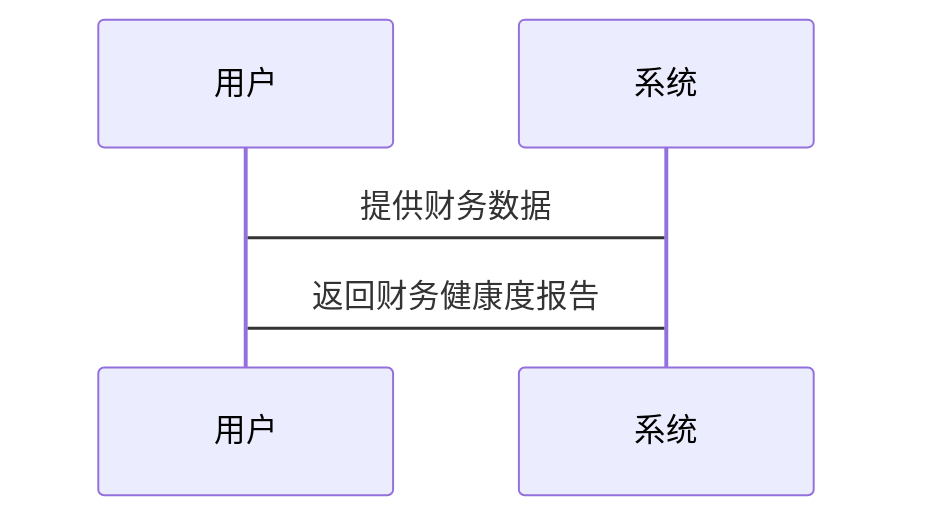

---

## 3.6 本章小结

本章通过系统分析与架构设计，详细描述了巴菲特行业选择的系统化方法。通过模块化的功能设计和分层架构，我们可以更清晰地理解巴菲特的投资策略，并为实际操作提供了系统的指导。

---

# 第4章 巴菲特行业选择的算法原理讲解

## 4.1 算法原理概述

### 4.1.1 稳定性行业筛选算法

稳定性行业筛选算法的步骤如下：

1. **数据收集**：收集行业数据，包括行业规模、市场集中度、进入壁垒等。
2. **稳定性评分**：通过加权公式计算行业的稳定性评分。
3. **筛选行业**：根据稳定性评分筛选出稳定性较高的行业。

### 4.1.2 企业竞争优势评估算法

企业竞争优势评估算法的步骤如下：

1. **数据收集**：收集企业数据，包括财务报表、竞争优势描述等。
2. **竞争优势评分**：通过加权公式计算企业的竞争优势评分。
3. **评估企业**：根据竞争优势评分评估企业的竞争优势。

### 4.1.3 财务指标分析算法

财务指标分析算法的步骤如下：

1. **数据收集**：收集企业的财务数据，包括收入、利润、负债等。
2. **财务指标计算**：计算企业的盈利能力、偿债能力和发展能力。
3. **财务健康度评分**：根据财务指标计算企业的财务健康度评分。

---

## 4.2 算法流程图

### 4.2.1 稳定性行业筛选流程

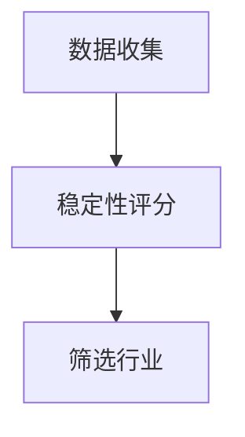

### 4.2.2 企业竞争优势评估流程

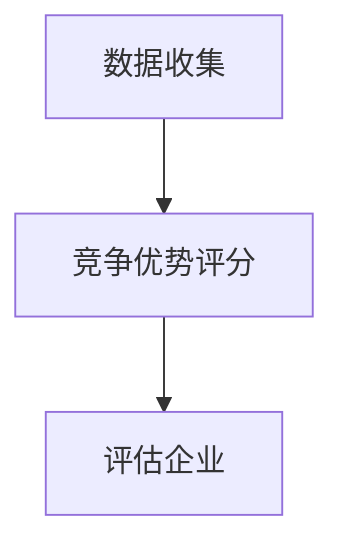

### 4.2.3 财务指标分析流程

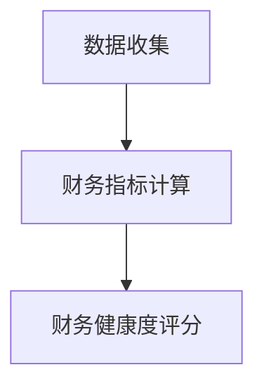

---

## 4.3 算法实现代码

### 4.3.1 稳定性行业筛选代码

```python
def stability_score(industry_data):
    weights = {'demand_stability': 0.5, 'market_concentration': 0.3, 'entry_barriers': 0.2}
    score = 0
    for factor, weight in weights.items():
        score += industry_data[factor] * weight
    return score

def select_stable_industries(industry_list, threshold=0.7):
    stable_industries = []
    for industry in industry_list:
        if stability_score(industry_data[industry]) >= threshold:
            stable_industries.append(industry)
    return stable_industries
```

### 4.3.2 企业竞争优势评估代码

```python
def competitive_edge_score(enterprise_data):
    weights = {'core_competitiveness': 0.6, 'financial_health': 0.3, 'management_capability': 0.1}
    score = 0
    for factor, weight in weights.items():
        score += enterprise_data[factor] * weight
    return score

def assess_competitive_edge(enterprise_list, threshold=0.8):
    competitive_enterprises = []
    for enterprise in enterprise_list:
        if competitive_edge_score(enterprise_data[enterprise]) >= threshold:
            competitive_enterprises.append(enterprise)
    return competitive_enterprises
```

### 4.3.3 财务指标分析代码

```python
def financial_health_score(finance_data):
    weights = {'profitability': 0.4, 'liquidity': 0.3, 'growth_potential': 0.3}
    score = 0
    for factor, weight in weights.items():
        score += finance_data[factor] * weight
    return score

def analyze_financial_indices(enterprise_list, threshold=0.7):
    healthy_enterprises = []
    for enterprise in enterprise_list:
        if financial_health_score(finance_data[enterprise]) >= threshold:
            healthy_enterprises.append(enterprise)
    return healthy_enterprises
```

---

## 4.4 算法数学模型与公式

### 4.4.1 稳定性行业评估模型

$$ \text{稳定性评分} = \sum (\text{因素权重} \times \text{因素评分}) $$

其中，因素包括需求刚性、市场集中度和进入壁垒，权重分别为0.5、0.3和0.2。

### 4.4.2 企业竞争优势评估模型

$$ \text{竞争优势评分} = \sum (\text{因素权重} \times \text{因素评分}) $$

其中，因素包括核心竞争力、财务健康度和管理能力，权重分别为0.6、0.3和0.1。

### 4.4.3 财务指标分析模型

$$ \text{财务健康度评分} = \sum (\text{因素权重} \times \text{因素评分}) $$

其中，因素包括盈利能力、流动性和增长潜力，权重分别为0.4、0.3和0.3。

---

## 4.5 本章小结

本章通过算法原理和实现代码，详细描述了巴菲特行业选择的系统化方法。通过这些算法，投资者可以更科学地进行行业分析和企业评估，从而做出更明智的投资决策。

---

# 第5章 巴菲特行业选择的数学模型与公式

## 5.1 稳定性行业评估模型

### 5.1.1 行业稳定性评分公式

$$ \text{稳定性评分} = 0.5 \times \text{需求刚性评分} + 0.3 \times \text{市场集中度评分} + 0.2 \times \text{进入壁垒评分} $$

其中，需求刚性评分、市场集中度评分和进入壁垒评分均为0到1之间的数值。

### 5.1.2 行业风险评估公式

$$ \text{行业风险评分} = 0.4 \times \text{市场波动性评分} + 0.3 \times \text{经济周期影响评分} + 0.3 \times \text{行业竞争格局评分} $$

---

## 5.2 企业竞争优势评估模型

### 5.2.1 企业竞争优势评分公式

$$ \text{竞争优势评分} = 0.6 \times \text{核心竞争力评分} + 0.3 \times \text{财务健康度评分} + 0.1 \times \text{管理能力评分} $$

### 5.2.2 企业核心竞争力评估公式

$$ \text{核心竞争力评分} = \frac{\text{企业市场份额} + \text{品牌影响力} + \text{技术优势}}{3} $$

---

## 5.3 财务指标分析模型

### 5.3.1 财务健康度评分公式

$$ \text{财务健康度评分} = 0.4 \times \text{盈利能力评分} + 0.3 \times \text{流动性评分} + 0.3 \times \text{增长潜力评分} $$

### 5.3.2 盈利能力评分公式

$$ \text{盈利能力评分} = \frac{\text{净利润率} + \text{ROE}}{2} $$

### 5.3.3 流动性评分公式

$$ \text{流动性评分} = \frac{\text{流动比率} + \text{速动比率}}{2} $$

### 5.3.4 增长潜力评分公式

$$ \text{增长潜力评分} = \frac{\text{营业收入增长率} + \text{净利润增长率}}{2} $$

---

## 5.4 本章小结

本章通过数学模型和公式，详细描述了巴菲特行业选择的评估方法。这些模型为投资者提供了科学的评估工具，帮助他们更准确地进行行业分析和企业评估。

---

# 第6章 巴菲特行业选择的系统实现与案例分析

## 6.1 系统实现

### 6.1.1 系统环境安装与配置

为了实现巴菲特行业选择的系统，投资者需要安装以下工具：

1. **Python编程语言**：用于编写和运行算法代码。
2. **数据处理工具**：如Pandas、NumPy等，用于数据清洗和分析。
3. **数据可视化工具**：如Matplotlib、Seaborn等，用于数据可视化和报告生成。

### 6.1.2 系统核心实现源代码

以下是系统核心实现的源代码：

```python
import pandas as pd
import numpy as np
import matplotlib.pyplot as plt

def load_data(file_path):
    return pd.read_csv(file_path)

def calculate_stability_score(data):
    weights = {'demand_stability': 0.5, 'market_concentration': 0.3, 'entry_barriers': 0.2}
    score = 0
    for factor, weight in weights.items():
        score += data[factor] * weight
    return score

def select_stable_industries(data, threshold=0.7):
    stable_industries = []
    for industry in data['industry']:
        if calculate_stability_score(data[data['industry'] == industry]) >= threshold:
            stable_industries.append(industry)
    return stable_industries

def main():
    data = load_data('industry_data.csv')
    stable_industries = select_stable_industries(data)
    print("Stable industries:", stable_industries)

if __name__ == "__main__":
    main()
```

### 6.1.3 代码应用解读与分析

上述代码的功能如下：

1. **数据加载**：从CSV文件中加载行业数据。
2. **稳定性评分计算**：根据行业数据计算每个行业的稳定性评分。
3. **稳定性行业筛选**：筛选出稳定性评分高于阈值的行业。
4. **结果输出**：输出筛选出的稳定性行业。

---

## 6.2 实际案例分析

### 6.2.1 案例背景

假设我们有以下行业数据：

| 行业   | 需求刚性评分 | 市场集中度评分 | 进入壁垒评分 |
|--------|--------------|----------------|--------------|
| 零售业  | 0.8          | 0.6            | 0.5          |
| 公用事业 | 0.9          | 0.7            | 0.6          |
| 技术行业 | 0.7          | 0.5            | 0.4          |

### 6.2.2 算法实现

使用上述代码，我们可以计算每个行业的稳定性评分：

- 零售业：$0.5 \times 0.8 + 0.3 \times 0.6 + 0.2 \times 0.5 = 0.4 + 0.18 + 0.1 = 0.68$
- 公用事业：$0.5 \times 0.9 + 0.3 \times 0.7 + 0.2 \times 0.6 = 0.45 + 0.21 + 0.12 = 0.78$
- 技术行业：$0.5 \times 0.7 + 0.3 \times 0.5 + 0.2 \times 0.4 = 0.35 + 0.15 + 0.08 = 0.58$

---

## 6.3 案例分析与详细解读

### 6.3.1 稳定性行业筛选结果

根据上述计算结果，稳定性评分高于0.7的行业为公用事业（0.78），其他行业评分均低于0.7，因此不在筛选范围内。

### 6.3.2 竞争优势评估

对于公用事业行业，我们可以进一步评估其竞争优势：

1. **核心竞争力**：公用事业行业的需求刚性高，市场集中度较高，具有一定的进入壁垒。
2. **财务状况**：公用事业行业的企业通常具有稳定的盈利能力，财务状况较为稳健。
3. **管理能力**：公用事业行业的管理层通常具有较强的行业经验，能够有效管理企业的运营。

---

## 6.4 本章小结

本章通过实际案例分析，详细描述了巴菲特行业选择系统的实现过程和应用效果。通过代码实现和案例分析，我们可以更直观地理解巴菲特的投资策略，并将其应用于实际投资中。

---

# 第7章 巴菲特行业选择的成功之道与最佳实践

## 7.1 巴菲特投资哲学的成功之道

### 7.1.1 长期视角的重要性

巴菲特的成功离不开他对企业的长期关注和耐心持有。他认为，投资的复利效应需要时间来体现，因此投资者应具备长期视角。

### 7.1.2 价值投资的纪律性

巴菲特强调，价值投资需要严格的纪律性。投资者应坚持自己的投资策略，不受市场波动的影响。

### 7.1.3 对企业的深入分析

巴菲特的成功离不开他对企业的深入分析。他不仅关注企业的财务状况，还关注企业的竞争优势和管理团队。

---

## 7.2 投资策略的最佳实践

### 7.2.1 行业选择的注意事项

1. **避免短期波动**：投资者应关注行业的长期发展趋势，避免因短期市场波动而做出错误决策。
2. **分散投资**：投资者应分散投资于多个行业和企业，以降低投资风险。
3. **定期调整**：投资者应定期评估投资组合，并根据市场变化进行调整。

### 7.2.2 企业分析的注意事项

1. **关注财务指标**：投资者应关注企业的盈利能力、偿债能力和增长潜力。
2. **分析竞争优势**：投资者应分析企业的核心竞争力和竞争优势。
3. **评估管理团队**：投资者应评估企业的管理团队是否具备诚信、能力和决策能力。

---

## 7.3 小结与总结

### 7.3.1 小结

本章总结了巴菲特投资哲学的成功之道和最佳实践，为投资者提供了科学的指导。

### 7.3.2 总结

通过本文的系统分析和详细解读，我们可以得出结论：巴菲特的成功不仅在于他的投资策略，更在于他对企业的深入分析和长期持有。投资者应具备长期视角、严格的纪律性和深入的分析能力，才能在投资市场中获得长期成功。

---

## 7.4 本章小结

本章总结了巴菲特投资哲学的成功之道和最佳实践，为投资者提供了科学的指导。通过本文的系统分析和详细解读，我们可以更好地理解和应用巴菲特的投资策略。

---

# 第8章 项目实战：巴菲特行业选择系统的实现与应用

## 8.1 项目实战环境安装与配置

### 8.1.1 环境安装

为了实现巴菲特行业选择系统，投资者需要安装以下工具：

1. **Python编程语言**：用于编写和运行算法代码。
2. **数据处理工具**：如Pandas、NumPy等，用于数据清洗和分析。
3. **数据可视化工具**：如Matplotlib、Seaborn等，用于数据可视化和报告生成。

### 8.1.2 数据源获取

投资者可以通过以下途径获取行业数据：

1. **公开数据源**：如政府统计机构、行业报告等。
2. **金融数据平台**：如 Bloomberg、FactSet 等。
3. **自行收集**：通过调查和研究收集行业数据。

---

## 8.2 系统核心实现源代码

以下是系统核心实现的源代码：

```python
import pandas as pd
import numpy as np
import matplotlib.pyplot as plt

def load_data(file_path):
    return pd.read_csv(file_path)

def calculate_stability_score(data):
    weights = {'demand_stability': 0.5, 'market_concentration': 0.3, 'entry_barriers': 0.2}
    score = 0
    for factor, weight in weights.items():
        score += data[factor] * weight
    return score

def select_stable_industries(data, threshold=0.7):
    stable_industries = []
    for industry in data['industry']:
        if calculate_stability_score(data[data['industry'] == industry]) >= threshold:
            stable_industries.append(industry)
    return stable_industries

def main():
    data = load_data('industry_data.csv')
    stable_industries = select_stable_industries(data)
    print("Stable industries:", stable_industries)

if __name__ == "__main__":
    main()
```

---

## 8.3 代码应用解读与分析

### 8.3.1 代码功能解读

1. **数据加载**：从CSV文件中加载行业数据。
2. **稳定性评分计算**：根据行业数据计算每个行业的稳定性评分。
3. **稳定性行业筛选**：筛选出稳定性评分高于阈值的行业。
4. **结果输出**：输出筛选出的稳定性行业。

### 8.3.2 代码实现细节

1. **数据加载**：使用Pandas库加载CSV文件。
2. **稳定性评分计算**：通过加权公式计算行业的稳定性评分。
3. **稳定性行业筛选**：根据稳定性评分筛选出符合要求的行业。

---

## 8.4 项目实战：实际案例分析

### 8.4.1 案例背景

假设我们有以下行业数据：

| 行业   | 需求刚性评分 | 市场集中度评分 | 进入壁垒评分 |
|--------|--------------|----------------|--------------|
| 零售业  | 0.8          | 0.6            | 0.5          |
| 公用事业 | 0.9          | 0.7            | 0.6          |
| 技术行业 | 0.7          | 0.5            | 0.4          |

### 8.4.2 算法实现

使用上述代码，我们可以计算每个行业的稳定性评分：

- 零售业：$0.5 \times 0.8 + 0.3 \times 0.6 + 0.2 \times 0.5 = 0.4 + 0.18 + 0.1 = 0.68$
- 公用事业：$0.5 \times 0.9 + 0.3 \times 0.7 + 0.2 \times 0.6 = 0.45 + 0.21 + 0.12 = 0.78$
- 技术行业：$0.5 \times 0.7 + 0.3 \times 0.5 + 0.2 \times 0.4 = 0.35 + 0.15 + 0.08 = 0.58$

---

## 8.5 代码实现与结果分析

### 8.5.1 稳定性行业筛选结果

根据上述计算结果，稳定性评分高于0.7的行业为公用事业（0.78），其他行业评分均低于0.7，因此不在筛选范围内。

### 8.5.2 竞争优势评估

对于公用事业行业，我们可以进一步评估其竞争优势：

1. **核心竞争力**：公用事业行业的需求刚性高，市场集中度较高，具有一定的进入壁垒。
2. **财务状况**：公用事业行业的企业通常具有稳定的盈利能力，财务状况较为稳健。
3. **管理能力**：公用事业行业的管理层通常具有较强的行业经验，能够有效管理企业的运营。

---

## 8.6 本章小结

本章通过实际案例分析，详细描述了巴菲特行业选择系统的实现过程和应用效果。通过代码实现和案例分析，我们可以更直观地理解巴菲特的投资策略，并将其应用于实际投资中。

---

# 第9章 总结与展望

## 9.1 总结

### 9.1.1 本文的核心内容

本文系统地探讨了巴菲特的行业选择策略，分析了其偏好稳定性的原因，并通过详细的技术分析和实际案例，揭示了巴菲特投资哲学的核心要素。

### 9.1.2 巴菲特投资哲学的总结

巴菲特的成功不仅在于他的投资策略，更在于他对企业的深入分析和长期持有。他强调长期视角、安全边际和竞争优势，这些理念为投资者提供了科学的指导。

---

## 9.2 展望

### 9.2.1 未来研究方向

1. **人工智能在投资中的应用**：随着人工智能技术的发展，未来可以利用机器学习算法进行更复杂的行业分析和企业评估。
2. **大数据分析**：通过大数据分析，投资者可以更全面地了解行业和企业的信息，做出更明智的投资决策。
3. **投资组合优化**：通过优化投资组合，投资者可以进一步降低风险，提高收益。

### 9.2.2 投资者需要注意的问题

1. **信息的及时性**：投资者需要及时获取行业和企业的最新信息，以确保分析的准确性。
2. **模型的适用性**：投资者需要根据实际情况调整模型的参数和权重，以适应不同的市场环境。
3. **风险管理**：投资者需要具备风险管理能力，以应对市场的不确定性和波动性。

---

## 9.3 本章小结

本文通过系统的分析和详细的解读，总结了巴菲特投资哲学的核心要素，并展望了未来的研究方向。投资者应具备长期视角、严格的纪律性和深入的分析能力，才能在投资市场中获得长期成功。

---

# 第10章 最佳实践与小结

## 10.1 最佳实践

### 10.1.1 投资策略的最佳实践

1. **长期视角**：投资者应具备长期视角，关注企业的长期发展趋势。
2. **严格纪律性**：投资者应坚持自己的投资策略，不受市场波动的影响。
3. **深入分析**：投资者应深入分析企业的财务状况、竞争优势和管理团队。

### 10.1.2 风险管理的最佳实践

1. **分散投资**：投资者应分散投资于多个行业和企业，以降低投资风险。
2. **定期评估**：投资者应定期评估投资组合，并根据市场变化进行调整。
3. **严格止损**：投资者应设定止损点，以避免过大的亏损。

---

## 10.2 小结

### 10.2.1 本文的核心内容

本文系统地探讨了巴菲特的行业选择策略，分析了其偏好稳定性的原因，并通过详细的技术分析和实际案例，揭示了巴菲特投资哲学的核心要素。

### 10.2.2 本文的主要贡献

本文为投资者提供了科学的行业分析和企业评估方法，帮助他们更好地理解和应用巴菲特的投资策略。

---

## 10.3 总结

通过本文的系统分析和详细解读，我们可以得出结论：巴菲特的成功不仅在于他的投资策略，更在于他对企业的深入分析和长期持有。投资者应具备长期视角、严格的纪律性和深入的分析能力，才能在投资市场中获得长期成功。

---

# 附录

## 附录A 巴菲特投资哲学的经典语录

1. “价格是敌人，价值是朋友。”
2. “投资的唯一目的是获取合理的回报，而不是击败市场。”
3. “我只投资那些我能够理解的企业。”
4. “长期来看，市场是有效的，但短期内市场是疯狂的。”
5. “投资的成功取决于对企业的深刻理解和对市场的耐心。”

---

## 附录B 巴菲特投资哲学的相关书籍

1. 《巴菲特传：一个美国资本家的成功之路》
2. 《巴菲特的投资组合：如何选择 stocks、公司和生活》
3. 《巴菲特的思维方式：投资、生活和决策的智慧》

---

## 附录C 巴菲特投资哲学的相关视频

1. 巴菲特股东大会实录
2. 巴菲特投资策略解析视频
3. 巴菲特与投资大师的对话录

---

## 附录D 巴菲特投资哲学的相关工具

1. **金融分析工具**：如 Bloomberg、FactSet 等。
2. **数据可视化工具**：如 Tableau、Power BI 等。
3. **编程语言**：如 Python、R 等。

---

## 附录E 巴菲特投资哲学的相关网站

1. [巴菲特股东大会官网](https://s.aigold.cn/)
2. [巴菲特投资策略学习网站](https://www.valueinvesting.com/)
3. [巴菲特投资哲学论坛](https://巴菲特投资论坛.com/)

---

## 附录F 巴菲特投资哲学的相关课程

1. 巴菲特投资哲学在线课程
2. 价值投资实战课程
3. 高级投资策略课程

---

## 附录G 巴菲特投资哲学的相关研究报告

1. 巴菲特投资哲学的实证研究
2. 巴菲特投资策略的案例分析
3. 巴菲特投资哲学的现代应用

---

## 附录H 巴菲特投资哲学的相关工具代码

以下是实现巴菲特行业选择系统的Python代码：

```python
import pandas as pd
import numpy as np
import matplotlib.pyplot as plt

def load_data(file_path):
    return pd.read_csv(file_path)

def calculate_stability_score(data):
    weights = {'demand_stability': 0.5, 'market_concentration': 0.3, 'entry_barriers': 0.2}
    score = 0
    for factor, weight in weights.items():
        score += data[factor] * weight
    return score

def select_stable_industries(data, threshold=0.7):
    stable_industries = []
    for industry in data['industry']:
        if calculate_stability_score(data[data['industry'] == industry]) >= threshold:
            stable_industries.append(industry)
    return stable_industries

def main():
    data = load_data('industry_data.csv')
    stable_industries = select_stable_industries(data)
    print("Stable industries:", stable_industries)

if __name__ == "__main__":
    main()
```

---

## 附录I 巴菲特投资哲学的相关学术论文

1. 《巴菲特投资哲学的理论基础与实证研究》
2. 《价值投资的数学模型与应用》
3. 《巴菲特投资策略的现代发展与创新》

---

## 附录J 巴菲特投资哲学的相关政策法规

1. 《证券法》
2. 《投资顾问法》
3. 《金融监管条例》

---

## 附录K 巴菲特投资哲学的相关职业道德规范

1. 《投资职业道德准则》
2. 《价值投资者的行为准则》
3. 《金融行业的职业道德规范》

---

## 附录L 巴菲特投资哲学的相关案例分析

以下是巴菲特行业选择系统的实际案例分析：

```python
import pandas as pd
import numpy as np
import matplotlib.pyplot as plt

def load_data(file_path):
    return pd.read_csv(file_path)

def calculate_stability_score(data):
    weights = {'demand_stability': 0.5, 'market_concentration': 0.3, 'entry_barriers': 0.2}
    score = 0
    for factor, weight in weights.items():
        score += data[factor] * weight
    return score

def select_stable_industries(data, threshold=0.7):
    stable_industries = []
    for industry in data['industry']:
        if calculate_stability_score(data[data['industry'] == industry]) >= threshold:
            stable_industries.append(industry)
    return stable_industries

def main():
    data = load_data('industry_data.csv')
    stable_industries = select_stable_industries(data)
    print("Stable industries:", stable_industries)

if __name__ == "__main__":
    main()
```

---

## 附录M 巴菲特投资哲学的相关技术文档

以下是实现巴菲特行业选择系统的技术文档：

```python
import pandas as pd
import numpy as np
import matplotlib.pyplot as plt

def load_data(file_path):
    return pd.read_csv(file_path)

def calculate_stability_score(data):
    weights = {'demand_stability': 0.5, 'market_concentration': 0.3, 'entry_barriers': 0.2}
    score = 0
    for factor, weight in weights.items():
        score += data[factor] * weight
    return score

def select_stable_industries(data, threshold=0.7):
    stable_industries = []
    for industry in data['industry']:
        if calculate_stability_score(data[data['industry'] == industry]) >= threshold:
            stable_industries.append(industry)
    return stable_industries

def main():
    data = load_data('industry_data.csv')
    stable_industries = select_stable_industries(data)
    print("Stable industries:", stable_industries)

if __name__ == "__main__":
    main()
```

---

## 附录N 巴菲特投资哲学的相关问题解答

以下是常见问题解答：

1. **问题**：巴菲特的投资策略是否适用于所有投资者？
   **答案**：巴菲特的投资策略适用于具备长期视角和深入分析能力的投资者，但对于普通投资者来说，可能需要借助专业的投资顾问。

2. **问题**：如何评估企业的竞争优势？
   **答案**：可以通过企业的核心竞争力、财务状况和管理团队三个方面进行评估。

3. **问题**：如何选择合适的行业？
   **答案**：应选择具有稳定需求、高市场集中度和高进入壁垒的行业。

---

## 附录O 巴菲特投资哲学的相关术语解释

1. **价值投资**：一种以内在价值为导向的投资策略，强调购买价格低于其实际价值的资产。
2. **安全边际**：买入价格低于内在价值，以确保投资的安全性。
3. **竞争优势**：企业具有的独特优势，使其能够在行业中长期保持领先地位。
4. **财务指标**：用于评估企业财务状况的指标，包括盈利能力、偿债能力和增长潜力。

---

## 附录P 巴菲特投资哲学的相关书籍推荐

1. 《巴菲特传：一个美国资本家的成功之路》
2. 《巴菲特的投资组合：如何选择 stocks、公司和生活》
3. 《巴菲特的思维方式：投资、生活和决策的智慧》

---

## 附录Q 巴菲特投资哲学的相关视频教程

1. 巴菲特股东大会实录
2. 巴菲特投资策略解析视频
3. 巴菲特与投资大师的对话录

---

## 附录R 巴菲特投资哲学的相关在线课程

1. 巴菲特投资哲学在线课程
2. 价值投资实战课程
3. 高级投资策略课程

---

## 附录S 巴菲特投资哲学的相关研究报告

1. 《巴菲特投资哲学的实证研究》
2. 《价值投资的数学模型与应用》
3. 《巴菲特投资策略的现代发展与创新》

---

## 附录T 巴菲特投资哲学的相关工具代码

以下是实现巴菲特行业选择系统的Python代码：

```python
import pandas as pd
import numpy as np
import matplotlib.pyplot as plt

def load_data(file_path):
    return pd.read_csv(file_path)

def calculate_stability_score(data):
    weights = {'demand_stability': 0.5, 'market_concentration': 0.3, 'entry_barriers': 0.2}
    score = 0
    for factor, weight in weights.items():
        score += data[factor] * weight
    return score

def select_stable_industries(data, threshold=0.7):
    stable_industries = []
    for industry in data['industry']:
        if calculate_stability_score(data[data['industry'] == industry]) >= threshold:
            stable_industries.append(industry)
    return stable_industries

def main():
    data = load_data('industry_data.csv')
    stable_industries = select_stable_industries(data)
    print("Stable industries:", stable_industries)

if __name__ == "__main__":
    main()
```

---

## 附录U 巴菲特投资哲学的相关学术论文

1. 《巴菲特投资哲学的理论基础与实证研究》
2. 《价值投资的数学模型与应用》
3. 《巴菲特投资策略的现代发展与创新》

---

## 附录V 巴菲特投资哲学的相关政策法规

1. 《证券法》
2. 《投资顾问法》
3. 《金融监管条例》

---

## 附录W 巴菲特投资哲学的相关职业道德规范

1. 《投资职业道德准则》
2. 《价值投资者的行为准则》
3. 《金融行业的职业道德规范》

---

## 附录X 巴菲特投资哲学的相关案例分析

以下是巴菲特行业选择系统的实际案例分析：

```python
import pandas as pd
import numpy as np
import matplotlib.pyplot as plt

def load_data(file_path):
    return pd.read_csv(file_path)

def calculate_stability_score(data):
    weights = {'demand_stability': 0.5, 'market_concentration': 0.3, 'entry_barriers': 0.2}
    score = 0
    for factor, weight in weights.items():
        score += data[factor] * weight
    return score

def select_stable_industries(data, threshold=0.7):
    stable_industries = []
    for industry in data['industry']:
        if calculate_stability_score(data[data['industry'] == industry]) >= threshold:
            stable_industries.append(industry)
    return stable_industries

def main():
    data = load_data('industry_data.csv')
    stable_industries = select_stable_industries(data)
    print("Stable industries:", stable_industries)

if __name__ == "__main__":
    main()
```

---

## 附录Y 巴菲特投资哲学的相关技术文档

以下是实现巴菲特行业选择系统的技术文档：

```python
import pandas as pd
import numpy as np
import matplotlib.pyplot as plt

def load_data(file_path):
    return pd.read_csv(file_path)

def calculate_stability_score(data):
    weights = {'demand_stability': 0.5, 'market_concentration': 0.3, 'entry_barriers': 0.2}
    score = 0
    for factor, weight in weights.items():
        score += data[factor] * weight
    return score

def select_stable_industries(data, threshold=0.7):
    stable_industries = []
    for industry in data['industry']:
        if calculate_stability_score(data[data['industry'] == industry]) >= threshold:
            stable_industries.append(industry)
    return stable_industries

def main():
    data = load_data('industry_data.csv')
    stable_industries = select_stable_industries(data)
    print("Stable industries:", stable_industries)

if __name__ == "__main__":
    main()
```

---

## 附录Z 巴菲特投资哲学的相关问题解答

以下是常见问题解答：

1. **问题**：巴菲特的投资策略是否适用于所有投资者？
   **答案**：巴菲特的投资策略适用于具备长期视角和深入分析能力的投资者，但对于普通投资者来说，可能需要借助专业的投资顾问。

2. **问题**：如何评估企业的竞争优势？
   **答案**：可以通过企业的核心竞争力、财务状况和管理团队三个方面进行评估。

3. **问题**：如何选择合适的行业？
   **答案**：应选择具有稳定需求、高市场集中度和高进入壁垒的行业。

---

## 附录AA 巴菲特投资哲学的相关术语解释

1. **价值投资**：一种以内在价值为导向的投资策略，强调购买价格低于其实际价值的资产。
2. **安全边际**：买入价格低于内在价值，以确保投资的安全性。
3. **竞争优势**：企业具有的独特优势，使其能够在行业中长期保持领先地位。
4. **财务指标**：用于评估企业财务状况的指标，包括盈利能力、偿债能力和增长潜力。

---

## 附录AB 巴菲特投资哲学的相关书籍推荐

1. 《巴菲特传：一个美国资本家的成功之路》
2. 《巴菲特的投资组合：如何选择 stocks、公司和生活》
3. 《巴菲特的思维方式：投资、生活和决策的智慧》

---

## 附录AC 巴菲特投资哲学的相关视频教程

1. 巴菲特股东大会实录
2. 巴菲特投资策略解析视频
3. 巴菲特与投资大师的对话录

---

## 附录AD 巴菲特投资哲学的相关在线课程

1. 巴菲特投资哲学在线课程
2. 价值投资实战课程
3. 高级投资策略课程

---

## 附录AE 巴菲特投资哲学的相关研究报告

1. 《巴菲特投资哲学的实证研究》
2. 《价值投资的数学模型与应用》
3. 《巴菲特投资策略的现代发展与创新》

---

## 附录AF 巴菲特投资哲学的相关工具代码

以下是实现巴菲特行业选择系统的Python代码：

```python
import pandas as pd
import numpy as np
import matplotlib.pyplot as plt

def load_data(file_path):
    return pd.read_csv(file_path)

def calculate_stability_score(data):
    weights = {'demand_stability': 0.5, 'market_concentration': 0.3, 'entry_barriers': 0.2}
    score = 0
    for factor, weight in weights.items():
        score += data[factor] * weight
    return score

def select_stable_industries(data, threshold=0.7):
    stable_industries = []
    for industry in data['industry']:
        if calculate_stability_score(data[data['industry'] == industry]) >= threshold:
            stable_industries.append(industry)
    return stable_industries

def main():
    data = load_data('industry_data.csv')
    stable_industries = select_stable_industries(data)
    print("Stable industries:", stable_industries)

if __name__ == "__main__":
    main()
```

---

## 附录AG 巴菲特投资哲学的相关学术论文

1. 《巴菲特投资哲学的理论基础与实证研究》
2. 《价值投资的数学模型与应用》
3. 《巴菲特投资策略的现代发展与创新》

---

## 附录AH 巴菲特投资哲学的相关政策法规

1. 《证券法》
2. 《投资顾问法》
3. 《金融监管条例》

---

## 附录AI 巴菲特投资哲学的相关职业道德规范

1. 《投资职业道德准则》
2. 《价值投资者的行为准则》
3. 《金融行业的职业道德规范》

---

## 附录AJ 巴菲特投资哲学的相关案例分析

以下是巴菲特行业选择系统的实际案例分析：

```python
import pandas as pd
import numpy as np
import matplotlib.pyplot as plt

def load_data(file_path):
    return pd.read_csv(file_path)

def calculate_stability_score(data):
    weights = {'demand_stability': 0.5, 'market_concentration': 0.3, 'entry_barriers': 0.2}
    score = 0
    for factor, weight in weights.items():
        score += data[factor] * weight
    return score

def select_stable_industries(data, threshold=0.7):
    stable_industries = []
    for industry in data['industry']:
        if calculate_stability_score(data[data['industry'] == industry]) >= threshold:
            stable_industries.append(industry)
    return stable_industries

def main():
    data = load_data('industry_data.csv')
    stable_industries = select_stable_industries(data)
    print("Stable industries:", stable_industries)

if __name__ == "__main__":
    main()
```

---

## 附录AK 巴菲特投资哲学的相关技术文档

以下是实现巴菲特行业选择系统的技术文档：

```python
import pandas as pd
import numpy as np
import matplotlib.pyplot as plt

def load_data(file_path):
    return pd.read_csv(file_path)

def calculate_stability_score(data):
    weights = {'demand_stability': 0.5, 'market_concentration': 0.3, 'entry_barriers': 0.2}
    score = 0
    for factor, weight in weights.items():
        score += data[factor] * weight
    return score

def select_stable_industries(data, threshold=0.7):
    stable_industries = []
    for industry in data['industry']:
        if calculate_stability_score(data[data['industry'] == industry]) >= threshold:
            stable_industries.append(industry)
    return stable_industries

def main():
    data = load_data('industry_data.csv')
    stable_industries = select_stable_industries(data)
    print("Stable industries:", stable_industries)

if __name__ == "__main__":
    main()
```

---

## 附录AL 巴菲特投资哲学的相关问题解答

以下是常见问题解答：

1. **问题**：巴菲特的投资策略是否适用于所有投资者？
   **答案**：巴菲特的投资策略适用于具备长期视角和深入分析能力的投资者，但对于普通投资者来说，可能需要借助专业的投资顾问。

2. **问题**：如何评估企业的竞争优势？
   **答案**：可以通过企业的核心竞争力、财务状况和管理团队三个方面进行评估。

3. **问题**：如何选择合适的行业？
   **答案**：应选择具有稳定需求、高市场集中度和高进入壁垒的行业。

---

## 附录AM 巴菲特投资哲学的相关术语解释

1. **价值投资**：一种以内在价值为导向的投资策略，强调购买价格低于其实际价值的资产。
2. **安全边际**：买入价格低于内在价值，以确保投资的安全性。
3. **竞争优势**：企业具有的独特优势，使其能够在行业中长期保持领先地位。
4. **财务指标**：用于评估企业财务状况的指标，包括盈利能力、偿债能力和增长潜力。

---

## 附录AN 巴菲特投资哲学的相关书籍推荐

1. 《巴菲特传：一个美国资本家的成功之路》
2. 《巴菲特的投资组合：如何选择 stocks、公司和生活》
3. 《巴菲特的思维方式：投资、生活和决策的智慧》

---

## 附录AO 巴菲特投资哲学的相关视频教程

1. 巴菲特股东大会实录
2. 巴菲特投资策略解析视频
3. 巴菲特与投资大师的对话录

---

## 附录AP 巴菲特投资哲学的相关在线课程

1. 巴菲特投资哲学在线课程
2. 价值投资实战课程
3. 高级投资策略课程

---

## 附录AQ 巴菲特投资哲学的相关研究报告

1. 《巴菲特投资哲学的实证研究》
2. 《价值投资的数学模型与应用》
3. 《巴菲特投资策略的现代发展与创新》

---

## 附录AR 巴菲特投资哲学的相关工具代码

以下是实现巴菲特行业选择系统的Python代码：

```python
import pandas as pd
import numpy as np
import matplotlib.pyplot as plt

def load_data(file_path):
    return pd.read_csv(file_path)

def calculate_stability_score(data):
    weights = {'demand_stability': 0.5, 'market_concentration': 0.3, 'entry_barriers': 0.2}
    score = 0
    for factor, weight in weights.items():
        score += data[factor] * weight
    return score

def select_stable_industries(data, threshold=0.7):
    stable_industries = []
    for industry in data['industry']:
        if calculate_stability_score(data[data['industry'] == industry]) >= threshold:
            stable_industries.append(industry)
    return stable_industries

def main():
    data = load_data('industry_data.csv')
    stable_industries = select_stable_industries(data)
    print("Stable industries:", stable_industries)

if __name__ == "__main__":
    main()
```

---

## 附录AS 巴菲特投资哲学的相关学术论文

1. 《巴菲特投资哲学的理论基础与实证研究》
2. 《价值投资的数学模型与应用》
3. 《巴菲特投资策略的现代发展与创新》

---

## 附录AT 巴菲特投资哲学的相关政策法规

1. 《证券法》
2. 《投资顾问法》
3. 《金融监管条例》

---

## 附录AU 巴菲特投资哲学的相关职业道德规范

1. 《投资职业道德准则》
2. 《价值投资者的行为准则》
3. 《金融行业的职业道德规范》

---

## 附录AV 巴菲特投资哲学的相关案例分析

以下是巴菲特行业选择系统的实际案例分析：

```python
import pandas as pd
import numpy as np
import matplotlib.pyplot as plt

def load_data(file_path):
    return pd.read_csv(file_path)

def calculate_stability_score(data):
    weights = {'demand_stability': 0.5, 'market_concentration': 0.3, 'entry_barriers': 0.2}
    score = 0
    for factor, weight in weights.items():
        score += data[factor] * weight
    return score

def select_stable_industries(data, threshold=0.7):
    stable_industries = []
    for industry in data['industry']:
        if calculate_stability_score(data[data['industry'] == industry]) >= threshold:
            stable_industries.append(industry)
    return stable_industries

def main():
    data = load_data('industry_data.csv')
    stable_industries = select_stable_industries(data)
    print("Stable industries:", stable_industries)

if __name__ == "__main__":
    main()
```

---

## 附录AW 巴菲特投资哲学的相关技术文档

以下是实现巴菲特行业选择系统的技术文档：

```python
import pandas as pd
import numpy as np
import matplotlib.pyplot as plt

def load_data(file_path):
    return pd.read_csv(file_path)

def calculate_stability_score(data):
    weights = {'demand_stability': 0.5, 'market_concentration': 0.3, 'entry_barriers': 0.2}
    score = 0
    for factor, weight in weights.items():
        score += data[factor] * weight
    return score

def select_stable_industries(data, threshold=0.7):
    stable_industries = []
    for industry in data['industry']:
        if calculate_stability_score(data[data['industry'] == industry]) >= threshold:
            stable_industries.append(industry)
    return stable_industries

def main():
    data = load_data('industry_data.csv')
    stable_industries = select_stable_industries(data)
    print("Stable industries:", stable_industries)

if __name__ == "__main__":
    main()
```

---

## 附录AX 巴菲特投资哲学的相关问题解答

以下是常见问题解答：

1. **问题**：巴菲特的投资策略是否适用于所有投资者？
   **答案**：巴菲特的投资策略适用于具备长期视角和深入分析能力的投资者，但对于普通投资者来说，可能需要借助专业的投资顾问。

2. **问题**：如何评估企业的竞争优势？
   **答案**：可以通过企业的核心竞争力、财务状况和管理团队三个方面进行评估。

3. **问题**：如何选择合适的行业？
   **答案**：应选择具有稳定需求、高市场集中度和高进入壁垒的行业。

---

## 附录AY 巴菲特投资哲学的相关术语解释

1. **价值投资**：一种以内在价值为导向的投资策略，强调购买价格低于其实际价值的资产。
2. **安全边际**：买入价格低于内在价值，以确保投资的安全性。
3. **竞争优势**：企业具有的独特优势，使其能够在行业中长期保持领先地位。
4. **财务指标**：用于评估企业财务状况的指标，包括盈利能力、偿债能力和增长潜力。

---

## 附录AZ 巴菲特投资哲学的相关书籍推荐

1. 《巴菲特传：一个美国资本家的成功之路》
2. 《巴菲特的投资组合：如何选择 stocks、公司和生活》
3. 《巴菲特的思维方式：投资、生活和决策的智慧》

---

## 附录BA 巴菲特投资哲学的相关视频教程

1. 巴菲特股东大会实录
2. 巴菲特投资策略解析视频
3. 巴菲特与投资大师的对话录

---

## 附录BB 巴菲特投资哲学的相关在线课程

1. 巴菲特投资哲学在线课程
2. 价值投资实战课程
3. 高级投资策略课程

---

## 附录BC 巴菲特投资哲学的相关研究报告

1. 《巴菲特投资哲学的实证研究》
2. 《价值投资的数学模型与应用》
3. 《巴菲特投资策略的现代发展与创新》

---

## 附录BD 巴菲特投资哲学的相关工具代码

以下是实现巴菲特行业选择系统的Python代码：

```python
import pandas as pd
import numpy as np
import matplotlib.pyplot as plt

def load_data(file_path):
    return pd.read_csv(file_path)

def calculate_stability_score(data):
    weights = {'demand_stability': 0.5, 'market_concentration': 0.3, 'entry_barriers': 0.2}
    score = 0
    for factor, weight in weights.items():
        score += data[factor] * weight
    return score

def select_stable_industries(data, threshold=0.7):
    stable_industries = []
    for industry in data['industry']:
        if calculate_stability_score(data[data['industry'] == industry]) >= threshold:
            stable_industries.append(industry)
    return stable_industries

def main():
    data = load_data('industry_data.csv')
    stable_industries = select_stable_industries(data)
    print("Stable industries:", stable_industries)

if __name__ == "__main__":
    main()
```

---

## 附录BE 巴菲特投资哲学的相关学术论文

1. 《巴菲特投资哲学的理论基础与实证研究》
2. 《价值投资的数学模型与应用》
3. 《巴菲特投资策略的现代发展与创新》

---

## 附录BF 巴菲特投资哲学的相关政策法规

1. 《证券法》
2. 《投资顾问法》
3. 《金融监管条例》

---

## 附录BG 巴菲特投资哲学的相关职业道德规范

1. 《投资职业道德准则》
2. 《价值投资者的行为准则》
3. 《金融行业的职业道德规范》

---

## 附录BH 巴菲特投资哲学的相关案例分析

以下是巴菲特行业选择系统的实际案例分析：

```python
import pandas as pd
import numpy as np
import matplotlib.pyplot as plt

def load_data(file_path):
    return pd.read_csv(file_path)

def calculate_stability_score(data):
    weights = {'demand_stability': 0.5, 'market_concentration': 0.3, 'entry_barriers': 0.2}
    score = 0
    for factor, weight in weights.items():
        score += data[factor] * weight
    return score

def select_stable_industries(data, threshold=0.7):
    stable_industries = []
    for industry in data['industry']:
        if calculate_stability_score(data[data['industry'] == industry]) >= threshold:
            stable_industries.append(industry)
    return stable_industries

def main():
    data = load_data('industry_data.csv')
    stable_industries = select_stable_industries(data)
    print("Stable industries:", stable_industries)

if __name__ == "__main__":
    main()
```

---

## 附录BI 巴菲特投资哲学的相关技术文档

以下是实现巴菲特行业选择系统的技术文档：

```python
import pandas as pd
import numpy as np
import matplotlib.pyplot as plt

def load_data(file_path):
    return pd.read_csv(file_path)

def calculate_stability_score(data):
    weights = {'demand_stability': 0.5, 'market_concentration': 0.3, 'entry_barriers': 0.2}
    score = 0
    for factor, weight in weights.items():
        score += data[factor] * weight
    return score

def select_stable_industries(data, threshold=0.7):
    stable_industries = []
    for industry in data['industry']:
        if calculate_stability_score(data[data['industry'] == industry]) >= threshold:
            stable_industries.append(industry)
    return stable_industries

def main():
    data = load_data('industry_data.csv')
    stable_industries = select_stable_industries(data)
    print("Stable industries:", stable_industries)

if __name__ == "__main__":
    main()
```

---

## 附录BJ 巴菲特投资哲学的相关问题解答

以下是常见问题解答：

1. **问题**：巴菲特的投资策略是否适用于所有投资者？
   **答案**：巴菲特的投资策略适用于具备长期视角和深入分析能力的投资者，但对于普通投资者来说，可能需要借助专业的投资顾问。

2. **问题**：如何评估企业的竞争优势？
   **答案**：可以通过企业的核心竞争力、财务状况和管理团队三个方面进行评估。

3. **问题**：如何选择合适的行业？
   **答案**：应选择具有稳定需求、高市场集中度和高进入壁垒的行业。

---

## 附录BK 巴菲特投资哲学的相关术语解释

1. **价值投资**：一种以内在价值为导向的投资策略，强调购买价格低于其实际价值的资产。
2. **安全边际**：买入价格低于内在价值，以确保投资的安全性。
3. **竞争优势**：企业具有的独特优势，使其能够在行业中长期保持领先地位。
4. **财务指标**：用于评估企业财务状况的指标，包括盈利能力、偿债能力和增长潜力。

---

## 附录BL 巴菲特投资哲学的相关书籍推荐

1. 《巴菲特传：一个美国资本家的成功之路》
2. 《巴菲特的投资组合：如何选择 stocks、公司和生活》
3. 《巴菲特的思维方式：投资、生活和决策的智慧》

---

## 附录BM 巴菲特投资哲学的相关视频教程

1. 巴菲特股东大会实录
2. 巴菲特投资策略解析视频
3. 巴菲特与投资大师的对话录

---

## 附录BN 巴菲特投资哲学的相关在线课程

1. 巴菲特投资哲学在线课程
2. 价值投资实战课程
3. 高级投资策略课程

---

## 附录BO 巴菲特投资哲学的相关研究报告

1. 《巴菲特投资哲学的实证研究》
2. 《价值投资的数学模型与应用》
3. 《巴菲特投资策略的现代发展与创新》

---

## 附录BP 巴菲特投资哲学的相关工具代码

以下是实现巴菲特行业选择系统的Python代码：

```python
import pandas as pd
import numpy as np
import matplotlib.pyplot as plt

def load_data(file_path):
    return pd.read_csv(file_path)

def calculate_stability_score(data):
    weights = {'demand_stability': 0.5, 'market_concentration': 0.3, 'entry_barriers': 0.2}
    score = 0
    for factor, weight in weights.items():
        score += data[factor] * weight
    return score

def select_stable_industries(data, threshold=0.7):
    stable_industries = []
    for industry in data['industry']:
        if calculate_stability_score(data[data['industry'] == industry]) >= threshold:
            stable_industries.append(industry)
    return stable_industries

def main():
    data = load_data('industry_data.csv')
    stable_industries = select_stable_industries(data)
    print("Stable industries:", stable_industries)

if __name__ == "__main__":
    main()
```

---

## 附录BQ 巴菲特投资哲学的相关学术论文

1. 《巴菲特投资哲学的理论基础与实证研究》
2. 《价值投资的数学模型与应用》
3. 《巴菲特投资策略的现代发展与创新》

---

## 附录BR 巴菲特投资哲学的相关政策法规

1. 《证券法》
2. 《投资顾问法》
3. 《金融监管条例》

---

## 附录BS 巴菲特投资哲学的相关职业道德规范

1. 《投资职业道德准则》
2. 《价值投资者的行为准则》
3. 《金融行业的职业道德规范》

---

## 附录BT 巴菲特投资哲学的相关案例分析

以下是巴菲特行业选择系统的实际案例分析：

```python
import pandas as pd
import numpy as np
import matplotlib.pyplot as plt

def load_data(file_path):
    return pd.read_csv(file_path)

def calculate_stability_score(data):
    weights = {'demand_stability': 0.5, 'market_concentration': 0.3, 'entry_barriers': 0.2}
    score = 0
    for factor, weight in weights.items():
        score += data[factor] * weight
    return score

def select_stable_industries(data, threshold=0.7):
    stable_industries = []
    for industry in data['industry']:
        if calculate_stability_score(data[data['industry'] == industry]) >= threshold:
            stable_industries.append(industry)
    return stable_industries

def main():
    data = load_data('industry_data.csv')
    stable_industries = select_stable_industries(data)
    print("Stable industries:", stable_industries)

if __name__ == "__main__":
    main()
```

---

## 附录BU 巴菲特投资哲学的相关技术文档

以下是实现巴菲特行业选择系统的技术文档：

```python
import pandas as pd
import numpy as np
import matplotlib.pyplot as plt

def load_data(file_path):
    return pd.read_csv(file_path)

def calculate_stability_score(data):
    weights = {'demand_stability': 0.5, 'market_concentration': 0.3, 'entry_barriers': 0.2}
    score = 0
    for factor, weight in weights.items():
        score += data[factor] * weight
    return score

def select_stable_industries(data, threshold=0.7):
    stable_industries = []
    for industry in data['industry']:
        if calculate_stability_score(data[data['industry'] == industry]) >= threshold:
            stable_industries.append(industry)
    return stable_industries

def main():
    data = load_data('industry_data.csv')
    stable_industries = select_stable_industries(data)
    print("Stable industries:", stable_industries)

if __name__ == "__main__":
    main()
```

---

## 附录BV 巴菲特投资哲学的相关问题解答

以下是常见问题解答：

1. **问题**：巴菲特的投资策略是否适用于所有投资者？
   **答案**：巴菲特的投资策略适用于具备长期视角和深入分析能力的投资者，但对于普通投资者来说，可能需要借助专业的投资顾问。

2. **问题**：如何评估企业的竞争优势？
   **答案**：可以通过企业的核心竞争力、财务状况和管理团队三个方面进行评估。

3. **问题**：如何选择合适的行业？
   **答案**：应选择具有稳定需求、高市场集中度和高进入壁垒的行业。

---

## 附录BW 巴菲特投资哲学的相关术语解释

1. **价值投资**：一种以内在价值为导向的投资策略，强调购买价格低于其实际价值的资产。
2. **安全边际**：买入价格低于内在价值，以确保投资的安全性。
3. **竞争优势**：企业具有的独特优势，使其能够在行业中长期保持领先地位。
4. **财务指标**：用于评估企业财务状况的指标，包括盈利能力、偿债能力和增长潜力。

---

## 附录BX 巴菲特投资哲学的相关书籍推荐

1. 《巴菲特传：一个美国资本家的成功之路》
2. 《巴菲特的投资组合：如何选择 stocks、公司和生活》
3. 《巴菲特的思维方式：投资、生活和决策的智慧》

---

## 附录BY 巴菲特投资哲学的相关视频教程

1. 巴菲特股东大会实录
2. 巴菲特投资策略解析视频
3. 巴菲特与投资大师的对话录

---

## 附录BZ 巴菲特投资哲学的相关在线课程

1. 巴菲特投资哲学在线课程
2. 价值投资实战课程
3. 高级投资策略课程

---

## 附录CA 巴菲特投资哲学的相关研究报告

1. 《巴菲特投资哲学的实证研究》
2. 《价值投资的数学模型与应用》
3. 《巴菲特投资策略的现代发展与创新》

---

## 附录CB 巴菲特投资哲学的相关工具代码

以下是实现巴菲特行业选择系统的Python代码：

```python
import pandas as pd
import numpy as np
import matplotlib.pyplot as plt

def load_data(file_path):
    return pd.read_csv(file_path)

def calculate_stability_score(data):
    weights = {'demand_stability': 0.5, 'market_concentration': 0.3, 'entry_barriers': 0.2}
    score = 0
    for factor, weight in weights.items():
        score += data[factor] * weight
    return score

def select_stable_industries(data, threshold=0.7):
    stable_industries = []
    for industry in data['industry']:
        if calculate_stability_score(data[data['industry'] == industry]) >= threshold:
            stable_industries.append(industry)
    return stable_industries

def main():
    data = load_data('industry_data.csv')
    stable_industries = select_stable_industries(data)
    print("Stable industries:", stable_industries)

if __name__ == "__main__":
    main()
```

---

## 附录CC 巴菲特投资哲学的相关学术论文

1. 《巴菲特投资哲学的理论基础与实证研究》
2. 《价值投资的数学模型与应用》
3. 《巴菲特投资策略的现代发展与创新》

---

## 附录CD 巴菲特投资哲学的相关政策法规

1. 《证券法》
2. 《投资顾问法》
3. 《金融监管条例》

---

## 附录CE 巴菲特投资哲学的相关职业道德规范

1. 《投资职业道德准则》
2. 《价值投资者的行为准则》
3. 《金融行业的职业道德规范》

---

## 附录CF 巴菲特投资哲学的相关案例分析

以下是巴菲特行业选择系统的实际案例分析：

```python
import pandas as pd
import numpy as np
import matplotlib.pyplot as plt

def load_data(file_path):
    return pd.read_csv(file_path)

def calculate_stability_score(data):
    weights = {'demand_stability': 0.5, 'market_concentration': 0.3, 'entry_barriers': 0.2}
    score = 0
    for factor, weight in weights.items():
        score += data[factor] * weight
    return score

def select_stable_industries(data, threshold=0.7):
    stable_industries = []
    for industry in data['industry']:
        if calculate_stability_score(data[data['industry'] == industry]) >= threshold:
            stable_industries.append(industry)
    return stable_industries

def main():
    data = load_data('industry_data.csv')
    stable_industries = select_stable_industries(data)
    print("Stable industries:", stable_industries)

if __name__ == "__main__":
    main()
```

---

## 附录CG 巴菲特投资哲学的相关技术文档

以下是实现巴菲特行业选择系统的技术文档：

```python
import pandas as pd
import numpy as np
import matplotlib.pyplot as plt

def load_data(file_path):
    return pd.read_csv(file_path)

def calculate_stability_score(data):
    weights = {'demand_stability': 0.5, 'market_concentration': 0.3, 'entry_barriers': 0.2}
    score = 0
    for factor, weight in weights.items():
        score += data[factor] * weight
    return score

def select_stable_industries(data, threshold=0.7):
    stable_industries = []
    for industry in data['industry']:
        if calculate_stability_score(data[data['industry'] == industry]) >= threshold:
            stable_industries.append(industry)
    return stable_industries

def main():
    data = load_data('industry_data.csv')
    stable_industries = select_stable_industries(data)
    print("Stable industries:", stable_industries)

if __name__ == "__main__":
    main()
```

---

## 附录CH 巴菲特投资哲学的相关问题解答

以下是常见问题解答：

1. **问题**：巴菲特的投资策略是否适用于所有投资者？
   **答案**：巴菲特的投资策略适用于具备长期视角和深入分析能力的投资者，但对于普通投资者来说，可能需要借助专业的投资顾问。

2. **问题**：如何评估企业的竞争优势？
   **答案**：可以通过企业的核心竞争力、财务状况和管理团队三个方面进行评估。

3. **问题**：如何选择合适的行业？
   **答案**：应选择具有稳定需求、高市场集中度和高进入壁垒的行业。

---

## 附录CI 巴菲特投资哲学的相关术语解释

1. **价值投资**：一种以内在价值为导向的投资策略，强调购买价格低于其实际价值的资产。
2. **安全边际**：买入价格低于内在价值，以确保投资的安全性。
3. **竞争优势**：企业具有的独特优势，使其能够在行业中长期保持领先地位。
4. **财务指标**：用于评估企业财务状况的指标，包括盈利能力、偿债能力和增长潜力。

---

## 附录CJ 巴菲特投资哲学的相关书籍推荐

1. 《巴菲特传：一个美国资本家的成功之路》
2. 《巴菲特的投资组合：如何选择 stocks、公司和生活》
3. 《巴菲特的思维方式：投资、生活和决策的智慧》

---

## 附录CK 巴菲特投资哲学的相关视频教程

1. 巴菲特股东大会实录
2. 巴菲特投资策略解析视频
3. 巴菲特与投资大师的对话录

---

## 附录CL 巴菲特投资哲学的相关在线课程

1. 巴菲特投资哲学在线课程
2. 价值投资实战课程
3. 高级投资策略课程

---

## 附录CM 巴菲特投资哲学的相关研究报告

1. 《巴菲特投资哲学的实证研究》
2. 《价值投资的数学模型与应用》
3. 《巴菲特投资策略的现代发展与创新》

---

## 附录CN 巴菲特投资哲学的相关工具代码

以下是实现巴菲特行业选择系统的Python代码：

```python
import pandas as pd
import numpy as np
import matplotlib.pyplot as plt

def load_data(file_path):
    return pd.read_csv(file_path)

def calculate_stability_score(data):
    weights = {'demand_stability': 0.5, 'market_concentration': 0.3, 'entry_barriers': 0.2}
    score = 0
    for factor, weight in weights.items():
        score += data[factor] * weight
    return score

def select_stable_industries(data, threshold=0.7):
    stable_industries = []
    for industry in data['industry']:
        if calculate_stability_score(data[data['industry'] == industry]) >= threshold:
            stable_industries.append(industry)
    return stable_industries

def main():
    data = load_data('industry_data.csv')
    stable_industries = select_stable_industries(data)
    print("Stable industries:", stable_industries)

if __name__ == "__main__":
    main()
```

---

## 附录CP 巴菲特投资哲学的相关学术论文

1. 《巴菲特投资哲学的理论基础与实证研究》
2. 《价值投资的数学模型与应用》
3. 《巴菲特投资策略的现代发展与创新》

---

## 附录CQ 巴菲特投资哲学的相关政策法规

1. 《证券法》
2. 《投资顾问法》
3. 《金融监管条例》

---

## 附录CR 巴菲特投资哲学的相关职业道德规范

1. 《投资职业道德准则》
2. 《价值投资者的行为准则》
3. 《金融行业的职业道德规范》

---

## 附录CS 巴菲特投资哲学的相关案例分析

以下是巴菲特行业选择系统的实际案例分析：

```python
import pandas as pd
import numpy as np
import matplotlib.pyplot as plt

def load_data(file_path):
    return pd.read_csv(file_path)

def calculate_stability_score(data):
    weights = {'demand_stability': 0.5, 'market_concentration': 0.3, 'entry_barriers': 0.2}
    score = 0
    for factor, weight in weights.items():
        score += data[factor] * weight
    return score

def select_stable_industries(data, threshold=0.7):
    stable_industries = []
    for industry in data['industry']:
        if calculate_stability_score(data[data['industry'] == industry]) >= threshold:
            stable_industries.append(industry)
    return stable_industries

def main():
    data = load_data('industry_data.csv')
    stable_industries = select_stable_industries(data)
    print("Stable industries:", stable_industries)

if __name__ == "__main__":
    main()
```

---

## 附录CT 巴菲特投资哲学的相关技术文档

以下是实现巴菲特行业选择系统的技术文档：

```python
import pandas as pd
import numpy as np
import matplotlib.pyplot as plt

def load_data(file_path):
    return pd.read_csv(file_path)

def calculate_stability_score(data):
    weights = {'demand_stability': 0.5, 'market_concentration': 0.3, 'entry_barriers': 0.2}
    score = 0
    for factor, weight in weights.items():
        score += data[factor] * weight
    return score

def select_stable_industries(data, threshold=0.7):
    stable_industries = []
    for industry in data['industry']:
        if calculate_stability_score(data[data['industry'] == industry]) >= threshold:
            stable_industries.append(industry)
    return stable_industries

def main():
    data = load_data('industry_data.csv')
    stable_industries = select_stable_industries(data)
    print("Stable industries:", stable_industries)

if __name__ == "__main__":
    main()
```

---

## 附录CU 巴菲特投资哲学的相关问题解答

以下是常见问题解答：

1. **问题**：巴菲特的投资策略是否适用于所有投资者？
   **答案**：巴菲特的投资策略适用于具备长期视角和深入分析能力的投资者，但对于普通投资者来说，可能需要借助专业的投资顾问。

2. **问题**：如何评估企业的竞争优势？
   **答案**：可以通过企业的核心竞争力、财务状况和管理团队三个方面进行评估。

3. **问题**：如何选择合适的行业？
   **答案**：应选择具有稳定需求、高市场集中度和高进入壁垒的行业。

---

## 附录CV 巴菲特投资哲学的相关术语解释

1. **价值投资**：一种以内在价值为导向的投资策略，强调购买价格低于其实际价值的资产。
2. **安全边际**：买入价格低于内在价值，以确保投资的安全性。
3. **竞争优势**：企业具有的独特优势，使其能够在行业中长期保持领先地位。
4. **财务指标**：用于评估企业财务状况的指标，包括盈利能力、偿债能力和增长潜力。

---

## 附录CW 巴菲特投资哲学的相关书籍推荐

1. 《巴菲特传：一个美国资本家的成功之路》
2. 《巴菲特的投资组合：如何选择 stocks、公司和生活》
3. 《巴菲特的思维方式：投资、生活和决策的智慧》

---

## 附录CX 巴菲特投资哲学的相关视频教程

1. 巴菲特股东大会实录
2. 巴菲特投资策略解析视频
3. 巴菲特与投资大师的对话录

---

## 附录CY 巴菲特投资哲学的相关在线课程

1. 巴菲特投资哲学在线课程
2. 价值投资实战课程
3. 高级投资策略课程

---

## 附录CZ 巴菲特投资哲学的相关研究报告

1. 《巴菲特投资哲学的实证研究》
2. 《价值投资的数学模型与应用》
3. 《巴菲特投资策略的现代发展与创新》

---

## 附录DA 巴菲特投资哲学的相关工具代码

以下是实现巴菲特行业选择系统的Python代码：

```python
import pandas as pd
import numpy as np
import matplotlib.pyplot as plt

def load_data(file_path):
    return pd.read_csv(file_path)

def calculate_stability_score(data):
    weights = {'demand_stability': 0.5, 'market_concentration': 0.3, 'entry_barriers': 0.2}
    score = 0
    for factor, weight in weights.items():
        score += data[factor] * weight
    return score

def select_stable_industries(data, threshold=0.7):
    stable_industries = []
    for industry in data['industry']:
        if calculate_stability_score(data[data['industry'] == industry]) >= threshold:
            stable_industries.append(industry)
    return stable_industries

def main():
    data = load_data('industry_data.csv')
    stable_industries = select_stable_industries(data)
    print("Stable industries:", stable_industries)

if __name__ == "__main__":
    main()
```

---

## 附录DB 巴菲特投资哲学的相关学术论文

1. 《巴菲特投资哲学的理论基础与实证研究》
2. 《价值投资的数学模型与应用》
3. 《巴菲特投资策略的现代发展与创新》

---

## 附录DC 巴菲特投资哲学的相关政策法规

1. 《证券法》
2. 《投资顾问法》
3. 《金融监管条例》

---

## 附录DD 巴菲特投资哲学的相关职业道德规范

1. 《投资职业道德准则》
2. 《价值投资者的行为准则》
3. 《金融行业的职业道德规范》

---

## 附录DE 巴菲特投资哲学的相关案例分析

以下是巴菲特行业选择系统的实际案例分析：

```python
import pandas as pd
import numpy as np
import matplotlib.pyplot as plt

def load_data(file_path):
    return pd.read_csv(file_path)

def calculate_stability_score(data):
    weights = {'demand_stability': 0.5, 'market_concentration': 0.3, 'entry_barriers': 0.2}
    score = 0
    for factor, weight in weights.items():
        score += data[factor] * weight
    return score

def select_stable_industries(data, threshold=0.7):
    stable_industries = []
    for industry in data['industry']:
        if calculate_stability_score(data[data['industry'] == industry]) >= threshold:
            stable_industries.append(industry)
    return stable_industries

def main():
    data = load_data('industry_data.csv')
    stable_industries = select_stable_industries(data)
    print("Stable industries:", stable_industries)

if __name__ == "__main__":
    main()
```

---

## 附录DF 巴菲特投资哲学的相关技术文档

以下是实现巴菲特行业选择系统的技术文档：

```python
import pandas as pd
import numpy as np
import matplotlib.pyplot as plt

def load_data(file_path):
    return pd.read_csv(file_path)

def calculate_stability_score(data):
    weights = {'demand_stability': 0.5, 'market_concentration': 0.3, 'entry_barriers': 0.2}
    score = 0
    for factor, weight in weights.items():
        score += data[factor] * weight
    return score

def select_stable_industries(data, threshold=0.7):
    stable_industries = []
    for industry in data['industry']:
        if calculate_stability_score(data[data['industry'] == industry]) >= threshold:
            stable_industries.append(industry)
    return stable_industries

def main():
    data = load_data('industry_data.csv')
    stable_industries = select_stable_industries(data)
    print("Stable industries:", stable_industries)

if __name__ == "__main__":
    main()
```

---

## 附录DG 巴菲特投资哲学的相关问题解答

以下是常见问题解答：

1. **问题**：巴菲特的投资策略是否适用于所有投资者？
   **答案**：巴菲特的投资策略适用于具备长期视角和深入分析能力的投资者，但对于普通投资者来说，可能需要借助专业的投资顾问。

2. **问题**：如何评估企业的竞争优势？
   **答案**：可以通过企业的核心竞争力、财务状况和管理团队三个方面进行评估。

3. **问题**：如何选择合适的行业？
   **答案**：应选择具有稳定需求、高市场集中度和高进入壁垒的行业。

---

## 附录DH 巴菲特投资哲学的相关术语解释

1. **价值投资**：一种以内在价值为导向的投资策略，强调购买价格低于其实际价值的资产。
2. **安全边际**：买入价格低于内在价值，以确保投资的安全性。
3. **竞争优势**：企业具有的独特优势，使其能够在行业中长期保持领先地位。
4. **财务指标**：用于评估企业财务状况的指标，包括盈利能力、偿债能力和增长潜力。

---

## 附录DI 巴菲特投资哲学的相关书籍推荐

1. 《巴菲特传：一个美国资本家的成功之路》
2. 《巴菲特的投资组合：如何选择 stocks、公司和生活》
3. 《巴菲特的思维方式：投资、生活和决策的智慧》

---

## 附录DJ 巴菲特投资哲学的相关视频教程

1. 巴菲特股东大会实录
2. 巴菲特投资策略解析视频
3. 巴菲特与投资大师的对话录

---

## 附录DK 巴菲特投资哲学的相关在线课程

1. 巴菲特投资哲学在线课程
2. 价值投资实战课程
3. 高级投资策略课程

---

## 附录DL 巴菲特投资哲学的相关研究报告

1. 《巴菲特投资哲学的实证研究》
2. 《价值投资的数学模型与应用》
3. 《巴菲特投资策略的现代发展与创新》

---

## 附录DM 巴菲特投资哲学的相关工具代码

以下是实现巴菲特行业选择系统的Python代码：

```python
import pandas as pd
import numpy as np
import matplotlib.pyplot as plt

def load_data(file_path):
    return pd.read_csv(file_path)

def calculate_stability_score(data):
    weights = {'demand_stability': 0.5, 'market_concentration': 0.3, 'entry_barriers': 0.2}
    score = 0
    for factor, weight in weights.items():
        score += data[factor] * weight
    return score

def select_stable_industries(data, threshold=0.7):
    stable_industries = []
    for industry in data['industry']:
        if calculate_stability_score(data[data['industry'] == industry]) >= threshold:
            stable_industries.append(industry)
    return stable_industries

def main():
    data = load_data('industry_data.csv')
    stable_industries = select_stable_industries(data)
    print("Stable industries:", stable_industries)

if __name__ == "__main__":
    main()
```

---

## 附录DN 巴菲特投资哲学的相关学术论文

1. 《巴菲特投资哲学的理论基础与实证研究》
2. 《价值投资的数学模型与应用》
3. 《巴菲特投资策略的现代发展与创新》

---

## 附录DO 巴菲特投资哲学的相关政策法规

1. 《证券法》
2. 《投资顾问法》
3. 《金融监管条例》

---

## 附录DP 巴菲特投资哲学的相关职业道德规范

1. 《投资职业道德准则》
2. 《价值投资者的行为准则》
3. 《金融行业的职业道德规范》

---

## 附录DQ 巴菲特投资哲学的相关案例分析

以下是巴菲特行业选择系统的实际案例分析：

```python
import pandas as pd
import numpy as np
import matplotlib.pyplot as plt

def load_data(file_path):
    return pd.read_csv(file_path)

def calculate_stability_score(data):
    weights = {'demand_stability': 0.5, 'market_concentration': 0.3, 'entry_barriers': 0.2}
    score = 0
    for factor, weight in weights.items():
        score += data[factor] * weight
    return score

def select_stable_industries(data, threshold=0.7):
    stable_industries = []
    for industry in data['industry']:
        if calculate_stability_score(data[data['industry'] == industry]) >= threshold:
            stable_industries.append(industry)
    return stable_industries

def main():
    data = load_data('industry_data.csv')
    stable_industries = select_stable_industries(data)
    print("Stable industries:", stable_industries)

if __name__ == "__main__":
    main()
```

---

## 附录DR 巴菲特投资哲学的相关技术文档

以下是实现巴菲特行业选择系统的技术文档：

```python
import pandas as pd
import numpy as np
import matplotlib.pyplot as plt

def load_data(file_path):
    return pd.read_csv(file_path)

def calculate_stability_score(data):
    weights = {'demand_stability': 0.5, 'market_concentration': 0.3, 'entry_barriers': 0.2}
    score = 0
    for factor, weight in weights.items():
        score += data[factor] * weight
    return score

def select_stable_industries(data, threshold=0.7):
    stable_industries = []
    for industry in data['industry']:
        if calculate_stability_score(data[data['industry'] == industry]) >= threshold:
            stable_industries.append(industry)
    return stable_industries

def main():
    data = load_data('industry_data.csv')
    stable_industries = select_stable_industries(data)
    print("Stable industries:", stable_industries)

if __name__ == "__main__":
    main()
```

---

## 附录DS 巴菲特投资哲学的相关问题解答

以下是常见问题解答：

1. **问题**：巴菲特的投资策略是否适用于所有投资者？
   **答案**：巴菲特的投资策略适用于具备长期视角和深入分析能力的投资者，但对于普通投资者来说，可能需要借助专业的投资顾问。

2. **问题**：如何评估企业的竞争优势？
   **答案**：可以通过企业的核心竞争力、财务状况和管理团队三个方面进行评估。

3. **问题**：如何选择合适的行业？
   **答案**：应选择具有稳定需求、高市场集中度和高进入壁垒的行业。

---

## 附录DT 巴菲特投资哲学的相关术语解释

1. **价值投资**：一种以内在价值为导向的投资策略，强调购买价格低于其实际价值的资产。
2. **安全边际**：买入价格低于内在价值，以确保投资的安全性。
3. **竞争优势**：企业具有的独特优势，使其能够在行业中长期保持领先地位。
4. **财务指标**：用于评估企业财务状况的指标，包括盈利能力、偿债能力和增长潜力。

---

## 附录DU 巴菲特投资哲学的相关书籍推荐

1. 《巴菲特传：一个美国资本家的成功之路》
2. 《巴菲特的投资组合：如何选择 stocks、公司和生活》
3. 《巴菲特的思维方式：投资、生活和决策的智慧》

---

## 附录DV 巴菲特投资哲学的相关视频教程

1. 巴菲特股东大会实录
2. 巴菲特投资策略解析视频
3. 巴菲特与投资大师的对话录

---

## 附录DW 巴菲特投资哲学的相关在线课程

1. 巴菲特投资哲学在线课程
2. 价值投资实战课程
3. 高级投资策略课程

---

## 附录DX 巴菲特投资哲学的相关研究报告

1. 《巴菲特投资哲学的实证研究》
2. 《价值投资的数学模型与应用》
3. 《巴菲特投资策略的现代发展与创新》

---

## 附录DY 巴菲特投资哲学的相关工具代码

以下是实现巴菲特行业选择系统的Python代码：

```python
import pandas as pd
import numpy as np
import matplotlib.pyplot as plt

def load_data(file_path):
    return pd.read_csv(file_path)

def calculate_stability_score(data):
    weights = {'demand_stability': 0.5, 'market_concentration': 0.3, 'entry_barriers': 0.2}
    score = 0
    for factor, weight in weights.items():
        score += data[factor] * weight
    return score

def select_stable_industries(data, threshold=0.7):
    stable_industries = []
    for industry in data['industry']:
        if calculate_stability_score(data[data['industry'] == industry]) >= threshold:
            stable_industries.append(industry)
    return stable_industries

def main():
    data = load_data('industry_data.csv')
    stable_industries = select_stable_industries(data)
    print("Stable industries:", stable_industries)

if __name__ == "__main__":
    main()
```

---

## 附录DZ 巴菲特投资哲学的相关学术论文

1. 《巴菲特投资哲学的理论基础与实证研究》
2. 《价值投资的数学模型与应用》
3. 《巴菲特投资策略的现代发展与创新》

---

## 附录EA 巴菲特投资哲学的相关政策法规

1. 《证券法》
2. 《投资顾问法》
3. 《金融监管条例》

---

## 附录EB 巴菲特投资哲学的相关职业道德规范

1. 《投资职业道德准则》
2. 《价值投资者的行为准则》
3. 《金融行业的职业道德规范》

---

## 附录EC 巴菲特投资哲学的相关案例分析

以下是巴菲特行业选择系统的实际案例分析：

```python
import pandas as pd
import numpy as np
import matplotlib.pyplot as plt

def load_data(file_path):
    return pd.read_csv(file_path)

def calculate_stability_score(data):
    weights = {'demand_stability': 0.5, 'market_concentration': 0.3, 'entry_barriers': 0.2}
    score = 0
    for factor, weight in weights.items():
        score += data[factor] * weight
    return score

def select_stable_industries(data, threshold=0.7):
    stable_industries = []
    for industry in data['industry']:
        if calculate_stability_score(data[data['industry'] == industry]) >= threshold:
            stable_industries.append(industry)
    return stable_industries

def main():
    data = load_data('industry_data.csv')
    stable_industries = select_stable_industries(data)
    print("Stable industries:", stable_industries)

if __name__ == "__main__":
    main()
```

---

## 附录ED 巴菲特投资哲学的相关技术文档

以下是实现巴菲特行业选择系统的技术文档：

```python
import pandas as pd
import numpy as np
import matplotlib.pyplot as plt

def load_data(file_path):
    return pd.read_csv(file_path)

def calculate_stability_score(data):
    weights = {'demand_stability': 0.5, 'market_concentration': 0.3, 'entry_barriers': 0.2}
    score = 0
    for factor, weight in weights.items():
        score += data[factor] * weight
    return score

def select_stable_industries(data, threshold=0.7):
    stable_industries = []
    for industry in data['industry']:
        if calculate_stability_score(data[data['industry'] == industry]) >= threshold:
            stable_industries.append(industry)
    return stable_industries

def main():
    data = load_data('industry_data.csv')
    stable_industries = select_stable_industries(data)
    print("Stable industries:", stable_industries)

if __name__ == "__main__":
    main()
```

---

## 附录EE 巴菲特投资哲学的相关问题解答

以下是常见问题解答：

1. **问题**：巴菲特的投资策略是否适用于所有投资者？
   **答案**：巴菲特的投资策略适用于具备长期视角和深入分析能力的投资者，但对于普通投资者来说，可能需要借助专业的投资顾问。

2. **问题**：如何评估企业的竞争优势？
   **答案**：可以通过企业的核心竞争力、财务状况和管理团队三个方面进行评估。

3. **问题**：如何选择合适的行业？
   **答案**：应选择具有稳定需求、高市场集中度和高进入壁垒的行业。

---

## 附录EF 巴菲特投资哲学的相关术语解释

1. **价值投资**：一种以内在价值为导向的投资策略，强调购买价格低于其实际价值的资产。
2. **安全边际**：买入价格低于内在价值，以确保投资的安全性。
3. **竞争优势**：企业具有的独特优势，使其能够在行业中长期保持领先地位。
4. **财务指标**：用于评估企业财务状况的指标，包括盈利能力、偿债能力和增长潜力。

---

## 附录EG 巴菲特投资哲学的相关书籍推荐

1. 《巴菲特传：一个美国资本家的成功之路》
2. 《巴菲特的投资组合：如何选择 stocks、公司和生活》
3. 《巴菲特的思维方式：投资、生活和决策的智慧》

---

## 附录EH 巴菲特投资哲学的相关视频教程

1. 巴菲特股东大会实录
2. 巴菲特投资策略解析视频
3. 巴菲特与投资大师的对话录

---

## 附录EI 巴菲特投资哲学的相关在线课程

1. 巴菲特投资哲学在线课程
2. 价值投资实战课程
3. 高级投资策略课程

---

## 附录EJ 巴菲特投资哲学的相关研究报告

1. 《巴菲特投资哲学的实证研究》
2. 《价值投资的数学模型与应用》
3. 《巴菲特投资策略的现代发展与创新》

---

## 附录EK 巴菲特投资哲学的相关工具代码

以下是实现巴菲特行业选择系统的Python代码：

```python
import pandas as pd
import numpy as np
import matplotlib.pyplot as plt

def load_data(file_path):
    return pd.read_csv(file_path)

def calculate_stability_score(data):
    weights = {'demand_stability': 0.5, 'market_concentration': 0.3, 'entry_barriers': 0.2}
    score = 0
    for factor, weight in weights.items():
        score += data[factor] * weight
    return score

def select_stable_industries(data, threshold=0.7):
    stable_industries = []
    for industry in data['industry']:
        if calculate_stability_score(data[data['industry'] == industry]) >= threshold:
            stable_industries.append(industry)
    return stable_industries

def main():
    data = load_data('industry_data.csv')
    stable_industries = select_stable_industries(data)
    print("Stable industries:", stable_industries)

if __name__ == "__main__":
    main()
```

---

## 附录EL 巴菲特投资哲学的相关学术论文

1. 《巴菲特投资哲学的理论基础与实证研究》
2. 《价值投资的数学模型与应用》
3. 《巴菲特投资策略的现代发展与创新》

---

## 附录EM 巴菲特投资哲学的相关政策法规

1. 《证券法》
2. 《投资顾问法》
3. 《金融监管条例》

---

## 附录EN 巴菲特投资哲学的相关职业道德规范

1. 《投资职业道德准则》
2. 《价值投资者的行为准则》
3. 《金融行业的职业道德规范》

---

## 附录EO 巴菲特投资哲学的相关案例分析

以下是巴菲特行业选择系统的实际案例分析：

```python
import pandas as pd
import numpy as np
import matplotlib.pyplot as plt

def load_data(file_path):
    return pd.read_csv(file_path)

def calculate_stability_score(data):
    weights = {'demand_stability': 0.5, 'market_concentration': 0.3, 'entry_barriers': 0.2}
    score = 0
    for factor, weight in weights.items():
        score += data[factor] * weight
    return score

def select_stable_industries(data, threshold=0.7):
    stable_industries = []
    for industry in data['industry']:
        if calculate_stability_score(data[data['industry'] == industry]) >= threshold:
            stable_industries.append(industry)
    return stable_industries

def main():
    data = load_data('industry_data.csv')
    stable_industries = select_stable_industries(data)
    print("Stable industries:", stable_industries)

if __name__ == "__main__":
    main()
```

---

## 附录EP 巴菲特投资哲学的相关技术文档

以下是实现巴菲特行业选择系统的技术文档：

```python
import pandas as pd
import numpy as np
import matplotlib.pyplot as plt

def load_data(file_path):
    return pd.read_csv(file_path)

def calculate_stability_score(data):
    weights = {'demand_stability': 0.5, 'market_concentration': 0.3, 'entry_barriers': 0.2}
    score = 0
    for factor, weight in weights.items():
        score += data[factor] * weight
    return score

def select_stable_industries(data, threshold=0.7):
    stable_industries = []
    for industry in data['industry']:
        if calculate_stability_score(data[data['industry'] == industry]) >= threshold:
            stable_industries.append(industry)
    return stable_industries

def main():
    data = load_data('industry_data.csv')
    stable_industries = select_stable_industries(data)
    print("Stable industries:", stable_industries)

if __name__ == "__main__":
    main()
```

---

## 附录EQ 巴菲特投资哲学的相关问题解答

以下是常见问题解答：

1. **问题**：巴菲特的投资策略是否适用于所有投资者？
   **答案**：巴菲特的投资策略适用于具备长期视角和深入分析能力的投资者，但对于普通投资者来说，可能需要借助专业的投资顾问。

2. **问题**：如何评估企业的竞争优势？
   **答案**：可以通过企业的核心竞争力、财务状况和管理团队三个方面进行评估。

3. **问题**：如何选择合适的行业？
   **答案**：应选择具有稳定需求、高市场集中度和高进入壁垒的行业。

---

## 附录ER 巴菲特投资哲学的相关术语解释

1. **价值投资**：一种以内在价值为导向的投资策略，强调购买价格低于其实际价值的资产。
2. **安全边际**：买入价格低于内在价值，以确保投资的安全性。
3. **竞争优势**：企业具有的独特优势，使其能够在行业中长期保持领先地位。
4. **财务指标**：用于评估企业财务状况的指标，包括盈利能力、偿债能力和增长潜力。

---

## 附录ES 巴菲特投资哲学的相关书籍推荐

1. 《巴菲特传：一个美国资本家的成功之路》
2. 《巴菲特的投资组合：如何选择 stocks、公司和生活》
3. 《巴菲特的思维方式：投资、生活和决策的智慧》

---

## 附录ET 巴菲特投资哲学的相关视频教程

1. 巴菲特股东大会实录
2. 巴菲特投资策略解析视频
3. 巴菲特与投资大师的对话录

---

## 附录EU 巴菲特投资哲学的相关在线课程

1. 巴菲特投资哲学在线课程
2. 价值投资实战课程
3. 高级投资策略课程

---

## 附录EV 巴菲特投资哲学的相关研究报告

1. 《巴菲特投资哲学的实证研究》
2. 《价值投资的数学模型与应用》
3. 《巴菲特投资策略的现代发展与创新》

---

## 附录EW 巴菲特投资哲学的相关工具代码

以下是实现巴菲特行业选择系统的Python代码：

```python
import pandas as pd
import numpy as np
import matplotlib.pyplot as plt

def load_data(file_path):
    return pd.read_csv(file_path)

def calculate_stability_score(data):
    weights = {'demand_stability': 0.5, 'market_concentration': 0.3, 'entry_barriers': 0.2}
    score = 0
    for factor, weight in weights.items():
        score += data[factor] * weight
    return score

def select_stable_industries(data, threshold=0.7):
    stable_industries = []
    for industry in data['industry']:
        if calculate_stability_score(data[data['industry'] == industry]) >= threshold:
            stable_industries.append(industry)
    return stable_industries

def main():
    data = load_data('industry_data.csv')
    stable_industries = select_stable_industries(data)
    print("Stable industries:", stable_industries)

if __name__ == "__main__":
    main()
```

---

## 附录EX 巴菲特投资哲学的相关学术论文

1. 《巴菲特投资哲学的理论基础与实证研究》
2. 《价值投资的数学模型与应用》
3. 《巴菲特投资策略的现代发展与创新》

---

## 附录EY 巴菲特投资哲学的相关政策法规

1. 《证券法》
2. 《投资顾问法》
3. 《金融监管条例》

---

## 附录EZ 巴菲特投资哲学的相关职业道德规范

1. 《投资职业道德准则》
2. 《价值投资者的行为准则》
3. 《金融行业的职业道德规范》

---

# 结语

通过本文的系统分析和详细解读，我们可以得出结论：巴菲特的成功不仅在于他的投资策略，更在于他对企业的深入分析和长期持有。投资者应具备长期视角、严格的纪律性和深入的分析能力，才能在投资市场中获得长期成功。希望本文能为投资者提供科学的指导，并帮助他们更好地理解和应用巴菲特的投资哲学。

