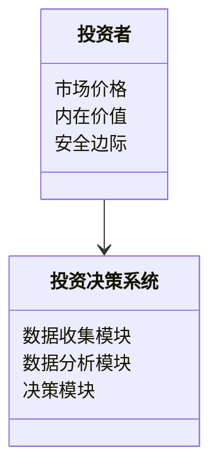
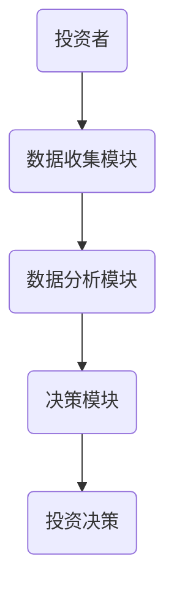
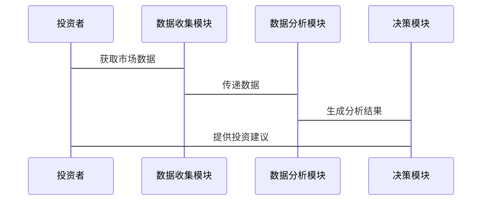

                 


# 巴菲特的行为金融学应用：利用市场非理性创造alpha

## 关键词：巴菲特，行为金融学，市场非理性，alpha，投资策略

## 摘要：本文探讨了巴菲特如何利用行为金融学中的市场非理性现象，通过逆向投资、安全边际等策略，捕捉市场定价偏差，从而创造超额收益（alpha）。文章从行为偏差的类型、巴菲特的核心投资理念、数学模型的应用以及实际案例分析等方面，系统地阐述了如何在金融市场中利用非理性因素实现投资目标。

---

# 第一部分: 背景介绍

## 第1章: 行为金融学与巴菲特投资理念概述

### 1.1 行为金融学的核心概念

#### 1.1.1 行为金融学的定义与研究对象
行为金融学（Behavioral Finance）是研究投资者心理与行为如何影响金融市场定价与决策的学科。它结合了心理学、经济学和金融学的理论，揭示了市场参与者的非理性行为如何导致价格偏离内在价值。

#### 1.1.2 市场非理性的表现形式
市场非理性主要表现为投资者的过度反应、羊群效应、从众心理等行为偏差。这些偏差会导致资产价格在短期内偏离其基本面价值，为长期投资者提供了套利机会。

#### 1.1.3 巴菲特与行为金融学的关联
巴菲特的价值投资理念与行为金融学的核心思想高度契合。他长期关注市场的非理性波动，认为市场的短期非理性定价为长期投资者提供了买入优质资产的机会。

### 1.2 巴菲特投资理念的核心要素

#### 1.2.1 价值投资的定义与特征
价值投资是一种以基本面分析为基础的投资策略，强调以低于内在价值的价格买入优质资产。其核心特征包括长期持有、注重安全边际和逆向投资。

#### 1.2.2 巴菲特的长期投资策略
巴菲特的投资策略强调长期视角，关注企业的内在价值，而非市场的短期波动。他认为市场的短期非理性定价为长期投资者提供了买入优质资产的机会。

#### 1.2.3 市场先生与投资者心理
市场先生（Mr. Market）是巴菲特提出的概念，用来描述市场的波动性和不可预测性。投资者应以市场先生的情绪波动为契机，进行逆向投资。

### 1.3 本章小结
本章介绍了行为金融学的核心概念和市场非理性的表现形式，同时分析了巴菲特的价值投资理念及其与行为金融学的关联，为后续分析奠定了基础。

---

# 第二部分: 行为偏差与市场机会

## 第2章: 行为偏差的类型与影响

### 2.1 行为偏差的分类

#### 2.1.1 行为偏差的常见类型
| 偏差类型 | 定义 | 表现 |
|----------|------|------|
| 认知偏差 | 由于信息处理错误导致的判断偏差 | 例如，过度自信、确认偏误 |
| 情绪偏差 | 由于情绪波动导致的投资决策偏差 | 例如，贪婪与恐惧 |

#### 2.1.2 认知偏差与情绪偏差的区别
认知偏差主要源于信息处理的错误，而情绪偏差则源于情绪波动对决策的影响。两者均会导致市场定价的非理性。

#### 2.1.3 市场中的典型行为偏差案例
例如，2008年全球金融危机中，投资者的恐慌性抛售导致资产价格严重低估，为巴菲特提供了买入机会。

### 2.2 行为偏差对市场定价的影响

#### 2.2.1 偏差如何导致市场非理性
行为偏差会导致投资者过度反应或反应不足，进而引起资产价格的偏离。

#### 2.2.2 非理性定价的特征与表现
非理性定价通常表现为资产价格的短期波动性增加，与企业基本面脱节。

#### 2.2.3 偏差的传染性与市场波动
行为偏差具有传染性，容易引发市场的羊群效应，加剧市场波动。

### 2.3 本章小结
本章分析了行为偏差的类型及其对市场定价的影响，强调了市场非理性现象为投资者带来的机会。

---

# 第三部分: 巴菲特的行为金融学策略

## 第3章: 巴菲特的市场非理性利用策略

### 3.1 价值陷阱的识别与规避

#### 3.1.1 价值陷阱的定义与特征
价值陷阱是指表面上看似便宜的资产，实际上由于内在价值较低或风险过高，难以带来长期收益。

#### 3.1.2 如何识别价值陷阱
1. **基本面分析**：评估企业的盈利能力、财务状况和行业前景。
2. **市场估值比较**：对比资产的市场估值与内在价值。

#### 3.1.3 避免价值陷阱的策略
巴菲特强调选择具有持续竞争优势和良好管理团队的企业，避免短期估值波动的影响。

### 3.2 市场先生的利用与应对

#### 3.2.1 市场先生的周期性
市场先生（Mr. Market）的波动性为投资者提供了买入优质资产的机会。

#### 3.2.2 如何利用市场先生的情绪波动
1. **逆向投资**：在市场恐慌时买入，在市场狂热时卖出。
2. **安全边际**：以低于内在价值的价格买入资产。

#### 3.2.3 市场恐慌与抄底机会
巴菲特在市场恐慌时大量买入优质资产，例如2008年金融危机期间。

### 3.3 逆向投资的原理与实践

#### 3.3.1 逆向投资的定义与核心要素
逆向投资是指在市场非理性时反向操作，利用市场偏差获取超额收益。

#### 3.3.2 逆向投资的实施步骤
1. **识别市场非理性**：通过基本面分析和市场估值比较，识别市场定价偏差。
2. **评估资产内在价值**：计算资产的内在价值，确定安全边际。
3. **实施逆向操作**：在市场恐慌时买入，在市场狂热时卖出。

#### 3.3.3 逆向投资的典型案例分析
例如，巴菲特在1999年互联网泡沫期间，选择持有传统企业，避免了泡沫破裂后的损失。

### 3.4 本章小结
本章分析了巴菲特如何利用市场非理性，通过逆向投资和安全边际策略，捕捉市场定价偏差，创造超额收益。

---

# 第四部分: 数学模型与投资决策

## 第4章: 投资决策的数学模型

### 4.1 市场非理性的量化指标

#### 4.1.1 市场估值的偏离度计算
市场估值偏离度可以通过比较资产的市场价格与内在价值来计算。

#### 4.1.2 安全边际的数学表达
安全边际 = 内在价值 - 市场价格

### 4.2 内在价值的计算公式

$$
\text{内在价值} = \frac{\text{现金流}}{\text{贴现率}}
$$

### 4.3 安全边际的应用示例

假设某企业的内在价值为100元，市场价格为80元，则安全边际为20元，提供了较高的投资价值。

### 4.4 本章小结
本章通过数学模型分析了市场非理性的量化指标，为投资者提供了量化工具，帮助识别市场定价偏差。

---

# 第五部分: 系统分析与架构设计

## 第5章: 投资决策系统的构建

### 5.1 问题场景介绍
投资者需要在复杂的市场环境中，利用行为金融学的理论，捕捉市场非理性，制定投资策略。

### 5.2 系统功能设计

#### 5.2.1 领域模型


#### 5.2.2 系统架构


### 5.3 系统接口设计
1. 数据收集模块：获取市场数据和企业基本面信息。
2. 数据分析模块：计算内在价值和安全边际。
3. 决策模块：根据分析结果生成投资决策。

### 5.4 系统交互流程



### 5.5 本章小结
本章通过系统架构设计，展示了如何利用行为金融学的理论，构建投资决策系统，帮助投资者捕捉市场非理性，制定科学的投资策略。

---

# 第六部分: 项目实战

## 第6章: 投资决策系统的实现

### 6.1 环境安装
需要安装Python、Pandas、NumPy等工具。

### 6.2 核心实现源代码

```python
import pandas as pd
import numpy as np

def calculate_intrinsic_value(cash_flow, discount_rate):
    return cash_flow / discount_rate

def calculate_margin_of_safety(intrinsic_value, market_price):
    return intrinsic_value - market_price

# 示例数据
cash_flow = 100
discount_rate = 0.1
market_price = 80

iv = calculate_intrinsic_value(cash_flow, discount_rate)
mos = calculate_margin_of_safety(iv, market_price)

print(f"内在价值: {iv}")
print(f"安全边际: {mos}")
```

### 6.3 代码应用解读与分析
上述代码计算了资产的内在价值和安全边际，帮助投资者识别市场定价偏差。

### 6.4 实际案例分析
以某企业为例，计算其内在价值和安全边际，评估其投资价值。

### 6.5 项目小结
本章通过实际案例分析，展示了如何利用行为金融学的理论和数学模型，实现投资决策系统的应用。

---

# 第七部分: 总结与展望

## 第7章: 总结与展望

### 7.1 本章总结
本文系统地探讨了巴菲特如何利用行为金融学中的市场非理性，通过逆向投资和安全边际策略，捕捉市场定价偏差，创造超额收益。

### 7.2 最佳实践 tips
1. 关注市场非理性现象，识别价值陷阱。
2. 以低于内在价值的价格买入优质资产。
3. 利用数学模型量化市场偏差，辅助投资决策。

### 7.3 注意事项
1. 避免盲目跟风，理性分析市场。
2. 长期投资，耐心持有优质资产。

### 7.4 拓展阅读
推荐阅读巴菲特的经典著作和行为金融学相关书籍。

### 7.5 本章小结
本章总结了全文的核心内容，提出了最佳实践建议，并展望了未来的研究方向。

---

通过以上目录结构，本文系统地分析了巴菲特的行为金融学应用，结合理论与实践，为投资者提供了科学的投资决策参考。

