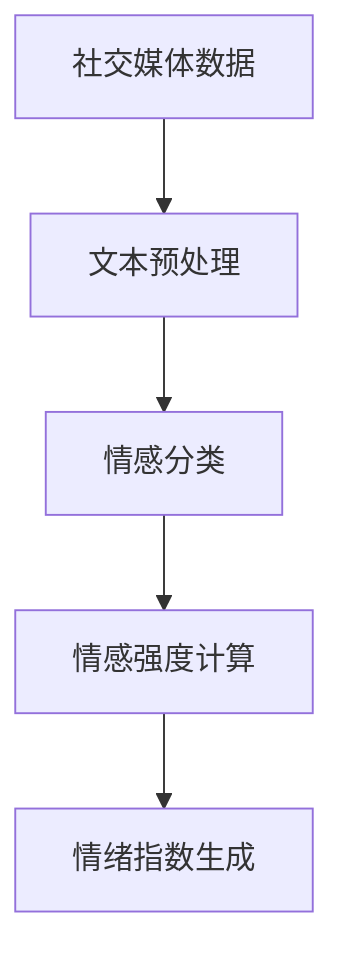
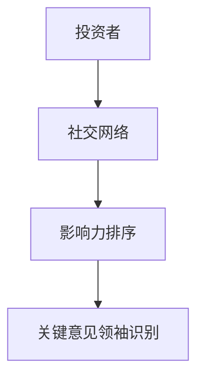
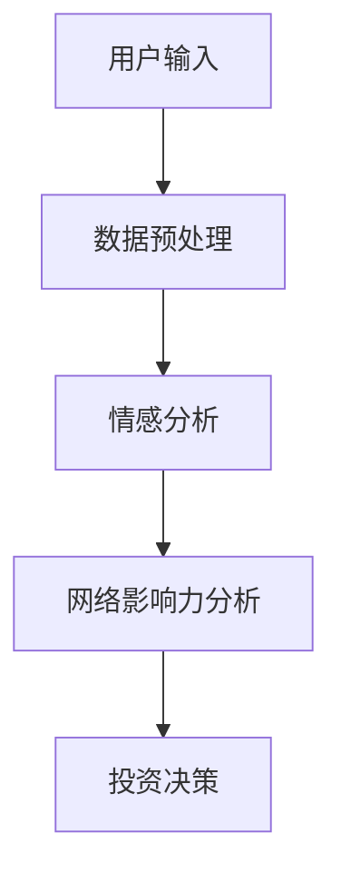

                 


# 巴菲特的行为金融学应用：社交媒体时代的群体投资心理

> 关键词：行为金融学，巴菲特，社交媒体，群体心理，投资策略，算法分析，系统设计

> 摘要：本文探讨了巴菲特的投资理念如何与行为金融学相结合，并分析了社交媒体时代对群体投资心理的影响。通过行为金融学的视角，文章揭示了社交媒体环境下投资者情绪波动的规律，结合算法分析和系统设计，提出了优化投资决策的新方法。

---

## 第一部分：行为金融学与巴菲特投资理念的结合

### 第1章：行为金融学的背景与核心概念

#### 1.1 行为金融学的定义与核心假设
行为金融学研究投资者心理和行为对金融决策的影响。其核心假设包括：
- **有限理性**：投资者无法完全理性，决策受认知偏差影响。
- **情绪驱动**：市场情绪波动影响价格，而非仅由基本面决定。
- **社会影响**：投资者行为受群体和社会环境影响。

#### 1.2 投资者心理与行为分析
- **理性与非理性决策**：理性决策基于逻辑，非理性受情绪和认知偏差驱动。
- **市场情绪波动**：市场情绪周期性波动，影响资产价格。
- **羊群效应**：投资者模仿他人行为，导致市场波动加剧。

#### 1.3 巴菲特投资理念概述
- **价值投资**：寻找被市场低估的企业，长期持有。
- **长期视角**：关注企业的内在价值，而非短期价格波动。
- **逆向思维**：在市场恐慌时买入，市场狂热时卖出。

---

### 第2章：社交媒体时代群体投资心理的特征

#### 2.1 社交媒体对投资者行为的影响
- **信息传播机制**：社交媒体加速信息传播，放大市场情绪。
- **情绪传染**：投资者受社交媒体影响，产生从众心理。
- **信息过载**：大量信息导致投资者决策疲劳。

#### 2.2 群体投资心理的形成机制
- **网络效应**：社交媒体上的讨论影响投资者决策。
- **舆论领袖影响**：关键人物的意见放大市场情绪。
- **反馈循环**：市场走势反过来影响社交媒体上的讨论。

---

## 第二部分：行为金融学的算法与系统分析

### 第3章：基于自然语言处理的情绪分析算法

#### 3.1 情绪分析算法原理
- **文本预处理**：去除停用词，提取关键词。
- **情感分类**：使用机器学习模型（如SVM、随机森林）对文本进行情感分类。
- **情感强度计算**：量化文本中情绪的强度。

#### 3.2 社交媒体数据的情感分析流程


#### 3.3 情绪指数的应用
- **市场情绪预测**：通过情绪指数预测市场走势。
- **投资决策辅助**：结合情绪指数优化投资策略。

---

### 第4章：社交媒体网络影响力分析

#### 4.1 网络影响力分析方法
- **社交网络分析**：构建投资者社交网络，识别关键节点。
- **影响力排序**：使用PageRank算法评估投资者影响力。

#### 4.2 网络影响力分析的实现


#### 4.3 网络影响力对投资决策的影响
- **舆论引导**：关键意见领袖影响市场情绪。
- **投资机会发现**：通过网络影响力发现新兴投资机会。

---

## 第三部分：系统设计与项目实战

### 第5章：社交媒体数据监测系统设计

#### 5.1 系统功能设计
- **数据收集模块**：实时采集社交媒体数据。
- **情感分析模块**：对数据进行情感分析。
- **网络影响力分析模块**：识别关键意见领袖。
- **市场反馈模块**：根据情绪指数调整投资策略。

#### 5.2 系统架构设计


#### 5.3 系统实现代码示例
```python
import pandas as pd
from sklearn.feature_extraction.text import TfidfVectorizer
from sklearn.svm import SVC

# 数据预处理
def preprocess(text):
    return text.lower().replace(',', ' ')

# 情感分类
vectorizer = TfidfVectorizer(max_features=5000)
X = vectorizer.fit_transform(data['text'])
y = data['label']

# 训练模型
model = SVC()
model.fit(X, y)
```

---

### 第6章：项目实战与案例分析

#### 6.1 实战背景
- **市场事件**：选择一个特定的市场事件，如科技股回调。
- **数据来源**：收集社交媒体上与该事件相关的讨论数据。

#### 6.2 情绪指数计算与分析
- **数据清洗**：去除无关信息，提取与事件相关的文本。
- **情感分类**：计算事件期间的市场情绪指数。
- **结果分析**：分析情绪指数与市场走势的相关性。

#### 6.3 投资策略优化
- **情绪驱动投资**：根据情绪指数调整投资策略。
- **风险控制**：结合情绪指数进行风险预警。

---

## 第四部分：总结与最佳实践

### 第7章：总结与投资策略建议

#### 7.1 总结
- 巴菲特的投资理念与行为金融学相结合，提供了新的视角。
- 社交媒体时代，投资者情绪波动更加复杂，需要新的工具和方法。

#### 7.2 投资策略建议
- **长期视角**：坚持价值投资，避免短期情绪波动干扰。
- **情绪监控**：利用社交媒体情绪指数优化投资决策。
- **独立思考**：避免从众心理，理性分析市场信息。

#### 7.3 注意事项
- **数据质量**：确保数据来源可靠，避免虚假信息。
- **模型优化**：持续优化算法，提高情绪分析准确性。
- **风险管理**：结合情绪指数进行风险控制，避免过度投资。

---

## 第五部分：拓展阅读与深入学习

### 第8章：深入学习与未来方向

#### 8.1 深入学习方向
- **复杂网络分析**：研究社交媒体网络的复杂性。
- **强化学习应用**：将强化学习应用于投资决策优化。
- **实时数据分析**：开发实时情绪监测系统。

#### 8.2 拓展阅读
- 推荐书籍：《行为金融学》、《巴菲特投资策略》。
- 推荐论文：社交媒体与金融市场情绪研究。

---

## 结语

通过本文的分析，我们看到行为金融学与巴菲特投资理念的结合，为投资者提供了新的工具和视角。社交媒体时代的群体投资心理分析，帮助投资者更好地理解和应对市场情绪波动。未来，随着技术的进步，行为金融学在投资领域的应用将更加广泛和深入。

---

**感谢您的阅读！希望本文对您理解巴菲特的投资理念和社交媒体时代的投资心理有所帮助。**

