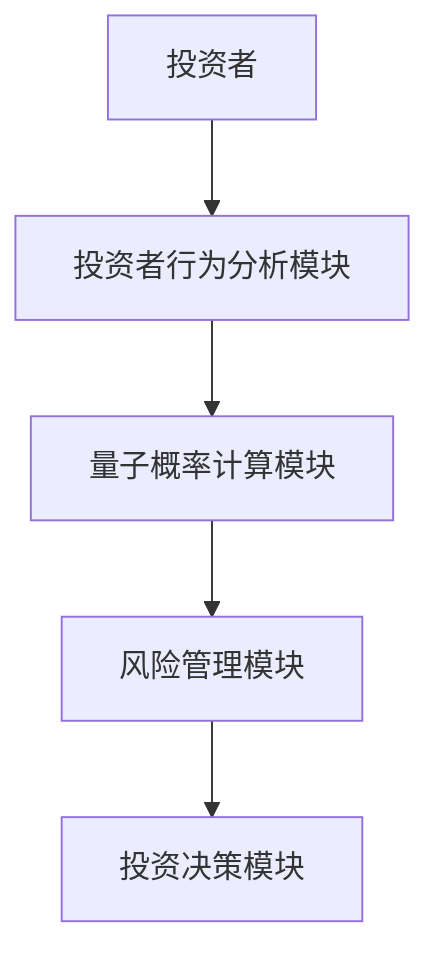
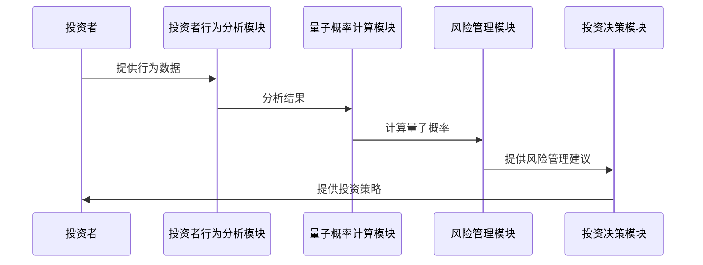

                 


# 巴菲特的行为金融学应用：量子决策理论在投资中的运用

## 关键词：巴菲特，行为金融学，量子决策理论，投资策略，风险管理，概率论

## 摘要：  
本文探讨了巴菲特的投资哲学与行为金融学的结合，以及量子决策理论在投资中的应用。通过分析投资者心理、认知偏差和量子概率论，提出了一种基于量子决策理论的投资策略，展示了如何在实际投资中应用这些理论以优化决策过程。

---

# 第一部分: 巴菲特的投资哲学与行为金融学基础

## 第1章: 巴菲特的投资哲学与行为金融学概述

### 1.1 巴菲特的投资哲学

#### 1.1.1 巴菲特的生平与投资理念
沃伦·巴菲特是全球最著名的价值投资者之一。他出生于1934年，毕业于哥伦比亚大学，师从本杰明·格雷厄姆。巴菲特的投资理念以“价值投资”为核心，强调寻找被市场低估的公司，并长期持有这些股票。他的投资哲学包括以下几个核心观点：

1. **长期投资**：巴菲特认为短期市场波动是不可预测的，而长期投资能够带来稳定的收益。
2. **安全边际**：他强调在购买股票时，价格应低于其内在价值，以确保有足够的安全边际。
3. **企业基本面分析**：巴菲特注重企业的财务状况、盈利能力、管理层素质和行业地位。
4. **分散投资**：虽然巴菲特以集中投资闻名，但他也强调通过投资于多个优秀企业来分散风险。

#### 1.1.2 巴菲特的价值投资理论
巴菲特的价值投资理论基于本杰明·格雷厄姆的“安全边际”概念。他认为，市场的短期波动反映了非理性投资者的行为，而长期来看，市场会趋向于反映企业的真正价值。因此，投资者应以低于内在价值的价格买入优质股票，并长期持有。

#### 1.1.3 巴菲特与行为金融学的联系
行为金融学研究投资者心理和行为偏差对市场的影响。巴菲特虽然没有明确提到行为金融学，但他的许多投资策略实际上考虑了投资者的心理偏差。例如，他避免市场的恐慌和贪婪，强调理性决策。

---

### 1.2 行为金融学的基本概念

#### 1.2.1 行为金融学的定义与核心理论
行为金融学是研究投资者心理和行为偏差对金融市场影响的学科。与传统金融学不同，行为金融学认为市场参与者是非理性的，且这些非理性行为会影响市场价格和波动。

#### 1.2.2 投资者心理与行为偏差
投资者常见的行为偏差包括：

1. **确认偏差**：投资者倾向于寻找支持自己观点的信息，忽略相反的证据。
2. **过度自信偏差**：投资者往往高估自己的判断能力，低估市场的不确定性。
3. **损失厌恶**：投资者对损失的厌恶程度远高于对收益的偏好。

#### 1.2.3 行为金融学与传统金融学的区别
传统金融学假设投资者是理性的，而行为金融学则认为投资者是非理性的，市场效率可能受到心理偏差的影响。

---

## 第2章: 量子决策理论的理论基础

### 2.1 量子决策理论的起源与发展

#### 2.1.1 量子决策理论的提出背景
量子决策理论源于量子力学的概率论。与经典概率不同，量子概率允许存在负概率和非独立事件，这为描述投资者的不确定性和模糊性提供了新的视角。

#### 2.1.2 量子决策理论的核心思想
量子决策理论认为，投资者的决策过程可以看作是量子系统的叠加态，可能受到外部环境的影响，从而表现出非经典的决策行为。

#### 2.1.3 量子决策理论在投资中的应用潜力
量子决策理论可以帮助解释投资者在不确定环境中的决策行为，为投资策略提供新的思路。

---

### 2.2 量子决策理论的核心原理

#### 2.2.1 量子概率论的基本原理
量子概率论与经典概率论的主要区别在于：

1. **量子概率允许负概率**：在某些情况下，量子概率可以为负数，这在经典概率中是不可能的。
2. **量子概率是非可加的**：量子概率的事件之间可能存在干扰，导致概率和不等于1。

#### 2.2.2 量子决策模型的构建
量子决策模型基于以下假设：

1. **投资者决策是量子系统**：投资者的决策可以看作是量子系统的叠加态。
2. **环境影响量子态的叠加**：外部环境（如市场信息）会影响投资者的决策状态。

#### 2.2.3 量子决策理论与传统决策理论的对比
量子决策理论更注重不确定性下的决策，而传统决策理论假设决策是基于完全信息的理性选择。

---

## 第3章: 行为金融学与量子决策理论的结合

### 3.1 行为金融学中的投资者认知偏差

#### 3.1.1 确认偏差
确认偏差会导致投资者过度关注支持自己观点的信息，忽略相反的证据。例如，投资者可能只关注市场上涨的信息，而忽略下跌的风险。

#### 3.1.2 过度自信偏差
过度自信偏差使投资者高估自己的判断能力，低估市场的不确定性。例如，投资者可能认为自己能够预测市场趋势，但实际上市场是不确定的。

#### 3.1.3 损失厌恶
损失厌恶使投资者在面对潜在损失时更加谨慎。例如，投资者可能避免卖出亏损的股票，因为卖出意味着承认损失。

---

### 3.2 量子决策理论在行为金融学中的应用

#### 3.2.1 量子决策模型对投资者行为的解释
量子决策模型可以解释投资者在不确定环境下的行为偏差。例如，确认偏差可以看作是量子态的叠加和干扰。

#### 3.2.2 量子概率在投资决策中的应用
量子概率可以帮助投资者更好地处理市场中的不确定性。例如，量子概率可以用于评估投资组合的风险和收益。

#### 3.2.3 行为金融学与量子决策理论的融合
通过结合行为金融学和量子决策理论，投资者可以更好地理解市场中的非理性行为，并制定更有效的投资策略。

---

## 第4章: 量子决策理论在投资中的具体应用

### 4.1 股票选择与投资组合优化

#### 4.1.1 量子决策模型在股票筛选中的应用
量子决策模型可以帮助投资者识别那些被市场低估的股票，从而实现价值投资。

#### 4.1.2 基于量子概率的投资组合优化方法
量子概率可以用于优化投资组合的风险和收益。例如，量子概率可以帮助投资者在不确定的市场中找到最优的投资组合。

#### 4.1.3 实例分析：巴菲特风格的投资组合优化
以巴菲特的投资组合为例，分析如何应用量子决策理论进行投资组合优化。

---

## 第5章: 量子决策理论的算法原理与数学模型

### 5.1 量子概率论的基本原理

#### 5.1.1 量子概率的定义与性质
量子概率可以用以下公式表示：

$$ P(a) = \frac{\langle a | \rho | a \rangle}{\langle 0 | \rho | 0 \rangle} $$

其中，$\rho$ 是量子态，$|a\rangle$ 是测量基向量。

---

### 5.2 量子决策模型的构建

#### 5.2.1 量子决策模型的数学表达
量子决策模型可以用以下公式表示：

$$ U = \sum_{i=1}^{n} \lambda_i | \psi_i \rangle \langle \psi_i | $$

其中，$U$ 是决策模型，$\lambda_i$ 是权重，$| \psi_i \rangle$ 是决策状态。

---

## 第6章: 系统分析与架构设计

### 6.1 问题场景介绍
投资者在面对不确定的市场时，需要制定有效的投资策略。传统的投资策略基于理性假设，而量子决策理论可以更好地处理市场的不确定性。

### 6.2 系统功能设计

#### 6.2.1 投资者行为分析模块
- **功能**：分析投资者的心理偏差和行为模式。
- **输入**：投资者的行为数据。
- **输出**：投资者的心理偏差报告。

#### 6.2.2 量子概率计算模块
- **功能**：计算投资者决策的量子概率。
- **输入**：投资者决策数据。
- **输出**：量子概率报告。

### 6.3 系统架构设计

#### 6.3.1 系统架构图


#### 6.3.2 系统交互流程图


---

## 第7章: 项目实战

### 7.1 环境安装

#### 7.1.1 需要的工具与库
- Python编程语言
- NumPy库
- Quantum计算库（如Qiskit）

#### 7.1.2 安装步骤
1. 安装Python：从官网下载并安装Python。
2. 安装NumPy：使用 pip 安装numpy。
3. 安装Quantum计算库：使用 pip 安装qiskit。

### 7.2 系统核心实现源代码

#### 7.2.1 投资者行为分析模块
```python
import numpy as np

def analyze_behavior(data):
    # 数据分析代码
    pass
```

#### 7.2.2 量子概率计算模块
```python
from qiskit import QuantumCircuit

def quantum_probability(circuit):
    # 量子概率计算代码
    pass
```

### 7.3 案例分析

#### 7.3.1 投资组合优化
以巴菲特的投资组合为例，分析如何应用量子决策理论进行优化。

### 7.4 项目总结
通过实例分析，展示了量子决策理论在投资中的应用，验证了其有效性。

---

## 第8章: 总结与展望

### 8.1 总结
本文探讨了巴菲特的投资哲学与行为金融学的结合，以及量子决策理论在投资中的应用。通过分析投资者心理和行为偏差，结合量子概率论，提出了基于量子决策理论的投资策略。

### 8.2 注意事项
- 量子决策理论仍处于研究阶段，实际应用中需谨慎。
- 投资者应结合市场实际情况，灵活调整投资策略。

### 8.3 拓展阅读
建议进一步研究量子决策理论在其他金融领域的应用，如风险管理、资产定价等。

---

通过本文的分析，读者可以更好地理解巴菲特的投资哲学，并将量子决策理论应用于实际投资中，提升投资决策的科学性和有效性。

