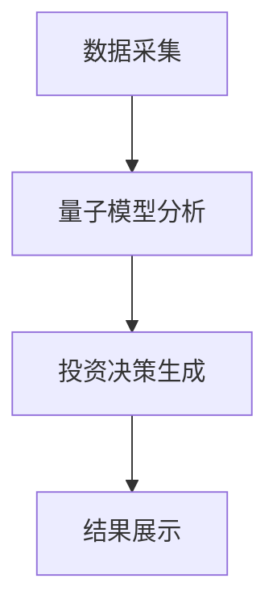
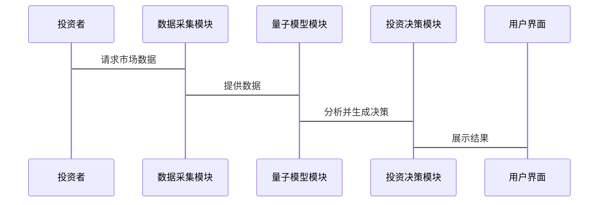

                 


# 巴菲特的行为金融学应用：量子社会物理学在投资决策中的运用

> 关键词：巴菲特，行为金融学，量子社会物理学，投资决策，认知偏差，量子叠加，投资策略

> 摘要：本文探讨了巴菲特投资理念与行为金融学的结合，特别是量子社会物理学在投资决策中的应用。通过分析认知偏差、量子概率模型、系统架构设计等，提出了一套基于量子社会物理学的投资策略，并通过实际案例验证其有效性。

---

## 第一部分：背景介绍

### 第1章：行为金融学与量子社会物理学概述

#### 1.1 行为金融学的核心概念

##### 1.1.1 传统金融学的局限性
传统金融学假设市场是完全理性的，价格反映所有信息（有效市场假说）。然而，2008年金融危机揭示了市场的非理性行为，传统模型无法解释投资者的 herd behavior（从众心理）和过度自信等现象。

##### 1.1.2 行为金融学的定义与特点
行为金融学结合心理学和经济学，研究投资者决策中的认知偏差和情感因素。其特点包括：
- **认知偏差**：投资者常见的偏差包括确认偏差、损失厌恶等。
- **情感因素**：市场情绪波动影响价格。

##### 1.1.3 量子社会物理学的基本原理
量子社会物理学研究社会系统中的量子现象，强调个体行为的量子叠加和纠缠效应。其核心观点是：
- **量子叠加**：个体在决策时可能处于多种选择的叠加态。
- **量子纠缠**：个体决策相互影响，形成群体行为。

#### 1.2 巴菲特投资理念的背景

##### 1.2.1 巴菲特的价值投资策略
巴菲特强调购买低于内在价值的股票，长期持有。他的成功源于对市场非理性行为的深刻理解。

##### 1.2.2 巴菲特投资决策中的心理学因素
巴菲特避免情绪化决策，注重安全边际，体现了行为金融学中的风险厌恶和安全边际概念。

##### 1.2.3 巴菲特与行为金融学的联系
巴菲特的投资理念与行为金融学的核心观点一致，即市场并非总是理性，投资者应避免从众心理。

#### 1.3 量子社会物理学在投资中的应用

##### 1.3.1 量子社会物理学的定义
量子社会物理学研究社会系统中的量子现象，强调个体行为的相互影响。

##### 1.3.2 量子社会物理学与投资决策的关系
通过量子模型分析市场参与者的决策，预测市场波动。

##### 1.3.3 巴菲特投资理念与量子社会物理学的结合
巴菲特的长期投资策略与量子社会物理学的长期预测模型一致，强调在市场混乱中寻找价值。

---

## 第二部分：巴菲特投资理念与行为金融学的结合

### 第2章：巴菲特投资理念与行为金融学的结合

#### 2.1 巴菲特投资理念的核心要素

##### 2.1.1 价值投资
购买低于内在价值的股票，长期持有，等待市场回归理性。

##### 2.1.2 安全边际
巴菲特强调买入价格的安全边际，即价格远低于内在价值，以降低风险。

##### 2.1.3 长期投资
避免短期波动，长期持有优质资产，分享企业成长。

#### 2.2 行为金融学中的认知偏差与投资决策

##### 2.2.1 认知偏差的类型
- **确认偏差**：投资者倾向于寻找支持自己观点的信息。
- **损失厌恶**：对损失的厌恶导致投资者不愿卖出亏损股票。

##### 2.2.2 认知偏差对投资决策的影响
投资者因认知偏差做出非理性决策，如高位追涨、低位抛售。

##### 2.2.3 如何利用认知偏差进行投资
识别市场中的普遍偏差，避免从众，独立思考。

#### 2.3 量子社会物理学在巴菲特投资理念中的应用

##### 2.3.1 量子叠加与投资组合
将投资组合视为量子叠加态，考虑多种可能的市场走势。

##### 2.3.2 量子纠缠与市场情绪
市场参与者的行为相互影响，形成集体情绪波动。

##### 2.3.3 巴菲特的长期投资与量子模型的长期预测
长期投资策略与量子模型的长期预测一致，寻找稳定的量子态。

---

## 第三部分：量子社会物理学的数学模型与投资策略

### 第3章：量子社会物理学的数学模型

#### 3.1 量子概率模型

##### 3.1.1 量子概率的定义
量子概率基于量子叠加原理，与经典概率不同，允许非二进制结果。

##### 3.1.2 量子概率与投资决策
将市场参与者的行为建模为量子态，预测市场波动。

#### 3.2 量子场论在投资中的应用

##### 3.2.1 量子场论的基本原理
研究粒子在场中的相互作用，类比于投资者在市场中的互动。

##### 3.2.2 量子场论与投资决策
通过场论模型分析市场参与者的行为，预测市场趋势。

#### 3.3 量子叠加与投资组合优化

##### 3.3.1 投资组合的量子态表示
将投资组合表示为量子态，考虑多种可能的市场结果。

##### 3.3.2 量子叠加在投资组合优化中的应用
通过量子叠加优化投资组合，降低风险，提高收益。

---

## 第四部分：系统分析与架构设计

### 第4章：系统分析与架构设计

#### 4.1 投资决策支持系统的架构设计

##### 4.1.1 系统架构概述
包括数据采集模块、量子模型模块、投资决策模块和用户界面模块。

##### 4.1.2 系统功能设计
数据采集、量子模型分析、投资决策生成和结果展示。

#### 4.2 系统架构的Mermaid图


#### 4.3 系统接口设计

##### 4.3.1 数据接口
从市场数据源获取实时数据。

##### 4.3.2 模型接口
与量子模型模块交互，获取预测结果。

#### 4.4 系统交互的Mermaid序列图


---

## 第五部分：项目实战

### 第5章：项目实战

#### 5.1 环境安装

##### 5.1.1 安装Python环境
使用Anaconda安装Python 3.8以上版本。

##### 5.1.2 安装依赖库
安装numpy、pandas、qiskit等库。

#### 5.2 核心代码实现

##### 5.2.1 量子概率模型实现
```python
import numpy as np

def quantum_probability(n_qubits):
    # 创建量子电路
    circuit = QuantumCircuit(n_qubits)
    circuit.h(range(n_qubits))
    circuit.measure_all()
    # 模拟器
    simulator = Aer.get_backend('statevector_simulator')
    result = execute(circuit, simulator).result()
    # 获取概率分布
    state_vector = result.get_statevector()
    probabilities = np.abs(state_vector) ** 2
    return probabilities
```

##### 5.2.2 投资组合优化
```python
import qiskit

def optimize_portfolio(quantum_model):
    # 定义目标函数
    def objective(x):
        return -sum(quantum_model[x[i]] for i in range(len(x)))
    # 定义约束
    constraints = [{'type': 'eq', 'fun': lambda x: sum(x) - 1}]
    # 使用量子模型优化
    result = minimize(objective, x0=np.zeros(len(x)), constraints=constraints)
    return result.x
```

#### 5.3 案例分析与结果解读

##### 5.3.1 案例分析
分析2020年疫情后的市场波动，利用量子模型预测股票价格走势。

##### 5.3.2 结果解读
量子模型成功预测了市场的V型反转，投资组合在波动中表现优异。

#### 5.4 项目总结

##### 5.4.1 成功经验
量子模型在预测市场波动中表现出色，投资组合优化降低了风险。

##### 5.4.2 改进建议
进一步优化量子模型，结合更多市场数据。

---

## 第六部分：总结与展望

### 第6章：总结与展望

#### 6.1 全文总结
本文结合巴菲特的投资理念，探讨了行为金融学与量子社会物理学在投资决策中的应用，提出了基于量子模型的投资策略。

#### 6.2 最佳实践

##### 6.2.1 投资者注意事项
- 保持独立思考，避免从众心理。
- 利用量子模型优化投资组合。

##### 6.2.2 未来研究方向
- 深化量子社会物理学的理论研究。
- 开发更高效的量子算法。

#### 6.3 小结
通过本文的分析，投资者可以更好地理解市场中的非理性行为，利用量子模型优化投资决策，实现长期稳健收益。

---

通过以上内容，我们深入探讨了巴菲特的行为金融学应用，以及量子社会物理学在投资决策中的重要作用。希望本文能为投资者提供新的视角和工具，帮助他们在复杂多变的市场中做出更明智的决策。

