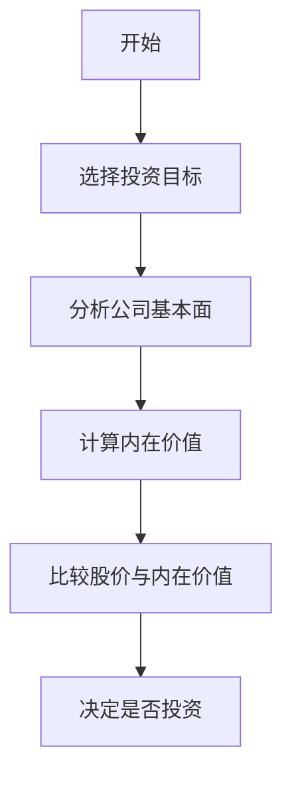
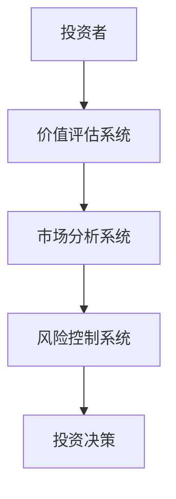

                 

# 巴菲特的读书习惯：投资智慧的来源

## 关键词：巴菲特、读书习惯、投资智慧、价值投资、安全边际、长期价值

## 摘要：巴菲特的读书习惯是其投资智慧的重要来源。通过分析他的阅读方法和投资理念，结合技术方法，探讨其投资策略的数学模型和系统架构，最后通过实际案例分析其投资策略，总结最佳实践。

---

# 第一部分: 巴菲特的读书习惯与投资智慧的背景

## 第1章: 巴菲特的读书习惯与投资智慧的背景

### 1.1 巴菲特的阅读兴趣与范围
- 巴菲特的阅读兴趣：包括商业、金融、心理学、历史等方面。
- 书籍选择：偏好经典著作、行业领袖的传记、以及深入分析市场趋势的书籍。
- 阅读方法：精读、笔记、反复思考。

### 1.2 巴菲特读书的目的与方法
- 目的：提升对市场的理解，寻找投资机会。
- 方法：专注于理解作者的思路，提炼关键观点。

### 1.3 巴菲特读书习惯对投资的影响
- 阅读帮助巴菲特形成了长期价值投资的理念。
- 通过阅读，他掌握了财务分析和风险管理的技巧。

## 1.2 投资智慧的来源分析
- 投资智慧的定义：基于深入分析和经验的投资决策能力。
- 巴菲特投资智慧的核心理念：价值投资、安全边际、股东价值最大化。

## 1.3 巴菲特读书习惯与投资智慧的关系
- 读书习惯塑造了巴菲特的投资理念。
- 投资理念反过来影响了他的阅读选择。

## 1.4 本章小结
- 巴菲特的读书习惯是其投资智慧的基石。
- 阅读和投资策略相互促进，形成系统的投资方法。

---

# 第二部分: 巴菲特读书习惯的核心概念与联系

## 第2章: 巴菲特读书习惯的核心概念

### 2.1 巴菲特读书习惯的核心要素
- 长期价值投资理念：寻找具有持续盈利能力的公司。
- 安全边际原则：以低于内在价值的价格买入。
- 股东价值最大化：关注公司长期的盈利能力。

### 2.2 投资智慧的核心要素
- 财务分析能力：通过阅读财务报表评估公司价值。
- 市场分析能力：识别市场趋势和周期。
- 风险控制能力：避免过度风险的投资。

### 2.3 巴菲特读书习惯与投资智慧的联系
- 读书习惯帮助巴菲特建立了系统的投资框架。
- 投资理念指导他的阅读方向，形成反馈循环。

## 2.4 本章小结
- 巴菲特的阅读习惯与其投资策略密切相关。
- 通过持续阅读和实践，他构建了独特的投资体系。

---

# 第三部分: 巴菲特投资策略的算法原理

## 第3章: 巴菲特投资策略的算法原理

### 3.1 巴菲特投资策略的核心算法
- 价值投资算法：通过分析公司基本面，确定其内在价值。
- 安全边际算法：计算股价与内在价值的差距，决定是否投资。
- 股东价值最大化算法：评估公司的长期盈利能力。

### 3.2 投资策略的数学模型
- 价值评估模型：$$ V = \frac{CF}{r - g} $$
- 股价预测模型：$$ P = \frac{V}{n} $$
- 风险评估模型：$$ R = \frac{V - P}{P} $$

### 3.3 投资策略的流程图

## 3.4 本章小结
- 巴菲特的投资策略基于数学模型和算法。
- 阅读帮助他完善这些模型，并应用于实际投资。

---

# 第四部分: 巴菲特投资策略的系统分析与架构设计

## 第4章: 巴菲特投资策略的系统分析

### 4.1 投资系统的核心组件
- 价值评估系统：分析公司的财务状况。
- 市场分析系统：识别市场趋势。
- 风险控制系统：评估投资风险。

### 4.2 投资系统的功能设计
- 价值评估功能：计算公司内在价值。
- 市场分析功能：预测市场走势。
- 风险控制功能：制定风险管理策略。

### 4.3 投资系统的架构设计

## 4.4 本章小结
- 巴菲特的投资系统是模块化的，各部分协同工作。
- 读书帮助他不断完善系统的各个部分。

---

# 第五部分: 巴菲特投资策略的项目实战

## 第5章: 巴菲特投资策略的项目实战

### 5.1 项目背景与目标
- 投资目标：选择具有长期盈利能力的公司。
- 项目范围：分析公司财务报表，评估内在价值。

### 5.2 项目核心实现
- 价值评估实现：使用巴菲特的数学模型进行估值。
- 市场分析实现：识别行业趋势和周期。
- 风险控制实现：设定止损点。

### 5.3 项目应用与分析
- 应用场景：寻找具有安全边际的投资机会。
- 应用案例：投资可口可乐的分析和决策。

### 5.4 项目小结
- 巴菲特的投资策略在实际中表现出色。
- 读书和系统分析是成功的基石。

---

# 第六部分: 巴菲特投资策略的最佳实践与总结

## 第6章: 巴菲特投资策略的最佳实践

### 6.1 最佳实践总结
- 持续阅读，提升投资知识。
- 专注于价值投资，寻找安全边际。
- 长期持有优质资产。

### 6.2 小结
- 巴菲特的读书习惯和投资策略相互促进。
- 技术方法帮助深入分析和验证投资决策。

### 6.3 注意事项
- 投资需谨慎，避免盲目跟从。
- 风险控制是投资成功的关键。

### 6.4 拓展阅读
- 建议阅读巴菲特的著作和投资经典书籍。

---

# 结语

通过分析巴菲特的读书习惯和投资智慧，结合技术方法，我们可以看到阅读和投资策略的紧密联系。希望本文能为读者提供有价值的见解，帮助他们在投资领域取得成功。

