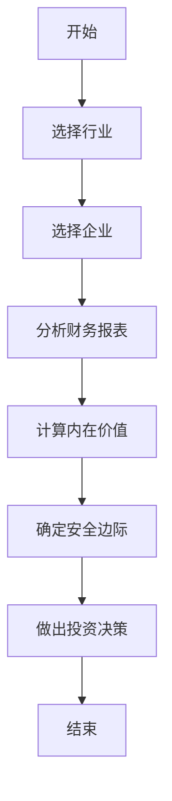

                 


# 巴菲特的读财报方法

## 关键词：巴菲特、价值投资、财务报表、安全边际、投资分析、投资策略

## 摘要：本文深入解析了巴菲特的财务报表分析方法，探讨了其价值投资理念的核心要素，包括安全边际和管理层分析，结合实际案例，揭示如何通过财报分析做出明智投资决策。

---

## 第一部分：背景介绍

### 第1章：投资与财报分析的背景

#### 1.1 投资的基本概念

- **投资的定义**：投资是将资源（资金、时间、精力）投入到某个项目或企业，期望获得超过初始投入的回报。
- **投资的分类**：包括股票、债券、房地产等多种形式。
- **投资的特点**：具有风险性、收益性、流动性等特点。

#### 1.2 财务报表的基本概念

- **财务报表的构成**：
  - 资产负债表：记录企业在某一特定日期的资产、负债和所有者权益。
  - 利润表：展示企业在一定会计期间内的收入、费用和利润。
  - 现金流量表：反映企业在一定会计期间内的现金流入和流出情况。

- **财务报表的用途**：
  - 评估企业的财务状况、经营成果和现金流量。
  - 帮助投资者做出投资决策。

- **财务报表的分析方法**：
  - 横向比较：分析同一企业在不同期间的财务数据。
  - 纵向比较：分析行业内的企业财务数据。
  - 趋势分析：预测企业未来财务状况。

#### 1.3 巴菲特投资理念的背景

- **巴菲特的投资风格**：
  - 价值投资：寻找被市场低估的企业，长期持有，获得企业成长带来的收益。
  - 集中投资：集中投资于少数优质企业，减少风险。

- **巴菲特投资理念的核心思想**：
  - 企业基本面分析是投资的核心。
  - 强调安全边际，即买入价格低于内在价值。
  - 长期持有优质企业股票。

- **巴菲特与财报分析的关系**：
  - 巴菲特通过深入分析财务报表，评估企业的财务状况和盈利能力。
  - 财务报表分析是巴菲特价值投资的重要工具。

---

## 第二部分：巴菲特的分析框架

### 第2章：巴菲特的分析框架

#### 2.1 投资理念与分析框架

- **价值投资的核心**：
  - 买入价格低于内在价值。
  - 长期持有优质企业。

- **分析框架的组成部分**：
  - 企业基本面分析：包括财务状况、盈利能力、竞争优势等。
  - 行业分析：了解行业地位和前景。
  - 管理层分析：评估管理层的诚信和能力。

- **分析框架的步骤**：
  1. 选择行业：选择具有长期增长潜力的行业。
  2. 选择企业：寻找具有竞争优势、财务健康的企业。
  3. 评估价值：计算内在价值，确定安全边际。
  4. 长期持有：耐心等待价值实现。

#### 2.2 财务报表分析的基本方法

- **财务报表分析的步骤**：
  1. 了解企业的财务状况：通过资产负债表分析资产、负债和所有者权益。
  2. 评估企业的盈利能力：通过利润表分析收入、费用和利润。
  3. 评估企业的现金流量：通过现金流量表分析现金流入和流出。

- **财务报表分析的关键指标**：
  - 资产负债率：衡量企业的财务杠杆。
  - 净利润率：衡量企业的盈利能力。
  - 现金流量：衡量企业的现金流健康状况。

- **财务报表分析的误区**：
  - 过于关注短期数据，忽视长期趋势。
  - 忽略行业特点，用统一标准分析不同行业。
  - 仅关注财务数据，忽视非财务因素。

#### 2.3 安全边际的概念

- **安全边际的定义**：
  - 安全边际 = 内在价值 - 市场价格。
  - 买入价格低于内在价值，确保投资的安全性。

- **安全边际的计算方法**：
  - 通过DCF模型计算企业的内在价值。
  - 比较市场价格与内在价值，确定安全边际。

- **安全边际在投资中的应用**：
  - 确保投资的安全性，减少市场波动带来的影响。
  - 提供缓冲区，避免市场估值过高带来的损失。

---

## 第三部分：核心概念与联系

### 第3章：核心概念与联系

#### 3.1 财务报表的核心概念

- **资产、负债、所有者权益的概念**：
  - 资产：企业拥有的资源，能够为企业创造价值。
  - 负债：企业欠款，需要在未来偿还。
  - 所有者权益：企业净资产，等于资产减去负债。

- **收入、费用、利润的概念**：
  - 收入：企业在一定会计期间内通过销售商品或服务获得的总收入。
  - 费用：企业在经营过程中发生的各项支出。
  - 利润：收入减去费用后的净收益。

- **现金流量的概念**：
  - 现金流入：企业通过销售商品、提供服务或其他活动获得的现金。
  - 现金流出：企业为了购买商品、支付费用或其他用途而支出的现金。

#### 3.2 核心概念的对比表格

| **概念**   | **定义**                                                                 |
|------------|--------------------------------------------------------------------------|
| 资产       | 企业拥有的资源，能够为企业创造价值。                                       |
| 负债       | 企业欠款，需要在未来偿还。                                                 |
| 所有者权益 | 企业净资产，等于资产减去负债。                                             |
| 收入       | 企业在一定会计期间内通过销售商品或服务获得的总收入。                       |
| 费用       | 企业在经营过程中发生的各项支出。                                         |
| 利润       | 收入减去费用后的净收益。                                                   |

#### 3.3 ER实体关系图

```mermaid
erd
    企业
    资产
    负债
    所有者权益
    收入
    费用
    利润
    现金流量
    财务报表
```

---

## 第四部分：算法原理讲解

### 第4章：算法原理讲解

#### 4.1 算法原理的数学模型

- **内在价值的计算公式**：
  $$ 内在价值 = \sum_{t=1}^{\infty} \frac{CF_t}{(r - g)^t} $$
  其中，CF_t是第t年的自由现金流，r是折现率，g是现金流增长率。

- **安全边际的计算公式**：
  $$ 安全边际 = 内在价值 - 市场价格 $$

#### 4.2 算法流程图



---

## 第五部分：系统分析与架构设计方案

### 第5章：系统分析与架构设计方案

#### 5.1 问题场景介绍

- **问题场景**：
  - 投资者希望通过分析财务报表做出投资决策。
  - 需要一个系统来自动化分析财务数据，评估内在价值，计算安全边际。

- **系统需求**：
  - 数据采集：获取企业的财务报表数据。
  - 数据分析：计算关键财务指标，评估内在价值。
  - 投资决策：根据分析结果，给出投资建议。

#### 5.2 项目介绍

- **项目名称**：巴菲特财报分析系统。
- **项目目标**：帮助投资者通过分析财务报表，做出明智的投资决策。

#### 5.3 系统功能设计

- **领域模型**：


- **系统架构设计**：


---

## 第六部分：项目实战

### 第6章：项目实战

#### 6.1 项目环境安装

- **工具安装**：
  - 安装Python和必要的数据处理库（Pandas、NumPy）。
  - 安装数据分析工具（Excel、SQL等）。

#### 6.2 系统核心实现源代码

- **财务报表分析代码示例**：

```python
import pandas as pd

# 读取财务报表数据
df = pd.read_csv('financial_report.csv')

# 计算关键财务指标
def calculate_financial_metrics(df):
    metrics = {}
    metrics['net_profit_margin'] = df['净利润'] / df['收入']
    metrics['debt_ratio'] = df['负债'] / df['资产']
    metrics['cash_flow'] = df['现金流']
    return metrics

# 输出分析结果
metrics = calculate_financial_metrics(df)
print(metrics)
```

---

## 第七部分：最佳实践、小结、注意事项和拓展阅读

### 第7章：最佳实践

- **最佳实践**：
  - 定期更新财务数据，保持分析的准确性。
  - 结合行业分析和企业分析，做出全面的投资决策。
  - 保持长期投资，避免短期波动的影响。

### 小结

通过本文的学习，读者可以掌握巴菲特的读财报方法，理解其价值投资理念的核心要素，包括安全边际和管理层分析。结合实际案例，读者可以学会如何通过财务报表分析做出明智的投资决策。

### 注意事项

- **数据来源**：确保数据的准确性和可靠性。
- **行业差异**：不同行业的财务指标分析方法不同，需特别注意。
- **管理层分析**：管理层的诚信和能力对企业的长期发展至关重要。

### 拓展阅读

- **推荐书籍**：
  - 《巴菲特致股东的信》：了解巴菲特的投资理念和管理智慧。
  - 《财务报表分析与投资决策》：深入学习财务报表分析的方法和技巧。

--- 

通过本文的学习，读者可以系统地掌握巴菲特的读财报方法，理解其价值投资理念的核心，并通过实际案例分析提升自己的投资能力。

