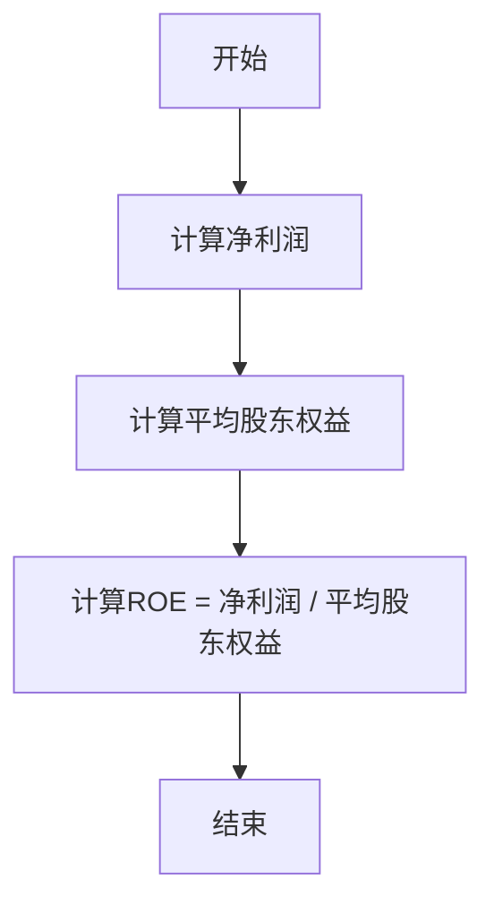
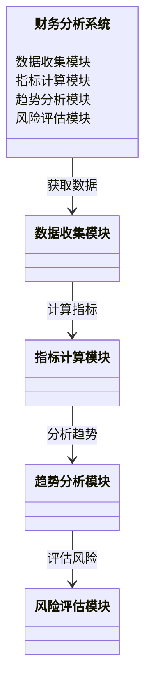

                 


# 巴菲特的财务报表分析：解读平台经济的新指标

## 关键词：巴菲特、财务报表分析、平台经济、新指标、投资策略

## 摘要：
本文通过分析巴菲特的财务报表分析方法，探讨其在平台经济中的应用，特别是对新指标的解读。结合实际案例，详细讲解如何利用这些指标评估平台经济的财务健康状况和投资价值，为读者提供系统的分析框架和实战指导。

---

## 第一部分: 背景介绍

### 1.1 平台经济与传统经济的差异
- **定义**：平台经济是以互联网为基础，通过撮合交易或提供服务，连接供需双方的商业模式。
- **特点**：轻资产、高杠杆、网络效应强、用户驱动。
- **对比**：与传统制造业相比，平台经济更依赖用户和数据，而非实体资产。

### 1.2 核心概念术语说明
- **ROE（净资产收益率）**：衡量公司盈利能力的指标，公式为：ROE = 净利润 / 平均股东权益。
- **ROA（资产回报率）**：衡量资产使用效率的指标，公式为：ROA = 净利润 / 平均总资产。
- **ARPU（每用户平均收入）**：平台经济中用户贡献的收入指标。

### 1.3 问题背景
平台经济的特殊性使得传统财务指标不足以全面反映其价值，需引入新指标进行分析。

### 1.4 问题解决
通过扩展巴菲特的分析框架，引入用户增长率、ARPU等指标，构建适合平台经济的财务分析模型。

### 1.5 边界与外延
平台经济的边界包括用户数量、交易频率，外延则涉及技术投入和生态合作。

---

## 第二部分: 核心概念与联系

### 2.1 平台经济的实体关系图
```mermaid
erDiagram
    actor 用户
    actor 供应商
    actor 投资者
    actor 平台公司
    用户 --> 平台公司 : 使用服务
    供应商 --> 平台公司 : 提供服务
    投资者 --> 平台公司 : 投资
    平台公司 --> 用户 : 提供服务
```

### 2.2 分析框架的类图


---

## 第三部分: 算法原理讲解

### 3.1 ROE计算流程图


### 3.2 ROE数学公式
ROE的计算公式为：
$$ROE = \frac{\text{净利润}}{\text{平均股东权益}}$$
例如，净利润为100万元，股东权益为500万元，则ROE = 20%。

---

## 第四部分: 系统分析与架构设计

### 4.1 功能设计


### 4.2 架构图


---

## 第五部分: 项目实战

### 5.1 环境安装
安装Python和相关库（如Pandas、Matplotlib）。

### 5.2 核心实现代码
```python
import pandas as pd

# 示例数据
data = {
    '用户数量': [10000, 20000, 15000],
    '交易金额': [500000, 750000, 600000],
    '净利润': [100000, 150000, 120000],
    '股东权益': [500000, 600000, 700000]
}
df = pd.DataFrame(data)

# 计算ARPU
df['ARPU'] = df['交易金额'] / df['用户数量']
# 计算ROE
df['ROE'] = df['净利润'] / df['股东权益'] * 100

print(df)
```

### 5.3 案例分析
以滴滴出行为例，分析其用户增长率和ARPU，评估其财务表现。

---

## 第六部分: 最佳实践

### 6.1 小结
平台经济的财务分析需结合传统指标与新指标，全面评估企业的价值。

### 6.2 注意事项
- 数据的准确性和完整性
- 指标的适用性
- 模型的可解释性

### 6.3 拓展阅读
推荐阅读巴菲特的《聪明的投资者》及相关平台经济分析书籍。

---

## 结语
通过本文的分析，读者可以掌握巴菲特的财务分析方法在平台经济中的应用，特别是新指标的解读，为投资决策提供有力支持。

