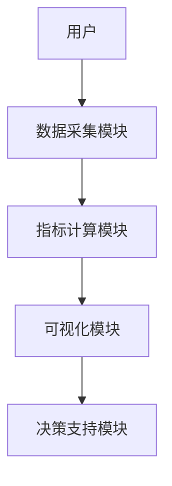

                 


```markdown
# 巴菲特的财务报表分析：解读数字经济时代的新指标

> 关键词：巴菲特，财务报表分析，数字经济，新指标，投资策略，财务指标

> 摘要：本文深入探讨了巴菲特的财务报表分析方法，并结合数字经济时代的特点，提出了新的财务指标和分析框架。通过对比传统指标与新指标的异同，结合实际案例和系统架构设计，展示了如何在数字经济时代优化投资决策。

---

## 第一部分: 巴菲特的财务报表分析基础

### 第1章: 巴菲特的分析方法与投资理念

#### 1.1 巴菲特的价值投资理论
巴菲特的价值投资理论强调以低于内在价值的价格购买优质资产。他的分析方法依赖于对财务报表的深入理解，尤其是通过关键财务指标评估企业的盈利能力、成长性和抗风险能力。

#### 1.2 财务报表分析的核心地位
巴菲特认为，财务报表是企业经营状况的晴雨表。通过对资产负债表、利润表和现金流量表的分析，可以揭示企业的财务健康状况和未来发展前景。

#### 1.3 数字经济时代的挑战
在数字经济时代，企业的价值不再仅仅体现在有形资产上，数据资产、用户粘性和技术创新能力成为新的核心竞争力。这要求传统的财务指标体系进行调整和补充。

---

### 第2章: 财务报表的基本构成与分析框架

#### 2.1 资产负债表的核心要素
- **资产**：包括流动资产（现金、应收账款）和非流动资产（固定资产、无形资产）。
- **负债**：包括流动负债（应付账款、短期债务）和非流动负债（长期债券）。
- **所有者权益**：反映企业的净资产价值。

#### 2.2 利润表的关键指标
- **营业收入**：企业的核心收入来源。
- **净利润**：衡量企业盈利能力的重要指标。
- **毛利率**：反映产品或服务的成本控制能力。

#### 2.3 现金流量表的重要性
现金流量表记录了企业在一定时期内的现金流入和流出情况，是评估企业流动性的重要依据。

#### 2.4 财务报表分析的基本方法
- **趋势分析**：分析财务数据的变化趋势。
- **比率分析**：通过计算各项财务比率（如ROE、ROA）评估企业财务状况。
- **质量分析**：关注财务数据的质量，如应收账款的回收情况。

---

## 第二部分: 巴菲特的财务分析框架

### 第3章: 巴菲特的三大财务指标

#### 3.1 净资产收益率（ROE）
ROE = 净利润 / 平均净资产
ROE衡量了企业使用股东资金的效率。巴菲特认为，ROE持续高于15%的企业具有较大的投资价值。

#### 3.2 总资产收益率（ROA）
ROA = 净利润 / 平均总资产
ROA衡量了企业利用全部资产创造利润的能力。ROA持续高于10%表明企业资产利用效率较高。

#### 3.3 投资资本回报率（ROI）
ROI = 净利润 / 投资资本
ROI反映了企业投资资本的回报效率。巴菲特倾向于选择ROI持续高于10%的企业。

---

### 第4章: 数字经济时代的新财务指标

#### 4.1 数字经济对传统财务指标的挑战
传统财务指标主要关注企业的财务状况和盈利能力，但在数字经济时代，企业的价值还体现在数据资产、用户粘性和技术创新能力上。

#### 4.2 新型财务指标的定义与特点
- **数字资产评估**：将数据视为企业的重要资产，评估其对收入的贡献。
- **用户生命周期价值（CLV）**：预测用户在生命周期内为企业带来的总收入。
- **数据 monetization 模型**：评估数据资产的变现能力。

#### 4.3 对比分析：传统指标与新指标的异同
| 指标类型 | 传统指标 | 新指标 |
|----------|----------|--------|
| 代表指标 | ROE, ROA | 数字资产评估, CLV |
| 侧重点  | 财务状况 | 数据资产和用户价值 |
| 适用性  | 线下企业 | 数字经济企业 |

#### 4.4 实体关系图（ER图）
```mermaid
erd
    股东
    股东 <-- 投资资本回报率 (ROI)
    企业 <-- 净资产收益率 (ROE)
    数据资产 <-- 用户生命周期价值 (CLV)
```

---

## 第三部分: 巴菲特分析框架与新指标的结合

### 第5章: 传统指标与新指标的融合

#### 5.1 融合的目标
通过结合传统财务指标和新指标，全面评估企业的财务状况和数字经济时代的竞争力。

#### 5.2 实际应用
以某科技公司为例：
- 传统指标：ROE = 20%，ROA = 15%，ROI = 12%。
- 新指标：数字资产价值 = 5000万元，CLV = 300元/用户。

#### 5.3 结论
结合新指标后，企业的综合竞争力显著提升，投资价值进一步确认。

---

### 第6章: 数学模型与算法实现

#### 6.1 数学模型
- ROE = 净利润 / 平均净资产
- CLV = (收入 * 用户留存率) / 用户获取成本

#### 6.2 算法实现
```python
def calculate_roe(net_profit, average_equity):
    return net_profit / average_equity

def calculate_clv(revenue, retention_rate, acquisition_cost):
    return (revenue * retention_rate) / acquisition_cost
```

---

### 第7章: 系统架构设计

#### 7.1 系统功能设计
- 数据采集：获取企业的财务数据和数字经济相关数据。
- 指标计算：计算传统和新指标。
- 可视化：生成对比图表，辅助决策。

#### 7.2 系统架构图


---

### 第8章: 项目实战与案例分析

#### 8.1 环境安装
安装Python和相关库（pandas, matplotlib）。

#### 8.2 核心实现
```python
import pandas as pd
import matplotlib.pyplot as plt

def analyze_company_data(data):
    roe = data['净利润'] / data['平均净资产']
    clv = (data['收入'] * data['用户留存率']) / data['用户获取成本']
    return roe, clv

data = pd.read_csv('company_data.csv')
roe, clv = analyze_company_data(data)
plt.plot(roe, label='ROE')
plt.plot(clv, label='CLV')
plt.legend()
plt.show()
```

---

### 第9章: 最佳实践与总结

#### 9.1 小结
通过结合传统财务指标和数字经济时代的新指标，投资者可以更全面地评估企业的价值，做出更明智的投资决策。

#### 9.2 注意事项
- 数据质量对分析结果影响重大。
- 新指标的计算需要结合企业的具体情况。

#### 9.3 拓展阅读
推荐阅读巴菲特的经典著作《 Intelligent Investor》以及相关数字经济领域的书籍。

---

# 总结
本文通过分析巴菲特的财务报表分析方法，并结合数字经济时代的新指标，展示了如何在现代投资环境中优化分析框架。通过实际案例和系统设计，为投资者提供了新的思路和工具。
```

