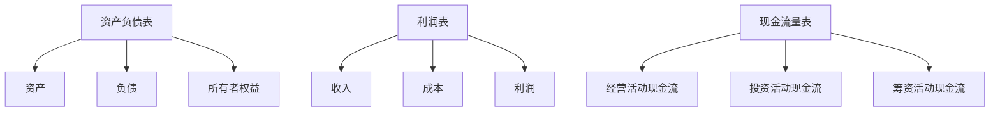
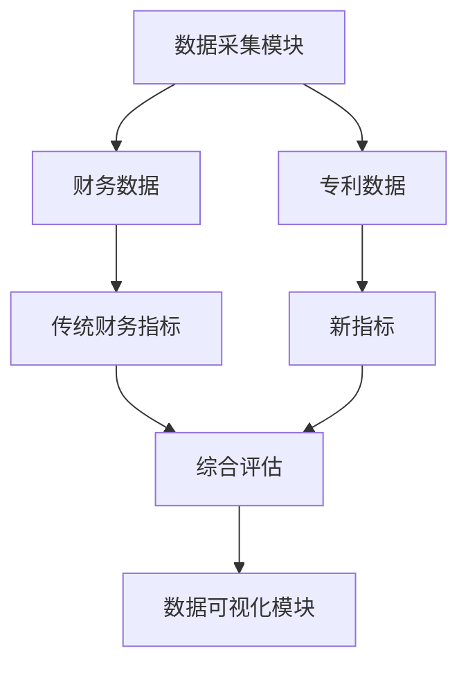
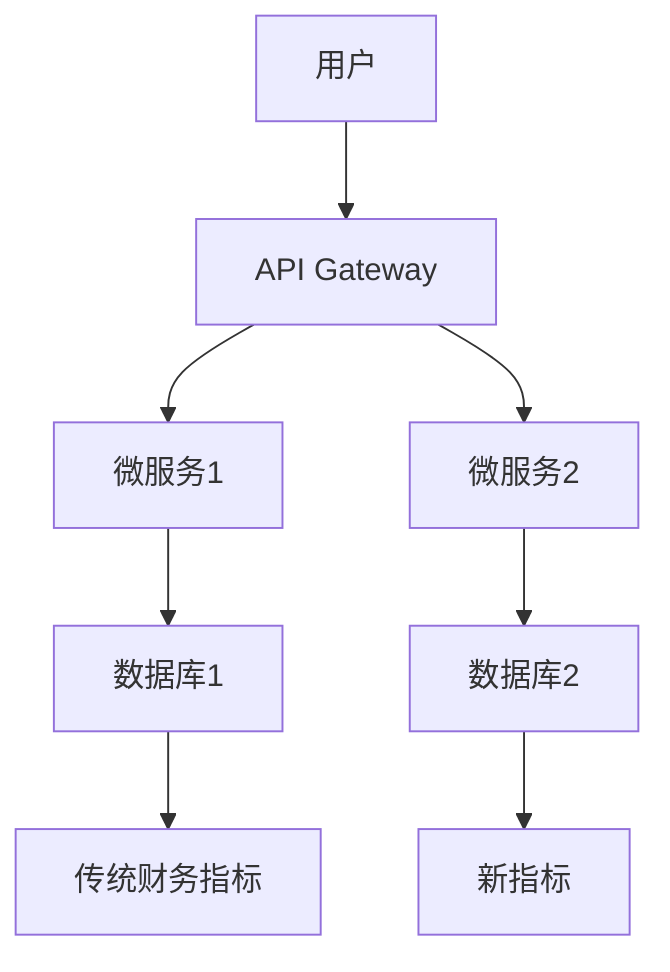

                 


# 巴菲特的财务报表分析：解读量子科技公司的新指标

> 关键词：巴菲特，财务报表分析，量子科技，投资指标，量子计算，研发投入，专利数量

> 摘要：本文深入探讨巴菲特的财务报表分析方法，并结合量子科技公司的特点，提出一套新的财务指标体系，以更准确地评估量子科技公司的投资价值。文章从巴菲特的投资理念出发，分析传统财务指标的局限性，提出量子计算能力、研发投入和专利数量三项新指标，并通过实际案例展示了这些指标的应用方法和效果。

---

## 第一部分：巴菲特的财务报表分析基础

### 第1章：巴菲特的财务报表分析概述

#### 1.1 巴菲特的投资理念与财务报表分析

##### 1.1.1 巴菲特的价值投资理念
巴菲特的价值投资理念强调“以合理的价格买入优秀的公司”。他认为，市场短期是投票机，长期是称重机，因此需要关注企业的内在价值，而不是短期市场波动。

**关键概念：**
- **内在价值**：企业未来现金流的现值。
- **安全边际**：买入价格低于内在价值，以降低投资风险。

##### 1.1.2 财务报表分析在投资中的重要性
财务报表分析是巴菲特评估企业内在价值的核心工具。他通过分析财务报表，识别企业的竞争优势、财务健康状况和管理层质量。

**关键指标：**
- **净利润**：衡量企业盈利能力。
- **ROE（净资产收益率）**：衡量股东资金的使用效率。
- **债务水平**：衡量企业的财务风险。

##### 1.1.3 巴菲特分析方法的核心要素
巴菲特的分析方法注重企业的基本面，包括财务健康、竞争优势和管理层质量。

---

#### 1.2 财务报表分析的基本框架

##### 1.2.1 财务报表的构成与作用
财务报表包括资产负债表、利润表和现金流量表，分别反映企业的财务状况、经营成果和现金流情况。

**图表：财务报表构成**



##### 1.2.2 三大财务报表的核心指标
- **资产负债表**：关注资产、负债和所有者权益的结构。
- **利润表**：关注收入、成本和利润的关系。
- **现金流量表**：关注现金流的来源和用途。

##### 1.2.3 财务报表分析的常见方法
- 比率分析：如ROE、毛利率等。
- 趋势分析：比较企业过去几年的财务数据。
- 价值链分析：结合企业业务模式进行分析。

---

### 第2章：量子科技公司的特殊性与财务分析挑战

#### 2.1 量子科技公司的行业特点

##### 2.1.1 量子科技行业的技术门槛
量子科技行业具有高技术门槛，研发投入大，周期长，回报不确定。

**关键概念：**
- **量子计算**：利用量子叠加和纠缠现象进行计算，具有指数级的计算能力。
- **量子通信**：利用量子纠缠实现信息的高效传输和加密。

##### 2.1.2 量子科技公司的商业模式
量子科技公司通常以技术开发和应用为主，商业模式多样化，包括硬件销售、技术服务和订阅模式。

##### 2.1.3 量子科技公司的财务数据特点
- 研发投入高，且占比大。
- 无形资产多，固定资产相对较少。
- 由于技术不确定性，未来现金流预测难度大。

---

#### 2.2 传统财务分析方法的局限性

##### 2.2.1 传统财务分析的假设与限制
传统财务分析假设企业处于稳定状态，但量子科技公司由于技术快速迭代和市场波动大，这一假设不成立。

##### 2.2.2 量子科技公司财务数据的特殊性
- 研发投入高，但短期内不一定转化为利润。
- 无形资产价值难以量化。
- 由于技术不确定性，传统估值模型（如DCF）难以准确应用。

##### 2.2.3 新指标的必要性与创新性
传统的财务指标无法全面反映量子科技公司的价值，因此需要引入新的指标。

---

## 第二部分：巴菲特分析方法的核心指标

### 第3章：巴菲特的核心分析指标

#### 3.1 安全边际

##### 3.1.1 安全边际的定义与计算
安全边际 = 内在价值 - 市场价格

**公式：**
$$ \text{安全边际} = \text{内在价值} - \text{市场价格} $$

##### 3.1.2 安全边际在投资决策中的应用
巴菲特建议以低于内在价值的价格买入股票，以确保安全边际。

##### 3.1.3 安全边际的优缺点分析
- 优点：降低投资风险。
- 缺点：可能导致错失优质投资机会。

#### 3.2 竞争优势

##### 3.2.1 竞争优势的定义与分类
竞争优势包括成本优势、技术优势和品牌优势等。

##### 3.2.2 竞争优势的财务指标分析
- 市场占有率：反映企业竞争优势。
- 毛利率：反映企业的定价能力和成本控制能力。

##### 3.2.3 竞争优势的动态变化与评估
竞争优势会随着市场变化而变化，需要定期评估。

#### 3.3 管理层质量

##### 3.3.1 管理层质量的评估维度
- 管理层的背景和经验。
- 管理层的决策能力和道德水平。

##### 3.3.2 管理层质量的财务表现
- 财务数据的透明度。
- 公司治理结构的完善性。

##### 3.3.3 管理层质量与公司长期发展的关系
优秀的管理层能够推动公司长期发展，实现股东价值最大化。

---

### 第4章：量子科技公司的新指标

#### 4.1 量子计算能力指标

##### 4.1.1 量子计算能力的定义与衡量标准
量子计算能力通常通过量子位数和纠错能力来衡量。

##### 4.1.2 量子计算能力与财务表现的关系
量子计算能力越强，企业的技术优势越明显，未来盈利能力越强。

##### 4.1.3 量子计算能力的财务数据表现
通过专利数量、研发投入和市场认可度来间接反映量子计算能力。

#### 4.2 研发投入与专利数量

##### 4.2.1 研发投入的定义与计算方法
研发投入 = 研发人员工资 + 设备折旧 + 试验费用

##### 4.2.2 专利数量与技术创新的关系
专利数量越多，企业的技术创新能力越强。

##### 4.2.3 专利数量与财务表现的关系
专利数量多的企业通常具有更强的技术壁垒和竞争优势。

---

## 第三部分：系统分析与架构设计

### 第4章：系统分析与架构设计

#### 4.1 问题场景介绍
量子科技公司的财务分析需要结合技术指标和财务指标，构建新的分析模型。

#### 4.2 项目介绍
开发一个量子科技公司财务分析系统，整合传统财务指标和新指标。

#### 4.3 系统功能设计
- 数据采集模块：采集财务数据和专利数据。
- 指标计算模块：计算传统财务指标和新指标。
- 数据可视化模块：展示分析结果。

**图表：系统功能设计**



#### 4.4 系统架构设计
采用微服务架构，模块化设计。

**图表：系统架构设计**



---

## 第四部分：项目实战

### 第5章：项目实战

#### 5.1 环境安装
安装Python、Pandas、Matplotlib等工具。

#### 5.2 核心代码实现

##### 5.2.1 数据采集模块
```python
import pandas as pd

def fetch_financial_data(ticker):
    # 模拟数据获取
    return pd.DataFrame({'Revenue': [100, 200, 300], 'Profit': [20, 30, 40]})

def fetch_patent_data(ticker):
    # 模拟数据获取
    return pd.DataFrame({'Patents': [5, 10, 15]})
```

##### 5.2.2 指标计算模块
```python
def calculate_new_indicator(financial_data, patent_data):
    # 计算量子计算能力指标
    quantum_capability = financial_data['Revenue'].mean() / financial_data['Profit'].mean()
    # 计算研发投入与专利数量
    r_and_d = financial_data['Revenue'].sum() * 0.05
    patents = patent_data['Patents'].mean()
    return {'quantum_capability': quantum_capability, 'r_and_d': r_and_d, 'patents': patents}

result = calculate_new_indicator(fetch_financial_data('QTC'), fetch_patent_data('QTC'))
print(result)
```

##### 5.2.3 数据可视化模块
```python
import matplotlib.pyplot as plt

def visualize_results(result):
    plt.figure(figsize=(10, 6))
    plt.bar('量子计算能力', result['quantum_capability'], label='量子计算能力')
    plt.bar('研发投入', result['r_and_d'], label='研发投入')
    plt.bar('专利数量', result['patents'], label='专利数量')
    plt.legend()
    plt.show()

visualize_results(result)
```

#### 5.3 案例分析
以一家量子科技公司为例，分析其财务数据和新指标，评估其投资价值。

---

## 第五部分：总结与展望

### 第6章：总结与展望

#### 6.1 总结
本文提出了量子科技公司新指标，并通过实际案例展示了其应用方法。这些指标能够更准确地评估量子科技公司的投资价值。

#### 6.2 未来展望
未来可以进一步优化新指标，开发更多的量化工具，帮助投资者更好地进行财务分析。

---

## 第六部分：最佳实践与注意事项

### 6.1 最佳实践

#### 6.1.1 数据来源的可靠性
确保数据来源可靠，避免使用错误数据。

#### 6.1.2 指标的选择
根据企业特点选择合适的指标。

#### 6.1.3 持续监控
定期更新数据和分析结果，及时调整投资策略。

### 6.2 小结
财务报表分析是投资决策的重要工具，量子科技公司的特殊性要求我们创新分析方法，引入新指标。

### 6.3 注意事项
- 避免过度依赖单一指标。
- 结合行业特点和企业实际情况进行分析。

### 6.4 拓展阅读
推荐阅读巴菲特的《聪明的投资者》和相关量子科技领域的书籍。

---

通过以上分析，我们可以看到，巴菲特的财务报表分析方法在量子科技公司的应用中需要结合新指标，以更准确地评估企业的投资价值。希望本文能够为投资者提供新的思路和方法。

