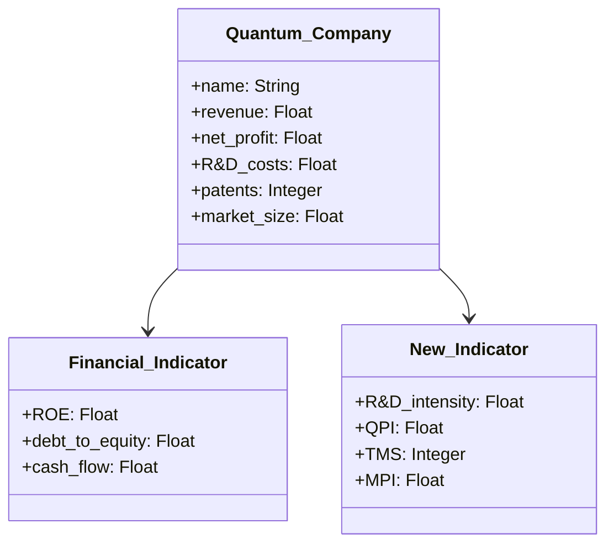
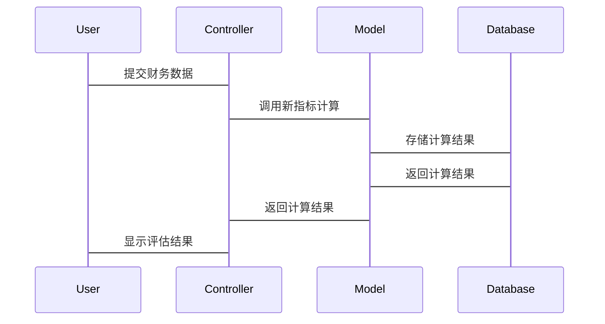

                 


# 巴菲特的财务报表分析：解读量子科技初创公司的新指标

## 关键词：
- 巴菲特
- 财务报表分析
- 量子科技
- 初创公司
- 新指标

## 摘要：
本文将深入探讨巴菲特的财务报表分析方法，并将其应用于量子科技初创公司的新指标。通过分析量子科技行业的特殊性，我们提出了新的财务指标，如研发投入占比、技术成熟度评分、市场潜力指数等，以更准确地评估量子科技初创公司的财务健康状况和潜在价值。本文结合理论与实践，提供详细的分析方法和案例，帮助投资者和企业管理者更好地理解和应用这些新指标。

## 第一章：巴菲特投资理念与财务报表分析概述

### 1.1 巴菲特投资理念的核心要素
#### 1.1.1 价值投资的定义与核心原则
- 价值投资：寻找市场低估的公司，长期持有，获得超额收益。
- 核心原则：安全边际、内在价值、长期视角。

#### 1.1.2 财务报表分析在巴菲特投资中的地位
- 财务报表是评估公司内在价值的基础。
- 重点关注ROE（净资产收益率）、杠杆率、现金流等指标。

#### 1.1.3 巴菲特投资策略的演变与特点
- 早期注重低估值股票，后期转向买入并持有优质企业。
- 强调公司管理层能力、行业地位和竞争优势。

### 1.2 财务报表分析的基本方法
#### 1.2.1 财务报表分析的三大核心报表
- 资产负债表：反映公司财务状况。
- 利润表：反映公司经营成果。
- 现金流量表：反映公司现金流动情况。

#### 1.2.2 财务比率分析的分类与作用
- 流动比率：衡量短期偿债能力。
- 负债比率：衡量杠杆风险。
- 盈利能力比率：衡量收益能力。

#### 1.2.3 财务报表分析的步骤与流程
1. 收集财务数据。
2. 计算关键财务比率。
3. 分析比率趋势。
4. 结合行业背景和公司具体情况。

### 1.3 巴菲特对财务报表分析的独特视角
#### 1.3.1 巴菲特对ROE（净资产收益率）的重视
- ROE公式：$$ROE = \frac{\text{净利润}}{\text{净资产}}$$
- 巴菲特认为，ROE高且稳定的公司具有更高的投资价值。

#### 1.3.2 巴菲特对杠杆率的警惕
- 杠杆率过高可能导致财务风险增加。
- 通过分析$$\text{债务/股权}$$比率评估杠杆风险。

#### 1.3.3 巴菲特对现金流的关注
- 现金流是公司财务健康的重要指标。
- 通过分析$$\text{经营活动现金流}$$评估公司盈利能力。

---

## 第二章：量子科技行业的财务分析特点

### 2.1 量子科技行业的核心特征
#### 2.1.1 量子科技行业的高风险与高回报
- 高研发投入，回报周期长。
- 技术成功可能导致爆发式增长。

#### 2.1.2 量子科技行业的技术门槛与研发投入
- 研发投入占比高。
- 技术壁垒高，竞争格局分散。

#### 2.1.3 量子科技行业的市场潜力与竞争格局
- 市场潜力巨大，但竞争激烈。
- 技术成熟度差异大，企业分化明显。

### 2.2 量子科技公司财务报表分析的特殊性
#### 2.2.1 研发投入占比的特殊意义
- 研发投入占比公式：$$\text{研发投入占比} = \frac{\text{研发费用}}{\text{营业收入}} \times 100\%$$
- 高研发投入可能意味着未来高回报，但也可能增加财务负担。

#### 2.2.2 技术成熟度对财务指标的影响
- 技术成熟度评分：分为早期、中期、后期。
- 早期技术公司可能亏损，但后期可能迎来爆发式增长。

#### 2.2.3 量子科技公司的估值挑战
- 传统估值方法难以准确评估量子科技公司。
- 需结合技术潜力和市场前景进行综合评估。

---

## 第三章：量子科技初创公司的新财务指标

### 3.1 新指标的定义与意义
#### 3.1.1 研发投入与未来盈利能力的关系
- 高研发投入可能转化为未来的竞争优势。
- 通过分析研发投入占比和研发投入强度（研发费用/总资产）评估研发力度。

#### 3.1.2 技术专利数量与市场竞争力的关联
- 专利数量与技术储备正相关。
- 通过分析专利数量和专利质量（如专利引用次数）评估技术实力。

#### 3.1.3 烧钱速度与资本需求
- 烧钱速度公式：$$\text{烧钱速度} = \frac{\text{现金流出}}{\text{时间}}$$
- 高烧钱速度可能意味着公司需要更多资本支持。

### 3.2 新指标的计算与应用
#### 3.2.1 量子专利指数（QPI）
- QPI计算公式：$$QPI = \frac{\text{专利数量} \times \text{专利质量}}{\text{公司规模}}$$
- QPI越高，公司技术实力越强。

#### 3.2.2 技术成熟度评分（TMS）
- TMS评分标准：1-5分，1分最低，5分最高。
- 通过技术阶段、专利质量和研发投入强度综合评估。

#### 3.2.3 市场潜力指数（MPI）
- MPI计算公式：$$MPI = \frac{\text{市场规模} \times \text{技术潜力}}{\text{竞争程度}}$$
- MPI越高，市场潜力越大。

---

## 第四章：量子科技初创公司财务指标的系统分析与架构设计

### 4.1 问题场景介绍
- 量子科技初创公司面临高研发投入、技术不确定性、市场潜力大等挑战。
- 需要通过新指标评估公司财务健康和潜在价值。

### 4.2 系统功能设计
#### 4.2.1 领域模型（Mermaid类图）


#### 4.2.2 系统架构设计（Mermaid架构图）


#### 4.2.3 系统接口设计
- 输入接口：量子公司财务数据。
- 输出接口：新指标计算结果和财务健康评估。

#### 4.2.4 系统交互（Mermaid序列图）


---

## 第五章：量子科技初创公司财务指标的项目实战

### 5.1 环境安装
- 需要Python 3.8及以上版本。
- 安装必要的库：pandas、numpy、scipy。

### 5.2 核心实现源代码
```python
import pandas as pd
import numpy as np

def calculate_roe(net_profit, equity):
    return net_profit / equity

def calculate_research_intensity(r_and_d_costs, total_assets):
    return r_and_d_costs / total_assets

def calculate_qpi(patents, patent_quality, company_size):
    return (patents * patent_quality) / company_size

# 示例数据
data = {
    'company': ['QuantumTech', 'QubitLabs', 'QuantumWave'],
    'revenue': [100, 80, 120],
    'net_profit': [20, 15, 30],
    'R&D_costs': [30, 20, 40],
    'patents': [5, 3, 7],
    'patent_quality': [0.8, 0.6, 0.9],
    'company_size': ['large', 'medium', 'small']
}

df = pd.DataFrame(data)

# 计算新指标
df['R&D_intensity'] = df.apply(lambda x: calculate_research_intensity(x['R&D_costs'], x['revenue']), axis=1)
df['QPI'] = df.apply(lambda x: calculate_qpi(x['patents'], x['patent_quality'], x['company_size']), axis=1)

print(df)
```

### 5.3 代码应用解读与分析
- 代码实现新指标的计算。
- 通过数据分析工具进行可视化展示，帮助用户更好地理解指标含义。

### 5.4 实际案例分析
- 以具体量子科技公司为例，展示新指标的计算过程和结果。
- 对比不同公司的指标，分析其财务健康状况和市场潜力。

### 5.5 项目小结
- 总结项目实现的关键点和注意事项。
- 提供进一步优化的建议，如引入更多指标或改进计算方法。

---

## 第六章：量子科技初创公司新指标的总结与展望

### 6.1 总结
- 新指标的提出为量子科技初创公司的财务分析提供了新的视角。
- 巴菲特的分析框架与量子科技行业的特点相结合，能够更准确地评估公司价值。

### 6.2 注意事项
- 新指标的应用需要结合具体行业特点和公司实际情况。
- 数据的准确性和完整性对分析结果至关重要。

### 6.3 拓展阅读
- 推荐相关书籍和文章，帮助读者深入学习财务分析和量子科技知识。

---

通过本文的详细分析和实际案例，读者可以更好地理解如何将巴菲特的财务报表分析方法应用于量子科技初创公司，并掌握新的财务指标的计算和应用方法。这些新指标不仅能够帮助投资者做出更明智的投资决策，也为量子科技企业的管理和战略规划提供了重要参考。

