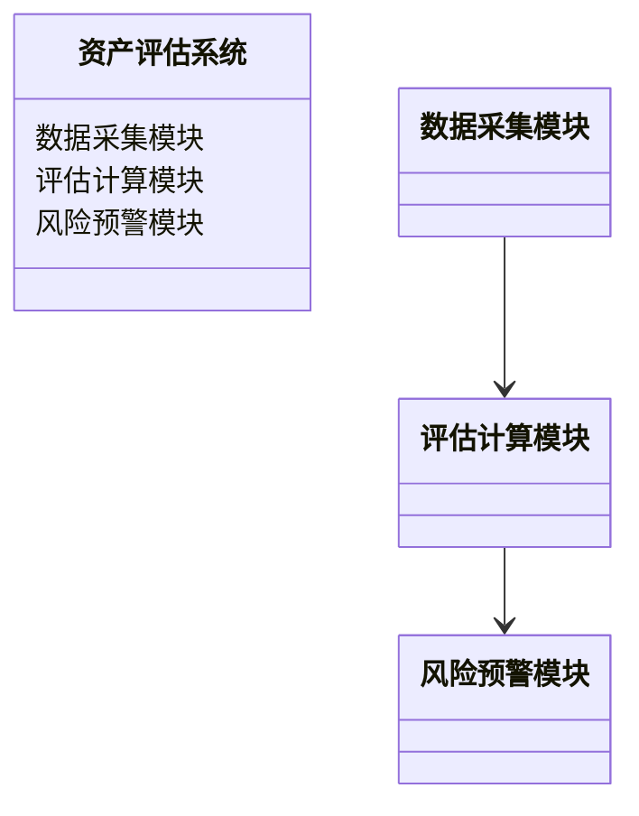
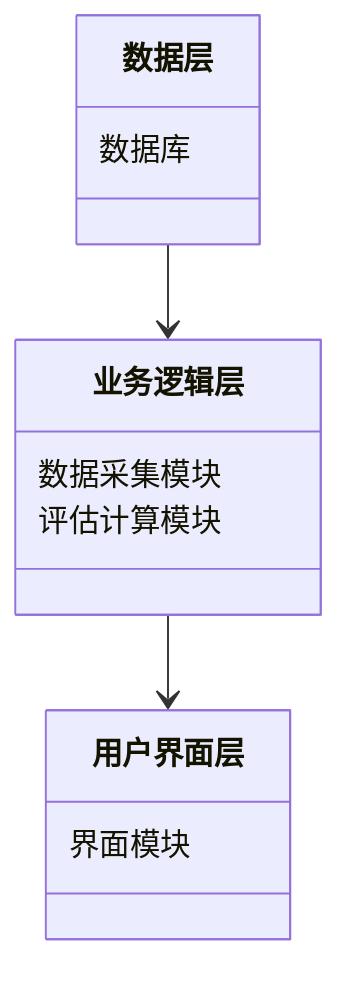
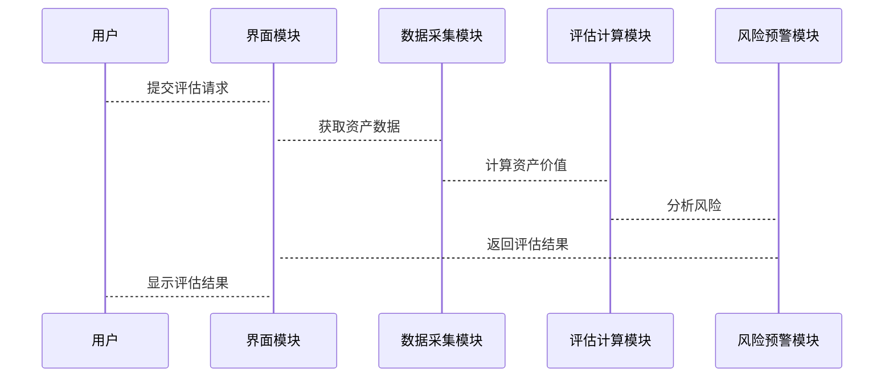

                 


# 巴菲特的资产负债表分析：数字资产和无形资产的重新定义

---

## 关键词：巴菲特、资产负债表、数字资产、无形资产、资产评估、投资分析

---

## 摘要：  
本文深入分析了巴菲特的资产负债表分析方法，并探讨了数字资产和无形资产在数字化时代的重新定义。通过结合传统资产评估方法与现代技术手段，本文提出了一种创新的数字资产评估模型，为投资者和企业管理者提供了新的视角和工具。

---

# 第1章：背景介绍

## 1.1 巴菲特的投资理念  
巴菲特以价值投资闻名，他注重企业的内在价值和财务健康状况。资产负债表作为企业财务健康状况的核心报表，是巴菲特分析企业的重要工具。  

### 1.1.1 巴菲特的生平与投资哲学  
巴菲特于1934年出生，是全球著名的投资者和慈善家。他的投资哲学强调长期投资、价值投资和风险管理。他通过分析企业的财务报表，尤其是资产负债表，来评估企业的内在价值。  

### 1.1.2 巴菲特对资产负债表分析的重视  
巴菲特认为，资产负债表反映了企业的资产、负债和所有者权益，是评估企业财务健康状况的关键。他尤其关注企业的资产质量、负债结构和资本回报率。  

### 1.1.3 巴菲特投资理念的核心要素  
- **长期投资**：巴菲特主张长期持有优质资产，避免短期波动。  
- **价值投资**：寻找具有持续竞争优势和良好财务状况的企业。  
- **风险管理**：通过分散投资和严格的风险评估来降低风险。  

---

## 1.2 传统资产负债表分析的局限性  
传统资产负债表分析主要关注有形资产和明确的财务数据，但在数字化时代，无形资产和数字资产的重要性日益增加。  

### 1.2.1 无形资产的传统定义与局限性  
无形资产包括专利、商标、商誉等，传统评估方法通常基于历史成本或收益法，难以准确反映其市场价值。  

### 1.2.2 数字资产的兴起与挑战  
数字资产（如数据、算法、区块链资产等）的兴起，对传统资产负债表分析提出了新的挑战。数字资产具有高度的流动性和潜在的高价值，但其评估方法尚未成熟。  

---

## 1.3 数字化时代对资产负债表分析的影响  
数字化转型使得企业资产结构发生了根本性变化，数字资产和无形资产的比例显著增加。如何在资产负债表中准确反映这些资产的价值，成为当前财务分析的重要课题。  

---

# 第2章：数字资产与无形资产的核心概念

## 2.1 数字资产的定义与特征  
数字资产是指以数字形式存在的资产，包括数据、算法、区块链资产等。  

### 2.1.1 数字资产的可量化性  
数字资产可以通过数据化手段进行量化，例如通过区块链技术记录资产的交易和所有权。  

### 2.1.2 数字资产的可分割性  
数字资产可以通过分割和组合，形成不同的资产类别，例如NFT（非同质化代币）。  

### 2.1.3 数字资产的可追踪性  
数字资产可以通过区块链等技术实现全生命周期的追踪和溯源，提高了资产的透明度和安全性。  

---

## 2.2 无形资产的重新定义  
在数字化时代，无形资产的定义和评估方法都需要重新审视。  

### 2.2.1 无形资产的传统分类  
无形资产通常分为可识别和不可识别两类。可识别无形资产包括专利、商标等，不可识别无形资产包括商誉。  

### 2.2.2 数字化时代下无形资产的新维度  
- **数据资产**：企业通过数据收集和分析获得的竞争优势。  
- **算法资产**：通过算法优化业务流程和决策。  
- **品牌资产**：数字化营销和社交媒体对品牌价值的影响。  

---

## 2.3 数字资产与无形资产的对比分析  
数字资产和无形资产在许多方面存在相似性，但也有一些关键区别。  

### 2.3.1 数字资产与无形资产的属性对比  
| 属性         | 数字资产           | 无形资产         |
|--------------|--------------------|------------------|
| 实体形式     | 以数字形式存在     | 无物理实体       |
| 可分割性     | 可分割             | 不可分割         |
| 可追踪性     | 可追踪             | 部分可追踪       |

### 2.3.2 数字资产与无形资产的优劣势分析  
- **数字资产的优势**：高度流动性和可编程性，便于管理和交易。  
- **数字资产的劣势**：技术风险高，容易受到黑客攻击。  
- **无形资产的优势**：长期价值稳定，不易被替代。  
- **无形资产的劣势**：评估难度大，难以量化。  

---

## 2.4 本章小结  
数字资产和无形资产在数字化时代的重要性日益增加，但它们的定义、特征和评估方法仍需进一步研究和创新。  

---

# 第3章：数字资产与无形资产的评估模型

## 3.1 数字资产评估的核心原理  
数字资产评估需要考虑其技术特性、市场价值和风险因素。  

### 3.1.1 数字资产的生命周期模型  
数字资产的生命周期包括创建、存储、交易和销毁四个阶段。  

### 3.1.2 数字资产的经济价值评估  
数字资产的经济价值可以通过市场供需关系、技术成熟度和法律环境进行评估。  

### 3.1.3 数字资产的风险评估  
数字资产的风险包括技术风险、市场风险和法律风险。  

---

## 3.2 无形资产评估的传统方法  
传统无形资产评估方法包括市场法、收益法和成本法。  

### 3.2.1 市场法  
通过比较类似资产的市场价格，评估目标资产的价值。  

### 3.2.2 收益法  
通过预测资产未来产生的收益，折现计算其当前价值。  

### 3.2.3 成本法  
通过估算资产的重置成本，评估其价值。  

---

## 3.3 数字化时代下的无形资产评估创新  
在数字化时代，无形资产评估需要结合数字技术的特点。  

### 3.3.1 数据驱动的评估方法  
通过大数据分析，评估数据资产的价值。  

### 3.3.2 区块链技术的应用  
区块链技术可以提高无形资产的透明度和可信度，降低评估难度。  

---

## 3.4 本章小结  
数字资产和无形资产的评估需要结合传统方法和新兴技术，创新评估模型以适应数字化时代的挑战。  

---

# 第4章：数字资产与无形资产的系统分析与架构设计

## 4.1 系统功能设计  
数字资产评估系统需要具备数据采集、评估计算和风险预警等功能。  

### 4.1.1 领域模型设计  
领域模型展示了系统的功能模块和数据关系。  



---

## 4.2 系统架构设计  
系统架构采用分层设计，包括数据层、业务逻辑层和用户界面层。  



---

## 4.3 系统接口设计  
系统接口采用RESTful API设计，便于与其他系统的集成。  

### 4.3.1 API接口定义  
- `/api/assets/data`：数据采集接口  
- `/api/assets/assessment`：评估计算接口  
- `/api/assets/risk`：风险预警接口  

---

## 4.4 系统交互设计  
系统交互流程包括用户请求、数据处理和结果反馈。  



---

## 4.5 本章小结  
通过系统设计和架构优化，可以提高数字资产和无形资产的评估效率和准确性。  

---

# 第5章：数字资产与无形资产的项目实战

## 5.1 环境安装  
项目实战需要安装以下环境：  
- Python 3.8+  
- Python库：pandas, numpy, matplotlib  

---

## 5.2 核心代码实现  
以下是一个数字资产评估的核心代码示例：  

```python
import pandas as pd
import numpy as np
import matplotlib.pyplot as plt

# 示例数据：数字资产价值评估
data = {
    '资产名称': ['资产A', '资产B', '资产C'],
    '市场价格': [100, 200, 150],
    '技术成熟度': [0.8, 0.6, 0.7],
    '市场需求': [0.9, 0.8, 0.5]
}

df = pd.DataFrame(data)

# 计算资产价值：市场价格 × 技术成熟度 × 市场需求
df['评估价值'] = df['市场价格'] * df['技术成熟度'] * df['市场需求']

print(df)
```

---

## 5.3 代码解读与分析  
上述代码通过数据框计算数字资产的评估价值，考虑了市场价格、技术成熟度和市场需求三个因素。  

---

## 5.4 案例分析  
以某科技公司为例，分析其数字资产的价值和风险。  

---

## 5.5 本章小结  
通过项目实战，可以验证数字资产评估模型的有效性和实用性。  

---

# 第6章：数字资产与无形资产的最佳实践

## 6.1 小结  
本文从巴菲特的资产负债表分析出发，探讨了数字资产和无形资产的重新定义，提出了创新的评估模型和系统架构。  

---

## 6.2 注意事项  
- 数字资产的评估需要结合技术特性和市场环境。  
- 无形资产的评估需注意法律和合规风险。  

---

## 6.3 未来趋势  
- 数字资产的法律规范将逐步完善。  
- 人工智能技术将推动资产评估的自动化和智能化。  

---

## 6.4 拓展阅读  
推荐阅读巴菲特的《聪明的投资者》和《数字资产：区块链技术与金融的未来》。  

---

# 结语  
数字资产和无形资产的重新定义是数字化时代的重要课题，本文通过理论分析和实践案例，为投资者和企业管理者提供了新的视角和工具。未来，随着技术的不断发展，数字资产和无形资产的评估方法和理论体系将更加完善。  

---

