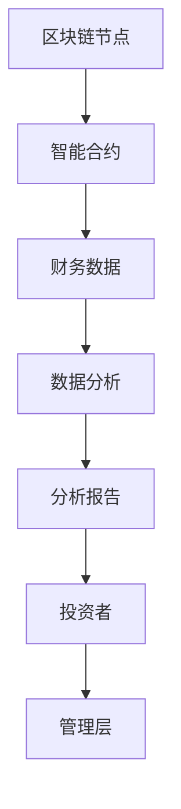

                 


# 巴菲特的资产负债表分析：智能合约对公司治理的影响

---

## 关键词：智能合约、区块链、公司治理、资产负债表分析、巴菲特、分布式账本、智能合约实现

---

## 摘要：

智能合约作为一种新兴的技术手段，正在逐步改变传统公司的治理方式。本文通过结合巴菲特的资产负债表分析方法，探讨智能合约在公司治理中的潜在影响。我们从智能合约的基本原理出发，分析其在公司治理中的应用场景，包括股权管理、董事会决策和风险管理等关键环节。通过对比传统资产负债表分析与智能合约驱动的分析方法，我们揭示了智能合约在提升公司治理透明度、降低运营成本和优化决策流程方面的巨大潜力。最后，本文还提供了智能合约在公司治理中的具体实现方案和实际案例分析，为读者提供了一种全新的公司治理思路。

---

# 第一部分: 智能合约与公司治理的背景

## 第1章: 智能合约的基本原理

### 1.1 智能合约的定义与特点

智能合约是一种基于区块链技术的自动执行合同协议。它通过代码自动执行预设的规则，无需依赖传统的中介机构。以下是智能合约的几个核心特点：

- **自动执行性**：智能合约一旦部署，会在预设的条件下自动执行。
- **不可篡改性**：智能合约的代码存储在区块链上，无法被篡改。
- **透明性**：所有交易记录在区块链上，可供所有参与者查阅。
- **去中心化**：智能合约的执行不依赖于任何中心化机构。

### 1.2 区块链技术的基本原理

区块链是一种分布式账本技术，通过去中心化的方式记录交易数据。以下是区块链的几个核心要素：

- **区块**：区块链由多个区块组成，每个区块包含一组交易数据。
- **链式结构**：每个区块都包含前一个区块的哈希值，形成链式结构。
- **共识机制**：通过共识算法（如PoW、PoS）确保所有节点的数据一致性。
- **智能合约**：区块链上的智能合约可以自动执行特定的规则。

### 1.3 智能合约与传统合约的对比

以下是智能合约与传统合约的主要区别：

| **对比维度** | **智能合约** | **传统合约** |
|--------------|--------------|--------------|
| 执行方式     | 自动执行     | 手动执行     |
| 可篡改性     | 不可篡改     | 可篡改       |
| 透明性       | 高           | 中/低        |
| 成本          | 低           | 高           |

---

## 第2章: 公司治理的基本概念

### 2.1 公司治理的定义

公司治理是指公司内部和外部的利益相关者（如股东、董事会、管理层、员工和监管机构）之间的一种制度安排，旨在确保公司能够高效、透明和合规地运作。

### 2.2 公司治理的核心要素

公司治理的核心要素包括：

1. **股权结构**：股东的权益分配和控制权。
2. **董事会结构**：董事会的组成和职责。
3. **管理层职责**：高管的职责和权限。
4. **风险管理**：公司如何识别和应对风险。
5. **透明度**：公司运营的透明度和信息披露。

### 2.3 公司治理的目标

公司治理的目标是通过优化内部制度和流程，实现以下目标：

- 提高公司运营效率。
- 降低公司治理成本。
- 提升公司透明度和信任度。
- 保护利益相关者的权益。
- 遵守法律法规和行业规范。

---

## 第3章: 巴菲特的资产负债表分析方法

### 3.1 资产负债表的核心要素

资产负债表是公司财务报表的重要组成部分，反映了公司在某一特定时点的财务状况。它主要包括以下三个核心要素：

- **资产**：公司拥有的资源，包括流动资产（如现金、应收账款）和非流动资产（如固定资产、无形资产）。
- **负债**：公司欠款的债务，包括流动负债（如应付账款、短期借款）和非流动负债（如长期借款、债券）。
- **所有者权益**：公司净资产的价值，等于资产减去负债。

### 3.2 巴菲特资产负债表分析的要点

巴菲特在分析资产负债表时，重点关注以下几个方面：

1. **流动资产与流动负债的匹配性**：流动资产是否能够覆盖流动负债，确保公司的短期偿债能力。
2. **非流动资产的质量**：非流动资产是否具有较高的变现能力或盈利能力。
3. **所有者权益的稳定性**：所有者权益是否稳健，是否存在虚增或虚减的情况。
4. **负债结构的合理性**：负债结构是否合理，是否存在过高或过低的风险。

### 3.3 巴菲特资产负债表分析的实践案例

以一家上市公司为例，分析其资产负债表的关键指标：

- **流动比率**：流动资产 / 流动负债 = 1.5，表明公司短期偿债能力较强。
- **速动比率**：（流动资产 - 存货） / 流动负债 = 0.8，表明公司速动资产不足以覆盖流动负债。
- **资产负债率**：总负债 / 总资产 = 40%，表明公司负债水平较为合理。

---

## 第4章: 智能合约在公司治理中的应用

### 4.1 智能合约在股权管理中的应用

智能合约可以通过区块链技术实现股权的自动管理。以下是具体应用场景：

- **股权登记**：通过智能合约记录股东的股权信息，确保股权的透明性和不可篡改性。
- **股权转让**：智能合约可以自动执行股权转让的条件，确保交易的合规性和高效性。
- **股息分配**：智能合约可以自动计算股息，并将收益分配给股东。

### 4.2 智能合约在董事会决策中的应用

智能合约可以优化董事会的决策流程，确保决策的透明性和高效性。以下是具体应用场景：

- **投票系统**：智能合约可以实现董事会成员的在线投票，确保投票的透明性和不可篡改性。
- **决策记录**：智能合约可以记录所有董事会决策的详细信息，确保决策的可追溯性。
- **决策执行**：智能合约可以自动执行董事会通过的决策，确保决策的及时性和准确性。

### 4.3 智能合约在风险管理中的应用

智能合约可以通过区块链技术实现风险管理的自动化和智能化。以下是具体应用场景：

- **风险预警**：智能合约可以通过实时监控公司的财务数据，自动触发风险预警。
- **风险应对**：智能合约可以根据预设的规则，自动执行风险应对措施，如调整资金流动或停止某些交易。
- **风险报告**：智能合约可以自动生成风险报告，并将其发送给相关利益相关者。

---

## 第5章: 巴菲特资产负债表分析与智能合约的结合

### 5.1 巴菲特资产负债表分析的智能化

智能合约可以将巴菲特的资产负债表分析方法转化为自动化流程。以下是具体实现步骤：

1. **数据采集**：智能合约可以自动采集公司的财务数据，并将其存储在区块链上。
2. **数据分析**：智能合约可以自动分析资产负债表的关键指标，并生成分析报告。
3. **决策支持**：智能合约可以根据分析结果，为投资者和管理层提供决策支持。

### 5.2 智能合约驱动的资产负债表分析的优势

智能合约驱动的资产负债表分析具有以下优势：

1. **自动化**：智能合约可以自动执行数据分析和报告生成，减少人工干预。
2. **透明性**：所有数据和分析结果都存储在区块链上，确保数据的透明性和不可篡改性。
3. **高效性**：智能合约可以快速完成数据分析和报告生成，提高分析效率。
4. **安全性**：区块链技术确保了数据的安全性和隐私性。

### 5.3 实际案例分析

以下是一个实际案例的分析：

假设某公司通过智能合约实现了资产负债表的自动分析。智能合约可以根据预设的规则，自动计算流动比率、速动比率和资产负债率等关键指标，并生成分析报告。投资者可以通过区块链浏览器查看这些数据，并做出投资决策。

---

## 第6章: 智能合约实现的系统架构设计

### 6.1 系统功能设计

智能合约实现的系统功能包括：

1. **智能合约部署**：部署智能合约到区块链上。
2. **数据采集**：采集公司的财务数据并存储在区块链上。
3. **数据分析**：智能合约自动分析财务数据，并生成分析报告。
4. **决策支持**：根据分析结果，为投资者和管理层提供决策支持。

### 6.2 系统架构设计

以下是系统的架构设计图：



### 6.3 系统接口设计

以下是系统的接口设计：

- **智能合约接口**：
  - `deployContract()`：部署智能合约。
  - `executeContract()`：执行智能合约。
- **数据分析接口**：
  - `analyzeData()`：分析财务数据。
  - `generateReport()`：生成分析报告。
- **报告接口**：
  - `getView()`：获取分析报告。

---

## 第7章: 项目实战

### 7.1 环境安装

以下是项目实战的环境安装步骤：

1. **安装区块链平台**：安装以太坊或其他区块链平台。
2. **安装智能合约开发工具**：安装Solidity编译器和以太坊钱包。
3. **安装数据分析工具**：安装Python和相关数据分析库。

### 7.2 核心代码实现

以下是核心代码实现：

```solidity
// 智能合约代码
contract BalanceSheetAnalysis {
    struct Company {
        uint totalAssets;
        uint totalLiabilities;
        uint ownerEquity;
    }

    function analyze(Company company) public pure returns (uint) {
        return company.totalAssets - company.totalLiabilities;
    }
}
```

### 7.3 代码应用解读与分析

上述代码实现了一个简单的资产负债表分析功能。通过智能合约，可以自动计算公司的净资产价值，并生成分析报告。

### 7.4 实际案例分析

以下是一个实际案例的分析：

假设某公司通过智能合约实现了资产负债表的自动分析。智能合约可以根据预设的规则，自动计算流动比率、速动比率和资产负债率等关键指标，并生成分析报告。

---

## 第8章: 总结与展望

### 8.1 总结

智能合约作为一种新兴的技术手段，正在逐步改变传统公司的治理方式。通过结合巴菲特的资产负债表分析方法，我们可以看到智能合约在公司治理中的巨大潜力。

### 8.2 展望

未来，智能合约将在公司治理中发挥更加重要的作用。随着区块链技术的不断发展，智能合约的应用场景将更加丰富，公司治理的效率和透明度将进一步提升。

### 8.3 注意事项

在实际应用中，需要注意以下几点：

- **安全性**：智能合约的安全性至关重要，必须经过严格测试。
- **合规性**：智能合约的实现必须符合相关法律法规。
- **可扩展性**：智能合约的设计必须具备良好的可扩展性。

### 8.4 拓展阅读

以下是拓展阅读的推荐书目：

1. 《区块链： hype之外的实用主义》
2. 《智能合约：区块链技术的革命性应用》
3. 《巴菲特的选股智慧》

---

通过本文的分析，我们可以看到，智能合约在公司治理中的应用前景广阔。未来，随着技术的不断进步，智能合约将为公司治理带来更多的创新和变革。

