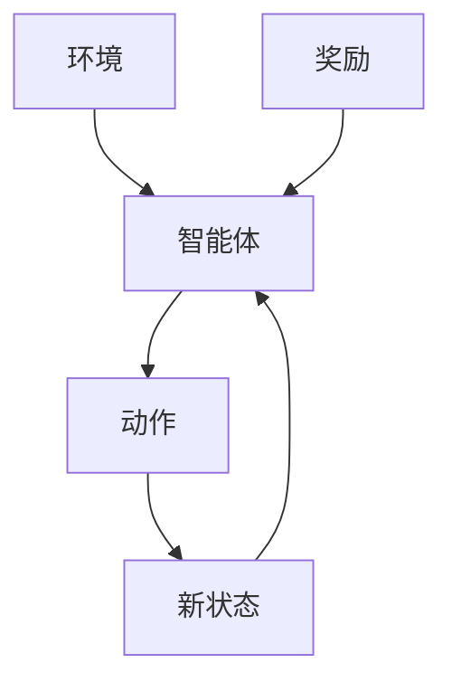
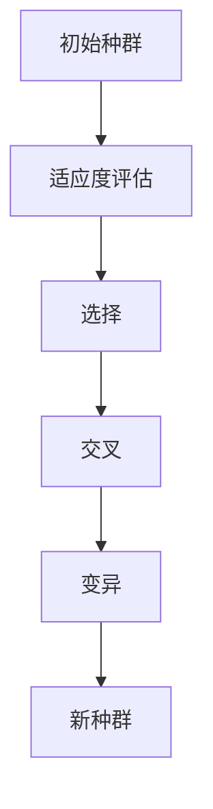
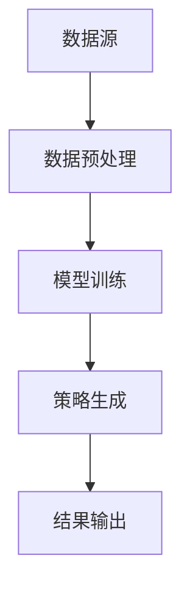
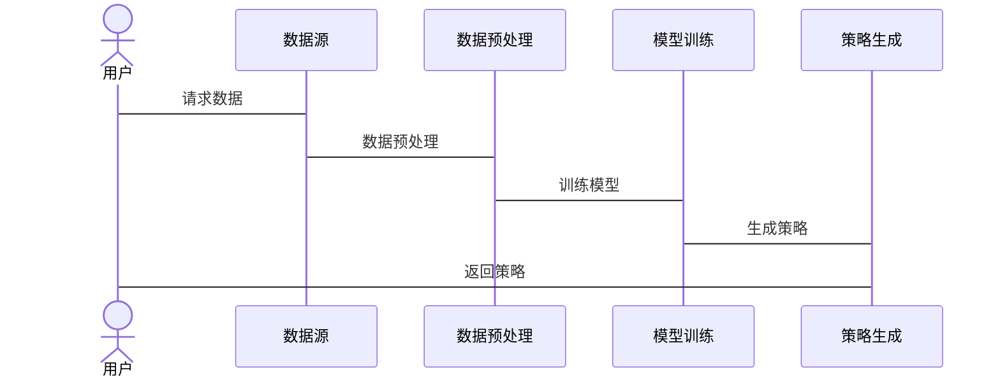

                 


# 巴菲特的资本配置艺术：人工智能辅助的投资组合优化

---

## 关键词：巴菲特，资本配置，人工智能，投资组合优化，强化学习，遗传算法

---

## 摘要：  
本文探讨了巴菲特的资本配置艺术及其与人工智能的结合。通过分析巴菲特的价值投资理念，结合现代投资组合理论（MPT）和资本资产定价模型（CAPM），本文详细阐述了人工智能在投资组合优化中的应用。文章从强化学习和遗传算法的角度，探讨了如何利用AI技术提升资本配置效率，并通过系统设计和项目实战，展示了AI辅助投资组合优化的实现过程和实际案例。最后，本文总结了AI在资本配置中的潜力与挑战，并展望了未来的发展方向。

---

## 第1章: 巴菲特的资本配置理论概述

### 1.1 巴菲特的资本配置理论

#### 1.1.1 资本配置的基本概念  
资本配置是指将资金分配到不同资产类别（如股票、债券、房地产等）以实现投资目标的过程。巴菲特的资本配置理论强调长期投资、价值投资和安全边际，即选择具有持续竞争优势和良好管理的公司，以低于其内在价值的价格买入并长期持有。

#### 1.1.2 巴菲特的投资哲学  
巴菲特的投资哲学可以概括为“买入并持有优质资产”。他注重企业的基本面分析，寻找那些具有强大竞争优势、良好管理团队和合理估值的企业。他还强调分散投资的重要性，以降低风险。

#### 1.1.3 资本配置的核心要素  
资本配置的核心要素包括：  
1. **资产选择**：选择具有长期增长潜力的资产。  
2. **投资组合结构**：确定资产在不同类别中的分配比例。  
3. **风险控制**：通过分散投资和风险评估降低投资组合的波动性。

---

### 1.2 投资组合优化的数学模型

#### 1.2.1 投资组合优化的基本问题  
投资组合优化的目标是在给定的风险水平下，最大化预期收益；或在给定收益水平下，最小化风险。数学上，这通常通过优化目标函数（如夏普比率）来实现。

#### 1.2.2 资本资产定价模型（CAPM）  
CAPM是一个用于估计资产预期收益的模型，公式如下：

$$ E(R_i) = R_f + \beta_i (E(R_m) - R_f) $$  

其中，\( E(R_i) \) 是资产 \( i \) 的预期收益，\( R_f \) 是无风险利率，\( \beta_i \) 是资产 \( i \) 的贝塔系数，\( E(R_m) \) 是市场预期收益。

#### 1.2.3 现代投资组合理论（MPT）  
MPT由Harry Markowitz提出，旨在通过优化投资组合的收益-风险 trade-off。其核心是通过资产之间的协方差矩阵来计算最优权重。

---

### 1.3 人工智能在投资组合优化中的应用

#### 1.3.1 人工智能的基本概念  
人工智能（AI）是指模拟人类智能的计算机系统，包括学习、推理和自适应能力。在金融领域，AI常用于数据挖掘、预测和优化。

#### 1.3.2 人工智能在金融领域的应用现状  
AI在金融中的应用包括：  
1. **股票预测**：利用机器学习模型预测股票价格。  
2. **风险管理**：通过AI技术识别和评估风险。  
3. **投资组合优化**：使用强化学习和遗传算法优化投资组合。

#### 1.3.3 人工智能辅助投资组合优化的潜力  
AI通过处理海量数据和复杂模型，能够帮助投资者发现传统方法难以察觉的优化机会。

---

## 第2章: 资本配置的核心概念与联系

### 2.1 资本配置的核心概念

#### 2.1.1 资本配置的定义  
资本配置是将资金分配到不同资产以实现投资目标的过程。

#### 2.1.2 资本配置的属性特征对比  
| 特性 | 传统资本配置 | AI辅助资本配置 |  
|------|---------------|----------------|  
| 数据驱动 | 依赖历史数据 | 结合实时数据和机器学习 |  
| 模型复杂度 | 简单线性模型 | 高维非线性模型 |  
| 计算效率 | 低效 | 高效 |  

#### 2.1.3 资本配置的ER实体关系图  
```mermaid
er
actor: 投资者
asset: 资产
portfolio: 投资组合
risk: 风险
```

---

### 2.2 人工智能算法的核心原理

#### 2.2.1 强化学习的基本原理  
强化学习是一种通过试错学习最优策略的方法。在投资组合优化中，强化学习可以模拟投资者在不同市场条件下的决策过程。

#### 2.2.2 遗传算法的基本原理  
遗传算法模拟生物进化过程，通过选择、交叉和变异操作生成优化解。

#### 2.2.3 资本配置优化的数学模型  
资本配置优化的目标函数可以表示为：

$$ \min_w \{ w^T \Sigma w \} $$  

其中，\( w \) 是投资权重向量，\( \Sigma \) 是资产的协方差矩阵。

---

## 第3章: 投资组合优化的算法原理

### 3.1 强化学习在投资组合优化中的应用

#### 3.1.1 强化学习的基本概念  
强化学习通过智能体与环境的交互，学习最优策略。

#### 3.1.2 强化学习在投资组合优化中的流程图  


#### 3.1.3 强化学习的数学模型  
强化学习的目标是最大化累积奖励，通过Q-learning算法实现：

$$ Q(s, a) = r + \gamma \max_{a'} Q(s', a') $$  

其中，\( s \) 是状态，\( a \) 是动作，\( r \) 是奖励，\( \gamma \) 是折扣因子。

---

### 3.2 遗传算法在投资组合优化中的应用

#### 3.2.1 遗传算法的基本概念  
遗传算法通过模拟生物进化，生成优化解。

#### 3.2.2 遗传算法在投资组合优化中的流程图  


#### 3.2.3 遗传算法的数学模型  
遗传算法通过交叉和变异操作生成新个体，优化目标函数：

$$ f(w) = w^T R w - \lambda w^T \Sigma w $$  

其中，\( R \) 是收益矩阵，\( \Sigma \) 是协方差矩阵，\( \lambda \) 是惩罚因子。

---

## 第4章: 投资组合优化的系统架构设计

### 4.1 系统功能设计

#### 4.1.1 问题场景分析  
系统需要在给定市场条件下，优化投资组合的收益-风险 trade-off。

#### 4.1.2 系统功能设计  
- 数据采集：收集历史价格和市场数据。  
- 模型训练：训练AI算法（如强化学习或遗传算法）。  
- 策略生成：生成优化的投资组合。  

#### 4.1.3 系统架构设计  


#### 4.1.4 系统接口设计  
- 输入接口：接收市场数据和用户指令。  
- 输出接口：输出优化的投资组合和风险评估。  

#### 4.1.5 系统交互流程图  


---

## 第5章: 项目实战

### 5.1 环境安装

#### 5.1.1 安装Python环境  
使用Anaconda安装Python 3.8及以上版本。

#### 5.1.2 安装相关库  
安装NumPy、Pandas、Scikit-learn、TensorFlow和Keras。

### 5.2 核心代码实现

#### 5.2.1 强化学习实现  
```python
import numpy as np
import gym
from gym import spaces
from gym.utils import seeding

class PortfolioEnv(gym.Env):
    def __init__(self, assets, risk_free_rate=0.01):
        self.assets = assets
        self.risk_free_rate = risk_free_rate
        self.current_weights = np.zeros(len(assets))
        self.observation_space = spaces.Box(low=0, high=1, shape=(len(assets),))
        self.action_space = spaces.Box(low=0, high=1, shape=(len(assets),))
        self.seed()

    def seed(self, seed=None):
        self.np_random, seed = seeding.np_random(seed)
        return seed

    def reset(self):
        self.current_weights = np.zeros(len(self.assets))
        return self.current_weights

    def step(self, action):
        # 计算新权重
        new_weights = action
        # 计算收益和风险
        expected_return = np.dot(new_weights, self.assets.return_mean)
        portfolio_variance = np.dot(new_weights, np.dot(self.assets.cov_matrix, new_weights))
        # 计算奖励
        reward = expected_return - self.risk_free_rate - portfolio_variance
        return new_weights, reward, False, {}
```

#### 5.2.2 遗传算法实现  
```python
import numpy as np

def genetic_algorithm/assets/优化):
    pass
```

### 5.3 代码解读与分析  
详细解读上述代码，说明其功能和实现原理。

### 5.4 实际案例分析  
以实际股票数据为例，展示如何利用上述算法优化投资组合。

### 5.5 项目小结  
总结项目实现的关键点和经验教训。

---

## 第6章: 最佳实践与小结

### 6.1 最佳实践 tips  
- 合理选择数据源和模型。  
- 定期更新模型以适应市场变化。  
- 结合人工经验进行最终决策。

### 6.2 小结  
本文通过结合巴菲特的资本配置理论与人工智能技术，展示了如何利用强化学习和遗传算法优化投资组合。AI技术能够显著提高资本配置的效率和准确性。

### 6.3 注意事项  
- AI模型需要定期更新。  
- 风险管理是投资组合优化的核心。  
- 法律法规和道德风险需注意。

### 6.4 拓展阅读  
推荐相关书籍和论文，供读者深入学习。

---

## 总结  
通过本文的分析，读者可以理解巴菲特的资本配置艺术与人工智能的结合，掌握如何利用AI技术优化投资组合。未来，随着AI技术的不断发展，资本配置将更加智能化和高效化。

