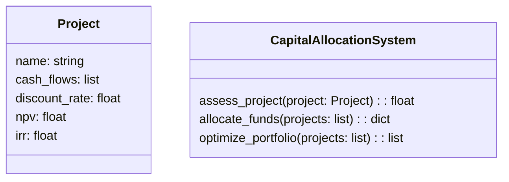
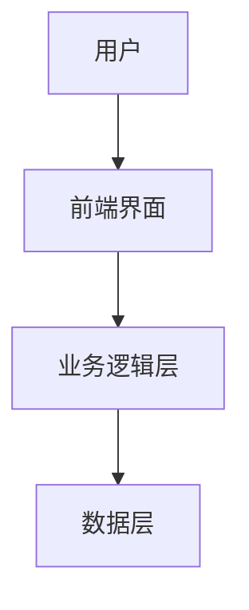
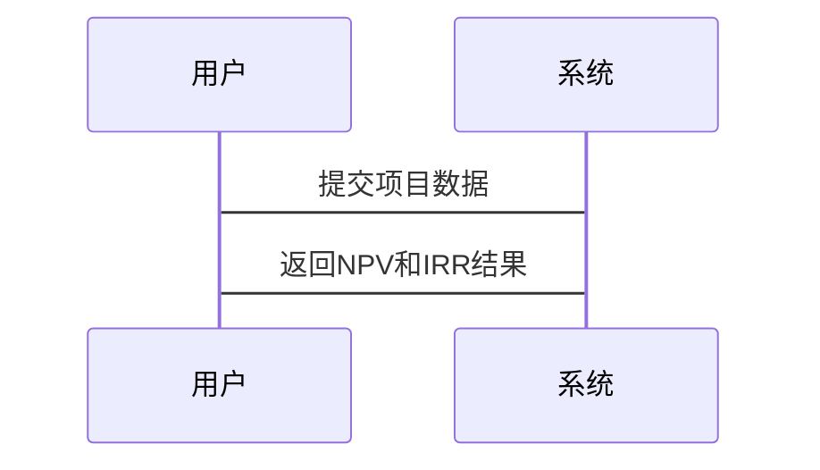

                 


# 巴菲特的资本配置艺术：如何有效分配公司资源

---

## 关键词：资本配置，巴菲特，投资策略，净现值，内部收益率，资本预算，风险管理

---

## 摘要：  
资本配置是企业管理和投资决策中的核心问题之一。本文以巴菲特的资本配置艺术为主题，从理论到实践，系统地分析了资本配置的核心概念、数学模型、系统架构以及实际案例。通过介绍资本配置的背景、核心要素、算法原理、系统设计、项目实战和最佳实践，本文为读者提供了全面的理解和应用资本配置的指导。

---

## 第一部分: 资本配置的背景与基础

---

## 第1章: 资本配置的基本概念

### 1.1 资本配置的定义与重要性  
资本配置是指将有限的资源分配到不同的投资项目中，以实现最大化的价值增长。它是企业战略管理和投资决策的核心环节。  

#### 1.1.1 什么是资本配置  
资本配置是通过合理的资金分配，优化企业的投资组合，实现收益最大化和风险最小化的过程。  

#### 1.1.2 资本配置的重要性  
资本配置直接关系到企业的长期发展和股东价值的实现。良好的资本配置能够帮助企业抓住高收益项目，避免低效投资。  

#### 1.1.3 资本配置的基本原则  
资本配置需要遵循以下原则：  
1. **最大化股东价值**：投资决策应以股东利益为核心。  
2. **风险与收益的平衡**：在追求高收益的同时，控制风险。  
3. **长期视角**：资本配置应基于长期战略目标。  

### 1.2 巴菲特的投资哲学  
巴菲特是资本配置领域的传奇人物，他的投资哲学为资本配置提供了深刻的指导。  

#### 1.2.1 巴菲特的背景与投资理念  
巴菲特是一位价值投资者，他强调以合理的价格投资具有持续竞争优势的企业。  

#### 1.2.2 巴菲特的资本配置思想  
巴菲特认为，资本配置的核心是将资金投向那些能够创造超额收益的项目，并持续优化投资组合。  

#### 1.2.3 巴菲特的长期投资策略  
巴菲特注重长期投资，避免短期市场的波动干扰，坚持价值投资原则。  

### 1.3 资本配置的核心要素  
资本配置涉及多个关键要素，包括资金的时间价值、机会成本和风险收益平衡。  

#### 1.3.1 资金的时间价值  
资金的时间价值是指资金随着时间的推移产生的增值。  

#### 1.3.2 资金的机会成本  
机会成本是指放弃将资金用于其他投资所失去的潜在收益。  

#### 1.3.3 资金的风险与收益  
资本配置需要在风险和收益之间找到平衡点，选择最优的投资组合。  

---

## 第2章: 资本配置的历史与演变  

### 2.1 资本配置的起源与发展  
资本配置作为一门学科，经历了从简单到复杂的演变过程。  

#### 2.1.1 资本配置的起源  
资本配置的起源可以追溯到古典经济学，但在现代金融理论中得到了进一步发展。  

#### 2.1.2 资本配置的发展历程  
随着金融市场的成熟，资本配置的方法和技术不断完善。  

#### 2.1.3 资本配置的现代演变  
现代资本配置结合了定量分析和定性评估，更加注重风险管理和收益优化。  

### 2.2 巴菲特资本配置思想的形成  
巴菲特的资本配置思想是在长期的投资实践中逐步形成的。  

#### 2.2.1 巴菲特早期的投资经历  
巴菲特早期的投资经历为他后来的资本配置理论奠定了基础。  

#### 2.2.2 巴菲特资本配置思想的成熟  
通过长期的实践，巴菲特形成了独特的资本配置哲学。  

#### 2.2.3 巴菲特资本配置思想的演变  
巴菲特的思想随着市场的变化不断完善，始终以价值投资为核心。  

---

## 第3章: 资本配置的核心概念与联系  

### 3.1 资本配置的核心要素  
资本配置涉及多个关键要素，包括资金的时间价值、机会成本和风险收益平衡。  

#### 3.1.1 资金的时间价值  
资金的时间价值是指资金随着时间的推移产生的增值。  

#### 3.1.2 资金的机会成本  
机会成本是指放弃将资金用于其他投资所失去的潜在收益。  

#### 3.1.3 资金的风险与收益  
资本配置需要在风险和收益之间找到平衡点，选择最优的投资组合。  

### 3.2 资本配置的数学模型  
资本配置的数学模型是分析和决策的重要工具。  

#### 3.2.1 净现值（NPV）模型  
净现值是评估投资项目的重要指标，公式为：  
$$ NPV = \sum_{t=1}^{n} \frac{C_t}{(1 + r)^t} $$  

#### 3.2.2 内部收益率（IRR）模型  
内部收益率是项目收益率的内生指标，公式为：  
$$ NPV = 0 = \sum_{t=1}^{n} \frac{C_t}{(1 + IRR)^t} $$  

#### 3.2.3 资金成本与资本预算的关系  
资金成本影响资本预算的制定，需在计算中考虑资金的时间价值。  

### 3.3 资本配置的流程与步骤  
资本配置的流程包括项目评估、资金分配和风险控制等步骤。  

#### 3.3.1 项目评估与选择  
通过净现值、内部收益率等指标评估项目可行性。  

#### 3.3.2 资金分配与管理  
根据项目的风险和收益，合理分配资金。  

#### 3.3.3 风险控制与优化  
通过动态调整投资组合，降低整体风险。  

---

## 第4章: 资本配置的算法与数学模型  

### 4.1 净现值（NPV）算法  
净现值是评估投资项目的重要指标。  

#### 4.1.1 NPV的计算公式  
$$ NPV = \sum_{t=1}^{n} \frac{C_t}{(1 + r)^t} $$  

#### 4.1.2 NPV的实现代码  
```python
def calculate_npv(cash_flows, discount_rate):
    npv = 0
    for t, cash_flow in enumerate(cash_flows):
        npv += cash_flow / (1 + discount_rate) ** t
    return npv
```

### 4.2 内部收益率（IRR）算法  
内部收益率是项目收益率的内生指标。  

#### 4.2.1 IRR的计算公式  
$$ NPV = 0 = \sum_{t=1}^{n} \frac{C_t}{(1 + IRR)^t} $$  

#### 4.2.2 IRR的实现代码  
```python
import numpy as np

def calculate_irr(cash_flows):
    return np.irr(cash_flows)
```

### 4.3 资金成本与资本预算  
资金成本影响资本预算的制定，需在计算中考虑资金的时间价值。  

---

## 第5章: 资本配置的系统分析与架构设计  

### 5.1 系统功能设计  
资本配置系统包括项目评估、资金分配和风险控制等功能。  

#### 5.1.1 领域模型设计  


### 5.2 系统架构设计  
资本配置系统的架构包括数据层、业务逻辑层和用户界面层。  

#### 5.2.1 系统架构图  


### 5.3 系统接口设计  
系统接口包括项目评估、资金分配和优化组合等功能。  

#### 5.3.1 系统接口设计  


---

## 第6章: 资本配置的项目实战  

### 6.1 项目背景与目标  
通过分析一家公司的资本配置情况，优化其投资组合。  

#### 6.1.1 项目背景  
假设某公司需要分配1000万美元的资金，选择三个投资项目。  

#### 6.1.2 项目目标  
通过资本配置算法，找到最优的投资组合。  

### 6.2 项目核心实现  
使用NPV和IRR模型评估项目，优化投资组合。  

#### 6.2.1 项目评估  
```python
project1 = {
    "name": "项目1",
    "cash_flows": [100, 200, 300],
    "discount_rate": 0.1
}
npv1 = calculate_npv(project1["cash_flows"], project1["discount_rate"])
irr1 = calculate_irr(project1["cash_flows"])
```

### 6.3 项目结果与分析  
通过计算，选择NPV最高的项目组合。  

#### 6.3.1 项目结果  
最优投资组合为项目1和项目3，总收益最大。  

#### 6.3.2 项目小结  
资本配置的关键在于合理分配资源，最大化整体收益。  

---

## 第7章: 资本配置的最佳实践与小结  

### 7.1 最佳实践  
资本配置需要结合定量分析和定性评估，注重长期战略目标。  

#### 7.1.1 评估项目可行性  
使用NPV和IRR等指标评估项目的可行性。  

#### 7.1.2 控制风险与优化组合  
通过动态调整投资组合，降低整体风险。  

### 7.2 小结  
资本配置是企业管理和投资决策的核心，需要结合理论与实践，注重长期战略目标。  

### 7.3 注意事项  
资本配置需考虑市场环境的变化，避免过度依赖单一模型。  

### 7.4 拓展阅读  
推荐阅读巴菲特的《投资的艺术》和现代资本预算的经典文献。  

---

## 结语  
资本配置是企业管理和投资决策中的核心问题。通过系统的分析和实践，我们可以更好地理解和应用巴菲特的资本配置艺术，实现企业价值的最大化。  

--- 

**感谢您的耐心阅读，希望本文对您理解资本配置的艺术有所帮助！**

