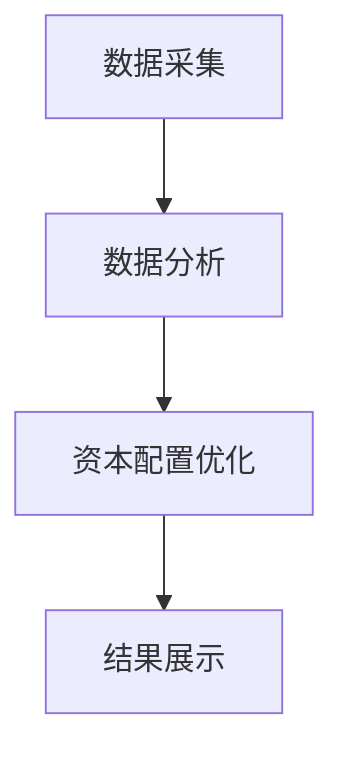

                 


# 巴菲特的资本配置艺术：数字化转型中的资源优化

## 关键词：资本配置，巴菲特，数字化转型，资源优化，投资策略，资产配置，技术应用

## 摘要：本文深入探讨了巴菲特的资本配置艺术，结合数字化转型背景，分析资源优化的关键策略。通过数学模型、系统架构设计和项目实战，展示了如何将巴菲特的投资理念与现代技术相结合，实现高效资本配置。

---

## 第1章：资本配置的定义与核心要素

### 1.1 资本配置的定义

资本配置是指将资金分配到不同资产或项目中，以实现收益最大化的过程。它涉及资产的选择、比例分配和风险控制。资本配置的目标是在风险可控的前提下，实现投资回报的最大化。

### 1.2 资本配置的核心要素

- **资产选择**：选择具有高回报潜力的资产。
- **比例分配**：根据风险承受能力分配各资产的比例。
- **风险控制**：通过分散投资降低风险。

### 1.3 资本配置的分类与特征

资本配置可分为传统模型和现代模型。传统模型侧重于资产类别分散，而现代模型则结合大数据和机器学习进行优化。下表对比了两种模型的优缺点：

| 特性        | 传统模型                 | 现代模型                 |
|-------------|--------------------------|--------------------------|
| 方法        | 资产分散                 | 数据驱动优化             |
| 优点        | 简单易行                 | 更高精度                 |
| 缺点        | 风险分散不足               | 计算复杂                 |

---

## 第2章：巴菲特的资本配置理论

### 2.1 巴菲特的投资理念

巴菲特倡导价值投资，注重企业基本面分析，长期持有优质资产。他的资本配置哲学强调选择具有持续竞争优势的企业。

### 2.2 成功案例分析

#### 2.2.1 可口可乐案例

巴菲特投资可口可乐，看重其强大的品牌和全球分销网络，长期持有带来稳定收益。

#### 2.2.2 富国银行案例

通过分析管理层和财务状况，巴菲特选择投资富国银行，实现资本增值。

---

## 第3章：数字化转型中的资本配置挑战

### 3.1 数字化转型背景

数字化转型通过大数据、AI等技术改变商业模式，资本配置需适应这些变化。

### 3.2 挑战分析

技术变革要求资本配置更具灵活性和数据驱动，同时需应对不确定性和市场波动。

---

## 第4章：资本配置的数学模型与算法

### 4.1 资本配置的数学模型

#### 4.1.1 资产组合理论

马科维茨的有效前沿模型通过最大化收益和最小化风险，确定最优投资组合。

#### 4.1.2 夏普比率

夏普比率衡量投资回报相对于风险的超额收益。

#### 4.1.3 CAPM模型

CAPM模型计算资产的预期收益，考虑系统性风险。

### 4.2 算法实现

使用Python实现资产组合优化，代码如下：

```python
import numpy as np
import matplotlib.pyplot as plt

# 示例数据
returns = np.array([[0.1, 0.2], [0.2, 0.15], [0.15, 0.25]])

# 计算有效前沿
def portfoliooptimize(returns, weights):
    return np.dot(returns, weights)

# 使用拉格朗日乘数法求解
# (省略详细代码实现)
```

---

## 第5章：系统架构设计

### 5.1 系统架构

系统模块包括数据采集、分析、优化和展示，使用Mermaid绘制架构图：



### 5.2 系统功能设计

系统模块划分：

- 数据采集：获取市场数据。
- 数据分析：计算资产回报和风险。
- 优化模块：应用算法优化配置。
- 展示模块：呈现结果。

---

## 第6章：项目实战

### 6.1 项目背景

构建数字化资本配置系统，帮助投资者优化资产配置。

### 6.2 系统实现

环境安装：安装Python和相关库，如NumPy和Pandas。

核心代码实现：

```python
import numpy as np

def compute_return(weights, returns):
    return np.dot(weights, returns)

# 示例优化
weights = np.array([0.5, 0.5])
returns = np.array([0.1, 0.2])
print(compute_return(weights, returns))
```

### 6.3 案例分析

分析可口可乐的投资，应用优化模型，验证资本配置的高效性。

---

## 最佳实践

### 小结

数字化转型中，资本配置需结合巴菲特的长期投资理念和现代技术，实现优化。

### 注意事项

- 数据质量影响结果，需谨慎处理。
- 算法选择需根据实际情况调整。
- 持续学习市场变化，优化配置。

### 拓展阅读

推荐书籍：《投资最重要的少数的事》。

---

通过以上结构，文章系统地介绍了资本配置的艺术，结合巴菲特的理论和数字化技术，提供了深入的分析和实践指导。

