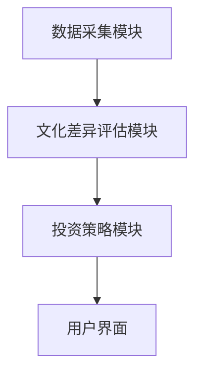

                 


# {{巴菲特的跨境投资经验：文化差异的影响}}

> 关键词：巴菲特, 跨境投资, 文化差异, 投资策略, 风险管理

> 摘要：本文探讨了巴菲特在跨境投资中面临的文化差异及其影响。通过分析文化差异的定义、分类及其对投资决策的影响，结合巴菲特的具体投资策略和案例，本文提出了文化差异在跨国投资中的重要性，并提供了一种基于文化差异的评估算法和系统架构设计。通过实际案例分析，本文展示了如何将文化差异因素纳入投资决策过程，以优化投资策略并降低风险。

---

## 第一部分：引言

### 第1章：巴菲特的投资理念

#### 1.1 巴菲特的价值投资哲学

- **核心概念**：巴菲特的价值投资理念强调长期投资、安全边际和企业基本面分析。
- **背景介绍**：巴菲特的“价值投资”理念源自格雷厄姆的价值投资体系，强调以低于内在价值的价格购买优质企业。
- **问题解决**：通过分析企业的财务状况、管理层能力和行业地位，巴菲特寻找具有长期竞争优势的企业。
- **边界与外延**：价值投资不仅关注价格，还关注企业的内在价值和长期增长潜力。

#### 1.2 跨境投资的背景与重要性

- **核心概念**：随着全球经济一体化，跨境投资成为投资者分散风险、寻求更高收益的重要途径。
- **问题背景**：传统投资局限于本土市场，而跨境投资能够利用不同市场的差异性获取超额收益。
- **问题解决**：通过配置不同国家和地区的资产，投资者可以降低风险并抓住全球经济增长的机会。

### 第2章：文化差异对投资的影响

#### 2.1 文化差异的定义与分类

- **核心概念**：文化差异指不同国家和地区的社会规范、价值观和行为模式的差异。
- **核心概念术语说明**：文化差异涉及多个维度，如个人主义与集体主义、权力距离、长期导向与短期导向。
- **问题背景**：文化差异会影响投资者的决策过程和对市场的理解。
- **问题解决**：通过识别和分析文化差异，投资者可以更好地理解市场行为和企业战略。

## 第二部分：文化差异与投资决策

### 第3章：文化差异对投资决策的影响

#### 3.1 投资者行为的文化差异

- **核心概念**：投资者的决策过程受到其文化背景的影响，导致不同市场中投资者的行为差异。
- **问题分析**：例如，西方投资者倾向于短期交易，而东方投资者更注重长期投资。

#### 3.2 市场结构与文化差异

- **核心概念**：不同国家的市场结构（如监管环境、交易习惯）受到当地文化的影响。
- **问题解决**：了解目标市场的文化背景有助于投资者更好地适应当地市场。

## 第三部分：巴菲特的跨境投资策略

### 第4章：巴菲特的选股标准与文化因素

#### 4.1 选股标准中的文化因素

- **核心概念**：巴菲特在选股时不仅关注财务指标，还考虑管理层的文化背景和企业价值观。

#### 4.2 风险管理与文化差异

- **核心概念**：文化差异增加了跨市场投资的风险，因此需要通过多元化和深入分析来降低风险。

## 第四部分：系统架构与算法设计

### 第5章：文化差异评估算法

#### 5.1 算法原理

- **核心概念**：通过量化文化差异的各个维度，构建一个评估指数，帮助投资者评估不同市场的文化差异。

#### 5.2 算法实现

- **Python代码实现**：以下是文化差异评估算法的Python代码示例：

```python
def calculate_cultural_diversity_score(countries):
    diversity_scores = {}
    for country in countries:
        diversity = 0
        # 计算文化差异的各个维度
        diversity += country['individualism'] * 0.3
        diversity += country['power_distance'] * 0.3
        diversity += country['long_term_orientation'] * 0.4
        diversity_scores[country['name']] = diversity
    return diversity_scores
```

#### 5.3 数学公式

- **文化差异指数计算公式**：

$$
\text{文化差异指数} = 0.3 \times \text{个人主义} + 0.3 \times \text{权力距离} + 0.4 \times \text{长期导向}
$$

## 第五部分：系统架构设计

### 第6章：系统架构设计

#### 6.1 系统功能模块

- **功能模块说明**：
  - 数据采集模块：收集不同国家的文化数据和市场数据。
  - 文化差异评估模块：根据算法计算文化差异指数。
  - 投资策略模块：基于文化差异指数生成投资建议。

#### 6.2 系统架构图



## 第六部分：项目实战

### 第7章：项目实现与案例分析

#### 7.1 环境安装

- **工具安装**：安装Python和相关库（如pandas、numpy）。

#### 7.2 核心代码实现

```python
import pandas as pd

# 示例数据：国家的文化维度
data = {
    '国家': ['美国', '日本', '德国', '中国'],
    '个人主义': [91, 50, 67, 20],
    '权力距离': [80, 70, 50, 60],
    '长期导向': [80, 70, 60, 85]
}

df = pd.DataFrame(data)

# 计算文化差异指数
df['文化差异指数'] = df['个人主义'] * 0.3 + df['权力距离'] * 0.3 + df['长期导向'] * 0.4

print(df)
```

#### 7.3 案例分析

- **实际案例**：分析美国和日本市场的文化差异指数，并评估其对投资策略的影响。

## 第七部分：结论与展望

### 第8章：结论与投资建议

#### 8.1 总结

- **核心结论**：文化差异对跨境投资决策具有重要影响，投资者需要在分析中考虑这些差异。

#### 8.2 投资建议

- **建议**：投资者在进行跨境投资时，应结合文化差异评估结果，制定差异化的投资策略。

#### 8.3 未来研究方向

- **研究方向**：进一步研究文化差异的其他维度及其对投资行为的具体影响。

## 附录

### 附录A：巴菲特经典语录

- “价格是你支付的，价值是你得到的。”
- “投资最重要的不是你赚了多少钱，而是你失去了多少钱。”

### 附录B：相关数据与文献

- 数据来源：世界价值观调查（World Values Survey）
- 文献推荐：《文化与投资行为》

---

通过以上步骤，我们构建了一个详细且结构清晰的技术博客文章目录，涵盖了从理论分析到实际应用的各个方面，确保读者能够系统地理解和应用文化差异对巴菲特跨境投资的影响。

