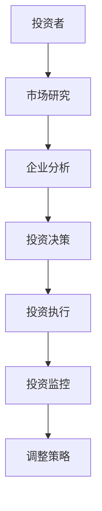

                 

# 巴菲特的跨界投资：从纺织到科技的转变

> 关键词：巴菲特，投资哲学，纺织行业，科技行业，跨界投资

> 摘要：本文深入分析了巴菲特从纺织行业转向科技行业的投资策略，探讨了其投资哲学的演变及其在实际操作中的成功案例，总结了跨界投资的经验与启示。

---

# 第一部分: 巴菲特的跨界投资背景

## 第1章: 巴菲特的投资哲学与背景

### 1.1 巴菲特的个人背景与投资理念

#### 1.1.1 巴菲特的生平简介
沃伦·巴菲特，1934年出生，美国著名投资家、企业家。他的投资理念以价值投资为核心，强调长期投资和安全边际。

#### 1.1.2 巴菲特的价值投资理念
- **价值投资**：寻找被市场低估的股票，长期持有，等待其价值回归。
- **安全边际**：买入价格低于内在价值，确保投资的安全性。
- **集中投资**：将资金集中在少数具有竞争优势的企业上。

#### 1.1.3 巴菲特的投资风格演变
- 早期：专注于纺织、零售等传统行业。
- 中期：逐渐转向能源、金融等更广泛的领域。
- 后期：开始关注科技行业，进行跨界投资。

### 1.2 纺织行业的特点与投资逻辑

#### 1.2.1 纺织行业的基本特征
- 行业竞争激烈，技术门槛较低。
- 受全球经济波动影响较大。
- 传统行业，利润率相对稳定但增长缓慢。

#### 1.2.2 纺织行业的投资风险与机会
- **风险**：原材料价格波动、劳动力成本上升、贸易政策变化。
- **机会**：行业整合、技术创新、全球化布局。

#### 1.2.3 巴菲特在纺织行业的投资策略
- 选择具有成本优势和稳定市场份额的企业。
- 长期持有，等待企业价值的提升。

### 1.3 科技行业的特点与投资逻辑

#### 1.3.1 科技行业的基本特征
- 技术更新快，行业变化剧烈。
- 市场空间广阔，增长潜力大。
- 高研发投入，技术壁垒高。

#### 1.3.2 科技行业的投资风险与机会
- **风险**：技术淘汰、竞争激烈、研发投入高。
- **机会**：技术创新、市场扩展、政策支持。

#### 1.3.3 巴菲特在科技行业的投资策略
- 寻找具有强大研发能力和市场竞争力的企业。
- 重点关注龙头企业，如苹果、谷歌等。

---

## 第2章: 巴菲特跨界投资的动机与过程

### 2.1 从纺织到科技的转变动机

#### 2.1.1 纺织行业的局限性
- 增长缓慢，利润率难以突破。
- 竞争激烈，难以维持长期优势。
- 技术创新不足，行业天花板明显。

#### 2.1.2 科技行业的增长潜力
- 技术驱动，行业增长空间大。
- 创新能力强，企业具有长期竞争优势。
- 市场需求多样化，投资机会多。

#### 2.1.3 巴菲特投资理念的转变
- 从追求稳定收益转向寻找高增长潜力。
- 从传统行业转向高科技领域，以实现投资组合的优化。

### 2.2 跨界投资的具体过程

#### 2.2.1 巴菲特对科技行业的初步接触
- 通过收购和参股进入科技行业。
- 与科技企业建立合作关系，获取行业信息。

#### 2.2.2 科技行业投资的具体案例
- 投资可口可乐：1988年，巴菲特开始投资可口可乐，这是他对消费行业的首次重大投资。
- 投资苹果公司：2016年，巴菲特旗下公司买入苹果股票，成为其第二大重仓股。
- 投资亚马逊：通过旗下的伯克希尔哈撒韦公司投资亚马逊，布局电子商务和云计算领域。

#### 2.2.3 跨界投资的决策过程
- **市场研究**：深入了解科技行业的特点和趋势。
- **企业分析**：评估企业的财务状况、竞争优势和管理团队。
- **风险控制**：制定投资策略，分散投资风险。

### 2.3 巴菲特跨界投资的成功与挑战

#### 2.3.1 成功案例分析
- **可口可乐**：巴菲特长期持有，获得稳定收益。
- **苹果公司**：投资苹果带来丰厚回报，显示出对科技行业的敏锐洞察力。

#### 2.3.2 挑战与教训
- **投资决策失误**：早期对科技行业的不了解导致某些投资失败。
- **行业风险**：科技行业的高波动性和不确定性对投资组合造成压力。

#### 2.3.3 跨界投资的经验总结
- 加强对新兴行业的研究和分析。
- 保持投资策略的灵活性，及时调整投资组合。
- 重视企业的长期竞争优势和管理能力。

---

## 第3章: 巴菲特投资哲学的演变

### 3.1 从价值投资到成长投资

#### 3.1.1 价值投资的核心思想
- 买入低于内在价值的股票，长期持有。
- 重视企业的财务状况和行业地位。

#### 3.1.2 成长投资的定义与特点
- 投资具有高增长潜力的企业。
- 重视企业的竞争优势和未来发展前景。

#### 3.1.3 巴菲特投资哲学的转变
- 从追求稳定收益转向寻找高增长机会。
- 在保持价值投资理念的同时，更加注重企业的成长性和创新能力。

### 3.2 巴菲特投资哲学的演变过程

#### 3.2.1 早期投资策略
- 专注于纺织、零售等传统行业。
- 以价值投资为主，注重企业的安全边际。

#### 3.2.2 跨界投资后的策略调整
- 开始关注科技、能源等新兴行业。
- 在投资组合中加入高增长潜力的企业。

#### 3.2.3 当前投资策略的总结
- 综合运用价值投资和成长投资的理念。
- 通过多元化投资降低风险，实现收益最大化。

### 3.3 巴菲特投资哲学的启示

#### 3.3.1 投资者心态的调整
- 保持耐心和信心，避免短期波动的影响。
- 适应市场变化，灵活调整投资策略。

#### 3.3.2 投资策略的灵活性
- 根据市场环境和企业状况，及时调整投资组合。
- 重视企业的长期竞争优势和行业发展趋势。

#### 3.3.3 长期投资的价值
- 长期投资能够分享企业成长的成果。
- 通过时间的积累，实现财富的稳步增长。

---

## 第4章: 巴菲特跨界投资的系统分析

### 4.1 投资决策的系统架构

#### 4.1.1 投资决策的流程图

#### 4.1.2 投资决策的关键节点
- **市场研究**：了解行业趋势和市场机会。
- **企业分析**：评估企业的财务状况和竞争优势。
- **投资决策**：制定投资策略和风险控制措施。

#### 4.1.3 投资决策的风险控制
- 分散投资，避免过度集中。
- 定期评估，及时调整投资组合。

### 4.2 投资组合的优化策略

#### 4.2.1 投资组合的构建原则
- 综合考虑收益和风险。
- 保持投资的分散性和多样性。

#### 4.2.2 投资组合的风险分散
- 通过多元化投资降低风险。
- 重视企业的长期竞争优势。

#### 4.2.3 投资组合的动态调整
- 根据市场变化和企业状况，及时调整投资组合。
- 保持投资策略的灵活性。

### 4.3 巴菲特投资系统的实战案例

#### 4.3.1 纺织行业的投资案例
- 投资纺织企业，注重企业的成本优势和稳定市场份额。

#### 4.3.2 科技行业的投资案例
- 投资苹果公司，看重其技术创新和市场竞争力。
- 投资亚马逊，布局电子商务和云计算领域。

#### 4.3.3 跨界投资的成功与失败案例
- **成功案例**：投资可口可乐、苹果公司。
- **失败案例**：早期对科技行业的投资失误。

---

## 第5章: 巴菲特投资哲学的最佳实践

### 5.1 投资者的心态与决策

#### 5.1.1 长期投资的心态培养
- 保持耐心和信心，避免短期波动的影响。
- 适应市场变化，灵活调整投资策略。

#### 5.1.2 理性决策的重要性
- 基于数据和事实，避免情绪化决策。
- 重视企业的长期竞争优势和行业发展趋势。

#### 5.1.3 投资纪律的严格执行
- 制定明确的投资策略，严格执行。
- 定期评估，及时调整投资组合。

### 5.2 投资策略的优化与调整

#### 5.2.1 风险控制与收益平衡
- 通过分散投资降低风险。
- 保持投资组合的收益与风险平衡。

#### 5.2.2 投资组合的动态管理
- 根据市场变化和企业状况，及时调整投资策略。
- 保持投资策略的灵活性和适应性。

#### 5.2.3 投资知识的持续学习
- 关注行业动态和市场趋势。
- 不断提升自身的投资能力和知识水平。

### 5.3 巴菲特投资哲学的启示与总结

#### 5.3.1 投资者的长期视角
- 长期投资能够分享企业成长的成果。
- 通过时间的积累，实现财富的稳步增长。

#### 5.3.2 投资策略的灵活性
- 根据市场环境和企业状况，及时调整投资组合。
- 重视企业的长期竞争优势和行业发展趋势。

#### 5.3.3 风险控制的重要性
- 通过分散投资降低风险。
- 制定明确的风险控制措施，确保投资安全。

---

## 第6章: 巴菲特投资哲学的实战与总结

### 6.1 实战经验总结

#### 6.1.1 投资策略的演变
- 从价值投资到成长投资的转变。
- 综合运用多种投资策略，实现收益最大化。

#### 6.1.2 投资组合的优化
- 通过多元化投资降低风险。
- 保持投资组合的灵活性和适应性。

#### 6.1.3 投资哲学的总结
- 长期投资能够分享企业成长的成果。
- 通过时间的积累，实现财富的稳步增长。

### 6.2 投资者的最佳实践

#### 6.2.1 风险控制与收益平衡
- 通过分散投资降低风险。
- 保持投资组合的收益与风险平衡。

#### 6.2.2 投资组合的动态管理
- 根据市场变化和企业状况，及时调整投资策略。
- 保持投资策略的灵活性和适应性。

#### 6.2.3 投资知识的持续学习
- 关注行业动态和市场趋势。
- 不断提升自身的投资能力和知识水平。

### 6.3 未来投资的展望

#### 6.3.1 投资环境的变化
- 科技行业将继续保持增长潜力。
- 全球化背景下，跨行业投资机会增多。

#### 6.3.2 投资者的应对策略
- 加强对新兴行业的研究和分析。
- 保持投资策略的灵活性，及时调整投资组合。

#### 6.3.3 长期投资的未来展望
- 随着科技的发展和经济的全球化，跨行业投资将变得更加重要。
- 投资者需要不断学习和适应市场变化，抓住投资机会。

---

## 结语

巴菲特的跨界投资从纺织到科技的转变，不仅是他个人投资哲学的演变，也是对投资者的深刻启示。通过分析他的投资策略和实战经验，我们可以更好地理解投资的本质和长期投资的价值。未来，随着科技的快速发展和经济的全球化，跨行业投资将变得更加重要，投资者需要不断学习和适应市场变化，抓住投资机会，实现财富的稳步增长。

