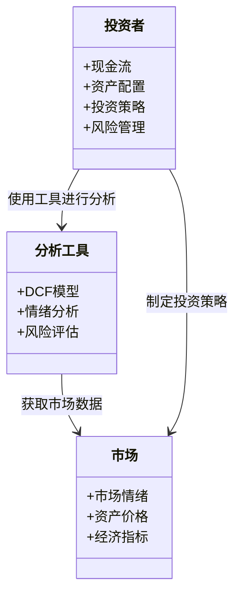
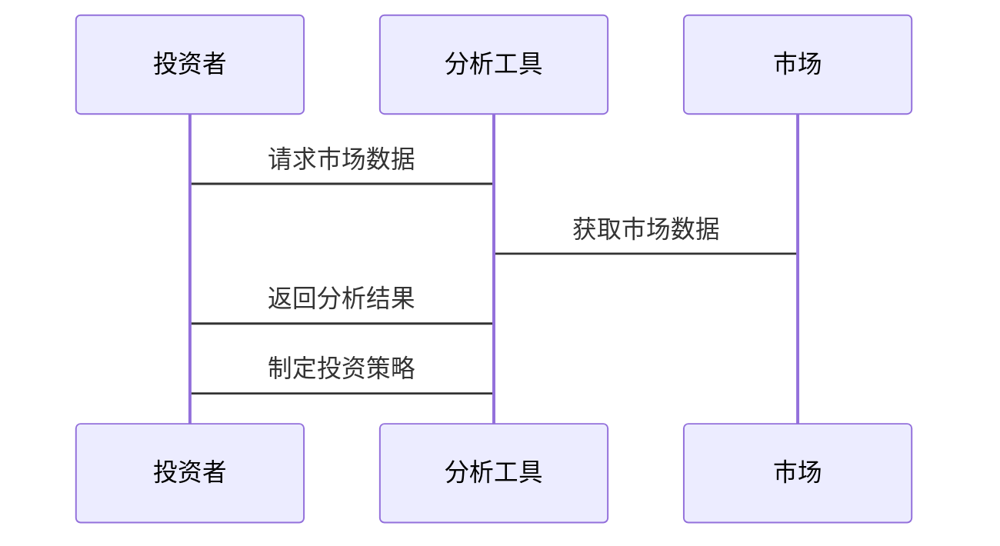

                 


# 巴菲特的逆向投资思维

## 关键词
- 逆向思维
- 巴菲特
- 投资策略
- 价值投资
- 风险管理
- 市场分析
- 投资哲学

## 摘要
逆向思维是一种在投资领域中极具价值的策略，它帮助投资者在市场中找到低估的机会，避免随波逐流。本文详细探讨了巴菲特如何运用逆向思维进行投资，并分析了其背后的哲学和数学模型。通过系统分析和项目实战，展示了逆向思维的实际应用，帮助读者提升投资决策能力。

---

# 第1章: 逆向思维的定义与背景

## 1.1 逆向思维的定义
### 1.1.1 逆向思维的定义与特点
逆向思维是一种与传统思维相反的思维方式，它通过反向思考问题，寻找独特的解决方案。其特点包括独特性、创新性和高效性，能够在复杂问题中找到突破口。

### 1.1.2 逆向思维与传统投资思维的区别
传统投资思维依赖市场趋势和情绪，而逆向思维则关注市场低估和非共识机会。逆向思维强调独立思考，避免随大流。

### 1.1.3 逆向思维在投资中的重要性
逆向思维帮助投资者在市场恐慌时发现价值，避免过度乐观时的错误决策，从而在长期获得超额收益。

## 1.2 巴菲特的投资理念
### 1.2.1 巴菲特的生平与投资风格
巴菲特作为价值投资的倡导者，注重企业的内在价值，而非市场的短期波动。他的投资风格以长期持有和安全边际为核心。

### 1.2.2 巴菲特的核心投资原则
巴菲特定律：投资于自己理解的领域，寻找具有持续竞争优势的企业，以合理价格买入并长期持有。

### 1.2.3 逆向思维与巴菲特投资理念的结合
巴菲特在市场恐慌时大量买入优质资产，逆向思维帮助他在市场低谷时发现价值，实现长期收益。

## 1.3 逆向思维在投资中的应用背景
### 1.3.1 传统投资思维的局限性
传统思维容易受到市场情绪影响，导致追涨杀跌，逆向思维则帮助投资者避免这种错误。

### 1.3.2 逆向思维的优势与适用场景
逆向思维在市场低估、恐慌时特别有效，适合寻找长期价值投资者。

### 1.3.3 逆向思维与价值投资的结合
价值投资强调寻找低估资产，逆向思维通过反向思考市场情绪，帮助发现这些低估资产。

## 1.4 本章小结
### 1.4.1 逆向思维的核心概念
逆向思维是一种反向思考问题的策略，帮助投资者在市场中找到低估机会。

### 1.4.2 巴菲特投资理念的总结
巴菲特的投资理念强调长期价值、安全边际和独立思考。

### 1.4.3 逆向思维在投资中的潜在价值
逆向思维帮助投资者避免随波逐流，发现市场中的非共识机会，实现超额收益。

---

# 第2章: 逆向思维的核心概念与原理

## 2.1 逆向思维的核心概念
### 2.1.1 逆向思维的逻辑框架
通过反向思考市场行为和情绪，寻找与市场预期相反的机会。

### 2.1.2 逆向思维的三大核心要素
- 市场情绪：分析市场的过度乐观或悲观。
- 价值评估：寻找市场价格与内在价值的差异。
- 时间因素：利用市场的短期波动，寻找长期价值。

### 2.1.3 逆向思维的数学模型与公式
逆向思维可以通过数学模型进行量化分析，例如：
$$ V = \frac{CF}{r} $$
其中，V为内在价值，CF为现金流，r为折现率。

## 2.2 逆向思维的原理与机制
### 2.2.1 逆向思维的心理学基础
市场参与者通常受情绪影响，逆向思维通过分析这些情绪偏差，寻找定价错误。

### 2.2.2 逆向思维的行为学特征
逆向思维者倾向于逆市场潮流而动，寻找非共识性的机会。

### 2.2.3 逆向思维的决策过程分析
逆向思维通过反向分析市场行为，寻找价格与价值的错配，做出反向投资决策。

## 2.3 逆向思维的核心算法
### 2.3.1 逆向思维的算法模型
逆向思维模型包括情绪分析、价值评估和策略制定三个步骤。

### 2.3.2 逆向思维的数学公式推导
通过DCF模型量化企业内在价值，与市场价格进行对比，寻找低估机会。

### 2.3.3 逆向思维的算法实现与优化
使用Python编写DCF模型代码，计算企业内在价值，与市场价格对比，寻找投资机会。

## 2.4 本章小结
### 2.4.1 逆向思维的核心概念总结
逆向思维通过反向思考市场行为，寻找价格与价值的错配。

### 2.4.2 逆向思维的原理与机制
逆向思维基于心理学和行为学分析，利用市场情绪偏差寻找投资机会。

### 2.4.3 逆向思维算法的数学模型与优化
通过DCF模型量化分析，实现逆向思维的算法优化。

---

# 第3章: 逆向思维在投资中的应用

## 3.1 逆向思维在股票投资中的应用
### 3.1.1 逆向思维在选股中的应用
寻找市场关注度低但具有稳定现金流的企业。

### 3.1.2 逆向思维在股票估值中的应用
通过DCF模型计算内在价值，寻找价格低于价值的股票。

### 3.1.3 逆向思维在市场周期中的应用
在市场恐慌时寻找优质资产，长期持有。

## 3.2 逆向思维在风险管理中的应用
### 3.2.1 逆向思维在风险识别中的应用
识别市场过度乐观带来的风险，提前规避。

### 3.2.2 逆向思维在风险评估中的应用
通过逆向分析市场行为，评估潜在风险。

### 3.2.3 逆向思维在风险控制中的应用
设置止损点，控制回撤，避免过度损失。

## 3.3 逆向思维在投资组合中的应用
### 3.3.1 逆向思维在资产配置中的应用
根据市场情绪调整资产配置比例，逆市增加价值投资比例。

### 3.3.2 逆向思维在分散投资中的应用
通过逆向思维选择多个低估资产，分散风险。

### 3.3.3 逆向思维在投资策略中的应用
制定逆向投资策略，定期审视并调整投资组合。

## 3.4 本章小结
### 3.4.1 逆向思维在股票投资中的应用总结
逆向思维帮助投资者在市场低估时买入优质资产，长期持有。

### 3.4.2 逆向思维在风险管理中的应用总结
通过逆向分析市场行为，识别和控制潜在风险。

### 3.4.3 逆向思维在投资组合中的应用总结
逆向思维帮助投资者制定有效的资产配置和风险控制策略。

---

# 第4章: 逆向思维的系统分析与架构设计

## 4.1 问题场景介绍
投资者在市场波动中如何利用逆向思维制定投资策略，系统化地进行投资决策。

## 4.2 系统功能设计
### 4.2.1 领域模型设计
使用Mermaid类图展示投资决策的各个角色和交互。



### 4.2.2 系统架构设计
使用Mermaid架构图展示系统整体架构。

```mermaid
architecturalDiagram
    partitions {
        投资者
        市场
        工具
    }
    投资者 ---(通过)--> 工具
    工具 ---(分析)--> 市场
```

### 4.2.3 系统接口设计
定义投资者与分析工具、市场之间的接口，确保数据流的顺畅。

### 4.2.4 系统交互设计
使用Mermaid序列图展示投资者与系统的交互流程。



## 4.3 本章小结
### 4.3.1 问题场景总结
逆向思维帮助投资者在复杂市场中制定有效策略。

### 4.3.2 系统功能与架构总结
系统化的方法帮助投资者高效地进行逆向思维分析。

---

# 第5章: 项目实战

## 5.1 环境安装
安装Python和必要的库，如numpy、pandas、scipy。

## 5.2 核心实现源代码
使用Python编写DCF模型代码，计算企业内在价值。

```python
import numpy as np
import pandas as pd

def calculate_intrinsic_value(fcf, discount_rate):
    return fcf / (1 + discount_rate)

# 示例数据
free_cash_flow = 100
discount_rate = 0.1

intrinsic_value = calculate_intrinsic_value(free_cash_flow, discount_rate)
print(f"内在价值: {intrinsic_value}")
```

## 5.3 代码应用解读与分析
解释代码的功能，展示如何通过DCF模型量化企业价值。

## 5.4 案例分析
选择具体企业，进行逆向思维分析，展示如何发现低估机会。

## 5.5 本章小结
### 5.5.1 项目实战总结
逆向思维分析帮助投资者发现低估资产，制定有效投资策略。

### 5.5.2 代码实现与案例分析
通过代码和案例展示逆向思维的实际应用。

---

# 第6章: 最佳实践与总结

## 6.1 逆向思维的应用技巧
保持独立思考，避免市场情绪影响，定期审视投资组合。

## 6.2 小结
逆向思维是投资中的重要策略，帮助投资者发现价值，实现长期收益。

## 6.3 注意事项
逆向思维需要结合市场环境和企业基本面，避免盲目投资。

## 6.4 拓展阅读
推荐相关书籍和文章，深入学习逆向思维和价值投资。

---

# 结语

逆向思维是巴菲特投资成功的重要因素，通过本文的系统分析和实战案例，读者可以更好地理解和应用逆向思维，制定更有效的投资策略。持续学习和独立思考是提升投资能力的关键，希望本文能为读者的投资之路提供有价值的指导。

---

