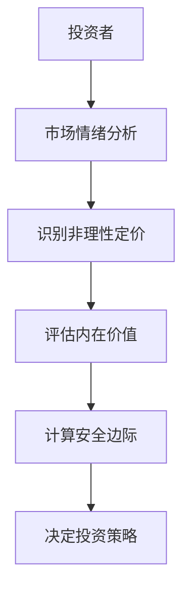
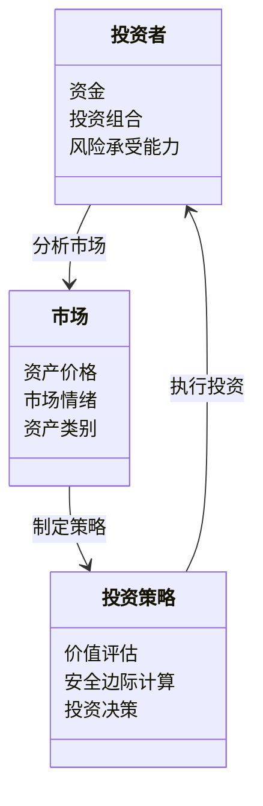
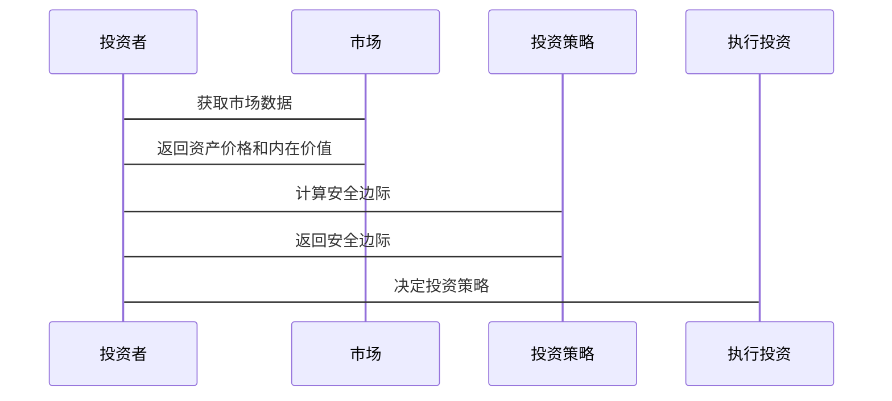

                 


```markdown
# 巴菲特的逆向投资思维：贪婪与恐惧

> 关键词：逆向投资，巴菲特，贪婪，恐惧，价值投资，安全边际

> 摘要：本文深入探讨了巴菲特的逆向投资策略，分析了贪婪与恐惧在投资中的作用，结合价值投资的核心理念，通过数学模型和实际案例，详细讲解了如何利用这些心理因素进行投资决策。文章从背景介绍到系统分析，再到实战案例，全面阐述了逆向投资的哲学、方法和应用。

---

# 第一部分: 巴菲特的逆向投资思维概述

## 第1章: 逆向投资的定义与核心理念

### 1.1 逆向投资的定义与核心理念
#### 1.1.1 逆向投资的定义
逆向投资是一种不同于传统投资的策略，它强调在市场恐慌或极度乐观时，逆市场情绪进行投资。通过分析市场非理性行为，寻找被低估或高估的资产。

#### 1.1.2 巴菲特逆向投资的核心理念
- **价值投资**：寻找具有长期竞争优势和良好管理的公司，以低于其内在价值的价格买入。
- **安全边际**：确保买入价格远低于内在价值，以降低风险并提高收益。
- **市场先生**：将市场波动视为市场先生的情绪化表现，利用其非理性定价。

#### 1.1.3 逆向投资与传统投资的区别
- **传统投资**：基于趋势和市场情绪，顺势而为。
- **逆向投资**：基于价值和市场非理性，逆势而为。

### 1.2 贪婪与恐惧在投资中的作用
#### 1.2.1 贪婪的定义与表现
- **贪婪**：投资者在市场上涨时过度乐观，追求高收益，导致高估资产价格。
- **表现**：市场泡沫的形成，投资者盲目追涨。

#### 1.2.2 恐惧的定义与表现
- **恐惧**：投资者在市场下跌时过度悲观，抛售资产，导致资产价格低估。
- **表现**：市场底部的出现，投资者恐慌性抛售。

#### 1.2.3 贪婪与恐惧对市场的影响
- **市场周期**：贪婪推动市场上涨，恐惧导致市场下跌。
- **非理性定价**：贪婪和恐惧导致资产价格偏离其内在价值。

### 1.3 巴菲特逆向投资的哲学基础
#### 1.3.1 价值投资的起源
- 价值投资由本杰明·格雷厄姆提出，强调寻找具有安全边际的低估资产。
- 巴菲特师承格雷厄姆，发展了价值投资的理念。

#### 1.3.2 巴菲特的投资理念
- **长期投资**：关注企业的长期价值，而非短期波动。
- **安全边际**：买入价格远低于内在价值，以确保投资的安全性。
- **能力圈**：专注于自己熟悉的行业和企业，避免盲目投资。

#### 1.3.3 逆向投资的哲学意义
- 利用市场的非理性，寻找投资机会。
- 通过逆向思维，获得超额收益。

---

# 第二部分: 逆向投资的核心概念与联系

## 第2章: 核心概念的原理

### 2.1 安全边际的计算
#### 2.1.1 安全边际的定义
安全边际 = 内在价值 - 市场价格

#### 2.1.2 内在价值的评估
- 内在价值是未来现金流的现值，通过DCF模型计算。
- 例如：假设一家公司未来现金流为100万元，折现率为10%，则内在价值为100 / (1.1)^n。

### 2.2 市场情绪的分析
#### 2.2.1 市场情绪的指标
- 市盈率（P/E）：市场价格 / 每股收益
- 市净率（P/B）：市场价格 / 每股净资产

#### 2.2.2 市场情绪与投资决策
- 当市场情绪乐观时，高估资产价格，寻找低估资产。
- 当市场情绪悲观时，低估资产价格，寻找高估资产。

### 2.3 投资者心理偏差
#### 2.3.1 心理偏差的类型
- **确认偏见**：投资者倾向于寻找支持自己观点的信息，忽视相反证据。
- **损失厌恶**：投资者对损失的厌恶程度高于对收益的追求。

#### 2.3.2 心理偏差对投资决策的影响
- **贪婪导致过度投资**：投资者在市场上涨时，倾向于追高，忽视风险。
- **恐惧导致错失投资机会**：投资者在市场下跌时，倾向于抛售，错失抄底机会。

---

## 第3章: 逆向投资的算法原理

### 3.1 算法原理的数学模型

#### 3.1.1 安全边际计算公式
$$ 安全边际 = 内在价值 - 市场价格 $$

#### 3.1.2 内在价值评估公式
$$ 内在价值 = \frac{未来现金流的现值}{折现率} $$

### 3.2 算法流程图


### 3.3 算法实现的Python代码
```python
def calculate_margin_of_safety(intrinsic_value, market_price):
    return intrinsic_value - market_price

# 示例：评估一家公司的安全边际
intrinsic_value = 100  # 内在价值
market_price = 80      # 市场价格
margin_of_safety = calculate_margin_of_safety(intrinsic_value, market_price)
print(f"安全边际为：{margin_of_safety}")
```

---

## 第4章: 逆向投资的系统分析与架构设计

### 4.1 系统功能设计（领域模型）



### 4.2 系统架构设计


### 4.3 系统接口设计

- **接口1：获取市场数据**
  ```python
  def get_market_data(asset):
      return asset.price, asset.intrinsic_value
  ```

- **接口2：计算安全边际**
  ```python
  def calculate_margin_of_safety(intrinsic_value, market_price):
      return intrinsic_value - market_price
  ```

### 4.4 系统交互流程图



---

## 第5章: 逆向投资的项目实战

### 5.1 环境安装
- 安装Python和相关库（如Pandas、NumPy）
- 安装数据分析工具（如Excel、SQL）

### 5.2 核心代码实现

#### 5.2.1 计算内在价值
```python
def calculate_intrinsic_value(cash_flows, discount_rate):
    return sum(cash_flow / (1 + discount_rate) ** n for n, cash_flow in enumerate(cash_flows))
```

#### 5.2.2 计算安全边际
```python
def calculate_margin_of_safety(intrinsic_value, market_price):
    return intrinsic_value - market_price
```

### 5.3 案例分析
#### 5.3.1 投资标的筛选
- 选择具有高安全边际的资产，例如股票、债券等。

#### 5.3.2 投资组合管理
- 分散投资，降低风险。
- 定期 rebalancing，保持投资组合的稳定性。

### 5.4 总结
- 通过逆向投资策略，可以在市场非理性时获得超额收益。
- 关键在于识别市场情绪，计算安全边际，并长期持有优质资产。

---

## 第6章: 逆向投资的最佳实践

### 6.1 小结
- 逆向投资的核心在于利用市场非理性，寻找低估资产。
- 关键因素：安全边际、内在价值、市场情绪。

### 6.2 投资注意事项
- **风险控制**：避免过度杠杆，分散投资。
- **长期持有**：耐心等待市场回归理性。
- **持续学习**：不断更新知识，适应市场变化。

### 6.3 拓展阅读
- 《格雷厄姆投资经典》
- 《巴菲特致股东的信》
- 《投资心理学》

---

## 第7章: 逆向投资的未来展望

### 7.1 未来趋势
- **量化投资**：利用算法和大数据分析，进一步提升逆向投资的效率。
- **人工智能**：通过AI分析市场情绪，预测投资机会。

### 7.2 个人建议
- 结合逆向投资与量化分析，打造个性化投资策略。
- 学习投资心理学，增强对市场情绪的理解。

### 7.3 总结
逆向投资是一种长期有效的策略，通过理解市场心理和价值评估，可以在投资中获得超额收益。

---

# 结语

巴菲特的逆向投资思维，教会我们在贪婪与恐惧中寻找机会，通过安全边际和内在价值的评估，实现长期稳定的收益。希望本文能为读者提供有价值的见解，帮助您在投资道路上走得更远。

--- 

# 目录结束
```

