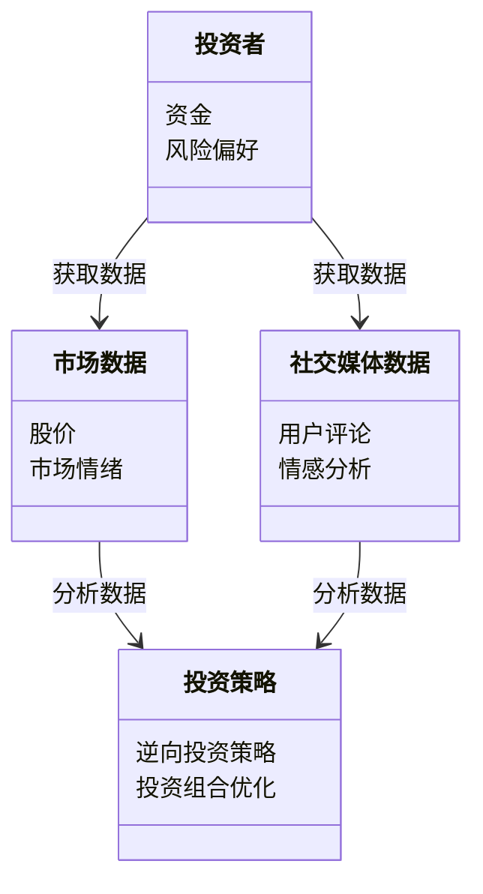

                 

# 巴菲特的逆向投资策略：在社交媒体影响下的执行

## 关键词：
- 巴菲特
- 逆向投资
- 投资策略
- 社交媒体
- 金融市场
- 数据分析
- 系统架构

## 摘要：
本文将深入探讨巴菲特的逆向投资策略在社交媒体影响下的执行方法。通过分析逆向投资的核心原理、社交媒体对投资决策的影响，以及如何结合数据分析和系统架构优化投资策略，本文旨在为投资者提供一套在信息爆炸时代下，如何利用社交媒体数据进行逆向投资的有效方法。文章内容涵盖逆向投资的定义、社交媒体对投资情绪的影响、逆向投资的数学模型、系统架构设计以及实际案例分析，帮助读者全面理解并掌握逆向投资在社交媒体时代的应用。

---

# 第1章: 逆向投资策略的背景与社交媒体的影响

## 1.1 逆向投资策略的定义与核心概念
### 1.1.1 逆向投资的定义
逆向投资是一种与市场主流趋势相反的投资策略，强调在市场低迷时买入，市场高涨时卖出。其核心在于识别市场非理性行为，捕捉被低估的投资机会。

### 1.1.2 巴菲特逆向投资的核心理念
- **价值投资**：寻找具有长期竞争优势的企业，关注企业的内在价值而非市场波动。
- **市场情绪分析**：通过分析市场情绪，识别市场的非理性行为，找到投资机会。
- **逆向思维**：在市场恐慌时寻找机会，避免追涨杀跌。

### 1.1.3 逆向投资与传统投资的区别
| 特性 | 逆向投资 | 传统投资 |
|------|----------|----------|
| 时间点 | 市场低谷 | 市场高点 |
| 风险偏好 | 高风险承受 | 风险中性 |
| 信息依赖 | 依赖市场非理性 | 依赖市场理性 |

## 1.2 社交媒体对投资的影响
### 1.2.1 社交媒体的崛起与投资领域
社交媒体的普及改变了信息传播的方式，投资者可以通过社交媒体获取实时市场动态、专家观点和散户情绪。

### 1.2.2 社交媒体对市场情绪的影响
- **情绪放大效应**：社交媒体上的信息传播速度快，容易引发市场情绪的剧烈波动。
- **信息过载**：投资者面临海量信息，如何筛选有效信息成为挑战。

### 1.2.3 逆向投资与社交媒体的结合
- **数据驱动的逆向投资**：利用社交媒体数据进行情绪分析，辅助逆向投资决策。
- **实时监控市场情绪**：通过社交媒体数据，实时捕捉市场情绪变化，优化投资策略。

---

# 第2章: 逆向投资的核心概念与数学模型

## 2.1 逆向投资的核心概念
### 2.1.1 投资组合优化
- **目标函数**：最大化投资收益，最小化投资风险。
- **约束条件**：资金分配、资产类别、市场限制。

### 2.1.2 市场情绪分析
- **市场情绪指数**：通过社交媒体数据计算市场情绪指数，反映市场的乐观或悲观程度。

## 2.2 逆向投资的数学模型
### 2.2.1 市场情绪指数计算公式
$$ \text{市场情绪指数} = \frac{\text{正面情绪占比} - \text{负面情绪占比}}{\text{总评论数}} $$

### 2.2.2 投资组合优化模型
$$ \max \sum_{i=1}^{n} w_i r_i - \lambda \sum_{i=1}^{n} w_i^2 $$
其中：
- \( w_i \) 表示第 \( i \) 资产的权重。
- \( r_i \) 表示第 \( i \) 资产的预期收益率。
- \( \lambda \) 表示风险厌恶系数。

---

# 第3章: 社交媒体对投资决策的系统分析

## 3.1 系统功能设计
### 3.1.1 领域模型（mermaid类图）

### 3.1.2 系统架构设计（mermaid架构图）

---

# 第4章: 逆向投资策略的执行与风险管理

## 4.1 逆向投资策略的执行步骤
### 4.1.1 数据收集
- 收集社交媒体上的评论、新闻、市场动态等数据。

### 4.1.2 数据分析
- 使用自然语言处理技术分析评论的情感倾向，计算市场情绪指数。

### 4.1.3 投资决策
- 根据市场情绪指数和投资模型，制定逆向投资策略。

## 4.2 风险管理
### 4.2.1 风险评估
- 通过VaR（Value at Risk）模型评估投资组合的风险。

### 4.2.2 风险控制
- 设置止损点，动态调整投资组合。

---

# 第5章: 实际案例分析与实战技巧

## 5.1 巴菲特的经典案例
### 5.1.1 巴菲特的可口可乐投资
- **背景**：20世纪80年代，可口可乐股价被市场低估。
- **策略**：巴菲特长期持有，最终获得丰厚回报。

## 5.2 社交媒体影响下的投资机会
### 5.2.1 某公司危机事件
- **事件**：社交媒体上出现对公司不利的评论，股价暴跌。
- **策略**：分析情绪，判断是否存在低估机会，选择逆势买入。

---

# 第6章: 逆向投资系统的优化与未来展望

## 6.1 系统优化建议
### 6.1.1 数据来源扩展
- 引入更多的社交媒体平台，增加数据的多样性和全面性。

### 6.1.2 情感分析优化
- 使用更先进的NLP技术，提高情感分析的准确性和精细度。

## 6.2 未来展望
- 随着AI和大数据技术的发展，逆向投资策略将更加依赖于实时数据和智能分析，投资者需要不断学习和适应新的技术工具。

---

# 第7章: 总结与建议

## 7.1 核心观点总结
- 巴菲特的逆向投资策略在社交媒体时代下依然有效，但需要结合实时数据和智能分析工具进行优化。

## 7.2 投资者建议
- 建立完善的数据分析系统，实时监控市场情绪。
- 保持理性，避免被社交媒体上的非理性信息误导。

---

通过以上目录结构，文章将从理论到实践，全面分析巴菲特逆向投资策略在社交媒体影响下的执行方法，为投资者提供一套科学的投资框架和实战技巧。

