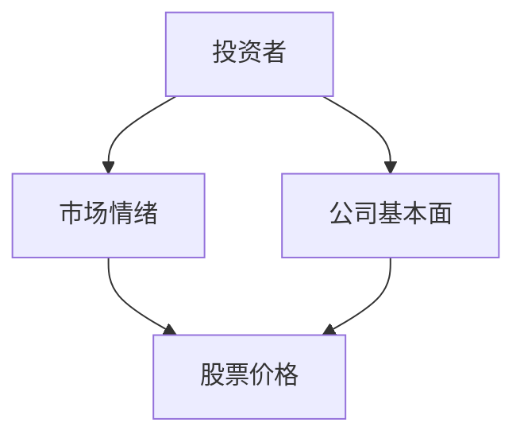

                 

# 巴菲特的逆向投资艺术：在社交媒体时代的执行挑战

> 关键词：巴菲特，逆向投资，价值投资，社交媒体，风险管理，市场情绪，投资策略

> 摘要：本文深入探讨了巴菲特的逆向投资艺术及其在社交媒体时代的执行挑战。首先，我们介绍了巴菲特的投资理念和逆向投资的核心概念。然后，分析了社交媒体时代对投资决策的影响，并探讨了如何在信息过载的环境下坚持逆向思维。最后，我们总结了逆向投资的执行策略和风险管理方法，为投资者提供了实用的指导。

---

## 第一部分: 巴菲特的逆向投资艺术概述

### 第1章: 巴菲特的生平与投资理念

#### 1.1 巴菲特的生平简介
沃伦·巴菲特（Warren Buffett）是全球最著名的投资者之一，被誉为“股神”。他于1934年出生在美国内布拉斯州，早年通过投资和股票交易积累了大量财富。巴菲特的哲学和价值观深受其导师本杰明·格雷厄姆（Benjamin Graham）的影响，格雷厄姆的价值投资理论奠定了巴菲特的投资基础。

#### 1.2 巴菲特的投资理念
巴菲特的投资理念的核心是“价值投资”。他认为，市场先生（Mr. Market）是不可预测的，但投资者可以通过分析企业的内在价值来做出明智的投资决策。以下是巴菲特投资理念的几个关键点：
1. **安全边际**：购买股票时，要确保其内在价值高于市场价格，留有安全边际。
2. **长期投资**：巴菲特强调长期持有优质资产，而不是频繁交易。
3. **企业基本面**：关注企业的盈利能力、财务状况和竞争优势。
4. **分散投资**：虽然巴菲特以集中投资闻名，但他也强调分散投资的重要性，以降低风险。

### 第2章: 逆向投资的定义与特点

#### 2.1 逆向投资的定义
逆向投资（Contrarian Investing）是一种与市场主流观点相反的投资策略。逆向投资者在市场情绪高涨时选择卖出，而在市场情绪低落时选择买入。这种策略的核心是利用市场的非理性行为，寻找被低估的投资机会。

#### 2.2 逆向投资的核心特点
逆向投资与传统投资相比，具有以下几个特点：
1. **反向思维**：逆向投资者往往在市场底部买入，在市场顶部卖出。
2. **长期视角**：逆向投资需要耐心，等待市场回归理性。
3. **风险管理**：逆向投资者需要严格控制风险，避免被市场的短期波动所影响。

### 第3章: 逆向投资的核心概念与联系

#### 3.1 核心概念原理
逆向投资的核心在于识别市场的非理性行为，并利用这些行为获利。以下是逆向投资的核心概念：
1. **市场情绪**：市场情绪的波动是逆向投资的机会所在。当市场情绪过于乐观时，投资者倾向于高估资产价值；当市场情绪过于悲观时，投资者倾向于低估资产价值。
2. **价值评估**：逆向投资者关注资产的内在价值，而不是市场的表象。
3. **风险管理**：逆向投资需要严格的风险管理，以应对市场的波动。

#### 3.2 核心概念属性对比表格
以下表格对比了传统投资和逆向投资的核心属性：

| 概念       | 传统投资       | 逆向投资       |
|------------|----------------|----------------|
| 投资逻辑   | 追涨杀跌       | 低买高卖       |
| 信息来源   | 市场热点       | 公司基本面     |
| 投资心态   | 追求短期收益   | 追求长期价值   |

#### 3.3 ER实体关系图
以下是逆向投资的核心概念的ER实体关系图：

---

## 第二部分: 逆向投资的执行挑战

### 第4章: 社交媒体时代的信息传播与影响

#### 4.1 社交媒体对投资决策的影响
社交媒体的兴起对投资决策产生了深远的影响。以下是一些关键点：
1. **信息传播的加速与碎片化**：社交媒体使得信息传播速度极快，但同时也导致了信息的碎片化。
2. **市场情绪的放大效应**：社交媒体上的情绪化言论往往会导致市场情绪的过度波动。
3. **信息过载对投资者决策的影响**：投资者在面对海量信息时，容易受到情绪化的影响，做出非理性的投资决策。

#### 4.2 社交媒体时代的逆向投资策略
在社交媒体时代，逆向投资者需要采取以下策略：
1. **识别社交媒体上的噪声**：投资者需要学会筛选信息，避免被情绪化的言论误导。
2. **利用社交媒体进行逆向投资**：通过社交媒体关注市场的非理性行为，寻找被低估的投资机会。
3. **投资者心理分析**：逆向投资者需要了解自己和他人的心理，避免被市场情绪所左右。

### 第5章: 逆向投资的执行策略

#### 5.1 逆向投资的执行步骤
1. **确定投资目标**：逆向投资者需要明确自己的投资目标和风险承受能力。
2. **进行基本面分析**：通过分析企业的财务状况、竞争优势和行业前景，确定其内在价值。
3. **制定投资计划**：根据分析结果，制定详细的投资计划，并严格执行。

#### 5.2 风险管理与心理控制
逆向投资需要严格的风险管理：
1. **控制仓位**：逆向投资者需要合理分配资金，避免过度集中。
2. **保持纪律**：在市场波动时，逆向投资者需要保持冷静，严格执行投资计划。
3. **长期视角**：逆向投资需要耐心，等待市场回归理性。

---

## 第三部分: 逆向投资的数学模型与算法原理

### 第6章: 逆向投资的数学模型

#### 6.1 CAPM模型
资本资产定价模型（CAPM）是逆向投资中常用的数学模型之一。CAPM公式如下：

$$
E(R_i) = R_f + \beta_i (E(R_m) - R_f)
$$

其中：
- \( E(R_i) \) 是资产 \( i \) 的预期收益。
- \( R_f \) 是无风险利率。
- \( \beta_i \) 是资产 \( i \) 的贝塔系数。
- \( E(R_m) \) 是市场预期收益。
- \( R_f \) 是无风险利率。

#### 6.2 风险管理模型
逆向投资者可以通过以下公式计算投资组合的风险：

$$
\sigma_p = \sqrt{w_1^2 \sigma_1^2 + w_2^2 \sigma_2^2 + 2w_1w_2 \text{Cov}(1,2)}
$$

其中：
- \( \sigma_p \) 是投资组合的标准差。
- \( w_1 \) 和 \( w_2 \) 是资产 \( 1 \) 和 \( 2 \) 的权重。
- \( \sigma_1 \) 和 \( \sigma_2 \) 是资产 \( 1 \) 和 \( 2 \) 的标准差。
- \( \text{Cov}(1,2) \) 是资产 \( 1 \) 和 \( 2 \) 的协方差。

---

## 第四部分: 总结与展望

### 第7章: 总结
逆向投资是一种需要耐心、纪律和长期视角的投资策略。在社交媒体时代，逆向投资者需要更加警惕市场的非理性行为，并通过基本面分析和风险管理来应对市场的波动。

### 第8章: 展望
随着科技的发展，社交媒体对投资决策的影响将更加深远。逆向投资者需要不断学习和适应新的环境，才能在市场中获得长期的成功。

---

通过以上分析，我们可以看到，逆向投资在社交媒体时代面临着巨大的挑战，但也带来了新的机遇。投资者需要结合市场的实际情况，灵活运用逆向投资策略，才能在复杂的市场环境中获得成功。

