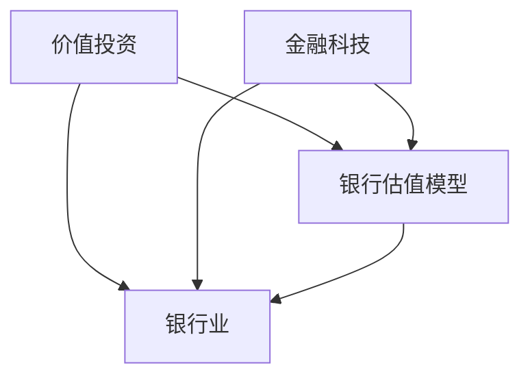

                 

# 巴菲特的银行业投资逻辑：金融科技挑战下的重新评估

---

## 关键词：
- 巴菲特投资逻辑  
- 金融科技  
- 银行业  
- 数字化转型  
- 人工智能  
- 区块链  
- 价值投资  

---

## 摘要：
本文深入分析了巴菲特的银行业投资逻辑，并探讨了金融科技对银行业带来的挑战与机遇。通过结合传统投资理论与现代技术趋势，本文重新评估了巴菲特的投资策略在数字时代的适用性，提出了在金融科技冲击下银行股估值与投资逻辑的调整方向。文章从背景分析、核心概念、算法原理、系统架构等多个维度展开，结合实际案例与技术实现，为投资者提供了全新的视角与深度见解。

---

# 第一部分：引言

## 1.1 巴菲特的投资理念概述

### 1.1.1 巴菲特的价值投资原则
- 巴菲特的价值投资理念强调长期持有、安全边际和内在价值。
- 通过分析财务报表和管理层能力，寻找具有持续竞争优势的企业。
- 重点投资于具有稳定现金流、强大资产负债表和良好治理结构的公司。

### 1.1.2 巴菲特对银行业的长期看法
- 银行业是巴菲特早期投资的重要领域，他偏好的银行股具有高分红、低估值和稳定收益的特点。
- 银行的本质是管理风险，尤其是信用风险和流动性风险。
- 美国银行和富国银行曾是巴菲特的“现金奶牛”，但近年来他对银行业的兴趣逐渐减弱。

### 1.1.3 金融科技的兴起与银行业变革
- 金融科技（FinTech）的崛起正在重塑银行业的商业模式。
- 数字化转型、人工智能和大数据分析正在改变银行的客户体验、运营效率和风险管理方式。
- 传统银行需要适应新技术带来的挑战，否则可能被科技型金融公司取代。

---

## 1.2 本书的核心问题与研究意义

### 1.2.1 问题背景与问题描述
- 金融科技的快速发展对传统银行的估值逻辑和投资策略提出了挑战。
- 巴菲特的银行业投资逻辑是否在金融科技时代仍然适用？
- 如何将金融科技因素纳入银行股的估值体系？

### 1.2.2 问题解决的思路与方法
- 结合巴菲特的价值投资理念，分析金融科技对银行业核心竞争力的影响。
- 通过技术分析和案例研究，探索银行业投资逻辑的现代重构。
- 提出基于金融科技的新估值模型，为投资者提供新的参考框架。

### 1.2.3 研究的边界与外延
- 本文主要关注银行业，不涉及其他金融领域。
- 聚焦于金融科技对银行股投资逻辑的影响，不讨论整体金融市场的波动。

### 1.2.4 核心概念与概念结构
- 核心概念：价值投资、金融科技、银行业、银行估值模型。
- 概念结构：通过概念图展示各概念之间的关系。

---

## 1.3 本书的结构与内容安排

### 1.3.1 各章节的核心内容
- 第二部分：分析传统银行业的运作模式和巴菲特的投资逻辑。
- 第三部分：探讨金融科技对银行业的挑战与机遇。
- 第四部分：重构巴菲特投资逻辑，提出现代投资策略。

### 1.3.2 目标读者与阅读方法
- 目标读者：投资者、金融从业者、科技爱好者。
- 阅读方法：结合理论分析与实际案例，逐步理解金融科技与投资逻辑的结合。

### 1.3.3 核心概念之间的联系
- 通过概念图展示各核心概念之间的联系，帮助读者理解整体结构。

---

# 第二部分：巴菲特的银行业投资逻辑

## 2.1 传统银行业的运作模式

### 2.1.1 银行业的基本业务模式
- 银行的核心业务包括存款、贷款、支付和财富管理。
- 银行通过资产与负债的匹配实现利润最大化。
- 银行的风险管理能力是其核心竞争力。

### 2.1.2 银行的核心竞争力分析
- 资产质量：贷款的违约率和抵押品价值。
- 资本实力：资本充足率和流动性覆盖率。
- 管理层能力：决策能力和风险管理能力。

### 2.1.3 巴菲特对银行股的估值方法
- 看重ROE（净资产收益率）和ROA（资产回报率）。
- 选择具有高分红和稳定收益的银行股。
- 考虑宏观经济环境和利率政策的影响。

---

## 2.2 巴菲特的价值投资原则

### 2.2.1 价值投资的核心理念
- 购买股票即购买企业的一部分。
- 寻找具有持续竞争优势和良好治理结构的企业。
- 买入价格低于内在价值。

### 2.2.2 财务指标分析与投资决策
- 重点分析净利润、ROE、负债率和分红率。
- 考虑企业的财务健康状况和成长潜力。
- 通过横向和纵向比较，寻找低估企业。

### 2.2.3 风险管理与安全边际
- 通过分散投资降低风险。
- 设定安全边际，确保买入价格低于内在价值。
- 通过长期持有分享企业成长的收益。

---

## 2.3 巴菲特对银行业的独特见解

### 2.3.1 银行的资产质量与管理层能力
- 资产质量是银行的核心竞争力。
- 管理层能力决定银行的风险控制和盈利能力。
- 优秀的管理层能够带领银行度过经济周期。

### 2.3.2 利率政策对银行股的影响
- 利率上升：贷款收益增加，存款成本上升。
- 利率下降：贷款收益减少，存款成本下降。
- 长期来看，利率政策对银行股的影响是中性的。

### 2.3.3 经济周期与银行股的表现
- 经济繁荣：银行股表现良好。
- 经济衰退：银行股面临压力，但优质银行能够 survive and thrive。
- 通过宏观经济分析选择投资时机。

---

# 第三部分：金融科技对银行业的挑战与机遇

## 3.1 金融科技的兴起与影响

### 3.1.1 金融科技的定义与分类
- 金融科技（FinTech）：利用技术手段优化或替代传统金融服务。
- 主要包括支付科技、区块链、人工智能、大数据和云计算。

### 3.1.2 金融科技对传统银行业的冲击
- 客户行为的变化：年轻一代更倾向于使用数字支付和移动银行。
- 业务模式的改变：传统银行的中介作用被削弱。
- 成本结构的变化：技术投入增加，但长期成本可能下降。

### 3.1.3 数字化转型的必要性与挑战
- 数字化转型是传统银行 survival 的必经之路。
- 技术投入和人才引进是转型的关键。
- 数据隐私和系统安全是转型的风险。

---

## 3.2 人工智能与大数据在银行业的应用

### 3.2.1 人工智能在风险控制中的应用
- 通过机器学习模型预测客户违约概率。
- 利用自然语言处理技术分析财务报表。
- 建立实时监控系统，识别异常交易。

### 3.2.2 大数据在客户画像与精准营销中的作用
- 通过大数据分析客户行为，建立客户画像。
- 利用数据驱动的营销策略提高客户转化率。
- 通过 A/B 测试优化营销方案。

### 3.2.3 数字支付与区块链技术的影响
- 数字支付改变了银行的结算方式。
- 区块链技术提高了支付的透明度和安全性。
- 去中心化金融（DeFi）可能颠覆传统银行的业务模式。

---

## 3.3 金融科技对银行估值逻辑的改变

### 3.3.1 传统估值模型的局限性
- 传统估值模型（如DCF模型）假设资产是静态的。
- 忽略了技术进步对银行长期盈利能力的影响。
- 未能充分考虑数字化转型的成本和收益。

### 3.3.2 新技术对银行资产质量的影响
- 通过大数据和人工智能提高贷款审批的准确性。
- 降低客户违约风险，提高资产质量。
- 通过智能风控系统减少不良资产。

### 3.3.3 金融科技公司与传统银行的估值差异
- 金融科技公司具有更高的成长性和创新性。
- 传统银行具有更强的稳定性，但可能被科技公司取代部分业务。

---

# 第四部分：巴菲特投资逻辑的现代重构

## 4.1 传统投资逻辑的局限性

### 4.1.1 传统银行估值模型的不足
- 未能充分考虑技术进步对银行长期盈利能力的影响。
- 忽略了数字化转型的成本和收益。
- 未能充分评估客户行为的变化。

### 4.1.2 金融科技对银行资产质量的影响
- 通过大数据和人工智能提高贷款审批的准确性。
- 降低客户违约风险，提高资产质量。
- 通过智能风控系统减少不良资产。

### 4.1.3 新技术对银行风险管理的挑战
- 数字化转型可能增加数据泄露和网络攻击的风险。
- 人工智能和大数据的应用需要大量的数据存储和处理能力。
- 区块链技术可能改变银行的结算方式。

---

## 4.2 重构投资逻辑的核心要素

### 4.2.1 金融科技对银行核心竞争力的影响
- 技术能力成为银行的核心竞争力之一。
- 数据分析能力决定银行的风控能力。
- 数字化转型的速度和效果影响银行的长期发展。

### 4.2.2 数字化转型与银行的未来竞争力
- 数字化转型是传统银行 survival 的必经之路。
- 技术投入和人才引进是转型的关键。
- 数据隐私和系统安全是转型的风险。

### 4.2.3 新技术对银行估值模型的调整
- 将技术投入和数字化能力纳入估值模型。
- 考虑客户行为变化和技术进步对银行长期盈利能力的影响。
- 重新定义银行的核心竞争力和竞争优势。

---

## 4.3 巴菲特投资逻辑的现代应用

### 4.3.1 金融科技时代银行股的估值方法
- 结合传统财务指标和技术创新能力进行估值。
- 考虑数字化转型的投入和预期收益。
- 通过技术分析和市场研究评估银行的长期发展潜力。

### 4.3.2 数字化转型对银行长期价值的影响
- 数字化转型可能提高银行的运营效率和客户满意度。
- 技术创新可能降低银行的成本，提高利润率。
- 数字化转型可能改变银行的业务模式，影响其长期竞争力。

### 4.3.3 未来投资策略的调整
- 选择具有强大技术能力和创新能力的银行。
- 关注银行的数字化转型进展和效果。
- 在投资组合中加入科技型金融公司，以分散风险。

---

## 结语

本文通过分析巴菲特的银行业投资逻辑，结合金融科技的挑战与机遇，提出了现代投资策略的重构方向。在数字化转型和金融科技的冲击下，传统银行需要适应新技术带来的变化，投资者也需要调整估值模型和投资逻辑。未来，银行股的投资价值将更多地取决于其技术创新能力和数字化转型的成果。

