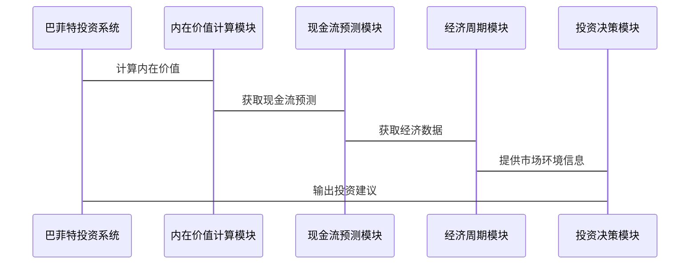

                 


# 巴菲特的错误投资案例分析：从失败中吸取教训

## 关键词：
- 巴菲特，投资，错误案例，价值投资，风险管理

## 摘要：
本文通过分析巴菲特在投资生涯中的一些错误案例，深入探讨其价值投资理念的局限性，并总结从中吸取的教训。文章结合技术分析方法，从模型构建、系统设计、案例分析等多角度展开，帮助读者更好地理解投资风险和如何避免类似错误。

---

# 引言：巴菲特的投资理念与错误案例分析

## 1.1 巴菲特投资理念的背景与核心思想

### 1.1.1 价值投资的定义与核心要素
价值投资是一种以基本面分析为基础的投资策略，强调以低于内在价值的价格购买优质资产。其核心要素包括：
1. **内在价值**：资产在未来现金流的现值。
2. **安全边际**：买入价格低于内在价值的幅度。
3. **竞争优势**：企业具备持续盈利的能力。
4. **长期视角**：投资不是短期交易，而是长期持有优质资产。

### 1.1.2 巴菲特投资理念的演变与特点
巴菲特的投资理念起源于价值投资，但随着市场的变化，他逐渐形成了自己的风格。他的投资策略强调：
- **买入并持有**：长期持有优质企业，避免频繁交易。
- **集中投资**：将资金集中在少数优质资产上。
- **安全边际**：确保买入价格远低于内在价值。

### 1.1.3 巴菲特投资理念的边界与外延
尽管价值投资在长期中表现优异，但其在某些情况下可能失效，例如：
- **市场周期**：在市场高估时，价值投资可能无法找到足够的安全边际。
- **行业变化**：某些行业的商业模式可能快速变化，导致竞争优势丧失。

---

## 1.2 错误案例分析的必要性

### 1.2.1 投资失败的常见原因
1. **估值错误**：低估了市场的波动性和企业的真实价值。
2. **行业变化**：未能预见行业的重大变化。
3. **人性弱点**：贪婪和恐惧导致决策失误。

### 1.2.2 巴菲特错误案例的独特价值
巴菲特作为价值投资的代表人物，其错误案例的独特性在于：
1. **经验教训**：他的错误往往源于对市场的过度乐观或对变化的忽视。
2. **案例分析**：通过分析这些案例，我们可以更好地理解投资风险。

### 1.2.3 从错误中学习的策略与方法
1. **风险控制**：在投资决策中引入更多风险管理工具。
2. **动态调整**：定期重新评估投资组合，适应市场变化。
3. **分散投资**：避免过度集中，降低单一资产的风险。

---

# 第二部分：巴菲特投资模型的核心概念与联系

## 2.1 巴菲特投资模型的核心原理

### 2.1.1 价值投资的数学模型

#### 内在价值公式
$$
\text{内在价值} = \sum_{t=1}^{n} \frac{\text{现金流}_t}{(1 + r)^t}
$$

其中，\( r \) 是折现率，\( \text{现金流}_t \) 是第 \( t \) 年的现金流。

#### 安全边际计算
$$
\text{安全边际} = \text{内在价值} - \text{市场价格}
$$

### 2.1.2 投资决策的关键因素
1. **现金流预测**：准确预测企业的未来现金流。
2. **折现率选择**：合理的折现率反映市场的风险偏好。
3. **竞争优势评估**：企业是否具备持续的竞争优势。

### 2.1.3 模型的优缺点分析
- **优点**：能够筛选出具备长期竞争优势的企业。
- **缺点**：低估了市场波动性和行业变化的风险。

---

## 2.2 核心概念对比表格

### 2.2.1 价值投资与其他投资策略的对比

| 投资策略 | 核心理念 | 优缺点 |
|----------|----------|--------|
| 价值投资 | 以低于内在价值的价格买入资产 | 长期稳定收益，但对市场波动敏感 |
| 股票交易 | 短期价格波动 | 高风险，需要高频交易能力 |
| 债券投资 | 稳定的固定收益 | 风险低，收益有限 |

### 2.2.2 巴菲特模型与现代金融理论的对比

| 对比维度 | 巴菲特模型 | 现代金融理论 |
|----------|------------|--------------|
| 核心假设 | 企业内在价值 | 市场有效定价 |
| 投资策略 | 长期持有 | 多样化投资 |
| 风险管理 | 安全边际 | 标准差、波动率 |

---

# 第三部分：巴菲特投资模型的系统分析

## 3.1 系统功能设计

### 3.1.1 领域模型（Mermaid 类图）

```mermaid
classDiagram
    class 巴菲特投资模型 {
        内在价值计算
        现金流预测
        竞争优势评估
        安全边际计算
    }
    class 市场环境 {
        市场波动
        经济周期
        行业变化
    }
    class 投资决策 {
        资产配置
        风险管理
        交易策略
    }
    巴菲特投资模型 <--( 市场环境 )
    巴菲特投资模型 --> 投资决策
```

---

## 3.2 系统架构设计

### 3.2.1 系统架构（Mermaid 架构图）


---

## 3.3 系统交互设计

### 3.3.1 系统交互流程图（Mermaid 序列图）



---

# 第四部分：项目实战

## 4.1 环境安装与数据准备

### 4.1.1 环境安装
- **工具**：Python、Jupyter Notebook、Matplotlib、Pandas
- **数据源**：历史股价、财务数据、行业报告

### 4.1.2 核心代码实现

#### 计算内在价值的 Python 代码

```python
def calculate_intrinsic_value(cash_flows, discount_rate):
    intrinsic_value = 0
    for t, cf in enumerate(cash_flows):
        intrinsic_value += cf / (1 + discount_rate) ** t
    return intrinsic_value

# 示例数据
cash_flows = [100, 120, 150, 180]
discount_rate = 0.08

iv = calculate_intrinsic_value(cash_flows, discount_rate)
print(f"内在价值: {iv:.2f}")
```

---

## 4.2 代码解读与分析

### 4.2.1 代码解读
- **函数定义**：`calculate_intrinsic_value` 计算内在价值。
- **输入参数**：`cash_flows` 是未来现金流，`discount_rate` 是折现率。
- **计算过程**：使用现值公式计算每一年的现金流现值，并求和得到内在价值。

### 4.2.2 实际案例分析
以巴菲特投资的可口可乐为例，假设未来现金流如下：
- 年1：100
- 年2：120
- 年3：150
- 年4：180

折现率为8%，计算内在价值：

$$
\text{内在价值} = \frac{100}{1.08} + \frac{120}{1.08^2} + \frac{150}{1.08^3} + \frac{180}{1.08^4}
$$

计算结果：
$$
\text{内在价值} \approx 364.47
$$

---

## 4.3 投资错误案例分析

### 4.3.1 巴菲特投资 IBM 的教训

#### 背景
巴菲特在2011年投资IBM，但后来因技术行业变化而亏损。IBM的传统业务（如硬件和服务）逐渐被云服务和大数据公司（如亚马逊、微软）取代。

#### 错误分析
1. **行业变化**：未能预见技术行业的快速变化。
2. **估值错误**：低估了IBM转型的难度。

---

## 4.4 项目小结

### 4.4.1 项目总结
通过案例分析，我们可以看到：
- **竞争优势**：选择具备持续竞争优势的企业。
- **行业风险**：关注行业变化，避免投资夕阳行业。
- **估值模型**：动态调整折现率，反映市场变化。

---

# 第五部分：最佳实践与注意事项

## 5.1 最佳实践 tips

### 5.1.1 投资组合管理
- **分散投资**：避免过度集中。
- **定期调整**：根据市场变化重新评估组合。

### 5.1.2 风险管理
- **止损策略**：设定止损点，避免重大损失。
- **动态估值**：定期重新计算内在价值。

### 5.1.3 持续学习
- **更新知识**：关注行业动态和市场变化。
- **复盘总结**：定期回顾投资决策，总结经验教训。

---

## 5.2 小结

巴菲特的投资理念是价值投资的典范，但其错误案例也提醒我们：
1. **市场变化**：行业的快速变化可能破坏竞争优势。
2. **估值模型**：动态调整模型参数，反映市场变化。
3. **风险管理**：引入更多的风险管理工具，避免重大损失。

---

## 5.3 注意事项

- **避免过度乐观**：不要低估市场的波动性和企业的风险。
- **关注管理层**：管理层的能力和决策对企业价值影响重大。
- **保持灵活性**：在市场变化中及时调整投资策略。

---

## 5.4 拓展阅读

1. 巴菲特的《致股东的信》。
2. 《价值投资实战策略》。
3. 现代金融理论的相关书籍。

---

# 结论

通过对巴菲特错误投资案例的分析，我们可以看到，价值投资并非完美无缺，其局限性在于对市场波动和行业变化的敏感性。投资者在实践中需要结合动态估值、行业分析和风险管理，以避免类似的错误。巴菲特的错误案例为我们提供了一个重要的启示：投资不仅是对企业的分析，更是对市场的深刻理解。

---

# 参考文献

1. 巴菲特，查理·芒格。《致股东的信》。
2. 约翰·C·涅曼。《价值投资实战策略》。
3. 弗朗西斯·阿克曼。《投资中的数学》。

