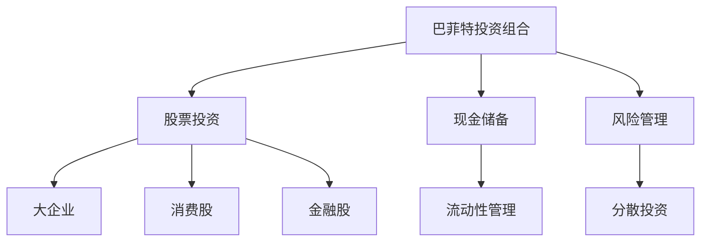

                 

# 巴菲特的长期主义再探讨：在快速变化的市场中保持定力

## 关键词：巴菲特，长期主义，投资策略，风险管理，价值投资

## 摘要：本文深入探讨巴菲特的长期主义投资理念，分析其在快速变化市场中的应用。通过解析巴菲特的核心思想、选股标准、风险管理策略及经典案例，本文为投资者提供实用的长期投资策略。

---

## 第1章 长期主义的背景与核心概念

### 1.1 长期主义的定义与重要性

长期主义是一种投资策略，强调长期持有优质资产，忽略短期市场波动。其重要性在于市场短期波动不可预测，但优质资产的长期价值可被合理评估。

### 1.2 巴菲特的长期主义投资哲学

巴菲特的价值投资理论强调购买优秀企业的一部分，而非仅仅交易股票。他寻找具备持续竞争优势、良好治理结构和合理估值的企业。

### 1.3 当前市场的挑战与长期主义的适用性

当前市场波动剧烈，短期因素影响股价，但优质企业的长期价值依然存在。长期主义在这样的环境中更具挑战性和必要性。

---

## 第2章 巴菲特的长期主义投资策略

### 2.1 价值投资的定义与原则

价值投资寻找市场价格低于内在价值的股票。巴菲特的六点筛选标准包括行业地位、财务状况、竞争优势等，确保投资的安全边际。

### 2.2 巴菲特的选股标准与案例分析

巴菲特偏好消费必需品和金融行业，投资对象包括可口可乐和富国银行。这些案例展示了他对持续盈利能力的重视。

### 2.3 集中投资与安全边际

巴菲特的投资组合集中于少数优质企业，注重安全边际。这种策略减少投资组合的波动，提高长期收益。

---

## 第3章 长期主义在快速变化市场中的应用

### 3.1 市场波动与长期投资的策略调整

市场波动不影响优质企业的长期价值，投资者应保持耐心。巴菲特的“雪球理论”强调时间的复利效应。

### 3.2 应对市场变化的实用技巧

通过分散投资和定期再平衡降低风险。巴菲特的长期视角使他在市场恐慌时寻找机会。

### 3.3 投资心态的长期管理

保持理性和耐心，避免情绪化决策。巴菲特的长期主义强调对投资对象的深入研究和信任。

---

## 第4章 风险管理与长期投资

### 4.1 风险识别与评估方法

分析企业的财务健康状况、行业风险和管理团队。巴菲特长期持有优质企业，降低投资风险。

### 4.2 风险管理策略与长期投资结合

分散投资和持续研究是风险管理的关键。巴菲特的集中投资策略在长期中表现出色。

### 4.3 应对市场危机的长期视角

市场危机是长期投资者的机会。巴菲特在恐慌时增加投资，体现了长期视角的优势。

---

## 第5章 巴菲特长期主义的实践案例

### 5.1 经典投资案例分析

分析巴菲特投资可口可乐和苹果的案例，展示他对品牌和竞争优势的重视。

### 5.2 案例中的长期主义应用

这些案例证明了长期持有优质企业的有效性。巴菲特长期关注企业的持续盈利能力。

### 5.3 启示与经验总结

投资优质企业，保持耐心和专注，避免短期波动干扰。

---

## 第6章 长期主义的未来展望

### 6.1 新兴市场的长期机会

新兴市场中的优质企业具备长期增长潜力。巴菲特的投资理念适用于全球市场。

### 6.2 科技公司的长期价值评估

科技公司的创新能力和持续盈利能力决定其长期价值。巴菲特长期关注具备竞争优势的科技企业。

### 6.3 长期主义的未来发展与挑战

随着市场的变化，长期主义仍需适应新的挑战。但其核心理念在长期投资中依然有效。

---

## 结论

### 7.1 全书总结

巴菲特的长期主义投资理念强调长期持有优质资产，忽略短期波动。这种策略在快速变化的市场中依然有效。

### 7.2 对投资者的实践建议

保持耐心，深入研究，分散投资，避免情绪化决策。巴菲特长期主义的成功证明了其有效性。

### 7.3 长期主义的持续价值

长期主义在快速变化的市场中提供稳定性。其核心理念在投资领域具有持久价值。

---

## 小结与最佳实践

### 8.1 长期主义的关键点回顾

- 选择优质企业
- 长期持有
- 风险管理
- 分散投资

### 8.2 投资者的注意事项

- 避免短期波动干扰
- 深入研究企业基本面
- 保持耐心和纪律性

### 8.3 拓展阅读与资源推荐

- 《巴菲特的哲学》
- 《投资之道》
- 《价值投资实战》

---

## 附录：巴菲特投资组合结构图（Mermaid）

---

通过以上章节的详细探讨，本文全面分析了巴菲特的长期主义投资理念，为投资者在快速变化的市场中提供了实用的策略和启示。

