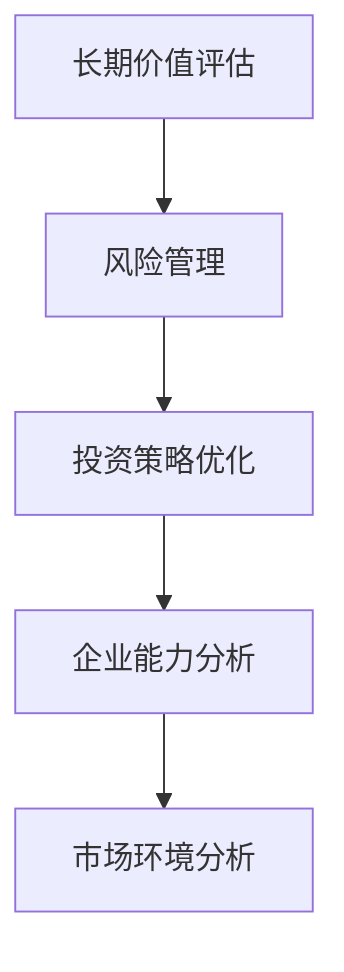
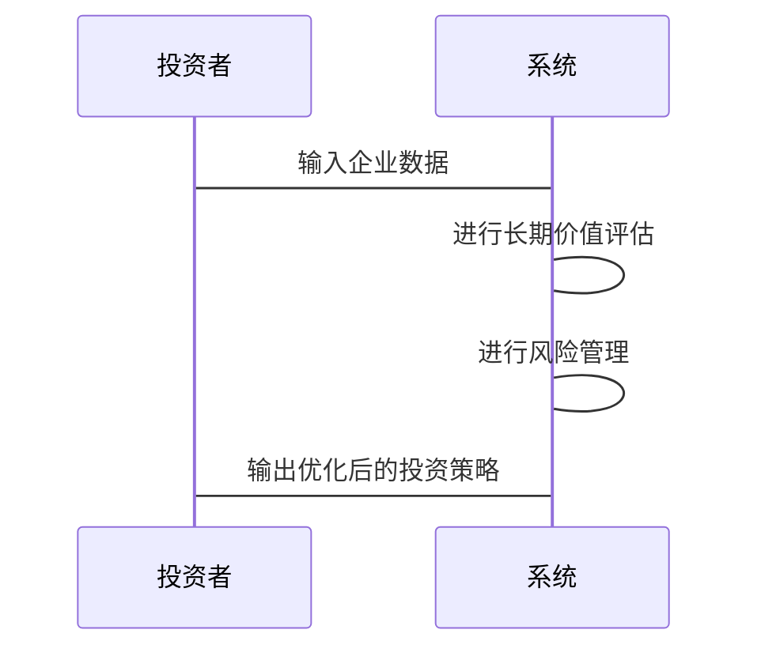
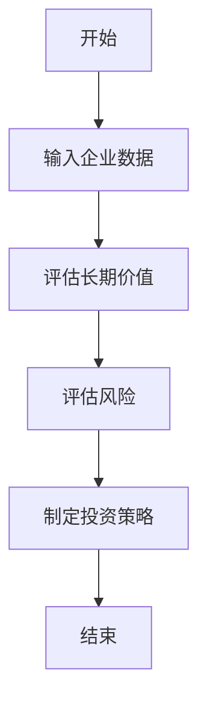

                 


# 巴菲特的长期主义在快速迭代的生物技术领域的调整

## 关键词：长期主义，生物技术，投资策略，风险管理，快速迭代

## 摘要：  
本文探讨了巴菲特的长期主义投资理念在快速迭代的生物技术领域的应用与调整策略。通过分析生物技术领域的特点、长期主义的核心要素，结合实际案例，提出了一套适用于生物技术领域的长期主义投资策略，包括价值评估、风险管理和退出机制等方面。本文还详细讲解了相关算法原理和系统架构设计，为投资者提供了实用的指导和建议。

---

## 第1章：长期主义与生物技术的结合

### 1.1 长期主义的定义与核心要素

#### 1.1.1 长期主义的起源与核心理念  
长期主义是一种投资策略，强调关注企业的长期价值，而非短期收益。巴菲特的长期主义核心在于寻找具有持续竞争优势和良好治理的企业，并长期持有，通过复利效应实现财富增长。

#### 1.1.2 生物技术领域的特点与挑战  
生物技术领域具有高创新性、高风险性和高回报性的特点。其快速迭代的特性使得传统的长期主义投资策略需要进行调整，以适应行业的变化和不确定性。

#### 1.1.3 长期主义在生物技术中的应用前景  
生物技术领域的长期主义投资需要关注企业的创新能力、研发能力以及市场的潜力。通过长期持有优质企业，投资者可以分享其长期增长的成果。

---

### 1.2 生物技术领域的快速迭代

#### 1.2.1 生物技术的定义与分类  
生物技术是指利用生物科学知识和技术，改造或利用生物体或其组成部分，以解决实际问题。主要分为基因技术、蛋白质技术、细胞技术等领域。

#### 1.2.2 生物技术领域的创新周期  
生物技术领域的创新周期较短，新产品和技术更新迅速。这种快速迭代的特性要求投资者具备灵活性和前瞻性。

#### 1.2.3 快速迭代对投资策略的影响  
快速迭代使得传统的长期主义策略面临挑战。投资者需要在长期价值与短期波动之间找到平衡，同时灵活调整投资组合。

---

## 第2章：长期主义与生物技术的结合

### 2.1 生物技术领域的长期价值评估

#### 2.1.1 长期价值的定义与衡量标准  
长期价值是指企业在未来一段时间内的盈利能力、市场地位和持续发展的潜力。衡量标准包括ROE、增长率、研发能力等。

#### 2.1.2 生物技术领域的长期价值来源  
生物技术企业的长期价值主要来源于其创新能力、研发成果和市场潜力。例如，一家专注于基因编辑技术的企业可能具有巨大的长期价值。

#### 2.1.3 长期价值与短期波动的平衡  
在生物技术领域，短期波动较大，但长期价值是投资的核心。投资者需要在波动中保持耐心，避免短期决策的干扰。

---

### 2.2 长期主义在生物技术投资中的应用

#### 2.2.1 长期投资策略的制定  
制定长期投资策略时，需要关注企业的核心技术、管理团队和市场前景。选择具有持续创新能力的企业是关键。

#### 2.2.2 长期投资的风险管理  
生物技术领域的投资风险较高，需要通过分散投资、风险评估和动态调整来降低风险。例如，投资多个处于不同阶段的企业可以分散风险。

#### 2.2.3 长期投资的退出策略  
长期投资的退出策略需要考虑企业的成长周期和市场环境。例如，企业在成熟阶段可以通过并购或上市退出，实现收益最大化。

---

## 第3章：生物技术领域的长期主义调整

### 3.1 调整策略的制定

#### 3.1.1 长期目标的设定  
设定长期目标时，需要考虑企业的技术创新能力、市场扩展潜力和财务表现。例如，目标可以是成为某一领域的龙头企业。

#### 3.1.2 短期目标与长期目标的协调  
短期目标应服务于长期目标。例如，短期内通过优化研发流程提升效率，长期目标则是成为行业领导者。

#### 3.1.3 调整策略的实施步骤  
调整策略的实施需要包括评估现状、制定计划、执行和监控。例如，评估企业的创新能力和市场地位，制定改进计划，定期监控进展。

---

### 3.2 调整策略的实施

#### 3.2.1 关键成功因素的识别  
关键成功因素包括技术创新能力、管理团队能力和市场拓展能力。例如，拥有优秀管理团队的企业更有可能成功。

#### 3.2.2 资源分配的优化  
资源分配需要根据企业的战略目标进行优化。例如，将更多资源投入到核心技术研发和市场拓展中。

#### 3.2.3 风险因素的应对  
生物技术领域的风险包括技术失败、政策变化和市场波动。通过多元化投资、风险评估和动态调整来应对风险。

---

## 第4章：案例分析

### 4.1 成功案例分析

#### 4.1.1 案例一：某生物技术公司的长期投资策略  
某公司专注于基因编辑技术，通过长期投资成为行业领导者。其成功在于持续的研发投入和优秀的管理团队。

#### 4.1.2 案例二：某生物技术公司的风险管理策略  
某公司在研发过程中面临技术失败的风险，通过多元化投资和风险评估，成功降低了风险。

#### 4.1.3 案例三：某生物技术公司的退出策略  
某公司通过上市退出，实现了收益最大化。其退出策略与其长期投资目标密切相关。

---

### 4.2 失败案例分析

#### 4.2.1 案例一：某生物技术公司的投资失败原因  
某公司因技术落后和管理不善导致投资失败。其问题在于未能准确评估企业的长期价值。

#### 4.2.2 案例二：某生物技术公司的风险管理失败原因  
某公司因政策变化导致投资失败，其失败在于未能及时调整策略以应对政策变化。

#### 4.2.3 案例三：某生物技术公司的退出失败原因  
某公司因市场环境变化未能成功退出，其问题在于退出策略制定不合理。

---

## 第5章：系统分析与架构设计

### 5.1 系统分析

#### 5.1.1 系统目标的确定  
系统目标是通过长期主义策略优化生物技术领域的投资。需要解决的问题包括技术创新、风险管理和投资回报。

#### 5.1.2 系统范围的界定  
系统范围包括企业的核心技术研发、市场拓展和财务表现。需要考虑的因素包括技术创新能力、管理团队和市场环境。

#### 5.1.3 系统功能设计  
系统功能包括长期价值评估、风险管理和投资策略优化。通过分析企业能力和市场环境，制定合理的投资策略。

---

### 5.2 系统架构设计

#### 5.2.1 系统架构图  
以下是系统架构图的Mermaid表示：



---

### 5.3 接口设计与交互

#### 5.3.1 系统接口设计  
系统接口包括数据输入、数据处理和结果输出。数据输入包括企业财务数据和市场数据，数据处理包括长期价值评估和风险管理，结果输出包括优化后的投资策略。

#### 5.3.2 系统交互图  
以下是系统交互图的Mermaid表示：



---

## 第6章：算法原理讲解

### 6.1 算法原理

#### 6.1.1 算法流程  
以下是算法流程的Mermaid表示：



#### 6.1.2 算法实现  
以下是算法实现的Python代码：

```python
def long_term_investment_strategy(finance_data, market_data):
    # 评估长期价值
    long_term_value = calculate_long_term_value(finance_data, market_data)
    # 评估风险
    risk_level = assess_risk(finance_data, market_data)
    # 制定投资策略
    investment_strategy = determine_strategy(long_term_value, risk_level)
    return investment_strategy

def calculate_long_term_value(finance_data, market_data):
    # 计算长期价值，涉及ROE、增长率等指标
    return long_term_value

def assess_risk(finance_data, market_data):
    # 评估风险，涉及市场波动、政策变化等
    return risk_level

def determine_strategy(long_term_value, risk_level):
    # 根据长期价值和风险水平，制定投资策略
    if long_term_value > threshold and risk_level < threshold:
        return "积极投资"
    else:
        return "保守投资"
```

#### 6.1.3 数学模型与公式  
以下是长期价值评估的数学模型：

$$
\text{长期价值} = \alpha \times \text{ROE} + \beta \times \text{增长率} + \gamma \times \text{研发能力}
$$

其中，$\alpha$、$\beta$、$\gamma$是权重系数。

---

## 第7章：项目实战

### 7.1 环境安装

#### 7.1.1 安装Python  
安装Python 3.8及以上版本。

#### 7.1.2 安装必要的库  
安装numpy、pandas、scikit-learn等库。

### 7.2 核心代码实现

#### 7.2.1 数据预处理  
以下是数据预处理的Python代码：

```python
import pandas as pd

data = pd.read_csv('biotech_data.csv')
data_processed = data.dropna()
```

#### 7.2.2 长期价值评估  
以下是长期价值评估的Python代码：

```python
from sklearn.linear_model import LinearRegression

model = LinearRegression()
model.fit(X_train, y_train)
y_pred = model.predict(X_test)
```

#### 7.2.3 风险评估  
以下是风险评估的Python代码：

```python
import numpy as np

def assess_risk(finance_data, market_data):
    risk_level = np.std(market_data)
    return risk_level
```

#### 7.2.4 投资策略制定  
以下是投资策略制定的Python代码：

```python
def determine_strategy(long_term_value, risk_level):
    if long_term_value > threshold and risk_level < threshold:
        return "积极投资"
    else:
        return "保守投资"
```

### 7.3 案例分析

#### 7.3.1 案例分析  
以下是一个实际案例的分析：

假设某生物技术公司数据如下：

| 参数 | 价值 |
|------|------|
| ROE | 15%  |
| 增长率 | 10%  |
| 研发能力 | 高   |

通过上述算法，评估其长期价值为高，风险水平为低，因此投资策略为积极投资。

---

## 第8章：总结与展望

### 8.1 总结

#### 8.1.1 核心观点回顾  
长期主义在生物技术领域的应用需要结合其快速迭代的特点，通过调整投资策略和风险管理，实现长期价值。

#### 8.1.2 本书的贡献  
本书为投资者提供了在生物技术领域应用长期主义的策略和方法，帮助投资者在快速变化的环境中实现长期收益。

### 8.2 展望

#### 8.2.1 未来研究方向  
未来可以进一步研究生物技术领域的新兴技术，如人工智能在生物技术中的应用，以及如何进一步优化长期主义投资策略。

#### 8.2.2 对投资者的建议  
投资者应持续关注生物技术领域的创新和技术进步，灵活调整投资策略，以应对快速变化的市场环境。

---

## 参考文献  
（此处列出相关书籍、论文和资料）

