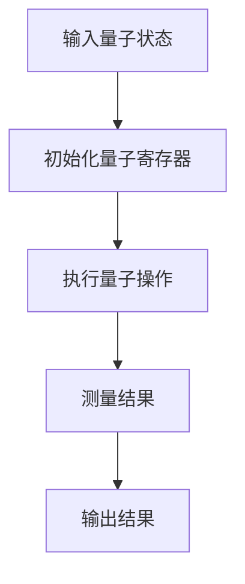
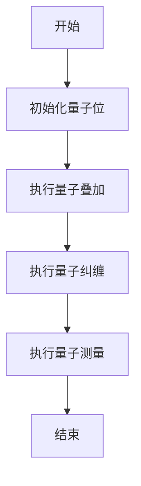

                 


# 巴菲特的长期主义在快速迭代的量子技术领域的调整

> 关键词：巴菲特，长期主义，量子技术，量子计算，投资策略

> 摘要：本文探讨了巴菲特的长期主义投资理念在量子技术领域的应用与调整。通过分析量子技术的快速发展特性，结合长期主义的核心原则，提出了一套在量子技术领域实现长期投资的有效策略，包括系统架构设计、算法原理解析和实际案例分析。

---

## # 第1章: 长期主义的定义与核心理念

### ## 1.1 长期主义的定义
#### ### 1.1.1 长期主义的起源与演变
长期主义是一种投资哲学，起源于20世纪，由巴菲特等投资大师发扬光大。它强调关注企业的长期价值，而非短期市场波动。长期主义的核心在于寻找具有持续竞争优势的企业，通过长期持有实现财富增值。

#### ### 1.1.2 长期主义的核心原则
- **价值投资**：寻找具有内在价值的企业，而非关注市场短期波动。
- **时间复利**：通过长期持有，利用复利效应实现财富增长。
- **风险管理**：避免高风险投资，注重企业基本面。

#### ### 1.1.3 长期主义在投资中的应用
长期主义在传统投资领域取得了巨大成功，但在快速迭代的技术领域面临挑战。量子技术的快速发展和不确定性要求长期主义进行调整。

### ## 1.2 量子技术的定义与特点
#### ### 1.2.1 量子技术的基本概念
量子技术利用量子力学原理，包括量子计算、量子通信和量子传感。量子计算通过量子位（qubit）实现超快计算能力，量子通信利用量子纠缠实现安全通信，量子传感则通过量子叠加提高传感精度。

#### ### 1.2.2 量子计算、量子通信与量子传感的核心区别
| 技术领域       | 核心原理                     | 应用场景                     |
|----------------|------------------------------|------------------------------|
| 量子计算       | 量子叠加与纠缠               | 解决复杂计算问题             |
| 量子通信       | 量子纠缠与不可克隆性           | 安全通信                     |
| 量子传感       | 量子叠加与增强灵敏度           | 高精度测量                   |

#### ### 1.2.3 量子技术的现状与未来发展趋势
量子技术目前处于快速发展阶段，但尚未大规模商业化。未来，量子计算可能在加密、药物研发等领域发挥作用，量子通信可能成为下一代通信技术的核心。

---

## # 第2章: 长期主义与量子技术的结合背景

### ## 2.1 量子技术领域的快速迭代特点
#### ### 2.1.1 量子技术的快速变化与不确定性
量子技术的快速发展带来了巨大机会，但也意味着高度不确定性。技术路径不明确，企业寿命短，投资风险高。

#### ### 2.1.2 量子技术领域的投资风险与机遇
- **风险**：技术失败、竞争激烈、政策变化。
- **机遇**：技术突破可能带来巨大收益。

### ## 2.2 长期主义在量子技术领域的适应性
#### ### 2.2.1 长期主义与量子技术周期的关系
量子技术的快速迭代周期与长期主义的长期持有理念存在冲突。长期主义需要调整策略，适应快速变化。

#### ### 2.2.2 长期主义在量子技术领域的优势与挑战
- **优势**：长期关注企业价值，避免短期波动干扰。
- **挑战**：技术快速变化，企业寿命短，难以长期持有。

---

## # 第3章: 长期主义在量子技术领域的核心概念与联系

### ## 3.1 核心概念原理
#### ### 3.1.1 长期主义的哲学基础
长期主义基于价值投资理念，认为企业长期价值决定投资价值。在量子技术领域，寻找具有持续创新能力的企业是关键。

#### ### 3.1.2 量子技术的科学基础
量子技术依赖量子力学原理，包括量子叠加、纠缠和不可克隆性。这些原理为量子计算、通信和传感提供了理论基础。

### ## 3.2 核心概念属性对比表格
| 属性           | 长期主义                     | 量子技术                     |
|----------------|------------------------------|------------------------------|
| 核心目标       | 实现长期价值增长             | 提高计算、通信和传感能力       |
| 变化周期       | 长期稳定                     | 快速迭代                     |
| 投资策略       | 价值投资                     | 技术驱动投资                 |

### ## 3.3 ER实体关系图架构
```mermaid
er
actor 投资者 {
  <拥有>
  关系：投资决策
}

实体 量子技术公司 {
  <属于>
  关系：投资决策
}
```

---

## # 第4章: 长期主义在量子技术领域的算法原理

### ## 4.1 量子计算的基本原理
#### ### 4.1.1 量子位与经典位的对比
量子位（qubit）与经典位（bit）的主要区别在于量子叠加和纠缠。量子位可以同时表示0和1，而经典位只能表示0或1。

#### ### 4.1.2 量子叠加与量子纠缠的数学模型
量子叠加的数学表示为：
$$ |\psi\rangle = \alpha|0\rangle + \beta|1\rangle $$
其中，$\alpha$ 和 $\beta$ 是概率幅度，满足$|\alpha|^2 + |\beta|^2 = 1$。

量子纠缠的数学表示为：
$$ |\psi\rangle = \frac{1}{\sqrt{2}}(|00\rangle + |11\rangle) $$

#### ### 4.1.3 量子算法的流程图


### ## 4.2 量子算法的流程图


---

## # 第5章: 长期主义在量子技术领域的系统架构设计

### ## 5.1 系统功能设计
#### ### 5.1.1 量子技术数据采集模块
负责收集量子技术相关的市场数据、技术进展和企业信息。

#### ### 5.1.2 量子技术分析模块
对量子技术公司的基本面和技术潜力进行分析，评估长期投资价值。

#### ### 5.1.3 长期主义决策模块
根据分析结果，制定长期投资策略，优化投资组合。

### ## 5.2 系统架构设计
#### ### 5.2.1 系统架构的分层设计
```
+-------------------+
|  数据层          |
|  数据库          |
+-------------------+
|  业务逻辑层      |
|  数据采集模块    |
|  数据分析模块    |
|  投资决策模块    |
+-------------------+
|  用户界面层      |
|  管理界面        |
+-------------------+
```

#### ### 5.2.2 模块之间

---

## # 第6章: 长期主义在量子技术领域的项目实战

### ## 6.1 环境安装
- 安装量子计算模拟器（如Qiskit）。
- 配置数据分析工具（如Python、Pandas）。

### ## 6.2 系统核心实现源代码
```python
import numpy as np
from qiskit import QuantumCircuit, Aer, execute

def quantum_algorithm(circuit):
    circuit.h(0)
    circuit.cx(0, 1)
    return circuit

def main():
    qc = QuantumCircuit(2)
    qc = quantum_algorithm(qc)
    backend = Aer.get_backend('qasm_simulator')
    result = execute(qc, backend).result()
    print(result.get_counts())

if __name__ == "__main__":
    main()
```

### ## 6.3 代码应用解读与分析
上述代码实现了量子叠加算法，展示了量子计算的基本原理。通过模拟器运行，可以观察量子态的叠加效果。

### ## 6.4 实际案例分析和详细讲解剖析
以投资一家量子计算公司为例，分析其技术潜力、市场地位和财务状况，制定长期投资策略。

### ## 6.5 项目小结
量子技术领域的投资需要结合长期主义和技术创新，注重基本面和技术潜力的综合评估。

---

## # 第7章: 长期主义在量子技术领域的调整与展望

### ## 7.1 结论
长期主义在量子技术领域的应用需要调整策略，注重技术创新和长期价值。通过系统架构设计和算法优化，可以在快速迭代的量子技术领域实现长期投资。

### ## 7.2 最佳实践 tips
- 选择具有持续创新能力的企业。
- 保持对量子技术发展的敏感性。
- 结合长期主义和短期波动进行投资决策。

### ## 7.3 小结
长期主义在量子技术领域的调整是一个复杂的过程，需要结合技术发展和市场变化，制定灵活的投资策略。

### ## 7.4 注意事项
- 避免过度依赖短期技术变化。
- 保持对量子技术公司的长期关注。
- 注意政策和市场风险。

### ## 7.5 拓展阅读
推荐阅读《量子计算入门》和《长期主义投资策略》，深入理解量子技术和长期主义的结合。

---

## # 第8章: 参考文献

- 巴菲特的长期主义理论
- 量子计算相关研究
- 投资策略与量子技术结合的文献

---

## # 第9章: 附录

### ## 9.1 附录A: 量子技术术语表
- 量子位（qubit）
- 量子叠加
- 量子纠缠

### ## 9.2 附录B: 长期主义投资策略模板

---

## # 第10章: 作者简介

> 作者：[您的姓名]
> 职位：[您的职位]
> 简历：[简要介绍您的背景和经验]

---

通过以上目录结构和内容安排，我们可以系统地探讨巴菲特的长期主义在量子技术领域的应用与调整，结合实际案例和系统设计，提供具有深度和实用价值的内容。

