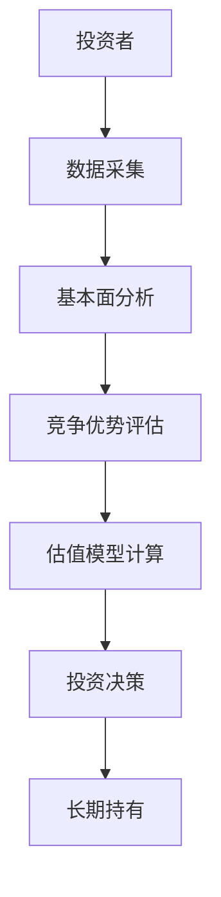
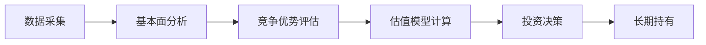
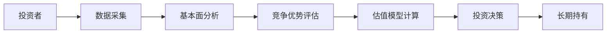

                 

# 巴菲特的长期持股策略

> 关键词：长期持股策略，巴菲特，投资策略，价值评估，风险管理

> 摘要：本文深入分析了巴菲特的长期持股策略，从投资理念、核心概念到算法原理、系统架构，再到项目实战，全面解析了这一策略的数学模型、系统设计和实际应用。通过本篇文章，读者可以全面理解长期持股策略的内在逻辑，掌握其在现代投资中的应用价值，并从中获得实践启示。

---

## 第1章: 长期持股策略的背景与定义

### 1.1 投资策略的演变
在金融投资领域，投资策略的演变经历了从短期交易到长期持有的转变。传统投资理论强调市场的短期波动和价格预测，但这种策略在实际操作中往往难以稳定获利。相比之下，长期持股策略则更加注重基本面分析和价值投资，强调长期稳定的收益。

### 1.2 巴菲特长期持股策略的核心理念
巴菲特的长期持股策略基于价值投资理论，其核心在于寻找具有持续竞争优势、良好管理和稳定财务状况的企业，并长期持有这些股票，等待其内在价值的实现。这种方法不仅避免了短期市场的波动干扰，还能够充分利用复利效应，实现财富的长期增长。

### 1.3 长期持股策略的优势
长期持股策略的优势在于其稳定性、持续性和抗风险性。通过长期持有优质资产，投资者能够规避短期市场的波动风险，同时享受企业成长带来的价值增值。这种策略尤其适合那些追求稳健收益、风险厌恶型的投资者。

### 1.4 巴菲特策略的独特之处
巴菲特的长期持股策略不仅仅是简单地买入并持有股票，而是结合了对企业基本面的深入分析和对管理层的信任。他注重企业的竞争优势、财务健康和管理团队，这些都是长期持股成功的关键因素。

---

## 第2章: 长期持股策略的核心概念

### 2.1 投资标的的选择标准
巴菲特在选择长期持有的股票时，通常会关注以下几个关键指标：
1. **竞争优势**：企业是否具备独特的竞争优势，能够在行业中长期保持领先地位。
2. **财务健康**：企业的财务状况是否稳健，包括盈利能力、资产负债情况和现金流状况。
3. **管理团队**：管理团队是否具备诚信和能力，能够为企业创造持续价值。
4. **估值合理**：股票的市场价格是否低于其内在价值，具备投资的安全边际。

### 2.2 价值评估模型的构建
为了评估股票的内在价值，巴菲特通常会使用 discounted cash flow (DCF) 模型来估算企业的未来现金流，进而计算其内在价值。公式如下：
$$
\text{内在价值} = \sum_{t=1}^{n} \frac{\text{现金流}_t}{(1 + r)^t} + \frac{\text{残值}}{(1 + r)^n}
$$
其中，$r$ 是折现率，$n$ 是估价期数，$\text{现金流}_t$ 是第 $t$ 年的现金流。

### 2.3 风险管理与投资组合
巴菲特的长期持股策略不仅注重单个股票的选择，还强调投资组合的风险管理。他通常会分散投资，避免过度集中于单一行业或企业。此外，他还会根据市场环境和企业状况动态调整投资组合，以应对潜在风险。

---

## 第3章: 长期持股策略的算法原理

### 3.1 投资决策模型的构建
长期持股策略的投资决策模型可以分为以下几个步骤：
1. **数据采集**：收集目标企业的财务数据、行业信息和市场数据。
2. **基本面分析**：通过财务指标（如ROE、ROA、净利率等）评估企业的盈利能力。
3. **竞争优势评估**：分析企业的市场地位、竞争优势和未来发展潜力。
4. **估值模型计算**：使用DCF模型等方法计算企业的内在价值。
5. **投资决策**：根据估值结果和市场情况决定是否买入并长期持有。

### 3.2 投资决策流程图

### 3.3 数学模型的应用
以DCF模型为例，假设某企业未来5年的现金流分别为100、120、140、160、180万元，折现率为10%。计算其内在价值如下：
$$
\text{内在价值} = \frac{100}{1.1} + \frac{120}{1.1^2} + \frac{140}{1.1^3} + \frac{160}{1.1^4} + \frac{180}{1.1^5}
$$
通过计算可得：
$$
\text{内在价值} \approx 445.33 \text{万元}
$$
如果当前市场价格低于445.33万元，则该股票具有投资价值。

---

## 第4章: 长期持股策略的系统架构设计

### 4.1 系统功能模块
长期持股策略的系统架构可以分为以下几个模块：
1. **数据采集模块**：收集企业的财务数据、行业信息和市场数据。
2. **基本面分析模块**：对企业的财务指标、竞争优势和管理层进行分析。
3. **估值模型计算模块**：使用DCF模型等方法计算企业的内在价值。
4. **投资决策模块**：根据估值结果和市场情况决定是否买入并长期持有。

### 4.2 系统架构图

### 4.3 系统接口设计
系统接口设计主要涉及数据输入输出和模块之间的交互。例如，数据采集模块需要从外部数据库获取企业数据，基本面分析模块需要从数据采集模块获取数据，依此类推。

### 4.4 系统交互流程图

---

## 第5章: 项目实战与案例分析

### 5.1 项目背景
假设我们选择一家具有强大竞争优势、良好财务状况和优秀管理团队的企业进行长期投资。

### 5.2 数据采集与分析
通过收集该企业的财务数据，包括收入、利润、现金流等，评估其财务健康状况。

### 5.3 估值模型计算
使用DCF模型计算企业的内在价值，判断其市场价格是否低于内在价值。

### 5.4 投资决策
根据估值结果和市场情况，决定是否买入并长期持有该股票。

### 5.5 投资结果
通过长期持有，享受企业成长带来的价值增值。

---

## 第6章: 总结与展望

### 6.1 总结
巴菲特的长期持股策略是一种基于价值投资的稳健投资方法，其核心在于选择具有持续竞争优势、良好财务状况和优秀管理团队的企业，并长期持有这些股票，等待其内在价值的实现。

### 6.2 展望
随着金融市场的发展和科技的进步，长期持股策略将更加依赖于数据驱动的分析和智能化的决策支持系统。未来，投资者可以通过更先进的技术手段，如大数据分析和人工智能，进一步优化长期持股策略，实现更精准的投资决策。

### 6.3 最佳实践 tips
- **长期思考，短期行动**：在投资决策中，保持长期视角，但行动要果断。
- **风险控制**：定期评估投资组合，及时调整以应对潜在风险。
- **持续学习**：不断学习投资知识，提升自身的分析能力。

---

## 结语
巴菲特的长期持股策略不仅是一种投资方法，更是一种投资哲学。它强调的不仅仅是股票的选择，更是对企业价值的深刻理解、对管理层的信任和对市场的耐心。通过本文的分析，我们希望能够为投资者提供一个清晰的长期持股策略框架，并在实际投资中加以应用。

