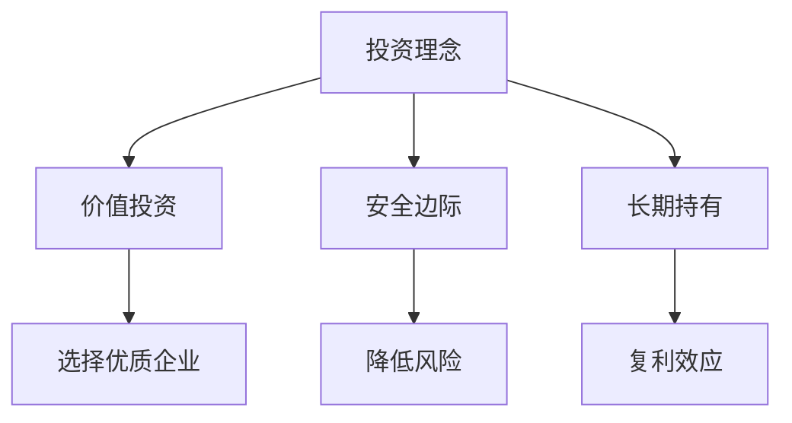

                 

# 巴菲特的集中投资理念

> 关键词：巴菲特，集中投资，价值投资，长期持有，安全边际

> 摘要：本文深入分析了巴菲特的集中投资理念，探讨了其背后的理论基础、核心策略、风险管理方法以及实际案例。通过系统化的方法，本文为读者提供了如何在现代投资环境中应用巴菲特的投资哲学的详细指导。

---

# 第一部分：巴菲特投资理念的背景与基础

## 第1章：集中投资理念的背景介绍

### 1.1 投资的核心问题

#### 1.1.1 问题背景：为什么投资如此重要？

投资是个人和机构实现财富增长的重要手段。然而，传统投资方法往往依赖于短期市场波动，难以实现长期稳定的收益。巴菲特的投资理念强调长期价值，提供了一种不同的视角。

#### 1.1.2 问题描述：传统投资方法的局限性

传统投资方法往往基于短期市场波动，忽视了企业的基本面和长期价值。这种方法可能导致投资者在市场波动中承受不必要的风险，并错失长期增长的机会。

#### 1.1.3 问题解决：集中投资如何解决这些问题

集中投资的理念是通过深入研究和选择少数优质企业，长期持有，从而实现稳定的收益。这种方法减少了投资组合的复杂性，降低了交易成本，并聚焦于企业的长期增长。

#### 1.1.4 边界与外延：集中投资与其他投资策略的区别

与其他策略（如指数投资或短期交易）不同，集中投资强调深度分析和长期持有。这种方法适用于那些能够识别并持有优质企业的投资者。

#### 1.1.5 核心要素：价值、长期、优质企业

集中投资的核心要素包括：

- **价值**：寻找市场价格低于内在价值的企业。
- **长期**：通过持有时间来实现复利效应。
- **优质企业**：选择具有强大竞争优势的企业。

### 1.2 巴菲特投资理念的核心概念

#### 1.2.1 核心概念原理

- **价值投资**：巴菲特认为市场先生并不总是理性的，因此可以通过购买低于内在价值的股票来实现收益。
- **安全边际**：通过支付低于内在价值的价格，来降低投资风险。
- **长期持有**：长期持有优质企业股票，利用复利效应实现财富增长。

#### 1.2.2 概念对比表格

| 概念       | 描述                                                                 |
|------------|----------------------------------------------------------------------|
| 价值投资   | 寻找市场价格低于内在价值的股票                                         |
| 安全边际   | 确保支付的价格低于内在价值，降低投资风险                             |
| 长期持有   | 长期持有股票，利用复利效应实现收益                                      |

#### 1.2.3 ER实体关系图（Mermaid流程图）

---

## 第2章：集中投资的核心概念与联系

### 2.1 核心概念原理

- **价值投资**：通过分析企业的财务报表、行业地位和竞争优势，确定其内在价值。
- **安全边际**：通过支付低于内在价值的价格，确保投资的安全性。
- **长期持有**：通过长期持有股票，避免频繁交易带来的成本和风险。

### 2.2 案例分析：巴菲特的经典投资

#### 2.2.1 案例1：购买喜诗糖果

- **背景**：喜诗糖果是一家具有强大品牌和竞争优势的公司。
- **分析**：巴菲特通过深入研究，确定其内在价值。
- **结果**：长期持有带来丰厚的回报。

---

# 第三部分：集中投资的策略与分析

## 第3章：集中投资的核心策略

### 3.1 寻找伟大企业

#### 3.1.1 识别竞争优势

- **护城河**：企业竞争优势的核心，包括成本优势、品牌优势、技术壁垒和网络效应。
- **案例分析**：谷歌通过技术壁垒建立强大的护城河。

#### 3.1.2 财务健康

- **盈利能力**：ROE（净资产收益率）是衡量盈利能力的重要指标。
- **财务杠杆**：适度的杠杆可以提高回报，但过高杠杆会增加风险。
- **现金流**：健康的现金流是企业财务健康的重要标志。

#### 3.1.3 管理层

- **诚信**：管理层必须诚实可靠，避免财务造假。
- **能力**：管理层应具备优秀的管理和决策能力。

### 3.2 竞争优势分析

#### 3.2.1 护城河的五种类型

| 类型         | 描述                                                                 |
|--------------|----------------------------------------------------------------------|
| 成本优势     | 企业生产成本低于竞争对手，提供价格优势                               |
| 品牌优势     | 强大的品牌影响力，吸引忠诚客户                                         |
| 技术壁垒     | 拥有独特的技术或专利，防止竞争对手进入                               |
| 网络效应     | 用户数量增加，网络价值提高，形成正反馈                               |
| 规模经济     | 随着规模扩大，单位成本下降，竞争优势增强                             |

#### 3.2.2 护城河分析工具

- **SWOT分析**：分析企业的优势、劣势、机会和威胁。
- **波特五力模型**：评估行业竞争结构，确定企业的竞争优势。

---

## 第4章：投资组合的构建与管理

### 4.1 投资组合构建

#### 4.1.1 资产配置

- **集中投资**：将资金集中在少数优质企业，减少投资组合的复杂性。
- **分散投资**：通过投资不同行业的企业，降低行业风险。

#### 4.1.2 个股选择

- **集中投资**：选择少数优质企业，长期持有。
- **分散投资**：通过投资不同行业的企业，降低行业风险。

#### 4.1.3 定期评估

- **定期复盘**：每季度或每半年评估投资组合的表现。
- **动态调整**：根据市场变化和企业基本面，调整投资组合。

### 4.2 系统化投资方法

#### 4.2.1 领域模型：企业基本面分析

- **财务报表分析**：通过分析资产负债表、利润表和现金流量表，评估企业的财务健康状况。
- **估值方法**：使用市盈率、市净率、股息率等指标，评估股票的估值是否合理。

#### 4.2.2 投资决策框架

- **第一步**：确定投资目标和风险承受能力。
- **第二步**：选择优质企业，评估其内在价值。
- **第三步**：制定投资计划，分散投资风险。
- **第四步**：长期持有，定期评估和调整。

---

## 第5章：风险管理与投资组合优化

### 5.1 风险管理

#### 5.1.1 投资组合的风险

- **系统性风险**：市场整体波动带来的风险。
- **非系统性风险**：特定企业或行业带来的风险。

#### 5.1.2 风险管理策略

- **分散投资**：通过投资不同行业和地区的股票，降低非系统性风险。
- **止损策略**：设定止损点，避免重大损失。

### 5.2 投资组合优化

#### 5.2.1 分散投资

- **行业分散**：投资不同行业的股票，降低行业风险。
- **地域分散**：投资国内外股票，降低区域风险。

#### 5.2.2 优化工具

- **现代投资组合理论（MPT）**：通过优化算法，找到风险最小化、收益最大化的投资组合。
- **风险调整后的收益（RAR）**：评估投资组合的风险调整后收益，选择最优组合。

---

## 第6章：长期投资策略与实践

### 6.1 长期投资策略

#### 6.1.1 制定长期目标

- **财务自由**：通过投资实现财务自由。
- **财富传承**：通过长期投资，实现财富的传承。

#### 6.1.2 避免短期波动

- **市场波动**：短期市场波动不影响长期投资目标。
- **情绪化决策**：避免情绪化决策，坚持长期投资。

### 6.2 实践指南

#### 6.2.1 如何开始投资

- **选择优质企业**：寻找具有强大竞争优势和财务健康的企业。
- **长期持有**：制定长期投资计划，定期评估和调整。

#### 6.2.2 投资心理

- **耐心**：长期投资需要耐心，避免频繁交易。
- **纪律性**：坚持投资计划，避免情绪化决策。

---

## 第7章：总结与启示

### 7.1 总结

集中投资理念强调选择优质企业，长期持有，实现稳定的收益。这种方法通过深度分析和长期持有，降低了投资风险，提高了投资回报。

### 7.2 启示

在现代投资环境中，集中投资理念仍然具有重要的现实意义。通过选择优质企业，长期持有，投资者可以实现财富的稳定增长。

---

# 结语

巴菲特的集中投资理念是一种简单而有效的投资方法。通过选择优质企业，长期持有，投资者可以实现财富的稳定增长。这种方法不仅适用于个人投资者，也适用于机构投资者。在现代投资环境中，集中投资理念仍然具有重要的现实意义。

