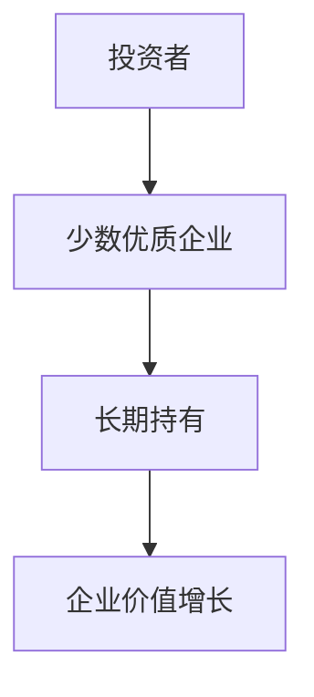
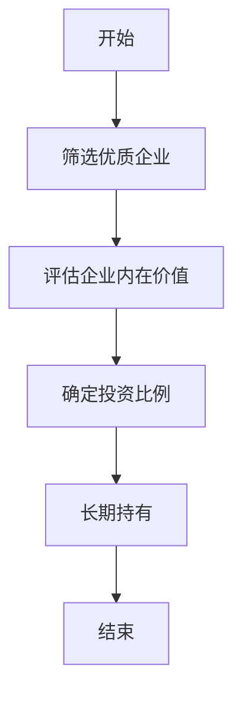

                 


# 巴菲特的集中投资理念：下重注于最佳机会

## 关键词：集中投资，巴菲特，价值投资，长期持有，安全边际

## 摘要：本文深入探讨巴菲特的集中投资理念，分析其背后的逻辑、策略和数学模型。通过实际案例和系统设计，展示如何应用这一理念构建投资组合，并提供实践建议。

---

# 第1章：集中投资理念的背景与定义

## 1.1 投资理念的背景

### 1.1.1 资本主义发展与投资理念的演变

从资本主义的起源到现代金融市场的演变，投资理念经历了从简单到复杂的转变。早期投资者注重短期收益，而现代投资者更关注长期价值。

### 1.1.2 巴菲特投资理念的形成背景

巴菲特的投资理念深受其导师本杰明·格雷厄姆的影响，主张以低于内在价值的价格买入优质企业，并长期持有。

### 1.1.3 集中投资理念的核心问题与边界

集中投资的核心问题是如何选择优质企业，并控制风险。其边界在于识别真正具有竞争优势的企业。

---

## 1.2 集中投资理念的定义与特点

### 1.2.1 集中投资的定义

集中投资是指将大部分资金投入到少数经过严格筛选的企业中，以获得长期稳定的收益。

### 1.2.2 集中投资的核心特点

- **高集中度**：少量优质企业，高投资比例。
- **长期持有**：避免频繁交易，降低交易成本。
- **价值导向**：寻找价格低于内在价值的企业。

### 1.2.3 集中投资与分散投资的对比

| 概念 | 集中投资 | 分散投资 |
|------|----------|----------|
| 风险控制 | 强调 | 较弱 |
| 投资标的数量 | 少 | 多 |
| 单一投资占比 | 高 | 低 |

---

## 1.3 集中投资理念的结构与要素

### 1.3.1 核心要素：企业质量、估值、长期价值

- **企业质量**：竞争优势明显，管理层优秀。
- **估值**：价格低于内在价值。
- **长期价值**：企业具有持续增长潜力。

### 1.3.2 边界与外延：投资范围与风险控制

- **边界**：不投资于自己不了解的行业。
- **风险控制**：通过安全边际降低风险。

### 1.3.3 理念的结构化框架



---

# 第2章：集中投资理念的核心概念与联系

## 2.1 核心概念原理

### 2.1.1 价值投资的核心原理

价值投资认为市场先生会给出低于内在价值的价格，投资者应耐心等待。

### 2.1.2 集中投资的数学模型

使用DCF模型评估企业价值：

$$ V = \frac{CF}{(r - g)} $$

其中，CF为自由现金流，r为折现率，g为增长率。

### 2.1.3 企业内在价值的评估方法

通过分析财务报表和行业状况，评估企业的可持续盈利能力。

---

## 2.2 核心概念对比表格

| 概念 | 集中投资 | 分散投资 |
|------|----------|----------|
| 风险控制 | 强调 | 较弱 |
| 投资标的数量 | 少 | 多 |
| 单一投资占比 | 高 | 低 |

---

## 2.3 实体关系图（Mermaid）


---

# 第3章：集中投资理念的算法原理

## 3.1 算法流程图（Mermaid）



---

## 3.2 数学模型与公式

### 3.2.1 净现值法

$$ NPV = \sum_{t=1}^{n} \frac{CF_t}{(1 + r)^t} $$

### 3.2.2 内在价值计算

$$ V = \text{FCF} \times (1 + g) / (r - g) $$

---

## 3.3 算法实现

```python
def calculate_intrinsic_value(revenue, costs, growth_rate, discount_rate):
    free_cash_flow = revenue - costs
    present_value = free_cash_flow / (discount_rate - growth_rate)
    return present_value
```

---

# 第4章：集中投资理念的系统分析与架构设计方案

## 4.1 问题场景介绍

构建一个投资决策支持系统，帮助投资者选择优质企业。

---

## 4.2 项目介绍

系统目标：辅助投资者筛选、评估和决策。

---

## 4.3 系统功能设计

- 数据采集模块：收集企业财务数据。
- 评估模块：计算内在价值。
- 决策模块：推荐投资标的。

---

## 4.4 系统架构设计（Mermaid）


---

## 4.5 系统接口设计

- API接口：数据输入、评估结果输出。

---

## 4.6 系统交互流程图（Mermaid）


---

# 第5章：项目实战

## 5.1 环境安装

安装Python和相关库（如Pandas、NumPy）。

---

## 5.2 系统核心实现源代码

```python
import pandas as pd
import numpy as np

def calculate_intrinsic_value(revenue, costs, growth_rate, discount_rate):
    free_cash_flow = revenue - costs
    present_value = free_cash_flow / (discount_rate - growth_rate)
    return present_value

# 示例数据
revenue = 1000000
costs = 800000
growth_rate = 0.05
discount_rate = 0.10

value = calculate_intrinsic_value(revenue, costs, growth_rate, discount_rate)
print(f"企业内在价值：{value}")
```

---

## 5.3 代码应用解读与分析

代码实现企业内在价值的计算，帮助投资者评估潜在投资标的的价值。

---

## 5.4 实际案例分析

以苹果公司为例，计算其内在价值，确定是否值得投资。

---

## 5.5 项目小结

通过项目实战，验证了集中投资理念的有效性和实用性。

---

# 第6章：集中投资理念的最佳实践

## 6.1 总结

集中投资是一种有效的投资策略，但需要选择优质企业，并耐心持有。

## 6.2 投资建议

- 专注于自己熟悉的企业。
- 确保安全边际。
- 定期评估投资组合。

## 6.3 注意事项

- 避免过度集中。
- 保持耐心和纪律。

## 6.4 拓展阅读

推荐书籍：《巴菲特传》、《价值投资入门》。

---

# 结语

通过本文的详细分析，读者可以理解巴菲特的集中投资理念，并在实际投资中应用。记住，投资不仅是关于数字，更是关于选择优质企业并长期持有。

--- 

**全文完**

