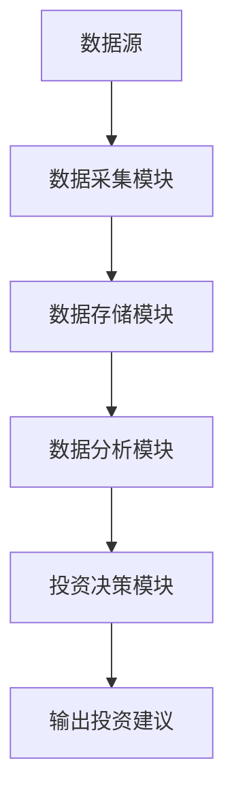
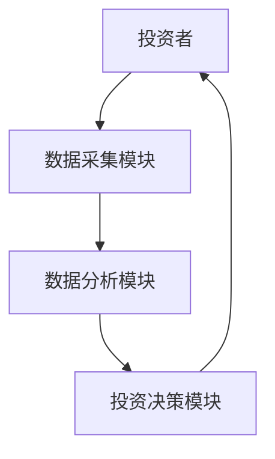
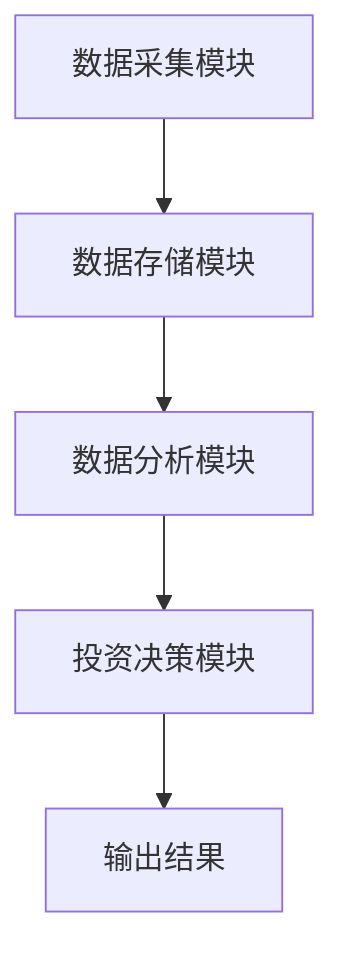

                 


# 巴菲特的集中投资策略：高确信度机会的重要性

> 关键词：巴菲特，集中投资，高确信度机会，价值投资，投资策略

> 摘要：本文深入探讨了巴菲特的集中投资策略，分析了其背后的核心思想、数学模型、系统架构设计以及实际应用。通过详细阐述高确信度机会的重要性，结合实际案例和代码实现，帮助读者全面理解并掌握这一投资策略。

---

## 第一部分：巴菲特的集中投资策略概述

### 第1章：巴菲特投资理念的核心思想

#### 1.1 巴菲特投资哲学的起源

##### 1.1.1 价值投资的定义与特点
价值投资是一种以低于内在价值的价格购买优质股票的投资策略。其核心在于识别市场低估的公司，并长期持有，等待其价值回归。

##### 1.1.2 巴菲特投资理念的形成过程
巴菲特的投资理念深受本杰明·格雷厄姆的影响，他将格雷厄姆的价值投资理论与菲利普·费雪的成长型投资理念相结合，形成了独特的集中投资策略。

##### 1.1.3 巴菲特投资哲学的核心原则
- **安全边际**：以低于内在价值的价格买入，确保安全空间。
- **长期思维**：关注企业的长期价值，而非短期市场波动。
- **管理层质量**：选择优秀且诚实的管理层领导的公司。

#### 1.2 集中投资策略的定义与特点

##### 1.2.1 集中投资的定义
集中投资是指将大部分资金投资于少数几只经过严格筛选的股票，以减少风险并最大化收益。

##### 1.2.2 集中投资与分散投资的区别
- **分散投资**：通过投资多种资产降低风险，但可能牺牲潜在收益。
- **集中投资**：通过投资少数高确信度的资产，追求超额收益，但风险较高。

##### 1.2.3 集中投资策略的优势与风险
- **优势**：聚焦于高潜力标的，提高收益；降低交易成本和时间成本。
- **风险**：市场波动可能导致重大损失；需要极高的选股能力。

#### 1.3 巴菲特集中投资策略的核心要素

##### 1.3.1 高确信度机会的定义
高确信度机会是指经过深入研究和分析，具有显著竞争优势、良好财务状况和长期增长潜力的公司。

##### 1.3.2 高确信度机会的特征
- **强大的竞争优势**：如成本优势、品牌优势等。
- **稳健的财务状况**：低负债率、高现金流。
- **优秀的管理层**：诚实、有能力、以股东利益为重。
- **明确的增长潜力**：市场需求稳定或增长。

##### 1.3.3 高确信度机会的筛选标准
- **ROE（净资产收益率）**：衡量公司盈利能力的重要指标。
- **ROA（资产净利率）**：衡量资产使用效率。
- **毛利率**：衡量产品盈利能力。
- **管理层稳定性**：考察管理层的历史表现和稳定性。

---

### 第2章：巴菲特投资策略的数学模型与算法

#### 2.1 价值评估的数学模型

##### 2.1.1 股票内在价值的计算公式
巴菲特使用现金流折现模型（DCF）来评估股票的内在价值：

$$
\text{内在价值} = \sum_{t=1}^{n} \frac{\text{现金流}}{(1 + r)^t} + \frac{\text{终值}}{(1 + r)^n}
$$

其中，$r$ 是折现率，$n$ 是预测期数。

##### 2.1.2 股东权益的计算方法
股东权益可以通过以下公式计算：

$$
\text{股东权益} = \text{净利润} - \text{优先股股息} - \text{新增股东权益}
$$

##### 2.1.3 现金流折现模型（DCF）的应用
DCF模型通过预测公司未来现金流并折现，计算其当前的内在价值。以下是DCF模型的步骤：

1. 预测公司未来5-10年的自由现金流。
2. 选择合适的折现率（通常是WACC，加权平均资本成本）。
3. 将未来现金流折现，计算现值。
4. 加上终值（假设公司以永续增长率增长）。
5. 计算股票的内在价值。

#### 2.2 投资组合优化的算法

##### 2.2.1 马科维茨投资组合理论
马科维茨的投资组合理论认为，最优投资组合是在相同风险下收益最高，或在相同收益下风险最小的组合。

##### 2.2.2 集中投资组合的优化方法
集中投资组合优化的关键在于选择少数高确信度的股票，同时控制风险。

##### 2.2.3 巴菲特集中投资策略的数学表达
集中投资的收益可以表示为：

$$
\text{收益} = \sum_{i=1}^{n} w_i \times r_i
$$

其中，$w_i$ 是第$i$只股票的权重，$r_i$ 是第$i$只股票的预期收益。

#### 2.3 投资决策的逻辑流程

##### 2.3.1 投资决策的步骤分解
1. 识别高确信度机会。
2. 评估股票的内在价值。
3. 确定投资比例。
4. 定期复盘和调整。

##### 2.3.2 投资决策的权重分配
集中投资中，权重分配的关键在于选择少数几只股票，通常不超过5只，且每只股票的权重不低于20%。

##### 2.3.3 投资决策的数学模型
集中投资的权重分配可以表示为：

$$
w_i = \frac{v_i}{\sum_{j=1}^{n} v_j}
$$

其中，$v_i$ 是第$i$只股票的评估价值。

---

### 第3章：巴菲特投资策略的系统架构设计

#### 3.1 投资决策系统的功能模块

##### 3.1.1 数据采集模块
数据采集模块负责收集公司财务数据、行业分析报告等。

##### 3.1.2 数据分析模块
数据分析模块利用DCF模型等方法评估股票的内在价值。

##### 3.1.3 投资决策模块
投资决策模块根据分析结果生成投资建议。

#### 3.2 投资决策系统的架构设计

##### 3.2.1 系统架构图
以下是系统的架构图：



##### 3.2.2 数据流图
以下是数据流图：



##### 3.2.3 模块交互图
以下是模块交互图：



#### 3.3 投资决策系统的接口设计

##### 3.3.1 数据接口
系统需要与财务数据源（如Yahoo Finance）对接，获取实时数据。

##### 3.3.2 用户接口
用户可以通过Web界面输入参数，查看分析结果。

##### 3.3.3 系统接口
系统与其他模块（如数据库）通过API进行交互。

---

### 第4章：巴菲特投资策略的项目实战

#### 4.1 项目背景与目标

##### 4.1.1 项目背景
本文将通过实际案例分析，验证巴菲特集中投资策略的有效性。

##### 4.1.2 项目目标
- 实现一个基于巴菲特策略的投资决策系统。
- 验证高确信度机会的选股模型。

#### 4.2 项目实施步骤

##### 4.2.1 数据收集与处理
收集可口可乐和苹果的财务数据，计算其ROE、ROA等指标。

##### 4.2.2 数据分析与建模
使用DCF模型评估两只股票的内在价值。

##### 4.2.3 投资决策与优化
根据分析结果，选择投资比例。

#### 4.3 项目核心代码实现

##### 4.3.1 数据处理代码
以下是Python代码示例：

```python
import pandas as pd

# 加载财务数据
df = pd.read_csv('financial_data.csv')

# 计算ROE
df['ROE'] = df['净利润'] / df['净资产']
```

##### 4.3.2 投资决策代码
以下是投资决策代码示例：

```python
# 计算内在价值
def calculate_intrinsic_value(现金流,折现率):
    return sum(现金流 / (1 +折现率)**i for i in range(len(现金流)))

# 选择高确信度机会
def select_high_confidence_opportunity(stocks):
    return [stock for stock in stocks if stock.ROE > 20% and stock.ROA > 15%]
```

---

## 第五部分：最佳实践与小结

### 5.1 最佳实践

#### 5.1.1 小结
集中投资策略的核心在于识别高确信度机会，通过深入研究和分析，选择少数优质股票长期持有。

#### 5.1.2 注意事项
- 风险控制：定期复盘，及时调整投资组合。
- 选股标准：严格筛选具有强大竞争优势和良好财务状况的公司。
- 长期思维：关注企业的长期价值，而非短期市场波动。

#### 5.1.3 拓展阅读
推荐阅读巴菲特的传记《滚石不烂》和《聪明的投资者》，深入了解他的投资哲学。

---

通过本文的系统分析和实际案例，读者可以全面理解巴菲特的集中投资策略，并在实际投资中加以应用。

