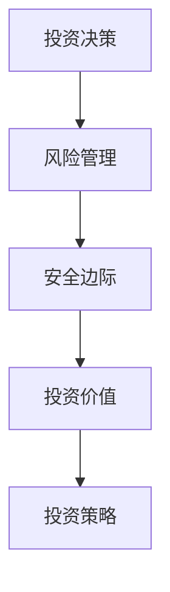
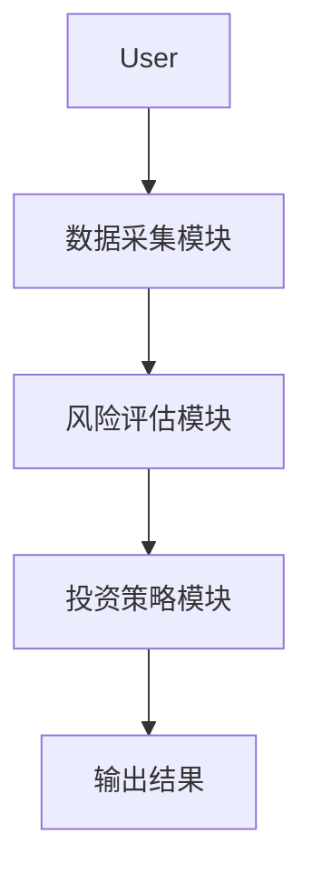

                 


# 巴菲特的风险管理：如何降低永久性资本损失

> 关键词：巴菲特，风险管理，永久性资本损失，投资策略，安全边际

> 摘要：本文深入探讨了巴菲特的风险管理策略，特别是如何通过价值投资和安全边际的概念来避免永久性资本损失。文章从投资哲学、核心概念、算法原理、系统架构到项目实战，全面分析了巴菲特的风险管理方法，并通过实际案例和系统设计提供了可操作的指导。

---

## 第1章：巴菲特的投资哲学与风险管理概述

### 1.1 巴菲特的投资哲学

#### 1.1.1 巴菲特的投资理念
巴菲特的投资哲学基于价值投资，强调购买低于其内在价值的股票。他坚信市场先生的存在，认为市场的短期波动是投资的敌人，而不是朋友。他的投资理念可以总结为“价格是买价，价值是卖价”。

#### 1.1.2 投资中的风险与收益平衡
巴菲特认为，投资的最终目标是实现资本的长期增值。他主张通过分散投资来降低风险，但更强调选择具有强大竞争优势的企业。他不喜欢高风险的投资，而是倾向于投资那些他能够理解的企业。

#### 1.1.3 长期投资与价值投资的核心思想
巴菲特的价值投资核心思想是寻找那些具有持续竞争优势、良好治理结构和优秀管理团队的企业。他强调长期投资，避免短期市场的波动干扰。

---

### 1.2 风险管理的重要性

#### 1.2.1 风险管理的定义与作用
风险管理是投资过程中不可或缺的一部分，它帮助投资者识别和应对潜在的风险，保护资本不受损失。巴菲特认为，风险管理的核心在于避免永久性资本损失。

#### 1.2.2 永久性资本损失的定义
永久性资本损失是指投资者在出售资产时，售价低于初始投资成本的情况。这种损失通常是由于企业基本面发生根本性变化，而不是市场短期波动导致的。

#### 1.2.3 永久性资本损失的影响与后果
永久性资本损失会严重侵蚀投资者的资本，影响投资组合的长期增长。巴菲特认为，避免永久性资本损失是风险管理的核心目标。

---

### 1.3 巴菲特的风险管理策略

#### 1.3.1 安全边际的概念与应用
安全边际是指股票的市场价格低于其内在价值的部分。巴菲特认为，通过购买价格低于内在价值的股票，可以有效降低永久性资本损失的风险。

#### 1.3.2 风险控制的边界与外延
巴菲特的风险控制不仅关注市场的波动性，还关注企业的基本面。他通过选择具有强大竞争优势的企业，以及合理的价格，来控制投资风险。

#### 1.3.3 投资组合的风险分散策略
巴菲特通过分散投资来降低风险。他的投资组合通常包括少数几家企业，每家企业都具有强大的竞争优势和良好的财务状况。

---

## 第2章：巴菲特的风险管理核心概念与联系

### 2.1 风险管理的核心概念

#### 2.1.1 投资决策中的概率分析
巴菲特强调概率分析，认为投资决策应基于对企业未来现金流的合理预期。他通过分析企业的竞争优势和财务状况，评估投资成功的概率。

#### 2.1.2 风险与收益的数学模型
巴菲特的投资模型基于价值评估，使用市盈率、市净率等指标来衡量股票的合理价格。他通过比较市场价格与内在价值，确定安全边际。

#### 2.1.3 安全边际的计算公式
安全边际 = 内在价值 - 市场价格

---

### 2.2 核心概念的属性对比

#### 2.2.1 风险与收益的属性对比
| 属性       | 风险           | 收益           |
|------------|----------------|----------------|
| 定义       | 损失的可能性   | 收益的可能性   |
| 计量方式   | 标准差         | 预期回报率     |
| 管理策略   | 避免永久性损失 | 最大化收益     |

#### 2.2.2 不同投资策略的风险特征
| 投资策略         | 风险特征         |
|------------------|------------------|
| 价值投资         | 低风险           |
| 股票投机         | 高风险           |
| 债券投资         | 低风险           |

#### 2.2.3 安全边际与投资价值的关系
安全边际越高，投资风险越小，投资价值越高。

---

### 2.3 巴菲特风险管理模型的ER实体关系图



---

## 第3章：巴菲特风险管理的算法原理

### 3.1 投资筛选算法

#### 3.1.1 巴菲特投资筛选的流程
1. 确定企业的竞争优势。
2. 评估企业的财务状况。
3. 计算企业的内在价值。
4. 比较市场价格与内在价值，确定安全边际。

#### 3.1.2 基于价值的股票筛选算法
```python
def calculate_intrinsic_value(enterprise):
    return enterprise.cash_flow * (1 + enterprise.growth_rate) / (enterprise.discount_rate - enterprise.growth_rate)
```

#### 3.1.3 算法的数学模型与公式
$$ \text{内在价值} = \frac{\text{自由现金流} \times (1 + \text{增长率})}{\text{折现率} - \text{增长率}} $$

---

### 3.2 投资组合优化算法

#### 3.2.1 风险分散的数学原理
$$ \text{投资组合的方差} = \sum_{i=1}^{n} \sum_{j=1}^{n} w_i w_j \text{Cov}(r_i, r_j) $$

#### 3.2.2 基于现代投资组合理论的优化算法
```python
import numpy as np
def optimize_portfolio(returns, weights):
    covariance_matrix = np.cov(returns)
    portfolio_variance = np.dot(weights.T, covariance_matrix.dot(weights))
    return portfolio_variance
```

---

## 第4章：巴菲特风险管理的系统分析与架构设计

### 4.1 投资决策支持系统的功能设计

#### 4.1.1 数据采集模块
1. 采集企业的财务数据。
2. 采集市场的价格数据。
3. 采集企业的竞争优势信息。

#### 4.1.2 风险评估模块
1. 计算企业的内在价值。
2. 计算安全边际。
3. 评估投资风险。

#### 4.1.3 投资策略模块
1. 确定投资组合。
2. 分配投资权重。
3. 监控投资风险。

---

### 4.2 系统架构设计



---

## 第5章：巴菲特风险管理的项目实战

### 5.1 环境配置

#### 5.1.1 安装Python环境
```bash
python --version
pip install numpy pandas
```

---

### 5.2 核心代码实现

#### 5.2.1 计算内在价值
```python
def calculate_intrinsic_value(enterprise):
    return enterprise.cash_flow * (1 + enterprise.growth_rate) / (enterprise.discount_rate - enterprise.growth_rate)
```

#### 5.2.2 计算安全边际
```python
def calculate_margin_of_safety(enterprise):
    return enterprise.intrinsic_value - enterprise.market_price
```

---

### 5.3 代码应用解读与分析

#### 5.3.1 现金流分析
通过分析企业的自由现金流，计算其内在价值，确定是否具有安全边际。

#### 5.3.2 市场价格比较
比较市场价格与内在价值，判断是否具有安全边际。

---

### 5.4 实际案例分析

#### 5.4.1 案例：可口可乐的投资决策
1. 计算可口可乐的内在价值。
2. 比较市场价格与内在价值，确定安全边际。
3. 评估投资风险。

---

### 5.5 项目小结

通过实际案例分析，验证了巴菲特的风险管理策略的有效性。安全边际的计算和投资组合的优化是降低永久性资本损失的关键。

---

## 第6章：最佳实践、小结、注意事项和拓展阅读

### 6.1 最佳实践
1. 坚持价值投资，避免短期波动。
2. 通过安全边际降低投资风险。
3. 分散投资，降低组合风险。

### 6.2 小结
巴菲特的风险管理策略强调安全边际和长期投资。通过合理评估企业的内在价值，避免永久性资本损失。

### 6.3 注意事项
1. 风险管理需要结合企业的基本面和市场环境。
2. 投资决策应基于充分的信息和合理的分析。

### 6.4 拓展阅读
1. 《巴菲特致股东的信》
2. 《投资最重要的事》
3. 《风险管理与投资组合优化》

---

通过本文的详细分析，读者可以深入了解巴菲特的风险管理策略，并将其应用到实际投资中，有效降低永久性资本损失的风险。

