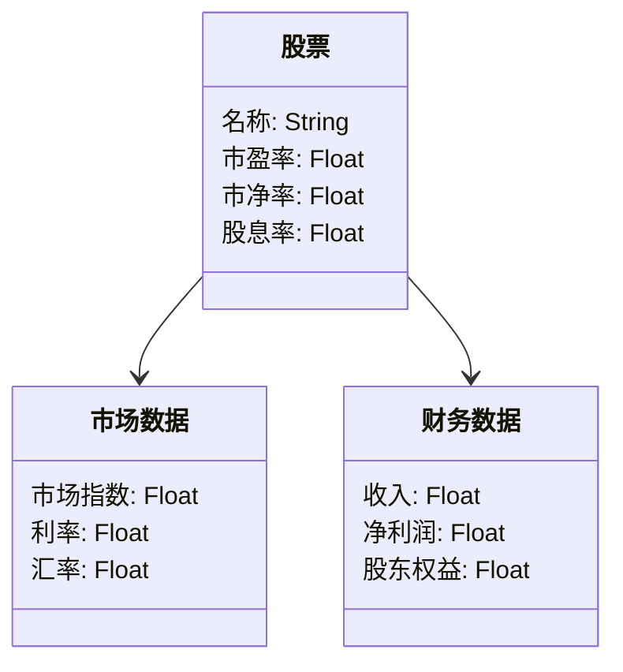
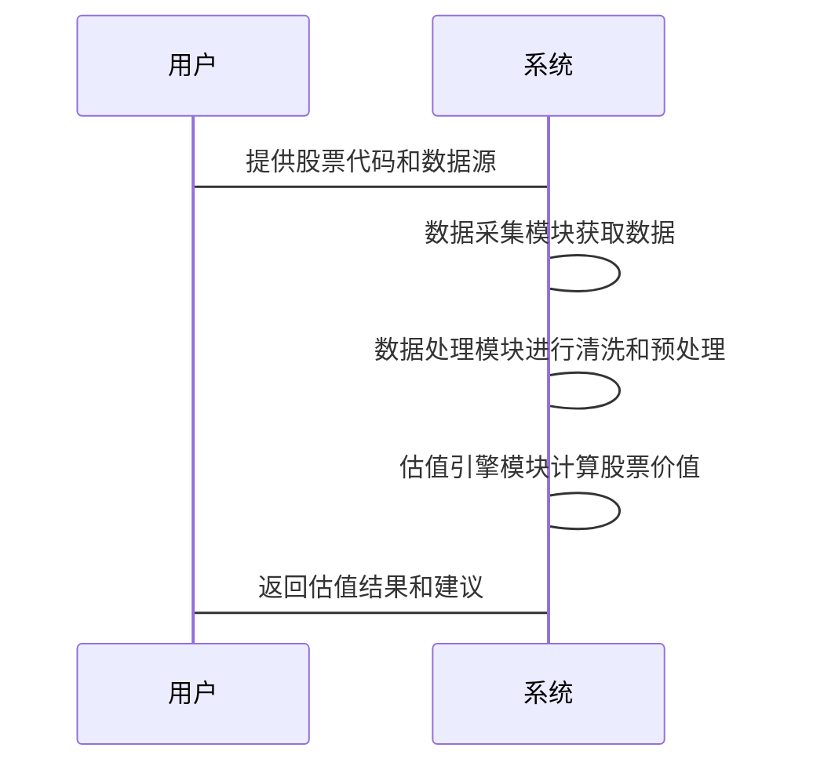

                 


# 巴西股市估值: 拉美最大经济体的投资前景

> 关键词：巴西股市, 估值模型, 投资策略, 风险管理, 经济分析

> 摘要：本文旨在探讨巴西股市的估值方法与投资前景，通过分析巴西股市的历史、现状及其影响因素，结合基本分析与技术分析，探讨适合巴西股市的估值模型与投资策略，最后结合实际案例，提出风险管理与投资建议。

---

# 第一部分: 巴西股市估值背景与现状

## 第1章: 巴西股市的背景与现状

### 1.1 巴西股市的历史与发展

#### 1.1.1 巴西股市的起源与发展
巴西股市的历史可以追溯到19世纪末，但现代意义上的股票交易市场始于1976年，当时巴西证券交易所（Bolsa de Valores do Brasil）成立，随后发展为今天的巴西证券交易所（B3）。B3是拉丁美洲最大的证券交易所，也是全球最重要的新兴市场之一。

#### 1.1.2 巴西在拉美股市中的地位
作为拉美最大的经济体，巴西的股市在该地区具有重要地位。巴西股市不仅吸引了大量本地投资者，还吸引了国际投资者的关注。B3的市值和交易量在拉美地区遥遥领先。

#### 1.1.3 巴西经济与股市的关联性
巴西经济的波动直接影响股市的表现。作为以出口为导向的经济体，巴西的经济受全球大宗商品价格、贸易政策和地缘政治因素的影响较大。同时，股市也是巴西经济的晴雨表，反映了国家经济的健康状况。

### 1.2 巴西股市的主要指数与成分股

#### 1.2.1 B3指数的构成与权重
B3指数（IBOVESPA）是巴西股市的核心指数，包含50家最大的上市公司，涵盖金融、能源、工业等多个行业。指数的权重基于市值，反映了各成分股在市场中的影响力。

#### 1.2.2 主要成分股的行业分布
B3指数的成分股主要集中在金融、能源、原材料和工业领域。这些行业对巴西经济的贡献较大，因此在股市中占据重要地位。

#### 1.2.3 巴西股市与其他主要市场的对比
与美国、欧洲和亚洲市场相比，巴西股市波动性较大，但增长潜力也较高。作为新兴市场，巴西股市的风险和收益均高于成熟市场。

### 1.3 巴西股市的主要参与者

#### 1.3.1 投资者结构分析
巴西股市的投资者结构以机构投资者为主，包括保险公司、 pension funds 和资产管理公司。个人投资者占比相对较小，但近年来随着市场的开放，个人投资者数量有所增加。

#### 1.3.2 市场监管机构与规则
巴西的市场监管机构是巴西证券交易委员会（CVM），负责监管股市的运行和投资者保护。巴西股市的交易规则与国际接轨，但也有其独特的监管要求。

#### 1.3.3 机构投资者的作用
机构投资者在巴西股市中占据主导地位，他们的投资行为对市场走势有重要影响。机构投资者通常采用基本面分析和量化策略进行投资。

## 第2章: 巴西股市估值的核心概念与方法

### 2.1 估值的基本原理

#### 2.1.1 估值的定义与目的
估值是指通过对公司财务数据、行业地位和市场环境的分析，确定其股票的合理价格。其目的是帮助投资者做出明智的投资决策，识别价值被低估或高估的股票。

#### 2.1.2 估值的基本假设与边界
估值通常基于以下假设：市场有效、数据准确、未来可预测。同时，估值结果受市场波动、政策变化和公司特定风险的影响。

#### 2.1.3 估值的核心要素与概念结构
估值的核心要素包括公司财务状况、行业前景、宏观经济环境和市场情绪。这些要素相互作用，共同决定股票的合理估值。

### 2.2 巴西股市估值的主要方法

#### 2.2.1 基本分析法（Fundamental Analysis）
基本分析通过分析公司的财务报表、行业地位和宏观经济因素来评估其股票价值。常用的指标包括市盈率（P/E）、市净率（P/B）和股息率。

#### 2.2.2 技术分析法（Technical Analysis）
技术分析通过分析历史价格和成交量数据，预测未来的价格走势。常用的技术指标包括移动平均线、相对强弱指数（RSI）和MACD。

#### 2.2.3 混合分析法（Hybrid Analysis）
混合分析法结合基本分析和技术分析，利用两者的优势，提高估值的准确性。例如，使用基本分析确定目标价格区间，再通过技术分析确认入场点。

### 2.3 估值模型与工具

#### 2.3.1 常用估值模型的介绍
常用的估值模型包括市盈率模型、股息贴现模型（DDM）和加权平均资本成本（WACC）模型。每种模型适用于不同类型的公司和市场环境。

#### 2.3.2 巴西股市估值工具的选择
选择估值工具时需要考虑公司的行业特性、财务数据的可得性和市场的波动性。例如，对于成长型企业，DDM模型可能更合适；而对于成熟企业，市盈率模型更适用。

#### 2.3.3 估值模型的优缺点对比
基本分析注重长期基本面，但可能忽视短期市场波动；技术分析注重短期趋势，但可能无法捕捉长期趋势。混合分析法结合了两者的优点，但需要较高的分析技巧。

---

# 第二部分: 巴西股市估值的算法原理

## 第3章: 巴西股市估值的算法原理

### 3.1 常用估值算法的数学模型

#### 3.1.1 市盈率模型
市盈率（P/E）= 股票价格 / 每股净利润（EPS）

#### 3.1.2 市净率模型
市净率（P/B）= 股票价格 / 每股净资产（BPS）

#### 3.1.3 股息贴现模型（DDM）
股票价值 = Σ（股息 / (1 + r)^t），其中r是贴现率，t是时间。

### 3.2 估值算法的实现步骤

#### 3.2.1 数据收集与预处理
收集公司的财务数据、行业数据和宏观经济指标，进行数据清洗和标准化处理。

#### 3.2.2 模型选择与参数设定
根据公司特点选择合适的估值模型，设定贴现率、增长率等关键参数。

#### 3.2.3 模型计算与结果分析
通过公式计算股票的理论价值，与市场价格进行对比，判断股票是否被低估或高估。

### 3.3 估值模型的优缺点与适用场景

#### 3.3.1 市盈率模型
优点：简单易用，适用于盈利稳定的公司；缺点：不适合亏损公司。

#### 3.3.2 市净率模型
优点：适用于净资产较多的公司；缺点：忽视了盈利能力。

#### 3.3.3 DDM模型
优点：考虑了股息支付，适用于高分红公司；缺点：假设股息增长率不变。

---

# 第三部分: 巴西股市估值的系统分析与架构设计

## 第4章: 巴西股市估值的系统分析与架构设计

### 4.1 问题场景介绍
巴西股市的复杂性要求投资者综合考虑宏观经济、行业趋势和公司基本面。本文将从系统架构的角度分析如何构建一个完整的估值系统。

### 4.2 项目介绍
本项目旨在开发一个巴西股市估值系统，整合多种估值方法，帮助投资者做出明智决策。

### 4.3 系统功能设计

#### 4.3.1 领域模型（Mermaid 类图）


#### 4.3.2 系统架构设计（Mermaid 架构图）


#### 4.3.3 系统接口设计
系统接口包括数据输入接口、参数设置接口和结果输出接口。数据输入接口接收股票和市场数据，参数设置接口允许用户调整估值模型的参数，结果输出接口展示估值结果和建议。

#### 4.3.4 系统交互（Mermaid 序列图）


### 4.4 系统实现与优化

#### 4.4.1 环境安装与配置
需要安装Python、Pandas、NumPy和Matplotlib等库。建议使用Jupyter Notebook进行开发。

#### 4.4.2 核心算法实现
以下是市盈率模型的Python代码示例：
```python
def calculate_pe(stock_price, net_income):
    pe_ratio = stock_price / net_income
    return pe_ratio

# 示例数据
stock_price = 50.0
net_income = 10.0
pe_ratio = calculate_pe(stock_price, net_income)
print(f"市盈率: {pe_ratio:.2f}")
```

### 4.5 项目实战与案例分析

#### 4.5.1 案例分析
假设我们要评估一家巴西石油公司的股票价值，我们可以使用市盈率和市净率模型进行分析。

#### 4.5.2 数据收集与处理
收集该公司的财务数据和行业数据，进行数据清洗和预处理。

#### 4.5.3 模型计算与结果分析
计算市盈率和市净率，对比市场价格，判断股票是否被低估。

#### 4.5.4 投资建议
根据估值结果，提出买入、持有或卖出的建议。

### 4.6 项目总结与经验分享

#### 4.6.1 项目总结
本项目通过系统架构设计和算法实现，展示了如何在巴西股市中进行有效的估值。

#### 4.6.2 经验分享
在实际操作中，建议投资者结合多种估值方法，灵活应对市场变化。

---

# 第四部分: 巴西股市估值的最佳实践与风险管理

## 第5章: 巴西股市估值的最佳实践

### 5.1 投资策略与风险管理

#### 5.1.1 投资策略
- 长期投资：适合价值投资者，注重公司基本面。
- 短期交易：适合技术分析师，捕捉短期价格波动。

#### 5.1.2 风险管理
- 分散投资：通过投资不同行业和公司的股票，降低风险。
- 设置止损：当股价达到预设亏损点时，立即卖出。

### 5.2 实际案例分析

#### 5.2.1 案例1：基本分析法
分析一家巴西银行的财务数据，计算其市净率，判断其是否被低估。

#### 5.2.2 案例2：技术分析法
分析某股票的历史价格走势，使用移动平均线和RSI指标预测未来走势。

### 5.3 投资建议与风险管理

#### 5.3.1 投资建议
- 保持对宏观经济和行业趋势的关注。
- 定期审视投资组合，及时调整。

#### 5.3.2 风险管理
- 避免过度杠杆，防止资金链断裂。
- 保持足够的流动资金，应对突发事件。

### 5.4 拓展阅读与学习资源

#### 5.4.1 拓展阅读
- 《投资学》（书籍）
- 巴西经济与股市分析报告

#### 5.4.2 学习资源
- 在线课程：巴西股市分析
- 投资论坛和社区

## 第6章: 巴西股市估值的总结与展望

### 6.1 本章总结
本文系统地介绍了巴西股市的估值方法与投资策略，结合实际案例分析，提出了风险管理与投资建议。

### 6.2 未来展望
随着巴西经济的进一步开放和数字化转型，巴西股市的投资机会和挑战将并存。未来的研究可以关注新兴技术和绿色能源领域的投资机会。

---

# 结语

巴西股市作为拉美最大的经济体，具有独特的优势和挑战。通过合理的估值方法和投资策略，投资者可以在这一市场中获得超额收益。希望本文能够为投资者提供有价值的参考和指导。

--- 

**附录与参考文献**
1. 巴西证券交易所（B3）官方报告
2. 相关学术论文与书籍
3. 数据来源与工具列表

