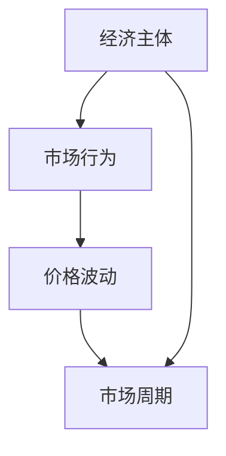
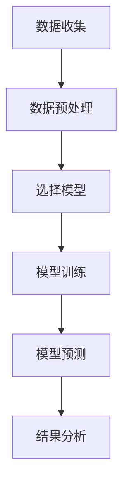

                 


# 市场周期理论：如何识别并利用经济周期变化

## 关键词
市场周期理论、经济周期、市场波动、预测模型、周期分析

## 摘要
市场周期理论是经济学和金融学中的重要概念，用于分析和预测经济波动。本文将从市场周期的基本概念入手，详细讲解其核心原理、预测算法、系统设计及实际应用。通过分析不同周期类型及其相互作用，结合统计模型和机器学习算法，帮助读者识别并利用经济周期变化，提升投资和决策的准确性。

---

## 第一部分: 市场周期理论基础

### 第1章: 市场周期理论概述

#### 1.1 市场周期的基本概念
##### 1.1.1 市场周期的定义
市场周期是指经济活动在一定时间内呈现的波动性模式，包括繁荣、衰退、萧条和复苏四个阶段。市场周期的核心特征是波动性、周期性和相关性。

##### 1.1.2 市场周期的类型
市场周期可以分为长期周期和短期周期。长期周期通常持续数十年，而短期周期可能只持续几个月到几年。不同类型的周期相互作用，形成复杂的市场波动。

##### 1.1.3 市场周期的核心要素
市场周期的核心要素包括价格波动、供需变化、市场参与者的心理预期以及外部经济政策。这些要素共同作用，推动市场的周期性变化。

#### 1.2 市场周期的历史演变
##### 1.2.1 经济周期的起源与发展
经济周期理论起源于19世纪，早期经济学家如亚当·斯密和大卫·李嘉图提出了初步的经济波动理论。20世纪，凯恩斯主义和货币主义进一步丰富了经济周期理论。

##### 1.2.2 历史上的市场周期案例分析
历史上的经济危机，如1929年的大萧条、2008年的金融危机，都体现了市场周期的波动性。通过对这些案例的分析，我们可以更好地理解市场周期的规律。

##### 1.2.3 市场周期与经济波动的关系
市场周期是经济波动的核心驱动因素之一。经济波动通过市场周期的表现，反映了经济系统的内在矛盾和外部冲击的影响。

### 第2章: 市场周期的核心概念与联系

#### 2.1 市场周期的核心原理
##### 2.1.1 市场周期的驱动力
市场周期的驱动力包括供需失衡、市场参与者行为变化、政策调整和技术进步。这些因素共同作用，推动市场的周期性波动。

##### 2.1.2 市场周期的波动规律
市场周期的波动规律可以通过统计分析和数学建模来描述。例如，傅里叶变换可以用来分析周期性信号，提取市场波动的特征。

##### 2.1.3 市场周期的预测方法
市场周期的预测方法包括统计模型、时间序列分析和机器学习算法。这些方法可以帮助我们更好地理解市场波动的规律，做出更准确的预测。

#### 2.2 市场周期的属性特征对比
##### 2.2.1 不同周期类型的核心特征
不同周期类型的核心特征包括波动幅度、周期长度和相关性。例如，长期周期通常与经济结构变化相关，而短期周期更多受到政策和市场情绪的影响。

##### 2.2.2 周期长度与波动幅度的对比
周期长度与波动幅度之间存在一定的相关性。长期周期通常伴随较大的波动幅度，而短期周期的波动幅度较小。

##### 2.2.3 周期之间的相互作用
市场周期之间存在相互作用，例如短期周期可能影响长期周期，反之亦然。这种相互作用可以通过系统动力学模型来描述。

#### 2.3 市场周期的ER实体关系图


---

## 第二部分: 市场周期预测的算法原理

### 第3章: 市场周期预测的算法选择

#### 3.1 统计模型与机器学习模型的对比
统计模型如ARIMA适用于线性时间序列分析，而机器学习模型如LSTM能够捕捉复杂的非线性模式。选择模型时需要考虑数据特征和预测目标。

#### 3.2 基于时间序列的预测方法
时间序列预测是市场周期分析的核心方法之一。常用的时间序列模型包括ARIMA、SARIMA和Prophet。

#### 3.3 常见的周期预测算法介绍
- **ARIMA模型**：适用于线性时间序列数据。
- **LSTM网络**：适用于非线性时间序列数据。
- **波浪理论**：通过周期性波动预测市场趋势。

### 第4章: 时间序列预测的数学模型

#### 4.1 ARIMA模型的原理与公式
ARIMA模型是一种广泛应用于时间序列预测的统计模型。其公式为：
$$ARIMA(p, d, q)$$
其中，p为自回归阶数，d为差分阶数，q为移动平均阶数。

#### 4.2 周期性分析的傅里叶变换
傅里叶变换可以用来分析时间序列中的周期性成分。其公式为：
$$\hat{f}(k) = \frac{1}{N}\sum_{n=0}^{N-1} x_n e^{-j2\pi kn/N}$$

### 第5章: 市场周期预测的流程图


---

## 第三部分: 市场周期监测系统设计

### 第6章: 系统分析与架构设计

#### 6.1 问题场景介绍
市场周期监测系统的目标是实时监测市场波动，预测未来趋势，帮助投资者做出决策。

#### 6.2 系统功能设计
- 数据采集模块：实时采集市场数据。
- 数据处理模块：对数据进行清洗和转换。
- 模型预测模块：使用ARIMA或LSTM模型进行预测。
- 可视化模块：将预测结果以图表形式展示。

#### 6.3 系统架构设计


#### 6.4 系统接口设计
- 数据接口：与数据源对接。
- API接口：提供预测结果给其他系统调用。

#### 6.5 系统交互设计


---

## 第四部分: 项目实战与应用

### 第7章: 项目实战

#### 7.1 环境安装
安装Python、Pandas、NumPy、Scikit-learn和TensorFlow等库。

#### 7.2 核心实现源代码
```python
from statsmodels.tsa.arima.model import ARIMA
import pandas as pd
import numpy as np

# 数据预处理
data = pd.read_csv('market_data.csv')
data = data['price'].values

# 模型训练
model = ARIMA(data, order=(5, 1, 0))
model_fit = model.fit()

# 模型预测
forecast = model_fit.forecast(steps=10)
```

#### 7.3 代码应用解读
上述代码展示了如何使用ARIMA模型进行市场周期预测。数据预处理包括数据加载和特征提取。模型训练使用ARIMA算法，预测结果用于市场周期分析。

#### 7.4 案例分析
通过对历史数据的分析，我们可以识别市场的周期性波动，预测未来趋势，并制定相应的投资策略。

---

## 第五部分: 最佳实践与总结

### 第8章: 最佳实践

#### 8.1 实用建议
- 结合多种模型进行预测，提高准确性。
- 定期更新模型参数，适应市场变化。
- 结合市场新闻和政策变化，进行综合判断。

#### 8.2 小结
市场周期理论是经济学和金融学的重要工具，通过识别和利用经济周期变化，可以帮助投资者做出更明智的决策。

#### 8.3 注意事项
- 市场周期预测具有不确定性，需谨慎使用。
- 结合实际情况，灵活调整预测模型。

#### 8.4 拓展阅读
推荐阅读《金融市场中的时间序列分析》和《经济周期理论与应用》等书籍，深入理解市场周期的理论与实践。

---

通过以上内容，我们可以系统地理解市场周期理论，掌握其在实际中的应用，从而更好地识别和利用经济周期变化，提升投资和决策的准确性。

