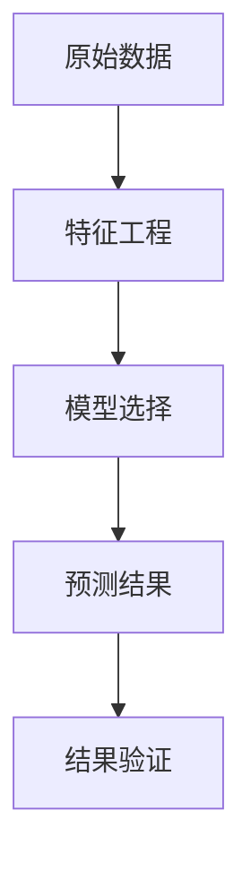
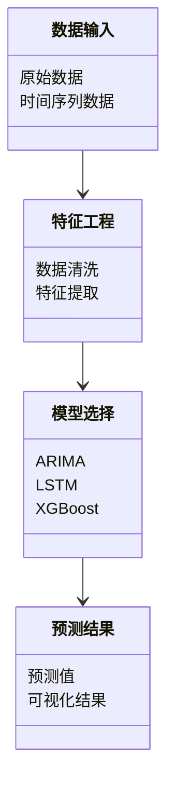
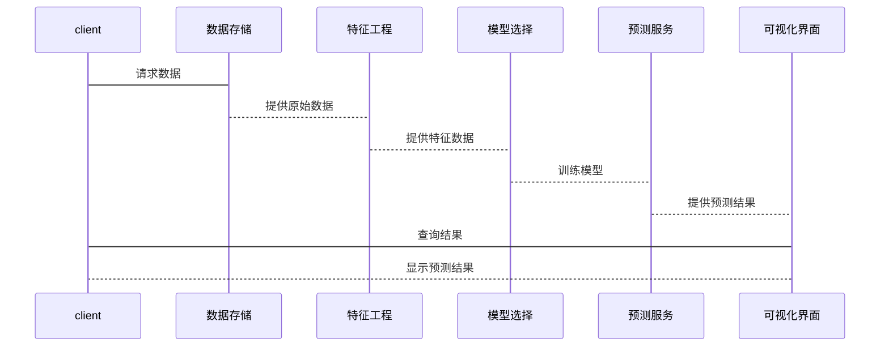

                 


# 《市场趋势预测模型》

---

## 关键词：  
市场趋势预测、时间序列分析、机器学习模型、ARIMA、LSTM、XGBoost、数据分析

---

## 摘要：  
本文详细探讨了市场趋势预测模型的构建与应用，从数据预处理到模型选择，从算法原理到系统实现，再到实际案例分析，全面解析了市场趋势预测的核心要素与实现方法。文章结合理论与实践，通过ARIMA、LSTM和集成学习等算法的详细推导和代码实现，帮助读者掌握市场趋势预测的关键技术，并通过系统架构设计与项目实战，展示了如何将这些模型应用于实际场景中。

---

## 第1章: 市场趋势预测模型的背景与概念

### 1.1 市场趋势预测的背景  
- 1.1.1 经济与市场分析的必要性：企业在竞争激烈的市场环境中，需要通过数据分析来预测市场趋势，优化决策。  
- 1.1.2 数据驱动决策的时代背景：随着数据采集技术的发展，企业能够从海量数据中提取有价值的信息，从而为市场预测提供有力支持。  
- 1.1.3 市场趋势预测的核心问题：如何从复杂的数据中提取有用的特征，并构建可靠的预测模型。  

### 1.2 市场趋势预测的核心问题  
- 1.2.1 数据的获取与处理：数据清洗、特征工程、时间序列数据的特殊处理。  
- 1.2.2 模型的选择与优化：线性回归、时间序列模型（如ARIMA）、机器学习模型（如随机森林、XGBoost）。  
- 1.2.3 预测结果的验证与评估：通过MAE、MSE、R²等指标对模型性能进行评估。  

### 1.3 市场趋势预测的边界与外延  
- 1.3.1 预测的适用范围：适用于时间序列数据，但需要考虑外部因素（如政策、经济波动）的影响。  
- 1.3.2 预测的局限性：模型无法预测突发事件（如疫情、战争）对市场的冲击。  
- 1.3.3 预测与实际市场的互动关系：模型需要不断更新，以适应市场的变化。  

### 1.4 市场趋势预测模型的核心要素  
- 1.4.1 数据特征：时间序列数据的连续性、周期性、趋势性。  
- 1.4.2 模型结构：模型的输入特征、模型参数、模型输出。  
- 1.4.3 预测目标：短期预测、中期预测、长期预测。  

---

## 第2章: 市场趋势预测的核心概念与联系  

### 2.1 数据预处理与特征工程  
- 2.1.1 数据清洗：处理缺失值、异常值、重复值。  
- 2.1.2 特征选择：选择对预测目标影响较大的特征。  
- 2.1.3 时间序列数据的特殊处理：滑动窗口、差分、分解（如趋势、周期、噪声）。  

### 2.2 常见预测模型原理  
- 2.2.1 线性回归模型：简单线性回归、多元线性回归。  
- 2.2.2 时间序列模型（ARIMA）：ARIMA模型的结构、参数选择、数学公式。  
- 2.2.3 机器学习模型：随机森林、XGBoost、LSTM。  

### 2.3 模型之间的关系与对比  
- 2.3.1 模型属性对比表：  
| 模型 | 优点 | 缺点 | 适用场景 |  
|------|------|------|----------|  
| ARIMA | 易实现、适合线性趋势 | 不适合非线性数据 | 时间序列数据 |  
| LSTM | 能捕捉长期依赖关系 | 需要大量数据 | 非线性时间序列数据 |  
| XGBoost | 高精度、特征重要性分析 | 易过拟合 | 非结构化数据 |  

- 2.3.2 模型适用场景分析：  
  - ARIMA适用于具有明确线性趋势和周期性的数据。  
  - LSTM适用于具有复杂非线性关系的数据。  
  - XGBoost适用于特征工程较为复杂的数据。  

### 2.4 数据流与模型关系图  


---

## 第3章: 时间序列预测模型的算法原理  

### 3.1 ARIMA模型原理  
- 3.1.1 ARIMA模型的结构：自回归（AR）、差分（I）、移动平均（MA）。  
- 3.1.2 ARIMA模型的参数选择：通过ACF和PACF图确定AR和MA的阶数。  
- 3.1.3 ARIMA模型的数学公式：  
  $$ARIMA(p, d, q) = y_t - \sum_{i=1}^{p} \phi_i y_{t-i} - \sum_{j=1}^{q} \theta_j \epsilon_{t-j}$$  

### 3.2 LSTM模型原理  
- 3.2.1 LSTM模型的结构：输入门、遗忘门、输出门。  
- 3.2.2 LSTM模型的数学公式：  
  - 遗忘门：$$f_t = \sigma(W_f \cdot [h_{t-1}, x_t] + b_f)$$  
  - 输入门：$$i_t = \sigma(W_i \cdot [h_{t-1}, x_t] + b_i)$$  
  - 输出门：$$o_t = \sigma(W_o \cdot [h_{t-1}, x_t] + b_o)$$  
  - 状态更新：$$h_t = f_t \cdot h_{t-1} + i_t \cdot tanh(W_c \cdot [h_{t-1}, x_t] + b_c)$$  

### 3.3 集成学习模型原理  
- 3.3.1 集成学习的原理：通过组合多个弱模型，提高预测精度。  
- 3.3.2 XGBoost模型的数学公式：  
  $$\text{损失函数} = \sum_{i=1}^{n} [y_i - \hat{y}_i]^2 + \lambda \sum_{j=1}^{m} \theta_j^2$$  

---

## 第4章: 系统分析与架构设计方案  

### 4.1 问题场景介绍  
- 系统目标：构建一个市场趋势预测模型，用于预测股票价格、销售量、用户活跃度等指标。  
- 问题描述：如何从历史数据中提取特征，选择合适的模型，优化模型性能。  

### 4.2 系统功能设计  
- 领域模型（Mermaid类图）：  


### 4.3 系统架构设计  
- 系统架构图（Mermaid架构图）：  


### 4.4 系统接口设计  
- 输入接口：时间序列数据、模型参数。  
- 输出接口：预测结果、模型性能指标。  

### 4.5 系统交互设计  
- 交互流程图（Mermaid序列图）：  


---

## 第5章: 项目实战  

### 5.1 环境安装  
- 安装Python、Pandas、NumPy、Scikit-learn、Keras、XGBoost。  

### 5.2 系统核心实现源代码  
- ARIMA模型实现：  
```python
from statsmodels.tsa.arima.model import ARIMA
import pandas as pd
import numpy as np

# 示例数据
data = pd.Series(np.random.randn(100), index=pd.date_range('1/1/2020', periods=100))
model = ARIMA(data, order=(1, 1, 1))
model_fit = model.fit()
forecast = model_fit.forecast(steps=5)
print(forecast)
```

- LSTM模型实现：  
```python
from keras.models import Sequential
from keras.layers import LSTM, Dense

# 示例数据
data = np.random.randn(100, 1)
model = Sequential()
model.add(LSTM(50, input_shape=(None, 1)))
model.add(Dense(1))
model.compile(loss='mean_squared_error', optimizer='adam')
model.fit(data, data, epochs=5, batch_size=1)
```

- XGBoost模型实现：  
```python
import xgboost as xgb

# 示例数据
X_train = np.random.randn(100, 5)
y_train = np.random.randn(100)
dtrain = xgb.DMatrix(X_train, label=y_train)
params = {'n_estimators': 100, 'learning_rate': 0.1, 'max_depth': 6}
model = xgb.train(params, dtrain)
```

### 5.3 代码应用解读与分析  
- ARIMA模型代码：通过ARIMA模型实现时间序列预测，适用于线性趋势的数据。  
- LSTM模型代码：通过LSTM网络捕捉时间序列数据中的长期依赖关系。  
- XGBoost模型代码：通过集成学习方法，优化模型性能，适用于复杂数据。  

### 5.4 实际案例分析  
- 案例：预测股票价格。  
  - 数据来源：股票历史价格数据。  
  - 特征工程：开盘价、收盘价、最高价、最低价、成交量。  
  - 模型选择：ARIMA、LSTM、XGBoost。  
  - 模型评估：通过回测结果评估模型性能。  

### 5.5 项目小结  
- 项目目标：构建一个可靠的市场趋势预测模型。  
- 项目过程：数据预处理、模型选择、模型训练、结果验证。  
- 项目总结：通过不同模型的对比，选择最适合数据的模型。  

---

## 第6章: 总结与拓展  

### 6.1 最佳实践 tips  
- 数据预处理是模型性能的关键。  
- 模型选择需要结合数据特征和业务需求。  
- 模型评估需要结合实际业务场景。  

### 6.2 小结  
市场趋势预测模型是一个复杂的系统工程，需要结合理论与实践，不断优化模型性能。  

### 6.3 注意事项  
- 数据的隐私与安全问题。  
- 模型的可解释性问题。  
- 模型的实时更新问题。  

### 6.4 拓展阅读  
- 《时间序列分析》  
- 《机器学习实战》  
- 《深度学习入门》  

---

# 《市场趋势预测模型》

---

**本文通过系统化的分析和实践，全面解析了市场趋势预测模型的构建与应用，帮助读者掌握从数据预处理到模型实现的关键技术，为实际业务中的市场预测提供了有力的理论支持和实践指导。**

