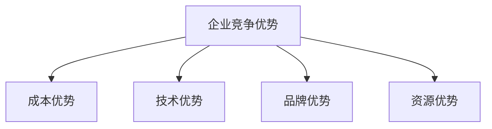
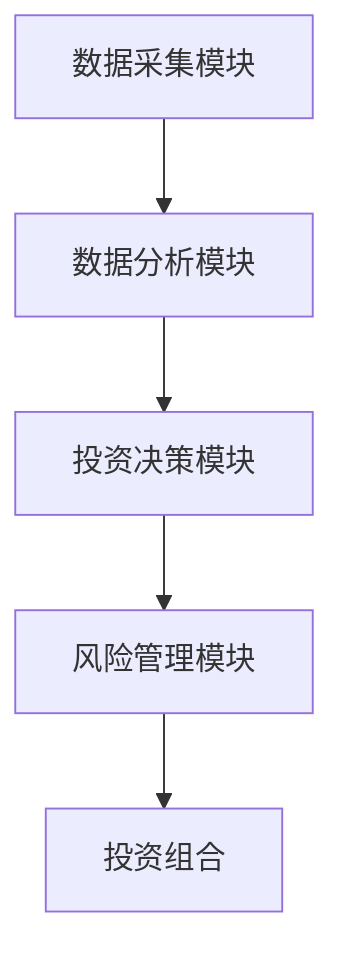

                 


# 布鲁斯·伯克维茨的集中型价值投资：深度研究的重要性

> 关键词：价值投资，集中型投资，深度研究，投资策略，风险管理，数学模型

> 摘要：本文深入探讨了布鲁斯·伯克维茨的集中型价值投资策略，分析了深度研究在投资决策中的重要性，并结合数学模型和算法原理，提供了一套系统化的投资分析方法。文章从价值投资的背景出发，详细讲解了深度研究的核心方法，分析了集中型投资的策略与风险管理，并通过实际案例展示了如何将理论应用于实践。

---

## 第1章：价值投资的起源与发展

### 1.1 价值投资的起源与发展

价值投资是一种以基本面分析为基础的投资策略，其核心理念是通过深入研究企业的内在价值，寻找被市场低估的投资机会。这种方法起源于20世纪初，由本杰明·格雷厄姆和戴维·多德共同提出，后来被沃伦·巴菲特发扬光大。

#### 1.1.1 价值投资的起源

价值投资的起源可以追溯到1924年，当时本杰明·格雷厄姆和戴维·多德合著了《证券分析》一书，首次系统地提出了价值投资的理念。他们认为，股票的内在价值是由其未来现金流的现值决定的，而市场的价格往往会在短期内偏离其内在价值，这为投资者提供了套利机会。

#### 1.1.2 价值投资的核心理念

价值投资的核心理念是“安全边际”。投资者应该购买那些市场价格低于其内在价值的股票，并长期持有，直到市场认识到其真实价值为止。这种方法强调对企业基本面的深入研究，而非关注市场的短期波动。

#### 1.1.3 价值投资与其他投资策略的区别

与技术分析和趋势投资不同，价值投资注重企业的内在价值，而非市场的短期走势。它强调长期持有优质资产，通过时间的积累实现财富的稳步增长。

---

### 1.2 集中型投资的定义与特点

集中型投资是一种将大部分资金投入到少数精选股票中的投资策略。与分散型投资相比，集中型投资的风险和收益呈现出明显的非线性关系。

#### 1.2.1 集中型投资的定义

集中型投资是指将投资组合中的大部分资金集中在少数几只股票上，这些股票通常具有较高的安全边际和成长潜力。这种方法要求投资者对所选股票进行深入研究，确保其投资标的具有长期竞争优势。

#### 1.2.2 集中型投资的核心特点

1. **高集中度**：投资组合中通常只包含少数几只股票，甚至可能只投资于一只股票。
2. **高门槛**：集中型投资对投资者的研究能力、风险承受能力和心理素质有较高要求。
3. **长期持有**：集中型投资者倾向于长期持有优质资产，等待其内在价值的实现。

#### 1.2.3 集中型投资与分散型投资的对比

| 特性                | 集中型投资             | 分散型投资             |
|---------------------|------------------------|------------------------|
| 投资标的数量        | 少数几只               | 多只                   |
| 风险承受能力        | 较高                   | 较低                   |
| 投资策略            | 深度研究，长期持有     | 多元化，降低风险       |

---

### 1.3 深度研究的重要性

深度研究是集中型价值投资的核心，它决定了投资者能否准确评估企业的内在价值，并找到被市场低估的投资机会。

#### 1.3.1 深度研究的定义

深度研究是指对企业的财务状况、行业地位、竞争优势、管理层能力等进行全面、细致的分析。通过深度研究，投资者可以更好地理解企业的内在价值，从而做出更明智的投资决策。

#### 1.3.2 深度研究在价值投资中的作用

1. **发现低估机会**：通过深度研究，投资者可以找到市场价格低于内在价值的企业。
2. **评估企业质量**：深度研究帮助企业识别出具有持续竞争优势的企业。
3. **降低投资风险**：通过深入分析企业的财务状况和行业前景，投资者可以更好地规避潜在风险。

#### 1.3.3 深度研究与投资决策的关系

深度研究是投资决策的基础。只有通过对企业的全面了解，投资者才能做出明智的投资决策，并在市场波动中保持冷静。

---

## 第2章：深度研究的核心方法

### 2.1 基本面分析

基本面分析是深度研究的重要组成部分，它通过对企业财务状况、行业地位和管理层能力的分析，评估企业的内在价值。

#### 2.1.1 什么是基本面分析

基本面分析是通过对企业的财务报表、行业地位、管理层能力和市场环境等多方面因素进行分析，以评估企业的内在价值。这种方法强调对企业经营状况的全面了解，而非关注市场的短期波动。

#### 2.1.2 基本面分析的主要指标

1. **市盈率（P/E）**：市盈率是股票价格与每股收益的比率，用于评估股票的估值水平。
2. **市净率（P/B）**：市净率是股票价格与每股净资产的比率，用于评估股票相对于其账面价值的高低。
3. **股息率**：股息率是每股股息与股票价格的比率，用于评估股票的分红能力。

#### 2.1.3 基本面分析的步骤与方法

1. **收集数据**：获取企业的财务报表、行业报告和市场数据。
2. **分析财务报表**：重点分析企业的盈利能力、偿债能力和发展能力。
3. **评估行业地位**：分析企业在行业中的竞争优势和市场地位。
4. **评估管理层能力**：了解管理层的背景、能力和战略规划。

---

### 2.2 企业竞争优势分析

企业竞争优势是深度研究的核心，它决定了企业在未来市场中的发展潜力。

#### 2.2.1 企业竞争优势的定义

企业竞争优势是指企业在市场上相对于竞争对手的独特优势，包括成本优势、技术优势、品牌优势和资源优势等。

#### 2.2.2 核心竞争力的识别方法

1. **成本优势**：通过分析企业的生产成本和供应链管理，评估其成本控制能力。
2. **技术优势**：评估企业拥有的核心技术及其竞争优势。
3. **品牌优势**：分析企业的品牌影响力和客户忠诚度。
4. **资源优势**：考察企业拥有的资源，如原材料、专利权等。

#### 2.2.3 企业竞争优势的评估模型

以下是用于评估企业竞争优势的简单模型：



---

### 2.3 财务指标分析

财务指标分析是深度研究的重要组成部分，它通过对企业财务状况的分析，评估企业的盈利能力和财务健康状况。

#### 2.3.1 财务指标分析的定义

财务指标分析是指通过对企业的财务报表进行分析，评估企业的盈利能力、偿债能力和成长能力。

#### 2.3.2 主要财务指标的解读

1. **净利润率**：净利润率 = 净利润 / 营业收入，用于评估企业的盈利能力。
2. **资产负债率**：资产负债率 = 总负债 / 总资产，用于评估企业的财务杠杆和偿债能力。
3. **ROE（净资产收益率）**：ROE = 净利润 / 平均净资产，用于评估企业的股东资金使用效率。

#### 2.3.3 财务健康状况的评估方法

1. **横向比较**：将企业的财务指标与同行业其他企业进行比较，评估其相对表现。
2. **纵向比较**：分析企业财务指标的变化趋势，评估其财务健康状况。
3. **行业标准比较**：将企业的财务指标与行业平均水平进行比较，评估其竞争力。

---

### 2.4 行业分析与市场定位

行业分析是深度研究的重要组成部分，它帮助投资者更好地理解企业的市场环境和行业发展趋势。

#### 2.4.1 行业分析的基本方法

1. **行业生命周期分析**：分析行业所处的生命周期阶段（导入期、成长期、成熟期、衰退期），评估行业的整体发展趋势。
2. **行业竞争结构分析**：分析行业内主要竞争对手的数量、市场份额和竞争程度，评估行业的竞争格局。
3. **行业政策分析**：分析行业相关的政策法规，评估政策对行业发展的潜在影响。

#### 2.4.2 行业竞争格局的评估

行业竞争格局的评估可以通过以下步骤进行：

1. **确定行业主要竞争对手**：列出行业内主要的竞争对手。
2. **分析竞争对手的市场份额**：计算各竞争对手的市场份额。
3. **评估行业集中度**：使用CR4（前四大企业市场份额之和）等指标评估行业的集中度。

#### 2.4.3 市场定位与企业发展的关系

市场定位是指企业在市场中所占据的位置，它直接影响企业的销售收入和市场份额。良好的市场定位可以帮助企业更好地应对市场竞争，实现可持续发展。

---

### 2.5 深度研究的实践案例

#### 2.5.1 案例分析：某行业龙头企业的深度研究

以某龙头企业的深度研究为例，我们可以通过以下几个步骤进行：

1. **收集数据**：获取该企业的财务报表、行业报告和市场数据。
2. **分析财务状况**：评估企业的盈利能力、财务状况和成长能力。
3. **评估竞争优势**：分析企业的成本优势、技术优势和品牌优势。
4. **行业分析**：分析行业的发展趋势和竞争格局。
5. **市场定位**：评估企业在市场中的定位和竞争优势。

#### 2.5.2 案例分析：中小企业的深度研究

以某中小企业为例，我们可以通过以下步骤进行深度研究：

1. **收集数据**：获取该企业的财务报表、行业报告和市场数据。
2. **分析财务状况**：评估企业的盈利能力、财务状况和成长能力。
3. **评估竞争优势**：分析企业的成本优势、技术优势和品牌优势。
4. **行业分析**：分析行业的发展趋势和竞争格局。
5. **市场定位**：评估企业在市场中的定位和竞争优势。

---

## 第3章：集中型投资策略与风险管理

### 3.1 投资目标的设定

#### 3.1.1 投资目标的定义

投资目标是指投资者希望通过投资活动实现的财务目标，包括财富积累、资产保值和风险控制等。

#### 3.1.2 投资目标的分类

1. **长期目标**：如财富积累、退休计划等。
2. **短期目标**：如资产配置、风险控制等。

#### 3.1.3 投资目标的制定方法

1. **明确投资目标**：投资者需要明确自己的投资目标，包括投资期限、风险承受能力和收益预期。
2. **设定合理的投资目标**：投资者需要根据自身的财务状况和风险偏好，设定合理的投资目标。
3. **定期评估和调整**：投资者需要定期评估投资目标的实现情况，并根据市场变化和自身条件进行调整。

---

### 3.2 资产配置与权重分配

#### 3.2.1 资产配置的定义

资产配置是指将投资资金分配到不同的资产类别中，以实现投资目标的风险和收益的最优组合。

#### 3.2.2 集中型投资的权重分配原则

1. **高集中度原则**：集中型投资要求将大部分资金投入到少数几只股票中。
2. **安全边际原则**：在权重分配时，应确保投资标的具有较高的安全边际。
3. **分散化原则**：虽然集中型投资强调高集中度，但应在不同的行业或领域中进行适当的分散。

#### 3.2.3 权重分配的优化方法

1. **根据企业基本面调整权重**：根据企业的基本面状况，动态调整投资标的权重。
2. **根据市场变化调整权重**：根据市场环境的变化，及时调整投资标的权重。
3. **根据风险承受能力调整权重**：根据自身的风险承受能力，合理调整投资标的权重。

---

### 3.3 投资组合的构建

#### 3.3.1 投资组合的定义

投资组合是指投资者持有的各种资产的组合，包括股票、债券、现金等。

#### 3.3.2 投资组合的构建步骤

1. **确定投资目标**：明确投资目标和风险偏好。
2. **选择投资标的**：根据深度研究的结果，选择具有较高安全边际和成长潜力的股票。
3. **分配投资权重**：根据资产配置原则，确定各投资标的的权重。
4. **定期调整组合**：根据市场变化和企业基本面的变化，定期调整投资组合。

#### 3.3.3 投资组合的风险评估

1. **风险分散**：通过适当的分散化，降低投资组合的整体风险。
2. **风险对冲**：利用衍生工具对冲投资组合中的风险。
3. **风险监控**：定期监控投资组合的风险状况，并根据需要进行调整。

---

### 3.4 风险管理与控制

#### 3.4.1 风险管理的定义

风险管理是指通过识别、评估和控制风险，降低投资组合的潜在损失。

#### 3.4.2 集中型投资中的主要风险

1. **市场风险**：由于市场价格波动导致的投资损失。
2. **流动性风险**：投资标的难以在短时间内以合理价格变现的风险。
3. **信用风险**：投资对象违约的风险。

#### 3.4.3 风险控制的具体方法

1. **分散化投资**：通过投资于不同行业和领域的标的，降低投资组合的整体风险。
2. **设定止损点**：在投资组合中设定止损点，避免过大的亏损。
3. **定期评估和调整**：根据市场变化和企业基本面的变化，定期评估投资组合的风险，并进行必要的调整。

---

## 第4章：集中型价值投资的数学模型与算法原理

### 4.1 股票估值模型

股票估值模型是价值投资的重要工具，它通过对企业未来现金流的现值进行估算，确定股票的内在价值。

#### 4.1.1 市盈率

市盈率（P/E）是股票价格与每股收益的比率，用于评估股票的估值水平。

公式：
$$ P/E = \frac{\text{股票价格}}{\text{每股收益}} $$

#### 4.1.2 市净率

市净率（P/B）是股票价格与每股净资产的比率，用于评估股票相对于其账面价值的高低。

公式：
$$ P/B = \frac{\text{股票价格}}{\text{每股净资产}} $$

#### 4.1.3 股息率

股息率是每股股息与股票价格的比率，用于评估股票的分红能力。

公式：
$$ 股息率 = \frac{\text{每股股息}}{\text{股票价格}} \times 100\% $$

---

### 4.2 股票选择的算法

股票选择的算法是集中型价值投资的核心，它通过对企业基本面的量化分析，筛选出具有较高安全边际和成长潜力的股票。

#### 4.2.1 简单平均法

简单平均法是一种最基本的股票选择算法，它通过对多个财务指标的简单平均，筛选出具有较高综合得分的股票。

公式：
$$ \text{综合得分} = \frac{\text{指标1} + \text{指标2} + \dots + \text{指标n}}{n} $$

#### 4.2.2 加权平均法

加权平均法是一种更为复杂的股票选择算法，它通过对不同财务指标赋予不同的权重，计算出股票的综合得分。

公式：
$$ \text{综合得分} = \sum_{i=1}^{n} (\text{权重i} \times \text{指标i}) $$

---

### 4.3 投资组合优化的数学模型

投资组合优化的数学模型是集中型投资的重要工具，它通过优化算法，确定最优的投资组合。

#### 4.3.1 均值-方差优化模型

均值-方差优化模型是一种经典的投资组合优化方法，它通过最小化投资组合的方差，实现收益的最大化。

公式：
$$ \min_{w} w^T \Sigma w $$
$$ \text{subject to} \quad w^T \mu = \text{target return} $$
$$ \quad \sum_{i=1}^{n} w_i = 1 $$
$$ \quad w_i \geq 0 \quad \forall i $$

其中，$w$ 是投资权重向量，$\Sigma$ 是协方差矩阵，$\mu$ 是收益向量。

#### 4.3.2 蒙特卡洛模拟

蒙特卡洛模拟是一种通过随机抽样来模拟投资组合未来表现的方法，它可以帮助投资者更好地理解投资组合的风险和收益分布。

算法步骤：
1. 确定投资组合的参数，包括收益分布、风险参数等。
2. 生成大量随机样本，模拟投资组合的未来表现。
3. 统计分析模拟结果，评估投资组合的风险和收益。

---

## 第5章：集中型价值投资的系统架构与实现

### 5.1 系统架构设计

集中型价值投资的系统架构需要能够支持投资者进行深度研究、投资决策和风险管理。

#### 5.1.1 系统功能设计

1. **数据采集模块**：负责采集企业的财务数据、行业报告和市场数据。
2. **数据分析模块**：对采集到的数据进行深度分析，评估企业的内在价值和竞争优势。
3. **投资决策模块**：根据分析结果，制定投资策略和投资组合。
4. **风险管理模块**：实时监控投资组合的风险，及时调整投资策略。

#### 5.1.2 系统架构图



---

### 5.2 系统实现与代码示例

#### 5.2.1 环境安装

为了实现集中型价值投资的系统，需要安装以下环境：

- Python 3.x
- 数据分析库（Pandas、NumPy）
- 数据可视化库（Matplotlib、Seaborn）
- 优化算法库（Scipy）

#### 5.2.2 数据分析模块代码示例

```python
import pandas as pd
import numpy as np

# 数据采集
data = pd.read_csv('stock_data.csv')

# 基本面分析
def calculate_P_E(data):
    pe = data['price'] / data['eps']
    return pe

pe_ratio = calculate_P_E(data)
print(pe_ratio)
```

#### 5.2.3 投资决策模块代码示例

```python
import pandas as pd
import numpy as np

# 数据分析
data = pd.read_csv('stock_data.csv')

# 股票选择
def stock_selection(data):
    pe_ratio = data['price'] / data['eps']
    pb_ratio = data['price'] / data['book_value']
    selected_stocks = data[pe_ratio < 15 & pb_ratio < 2]
    return selected_stocks

selected_stocks = stock_selection(data)
print(selected_stocks)
```

---

## 第6章：集中型价值投资的实战案例与总结

### 6.1 实战案例分析

#### 6.1.1 案例背景

假设我们选择了一家具有较高安全边际和成长潜力的企业进行投资。

#### 6.1.2 投资策略制定

1. **深度研究**：通过对该企业的财务状况、行业地位和竞争优势进行分析，确定其内在价值。
2. **投资组合构建**：将大部分资金投入到该企业股票中，同时进行适当的分散化投资。
3. **风险管理**：设定止损点，定期监控投资组合的风险。

#### 6.1.3 投资结果分析

通过长期持有该企业股票，投资组合实现了稳定的收益，市场波动对投资组合的影响较小。

---

### 6.2 投资总结与反思

集中型价值投资是一种高风险高回报的投资策略，它要求投资者具备较高的研究能力和风险承受能力。通过深度研究和系统化的投资分析，投资者可以在市场中找到具有长期竞争优势的企业，实现财富的稳步增长。

---

## 第7章：集中型价值投资的未来发展与挑战

### 7.1 价值投资的未来发展趋势

随着市场的不断发展，价值投资的未来发展趋势将更加注重企业质量和长期竞争优势。投资者需要不断学习和适应市场的变化，寻找新的投资机会。

### 7.2 集中型投资的挑战与应对策略

集中型投资面临的主要挑战包括市场波动风险和流动性风险。投资者需要通过合理的资产配置和风险管理，降低投资组合的整体风险。

---

## 第8章：总结与建议

### 8.1 本章总结

集中型价值投资是一种以深度研究为基础的投资策略，它通过长期持有优质资产，实现财富的稳步增长。本文从价值投资的背景、深度研究的方法、集中型投资的策略与风险管理等方面进行了详细探讨，并通过实际案例展示了如何将理论应用于实践。

### 8.2 投资建议

1. **注重深度研究**：投资者需要对企业基本面进行深入分析，识别出具有长期竞争优势的企业。
2. **合理配置资产**：在集中投资的同时，进行适当的分散化，降低投资组合的整体风险。
3. **长期持有优质资产**：集中型投资强调长期持有，投资者需要具备耐心和信心，等待市场认识到其投资标的的内在价值。
4. **注重风险管理**：投资者需要通过合理的风险管理，降低投资组合的潜在损失。

---

## 第9章：最佳实践与小结

### 9.1 最佳实践

1. **持续学习**：投资者需要不断学习和更新自己的知识，保持对市场变化的敏感性。
2. **严格遵守投资纪律**：投资者需要严格按照自己的投资计划进行操作，避免被市场波动干扰。
3. **定期评估和调整**：投资者需要定期评估自己的投资组合，并根据市场变化和企业基本面的变化进行调整。

### 9.2 小结

集中型价值投资是一种高风险高回报的投资策略，它要求投资者具备较高的研究能力和风险承受能力。通过深度研究和系统化的投资分析，投资者可以在市场中找到具有长期竞争优势的企业，实现财富的稳步增长。

