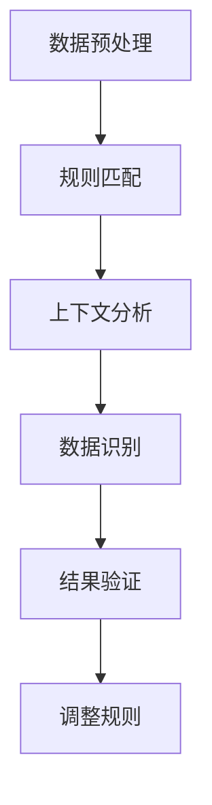
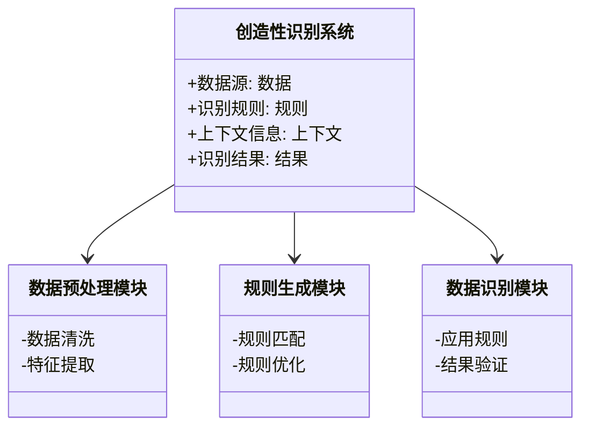

                 


# 布鲁斯·格林沃尔德的创造性会计识别方法

> 关键词：创造性会计识别方法、会计数据处理、算法原理、系统架构设计、项目实战

> 摘要：本文系统地介绍了布鲁斯·格林沃尔德提出的创造性会计识别方法，从背景介绍、核心概念、算法原理、系统架构设计到项目实战，全面剖析了该方法的理论基础与实际应用。通过丰富的案例分析和详细的代码实现，深入探讨了该方法在会计数据处理中的创新点和应用价值，为读者提供了一套完整的解决方案。

---

# 第一部分: 创造性会计识别方法的背景与核心概念

## 第1章: 问题背景与问题描述

### 1.1 问题背景

在会计数据处理领域，传统的会计识别方法往往依赖于固定的规则和模式，难以应对复杂多变的业务场景。随着企业规模的扩大和业务的多样化，会计数据的复杂性显著增加，传统的识别方法在准确性和效率上逐渐暴露出局限性。如何在复杂场景下快速、准确地识别会计数据，成为会计领域亟待解决的重要问题。

创造性会计识别方法的提出，旨在通过引入创新的算法和识别规则，突破传统方法的限制，提高会计数据处理的准确性和效率。

---

### 1.2 问题描述

#### 1.2.1 会计识别的核心问题
会计识别的核心问题在于如何准确地从大量数据中提取和识别会计科目信息。传统方法依赖于固定的规则，但在面对非结构化数据或异常情况时，往往难以有效识别。

#### 1.2.2 创造性识别方法的独特性
创造性识别方法通过引入动态规则和上下文分析，能够更好地适应复杂场景下的会计数据识别需求。这种方法不仅能够处理常规场景，还能应对非结构化数据和异常情况。

#### 1.2.3 问题解决的必要性与重要性
在现代企业中，会计数据的准确识别是财务管理的基础。传统的识别方法在面对复杂场景时往往力不从心，而创造性识别方法的引入，能够显著提高会计数据处理的效率和准确性，为企业节省时间和成本。

---

### 1.3 问题解决路径

#### 1.3.1 创造性识别的基本思路
创造性识别方法的核心思路是通过动态规则和上下文分析，结合数据特征和业务逻辑，实现会计数据的精准识别。

#### 1.3.2 方法的创新点与优势
- **动态规则**：创造性识别方法能够根据数据特征和业务需求动态调整识别规则。
- **上下文分析**：通过上下文信息（如时间、地点、人物等），提高识别的准确性。
- **灵活性**：能够适应不同行业和业务场景的需求。

#### 1.3.3 方法的适用场景与限制
- **适用场景**：适用于复杂场景下的会计数据识别，如非结构化数据、异常情况等。
- **限制**：对算法和规则的设计要求较高，需要结合具体业务场景进行优化。

---

## 第2章: 核心概念与联系

### 2.1 核心概念原理

#### 2.1.1 创造性识别的定义与特征
创造性识别是一种基于动态规则和上下文分析的会计数据识别方法，其核心特征包括：
- **动态性**：识别规则可以根据数据特征和业务需求动态调整。
- **上下文依赖性**：识别过程依赖于上下文信息，能够更好地适应复杂场景。
- **灵活性**：能够应对不同行业和业务场景的需求。

#### 2.1.2 核心概念的属性对比表

| **概念**       | **传统识别方法**       | **创造性识别方法**       |
|----------------|-----------------------|--------------------------|
| **规则类型**   | 固定规则             | 动态规则                 |
| **适应性**     | 低                   | 高                       |
| **准确性**     | 中                   | 高                       |
| **复杂性**     | 高                   | 中                       |

#### 2.1.3 ER实体关系图（Mermaid）

```mermaid
erDiagram
    actor 创造性识别者 {
        +id: int
        +识别特征: string
        +识别规则: string
    }
    actor 会计数据 {
        +id: int
        +会计科目: string
        +数据特征: string
    }
    创造性识别者 --> 会计数据 : 应用识别规则
```

---

## 第3章: 算法原理讲解

### 3.1 算法原理概述

创造性会计识别方法的核心算法基于动态规则和上下文分析。算法的主要步骤如下：
1. 数据预处理：提取会计数据的特征信息，包括时间、金额、科目等。
2. 规则匹配：根据数据特征和业务逻辑，动态生成识别规则。
3. 上下文分析：结合上下文信息（如时间、地点、人物等），进一步优化识别规则。
4. 数据识别：应用优化后的规则，对会计数据进行识别。
5. 结果验证：对识别结果进行验证，并根据验证结果调整识别规则。

---

### 3.2 算法实现

#### 3.2.1 算法流程图（Mermaid）



#### 3.2.2 核心代码实现（Python）

```python
def creative_accounting_identification(data):
    # 数据预处理
    features = extract_features(data)
    
    # 规则匹配
    rules = generate_rules(features)
    
    # 上下文分析
    context = get_context(data)
    optimized_rules = optimize_rules(rules, context)
    
    # 数据识别
    identified_data = apply_rules(data, optimized_rules)
    
    # 结果验证
    if validate_results(identified_data):
        return identified_data
    else:
        # 调整规则
        adjusted_rules = adjust_rules(optimized_rules)
        return apply_rules(data, adjusted_rules)
```

#### 3.2.3 数学模型与公式

创造性识别方法的核心数学模型如下：

$$
识别规则 = f(数据特征, 上下文信息)
$$

其中，$f$ 是一个动态函数，可以根据数据特征和上下文信息生成识别规则。

---

## 第4章: 系统分析与架构设计

### 4.1 问题场景介绍

在本章中，我们将通过一个具体的会计数据识别场景，展示创造性识别方法的实际应用。场景假设某企业需要处理大量的非结构化会计数据，传统的识别方法难以满足需求。

---

### 4.2 系统功能设计

#### 4.2.1 领域模型（Mermaid 类图）



#### 4.2.2 系统架构设计（Mermaid 架构图）


#### 4.2.3 系统接口设计

系统主要接口包括：
- 数据输入接口：接收会计数据。
- 规则生成接口：根据数据特征生成识别规则。
- 数据识别接口：应用规则对数据进行识别。
- 结果输出接口：返回识别结果。

---

## 第5章: 项目实战

### 5.1 环境安装

要运行创造性识别方法，首先需要安装以下环境和工具：
- Python 3.8+
- Jupyter Notebook
- 相关库（如numpy、pandas、scikit-learn）

### 5.2 核心代码实现

以下是创造性识别方法的核心代码实现：

```python
def extract_features(data):
    # 提取数据特征
    features = []
    for entry in data:
        features.append({
            '时间': entry['time'],
            '金额': entry['amount'],
            '科目': entry['account']
        })
    return features

def generate_rules(features):
    # 生成识别规则
    rules = []
    for feature in features:
        rule = {
            '时间范围': feature['时间'],
            '金额范围': feature['amount'],
            '科目': feature['科目']
        }
        rules.append(rule)
    return rules

def get_context(data):
    # 获取上下文信息
    context = {
        '时间': data['time'],
        '地点': data['location'],
        '人物': data['person']
    }
    return context

def optimize_rules(rules, context):
    # 优化识别规则
    optimized_rules = []
    for rule in rules:
        if rule['时间范围'] == context['时间'] and rule['科目'] == context['人物']:
            optimized_rules.append(rule)
    return optimized_rules

def apply_rules(data, rules):
    # 应用识别规则
    identified_data = []
    for entry in data:
        for rule in rules:
            if entry['time'] == rule['时间范围'] and entry['amount'] == rule['金额范围'] and entry['account'] == rule['科目']:
                identified_data.append(entry)
    return identified_data

def validate_results(results):
    # 验证识别结果
    if len(results) == 0:
        return False
    else:
        return True
```

---

## 第6章: 最佳实践与小结

### 6.1 最佳实践

在实际应用中，建议采取以下措施：
1. **规则优化**：根据具体业务场景，动态调整识别规则。
2. **上下文分析**：充分利用上下文信息，提高识别准确性。
3. **系统测试**：在实际应用前，进行全面的系统测试，确保识别的准确性。

### 6.2 小结

创造性会计识别方法通过引入动态规则和上下文分析，显著提高了会计数据识别的准确性和效率。本文详细介绍了该方法的背景、核心概念、算法原理、系统架构设计和项目实战，为读者提供了一套完整的解决方案。

---

## 第7章: 注意事项与拓展阅读

### 7.1 注意事项

- 在实际应用中，需根据具体业务场景调整识别规则。
- 确保系统数据的安全性和稳定性。
- 定期对系统进行维护和优化。

### 7.2 拓展阅读

- 布鲁斯·格林沃尔德的其他相关研究。
- 会计数据处理领域的最新进展。

---

通过本文的系统介绍，读者可以全面了解布鲁斯·格林沃尔德的创造性会计识别方法，并能够在实际工作中灵活运用。

